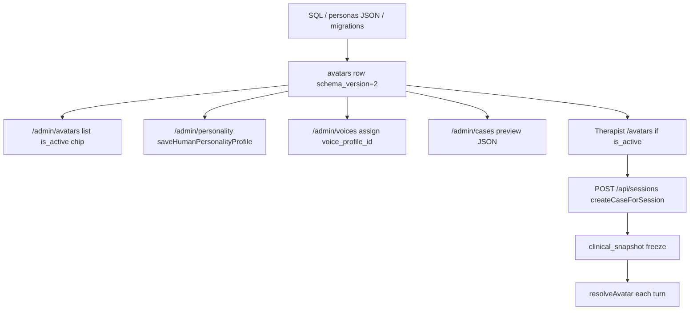

# VPsych — Admin Experience & Virtual Patient Authoring UX Assessment

**Document type:** Phase 1 assessment + UX architecture (read-only)  
**Assessment date:** 2026-08-09  
**Baseline inventory:** [`VPsych_SYSTEM_INVENTORY_AND_FUNCTION_CATALOG.md`](./VPsych_SYSTEM_INVENTORY_AND_FUNCTION_CATALOG.md)  
**Companion inventory JSON:** [`VPsych_SYSTEM_INVENTORY.json`](./VPsych_SYSTEM_INVENTORY.json)  
**Application / schema / RLS / auth modified:** **No**  
**Authorization roles changed:** **No** (UX personas only)

> Goal: reorganize the existing technically powerful Admin surface into a **task-oriented** administrator experience **without** changing clinical engines, scoring, AI prompts, avatar schemas, security, or session architecture.

---

## 1. Executive Summary

VPsych’s admin console is an **engine inspection and ops console**, not a product workflow for clinical content administrators. Fourteen flat admin nav items mirror software subsystems (Case Engine, Personality Engine, Competency Graph Engine, CIDP, …). The single most important product gap is confirmed by inventory and code:

**There is no in-app Virtual Patient create / draft / test / validate / publish / archive workflow.**

What exists today:

| Can do in UI | Cannot do in UI |
|---|---|
| List seeded avatars; preview EN/AR TTS | Create a new avatar |
| Edit human personality traits for an existing avatar | Edit clinical_core / disorder / rubric / guidelines as a product form |
| Assign/tune voice profiles | Activate/deactivate avatar publish lifecycle |
| Preview cases/templates/presets as **raw JSON** | Persist case/template authoring forms (clone/archive only for some) |
| Review admin-only session reports | Run a non-learner “test conversation” against a draft patient |
| Triage feedback; view research/ops/enterprise panels | Understand completeness (“ready to publish?”) without engineering knowledge |

**Recommendation (Phase 1 conclusion):** Introduce a **presentation-layer** Admin Information Architecture and a **Virtual Patient Authoring Wizard** that *orchestrates* existing engines (`avatars`, personality-engine, voice registry/CVP, case-engine, scenario-templates, instructor-presets, existing validators, preview APIs). Do **not** create parallel clinical systems. Keep Advanced/Developer details behind an explicit disclosure. Do **not** invent new `profiles.role` values.

---

## 2. Current Admin Architecture

### 2.1 Navigation (engine-oriented)

Evidence: `src/components/AppShell.tsx` (admin block) + `messages/en.json` `nav.*`.

| Nav label (concept) | Route | Underlying panel |
|---|---|---|
| Reports library | `/admin/reports` | Server page + `ReportView` |
| Avatar presets | `/admin/avatars` | Server list only |
| Human Personality | `/admin/personality` | `PersonalityEnginePanel` |
| Voice management | `/admin/voices` | `VoiceManagementPanel` |
| Case engine | `/admin/cases` | `CaseEnginePanel` |
| Scenario templates | `/admin/templates` | `TemplateEnginePanel` |
| Instructor presets | `/admin/presets` | `InstructorPresetPanel` |
| Adaptive curriculum | `/admin/curriculum` | `InstructorAcePanel` |
| Competency graph | `/admin/graph` | `InstructorGraphPanel` |
| Research validation | `/admin/research` | `ResearchValidationPanel` |
| Supervisor AI | `/admin/supervisor` | `AdminSupervisorPanel` |
| Enterprise platform | `/admin/enterprise` | `AdminEnterprisePanel` |
| CIDP operations | `/admin/cidp` | CIDP + Phase14–16 panels |
| Feedback queue | `/admin/feedback` | `AdminFeedbackPanel` |

There is **no** `/admin` landing dashboard. Admins land on whichever nav item they click; reports is first in the list.

### 2.2 Authorization (unchanged)

Canonical roles remain `therapist` | `admin` (`src/lib/types.ts`). All `/admin/*` and `/api/admin/*` require `profiles.role === "admin"` (middleware + `requireAdmin` / `requireApiAdmin`). UX personas below are **not** new roles.

### 2.3 Per-page audit (Task 1)

| Page | Purpose | Primary UX persona | Complexity (1–5) | Technical concepts exposed | Standalone? | Consolidation proposal |
|---|---|---|---|---|---|---|
| `/admin/reports` | Session report library | Clinical Supervisor | 2 | overall/100, language codes, RLS note | **Yes** (core) | Move under LEARNERS → Reports |
| `/admin/reports/[id]` | Full report | Clinical Supervisor | 2 | rubric weights `w{n}`, scores | Keep detail | Same |
| `/admin/avatars` | List patients + voice chips | Clinical Content Admin | 2 | voice_id, rubric max/weight, dialect | **No** as-is | Become VP library hub |
| `/admin/personality` | Trait editor | Clinical Content Admin | 4 | attachment enums, Big-Five scales, prompt preview `<pre>` | **No** | Step inside VP wizard |
| `/admin/voices` | Voice DB + assign | Clinical Content Admin | 4 | prosody knobs, emotion live-switch, mono IDs | Split | Assign in VP wizard; library under Voices |
| `/admin/cases` | Case preview | Clinical Content / specialist | 4 | DSM/ICD, snapshot **JSON** | **No** | Preview step / Cases advanced |
| `/admin/templates` | Template library + JSON patient | Specialist content | 3–4 | slug, enabled/draft, specialty enums, **JSON** | Partial | CONTENT → Templates |
| `/admin/presets` | Preset library + JSON | Specialist / supervisor setup | 4 | grading modes, versioning, **JSON**, archive | Partial | CONTENT → Presets |
| `/admin/curriculum` | ACE learner controls | Supervisor / curriculum specialist | 4 | learner IDs, thresholds, analytics **JSON** | Partial | LEARNERS → Learning |
| `/admin/graph` | CGE lock/mastery/RCA | Specialist | 5 | competency IDs, DAG, RCA **JSON** | Advanced | LEARNERS → Competencies (advanced) |
| `/admin/research` | Validation metrics/export | Research Admin | 5 | κ/ICC, realism indices | **Yes** | RESEARCH |
| `/admin/supervisor` | Skill catalogue overview | Specialist (limited value) | 3 | supervisor_version, skill weights | Merge/clarify | LEARNERS or Advanced — not “review sessions” |
| `/admin/enterprise` | Tenancy/RBAC overview | Enterprise Admin | 4 | permission counts, latency | **Yes** | ORGANIZATION |
| `/admin/cidp` | Deployment evidence gates | System / ops | 5 | cert IDs, GO/NO-GO | **Yes** (Advanced System) | SYSTEM → Operations |
| `/admin/feedback` | Feedback triage | System / Enterprise | 2 | severity/status | **Yes** | ORGANIZATION → Feedback |

**APIs used by these UIs:** `/api/admin/personality`, `voice-profiles/*`, `avatars/[id]/voice`, `cases/preview`, `templates(+preview)`, `presets(+preview)`, `ace/learners`, `cge`, `supervisor`, `enterprise`, `feedback`, `validation`, `ops/cidp|phase14–16`.

**Admin APIs without dedicated pages** (inventory): VQI/AVI/ALE/CFI/ERI/RRS, quality-ledger, realtime, disorders, ops/metrics, research/export — should stay **Advanced / System**, not primary nav.

### 2.4 Related non-admin surfaces admins also care about

| Surface | Relevance |
|---|---|
| `/avatars` (therapist library) | What learners see when `is_active` |
| `/learning`, `/learning/graph` | Competency UX issues (baseline 70, raw JSON) affect how supervisors interpret learner progress |
| `/validation` | Research invite portal (public + invite) |

---

## 3. Current Problems

1. **Navigation mirrors architecture, not tasks** — “Human Personality Engine” vs “Edit this patient’s personality.”
2. **Virtual Patient is fragmented** across avatars / personality / voices / cases / templates / presets with no single object lifecycle.
3. **No create / publish / archive for avatars** — `schemas/avatar.v2.json` requires `is_active`, but UI only displays it (`admin/avatars/page.tsx`).
4. **Raw JSON is the primary preview** for cases, templates, presets, ACE analytics, CGE RCA (and learner adaptive-case).
5. **Engine names and IDs leak** into titles and forms (ACE, CGE, CIDP, competency_id free-text).
6. **No admin test conversation** that avoids polluting learner session history / ACE ingest.
7. **Supervisor confusion** — `/admin/supervisor` is a skill catalogue; real report review is `/admin/reports`.
8. **No attention dashboard** — no drafts, incompleteness, warnings, queue counts.
9. **Dual optional flags / ops panels** compete with content work (CIDP, enterprise KPIs).
10. **Competency scores look authoritative** while inventory confirms baseline 70 + unvalidated formative estimates.

---

## 4. Admin Personas (UX only)

| Persona | Goals | Uses today | Auth role |
|---|---|---|---|
| **System Administrator** | Platform health, feedback, ops gates, access | CIDP, feedback, enterprise skim | `admin` |
| **Clinical Content Administrator** | Create/maintain Virtual Patients, voices, scenarios | avatars, personality, voices, cases, templates, presets | `admin` |
| **Clinical Supervisor** | Review sessions/reports, learner progress language | reports, curriculum (limited), therapist learning views | `admin` (reports) / sometimes also therapist account |
| **Research / Validation Administrator** | Observational validation, exports | research, validation portal | `admin` |
| **Enterprise Administrator** | Institutional overview, feedback | enterprise, feedback | `admin` |

No new authorization roles. Optional later: **nav presets / saved views** per persona within the same `admin` role (presentation only).

---

## 5. Admin Tasks (Task 2)

### Common (most deployments, weekly+)

| Task | Frequency | Current support |
|---|---|---|
| A. Manage Virtual Patients (full lifecycle) | High need | **Broken as workflow** — list + partial edit only |
| B. Assign / preview voices | High | Partial (voices page) |
| E. Review reports / recent sessions | High | Strong (`/admin/reports`) |
| H. Triage feedback | Medium | Strong |
| Review learner learning progress (formative) | Medium | Weak/misleading (ACE JSON, baseline 70) |

### Specialist

| Task | Audience | Current support |
|---|---|---|
| C. Manage clinical cases (preview/configure) | Content + curriculum | Preview JSON only |
| D. Templates / presets / competencies | Content / supervisor specialists | Partial clone/archive + JSON |
| F. Research / validation | Research | Strong but expert UI |
| G. Platform operations (CIDP/phases) | System | Strong ops, wrong for content admins |
| I. Enterprise configuration | Enterprise | Overview only; LMS schema underused |

### Task detail — Manage Virtual Patients (desired)

| Subtask | Exists? | Notes |
|---|---|---|
| Create | No | Requires DB/seed/ops today |
| Edit | Partial | Personality yes; identity/clinical_core/rubric no product form |
| Duplicate | No (avatars) | Templates/presets have clone |
| Preview | Partial | TTS + prompt block + case JSON — not unified profile card |
| Test | No | Would need non-learner sandbox (design only) |
| Activate / deactivate | Display only | `is_active` chip; no toggle |
| Publish | No | No draft vs published model in avatar UI |
| Archive | No | Presets have archive |

---

## 6. Current Complexity Scores (Task 8)

Scale: 1 trivial · 2 easy · 3 moderate · 4 difficult · 5 expert-only.

| Task | Score | Why |
|---|---|---|
| Create Virtual Patient | **5** | No UI; must know avatar v2 schema, dual locales, personality, voice, disorders, seeds |
| Edit Virtual Patient | **4** | Split across 3+ pages; clinical fields not editable as one object |
| Assign Voice | **3** | Doable on Voices page; still exposes prosody enums/IDs |
| Edit Personality | **4** | Rich form but enum jargon + prompt preview as primary feedback |
| Preview Case | **4** | Works, but output is raw snapshot JSON |
| Create Template | **5** | No create form; clone only |
| Create Preset | **5** | No create form; clone/version/archive only |
| Publish Patient | **5** | Concept absent in UI (`is_active` not a guided publish gate) |
| Review Report | **2** | Clearest admin task today |
| Review Learner | **4** | ACE panel + IDs + JSON analytics; no cohort coach UX |
| Review Competency | **5** | Graph + typed competency IDs + RCA JSON; scores unvalidated |
| Research Validation | **5** | Appropriate for specialists; wrong for content admins |
| Enterprise Management | **4** | Read-only control plane; little actionable config UI |

---

## 7. Current Virtual Patient Workflow



**Actual path to “add a patient” today:** engineering/ops inserts into `avatars` (+ personas/disorders as needed), authors `en-US` and `ar-JO` personalities natively, attaches voice profiles, sets `is_active`, validates offline. Admin UI only tunes subsets after the fact.

**Dependencies that must remain (orchestration targets):**

| Layer | Module / artifact | Must reuse |
|---|---|---|
| Schema | `schemas/avatar.v2.json`, `avatars` columns/jsonb | Yes |
| Personality | `lib/personality-engine` (`validateHumanPersonality`, persist) | Yes |
| Voice | `voice_profiles`, CVP, `/api/admin/voice-profiles*`, TTS | Yes |
| Case mint | `lib/case-engine` (`createCaseForSession`, `validateCaseGeneration`, preview API) | Yes |
| Templates / presets | scenario-templates, instructor-presets (+ validate*) | Yes |
| Runtime resolve | `lib/avatars/resolve.ts` | Yes |
| Prompt assembly | `lib/ai/prompt-engine.ts` | Yes (do not fork) |
| Session/report security | RLS + HMAC report path | Yes |

---

## 8. Proposed Virtual Patient Workflow (Tasks 3–4)

### 8.1 Design principle

**One wizard, many existing engines.** The form is a façade. Saves call existing validators and persistence helpers. No second personality/voice/case/clinical-intelligence system.

### 8.2 Proposed steps (admin-facing)

| Step | Admin sees | Maps to existing system |
|---|---|---|
| 1 Identity | Name, age, gender, locales, short description, portrait if present | `avatars` flat + personality locale keys; `default_locale` |
| 2 Clinical profile | Primary diagnosis, DSM/ICD labels, severity, comorbidities, risk, meds, history (human labels) | `clinical_core` / disorders catalog / case-engine disorder packages — **clinical meaning unchanged** |
| 3 Personality | Guided temperament/communication/trust/insight scales + notes | `validateHumanPersonality` + `saveHumanPersonalityProfile` per locale |
| 4 Patient behaviour | Disclosure, resistance, difficulty, engagement (plain language) | Existing speech-behavior / therapy-process / CBE-related authored fields — map to current schema fields, do not invent parallel rules engine |
| 5 Language & voice | EN/AR locale, dialect labels, voice pickers, pronunciation preview | `voice_profiles`, `VoicePreviewButton`, existing assign API |
| 6 Therapy configuration | Modality, scenario/template/preset pickers, objectives, target competencies | instructor-presets + scenario-templates + competency domain labels (IDs hidden) |
| 7 Preview | Human-readable profile card | Compose from resolved avatar + personality formatters + voice labels — JSON under Advanced |
| 8 Test patient | Short admin sandbox chat | **New orchestration only:** reuse patient-agent + message pipeline with a **non-learner / non-ACE** session mode *to be designed later* — must not call `runAceAfterAssessment` / learner ingest. **Not implemented in this phase.** |
| 9 Validate | Pass/warn/fail checklist | Call existing `validateHumanPersonality`, case generation validators, schema required fields (`en-US`+`ar-JO`), voice assignment presence, `is_active` readiness |
| 10 Save draft | “Draft” status | Presentation over storage: e.g. `is_active=false` + completeness metadata *if already available* — **no schema change in this phase**; Phase 2 may add draft fields via migration later (out of scope now) |
| 11 Publish | Explicit confirm | Sets active only when validation gates pass; remains admin-only API |
| 12 Archive | Hide from library | Prefer soft-deactivate (`is_active=false`) until a dedicated archive column exists — do not invent conflicting status enums in UX docs as if already in DB |

### 8.3 Orchestration map (required)

```text
Admin Form (wizard)
   ↓
Existing validators (personality, case generation, schema required)
   ↓
Existing avatar v2 shape (clinical_core + personalities + rubric)
   ↓
Existing personality-engine persist
   ↓
Existing voice assign / CVP
   ↓
Existing case/template/preset preview APIs
   ↓
Human Preview Panel  (+ Advanced JSON disclosure)
   ↓
Test harness (future; reuse patient-agent; skip learner ACE)
   ↓
Publish gate → is_active / library visibility
```

### 8.4 Explicit non-duplication

| Do not create | Reuse |
|---|---|
| New personality model | `human-personality.v1` + engine |
| New voice model | `voice_profiles` + clinical-voice |
| New case generator | `case-engine` |
| New prompt modules | `prompt-engine` / `resolveAvatar` |
| New report writer | existing end/HMAC path (tests must not write learner reports casually) |
| New roles | `admin` only |

---

## 9. Proposed Admin Information Architecture (Task 5)

Derived from **tasks + personas**, not from current engine folders.

```text
ADMIN HOME (Dashboard)

CONTENT
  Virtual Patients          ← hub replacing fragmented avatars/personality/(voice assign)
  Voices                    ← voice library & clinical tuning (advanced knobs)
  Cases                     ← case preview/configure (specialist)
  Templates                 ← scenario templates
  Presets                   ← instructor presets

LEARNERS
  Reports                   ← today’s /admin/reports (primary supervisor tool)
  Learners & progress       ← ACE curriculum controls + human summaries
  Competencies              ← CGE; default simplified; graph/RCA under Advanced

RESEARCH
  Validation                ← /admin/research
  Quality (Advanced)        ← VQI/indices/quality-ledger APIs currently orphaned from nav

ORGANIZATION
  Enterprise
  Feedback

SYSTEM
  Operations (CIDP / phases)
  Health & diagnostics (Advanced)  ← /api/health/openai, ops/metrics, flags readouts
```

| Section | Why | Replaces / combines | Hide by default |
|---|---|---|---|
| ADMIN HOME | Attention & counts | *New* (no page today) | Engine metrics |
| CONTENT / Virtual Patients | Primary content job | avatars + personality + voice assign + publish | schema_version, raw jsonb |
| CONTENT / Voices | Shared voice assets | `/admin/voices` | live-switch internals unless opened |
| CONTENT / Cases·Templates·Presets | Specialist libraries | existing three pages | raw JSON primary |
| LEARNERS / Reports | Highest-value supervisor task | `/admin/reports` | RLS implementation notes |
| LEARNERS / Progress | Formative coaching | `/admin/curriculum` (+ clarified `/admin/supervisor`) | raw analytics JSON |
| LEARNERS / Competencies | Graph specialists | `/admin/graph` | free-typed competency IDs as primary UX |
| RESEARCH | Scientists | `/admin/research` | — |
| ORGANIZATION | Institutional | enterprise + feedback | unused LMS tables |
| SYSTEM | Ops | CIDP/phases | GO/NO-GO in content admins’ default home |

`/admin/supervisor` skill catalogue: demote to Advanced under LEARNERS or merge into documentation panel — it does **not** replace report review.

---

## 10. Proposed Dashboard (Task 6)

Admin Home should answer only:

1. **Needs attention** — open feedback; failed validation drafts (when draft model exists); missing voice/personality locales
2. **Active Virtual Patients** — count `is_active=true`
3. **Incomplete patients** — missing `en-US`/`ar-JO` personality, missing voice, failing validators
4. **Drafts awaiting publication** — inactive but “ready” or explicitly drafted (future)
5. **Recent sessions/reports** — last N from `session_reports`
6. **System warnings** — report-write misconfig only if detectable without leaking secrets; AI/TTS health for admins
7. **Validation issues** — research queue summary for Research persona card
8. **Operational issues** — CIDP NO-GO summary collapsed under System card

**Do not put on Home:** raw DB, engine names as heroes, unused scientific index empty charts, feature flag dumps, ACE baseline radar noise.

---

## 11. Page Consolidation Plan

| Current route | Proposed home | Action |
|---|---|---|
| `/admin/avatars` | CONTENT → Virtual Patients | Evolve into library + wizard entry |
| `/admin/personality` | Wizard Step 3 / patient detail tab | Remove from top nav |
| `/admin/voices` | CONTENT → Voices + wizard Step 5 | Keep library; simplify assign path |
| `/admin/cases` | CONTENT → Cases | Keep; humanize preview |
| `/admin/templates` | CONTENT → Templates | Keep; humanize preview |
| `/admin/presets` | CONTENT → Presets | Keep; humanize preview |
| `/admin/reports` | LEARNERS → Reports | Keep first-class |
| `/admin/curriculum` | LEARNERS → Progress | Rename; hide JSON |
| `/admin/graph` | LEARNERS → Competencies | Advanced default |
| `/admin/supervisor` | Advanced / docs panel | Deprecate as primary nav |
| `/admin/research` | RESEARCH | Keep |
| `/admin/enterprise` | ORGANIZATION | Keep |
| `/admin/feedback` | ORGANIZATION | Keep |
| `/admin/cidp` | SYSTEM → Operations | Keep out of content nav |
| *(none)* | ADMIN HOME | Add |
| *(none)* | VP Authoring Wizard | Add (orchestration UI) |

Deep links to old URLs can remain as redirects in a later implementation phase.

---

## 12. JSON Reduction Plan (Task 7)

| Location | Why it exists | Meaning | Needed for normal admin? | Replacement |
|---|---|---|---|---|
| `CaseEnginePanel` `<pre>` snapshot | Debug/preview generator output | Frozen case clinical_snapshot | No | Preview cards: diagnosis, severity, modality, locale, comorbidity list; JSON → Advanced |
| `TemplateEnginePanel` patient JSON | Sample patient from template | Generated patient payload | No | Same human preview pattern |
| `InstructorPresetPanel` full preview JSON | Case+report preview blob | Preset expansion | No | Summary sections + Advanced |
| `PersonalityEnginePanel` prompt `<pre>` | Show Module 2b injection | Prompt text | Rarely | “Personality summary” prose; prompt under Advanced |
| `InstructorAcePanel` analytics JSON | Dump `/api/ace/analytics` | Radar/confidence/certs | No | Charts/tables with formative labeling |
| `CompetencyGraphView` RCA `<pre>` | RCA report | Root-cause graph text | Specialist | Structured findings list; JSON Advanced |
| `LearnerDashboard` adaptive-case `<pre>` | Therapist learning UX | Next case suggestion | No (also therapists) | Case card; Advanced for admins/devs |

**Rule:** JSON allowed only inside **Advanced details** disclosure, default collapsed.

---

## 13. Component Architecture (Task 10)

| Component | Purpose | Existing reuse? | New/Reuse | Dependencies |
|---|---|---|---|---|
| `AdminShell` | Sectioned admin chrome | Partial `AppShell` | Extend / nest | nav i18n, `requireAdmin` |
| `AdminSidebar` | Task IA | AppShell nav | New structure | persona presets optional |
| `AdminHeader` / `AdminBreadcrumbs` | Orientation | page H1s | New | next-intl |
| `AdminPageHeader` | Title + primary actions | repeated page headers | New | — |
| `StatusBadge` | Active/Draft/Incomplete | `status-chip` on avatars | Reuse/extend | — |
| `EntityTable` / `EntityCard` | Libraries | reports list, avatar cards | Reuse patterns | — |
| `EntityWizard` / `WizardStep` | VP authoring | none | **New** | forms |
| `ClinicalProfileForm` | Step 2 | none as unified form | **New façade** | disorders catalog APIs |
| `PersonalityForm` | Step 3 | `PersonalityEnginePanel` | **Reuse/refactor UI** | personality-engine |
| `VoiceSelector` / `VoicePreview` | Step 5 | `VoiceManagementPanel`, `VoicePreviewButton` | Reuse | TTS API |
| `CaseSelector` / `CompetencySelector` | Step 6 | case/preset panels | New façade | templates/presets/ACE ids→labels |
| `PreviewPanel` | Step 7 | fragments | New | resolve/formatters |
| `ValidationPanel` | Step 9 | validators exist server-side | New UI | existing validate* |
| `TestConversationPanel` | Step 8 | `VoiceSession` patterns | New orchestration | patient-agent; **no ACE** |
| `PublishPanel` | Steps 10–12 | none | New | admin APIs (future) |
| `AuditTimeline` | Who changed what | `security_audit_events` partial | New later | audit logger |
| `AdvancedDetails` | JSON/IDs/diagnostics | ad-hoc `<pre>` | **New wrapper** | — |
| `AttentionDashboard` | Admin Home | none | New | aggregates read APIs |

---

## 14. Security Considerations (Task 12)

| Operation | Existing control | UX note |
|---|---|---|
| Any `/admin/*` page | middleware admin gate + `requireAdmin` | Keep |
| Any `/api/admin/*` | `requireApiAdmin` + rate limit + deny audit | Keep |
| Personality save | admin API + RLS | Wizard must call same API |
| Voice assign / patch | admin APIs | Keep |
| Case/template/preset preview | admin preview rate limits (30/hr) | Keep |
| Report view | RLS admin SELECT + `admin.report.view` audit | Keep |
| Research export | admin validation/export | Keep; avoid therapist exposure |
| Publish / activate | **No dedicated API today** | Future API must remain admin-only; prefer explicit audit event |
| Test conversation | Must not weaken session ownership RLS | Sandbox design must not bypass message RPCs unsafely |
| Learner data | ACE learner admin PATCH | Supervisors see formative data only |

**Do not** relax RLS, HMAC reports, or role storage. UX personas ≠ roles.

---

## 15. Clinical Safety Considerations (Task 11)

### Must not “simplify away” (clinical meaning preserved)

| Concern | Why |
|---|---|
| Primary diagnosis / DSM / ICD mapping | Training fidelity |
| Comorbidities & impossibility rules | `comorbidity_rules` / validators |
| Risk / suicide / violence presentation | Safety training realism |
| Medication & history packages | Case authenticity |
| `clinical_snapshot` immutability per session | Platform invariant — persona never permanently owns disorder |
| Native EN vs AR personalities (no machine translate) | Inventory + schema require both locales |
| Competency / objective mapping on presets/templates | Educational alignment |
| Disclosure / behaviour rules that affect risk revelation | Must remain authored, not casually defaulted |
| Rubric weights used in assessment | Affects admin reports |

### May simplify in UX only

| UX simplification | Safe because |
|---|---|
| Plain-language labels over enum tokens | Same stored enum |
| Grouping personality scales into “Communication style” | Same fields persisted |
| Hiding schema_version / slug / UUIDs | Still stored |
| Human preview instead of JSON | Same snapshot generated |
| Publish checklist | Gates existing validators |

**Separation rule:** UX simplification ≠ clinical model modification. No prompt/schema/scoring changes in implementation of this UX without a separate clinical change control.

---

## 16. Competency UX Considerations (Task 13)

Inventory findings to respect:

- `createEmptyCompetencies()` seeds **score 70**, `samples: 0`
- Scores are **not clinically validated**
- `estimated_sessions_to_threshold` floored at 1
- Learner adaptive-case shown as raw JSON

**Recommended admin/supervisor language (no algorithm change):**

| Instead of | Use |
|---|---|
| “Mastery 70” | “Baseline (not yet assessed)” when `samples === 0` |
| “Strengths” on flat 70s | “Insufficient evidence” |
| “Sessions to threshold ~1” at gap 0 | Hide or “At baseline threshold — needs assessed sessions” |
| Implied credentialing | “Formative training estimate — not validated for high-stakes decisions” |
| Raw JSON next case | Labeled case suggestion card + confidence/limitation note |

Admin Competencies page should show **sample counts** and **confidence/limitations** before scores.

---

## 17. Current → Desired Gap Analysis (Task 9)

| Area | Current | Desired |
|---|---|---|
| Navigation | 14 engine links, no home | Task sections + Dashboard |
| Dashboard | None | Attention + VP health + recent reports |
| VP creation | Ops/SQL | Guided wizard orchestrating engines |
| VP editing | Split pages | Single patient record + tabs/wizard |
| Personality | Standalone engine UI | Step/tab inside patient |
| Voice | Full CVP console | Simple assign + Advanced tuning |
| Cases | JSON preview | Human preview + Advanced JSON |
| Templates/Presets | Clone + JSON | Library cards + guided fields later |
| Publishing | `is_active` chip only | Explicit draft → validate → publish |
| Testing | None | Sandbox test chat (no learner ACE) |
| Validation | Scattered / research-only | Step 9 checklist using existing validators |
| Reports | Good | Keep; link from Home |
| Learners | ACE JSON | Formative progress UI |
| Competencies | Expert graph | Labels + evidence; graph Advanced |
| Research | Expert panel | Keep in RESEARCH |
| Enterprise | Overview | Keep in ORGANIZATION |
| Operations | CIDP in main content nav | SYSTEM only |

---

## 18. Priority Matrix

| Priority | Item | Rationale |
|---|---|---|
| **P0** | Virtual Patients hub + authoring wizard façade (even if create API comes next) | Unblocks Clinical Content Admin |
| **P0** | Remove JSON as primary preview; Advanced disclosure | Immediate usability |
| **P0** | Admin Home attention dashboard | Orientation |
| **P1** | Publish/activate guided flow on `is_active` + validation checklist | Closes lifecycle gap without new clinical model |
| **P1** | Voice assign inside patient record | Cuts cross-page thrash |
| **P1** | Competency/report language honesty (samples, formative) | Prevents misinterpretation |
| **P2** | Test conversation sandbox design | Needs careful session semantics |
| **P2** | Templates/presets human authoring forms | Specialist productivity |
| **P2** | Nav IA regroup + `/admin/supervisor` demotion | Clarity |
| **P3** | Audit timeline, persona nav presets, Quality advanced nav | Polish |

---

## 19. Implementation Phases (recommended; not started)

| Phase | Scope | Constraint |
|---|---|---|
| **Phase 1 (this document)** | Assessment + UX architecture | Done — no code |
| **Phase 2** | Admin IA + Home + JSON→Advanced on existing panels | Presentation only; no schema |
| **Phase 3** | VP library + wizard wired to **existing** personality/voice/preview/validate APIs | Still no parallel engines |
| **Phase 4** | Create/upsert avatar admin API if missing — **separate security review**; may need migration for draft metadata | Only if product requires fields not expressible with `is_active` |
| **Phase 5** | Test sandbox session mode (exclude ACE/learner side effects) | Architecture + RLS review |
| **Phase 6** | Templates/presets authoring forms; competency label dictionaries | No scoring changes |

Each phase must re-read inventory “What MUST NOT change.”

---

## 20. Risks

| Risk | Mitigation |
|---|---|
| Wizard accidentally forks clinical fields | Bind strictly to existing types/validators; architecture tests |
| “Draft” invents conflicting status vs `is_active` | Document mapping; migrate only with explicit schema phase |
| Test chat writes learner ACE scores | Hard-exclude education/ACE bridges in sandbox design |
| Hiding JSON hides needed clinical detail | Advanced details always available |
| Persona nav confuses authz | Label as views; keep single `admin` role |
| Publish without bilingual personalities | Validation gate requires `en-US` + `ar-JO` per schema |
| Overselling competency UI | Formative language mandatory |

---

## 21. What MUST NOT Change

From inventory + this assessment:

1. `profiles.role` model (`therapist` | `admin` only)
2. RLS on `session_messages` / `session_reports`
3. HMAC / service-role report write contract
4. Case immutability / diagnosis on `clinical_snapshot`
5. Native non-translated locale personalities
6. `weightedOverall` ownership; assessment validation status (still unvalidated)
7. ACE soft-fail after assessment
8. CGE ↔ ACE cycle guard (`ace-bridge` not barreled)
9. Personality / voice / case / prompt engines as systems of record
10. Security headers, rate limits, admin API gates
11. Competency **algorithms** and baseline constants (UX wording only until a separate measurement project)

---

## 22. Recommended Next Step

**Proceed to Phase 2 (presentation only):**

1. Draft Admin IA wireframes (Home, Virtual Patients library, wizard skeleton).
2. Replace primary JSON previews with human-readable Preview + `AdvancedDetails` on Cases/Templates/Presets/ACE/CGE panels **without** changing APIs.
3. Specify the Virtual Patient wizard field→schema map (spreadsheet) against `avatar.v2` + `human-personality.v1` + voice assign APIs — still no code to clinical engines.
4. Write an ADR: “Admin sandbox session must not ingest ACE/learner competencies.”
5. Keep Research/CIDP/Enterprise out of the default Content Admin home.

Do **not** start schema migrations or new roles until Phase 4 explicitly justifies them.

---

## Appendix A — Evidence index

| Claim | Evidence |
|---|---|
| No avatar create UI | `src/app/(app)/admin/avatars/page.tsx` read-only; only `PATCH /api/admin/avatars/[id]/voice` |
| Avatar schema requires bilingual personalities + is_active | `schemas/avatar.v2.json` |
| Personality save exists | `PersonalityEnginePanel` → `/api/admin/personality` |
| JSON previews | `CaseEnginePanel`, `TemplateEnginePanel`, `InstructorPresetPanel`, `InstructorAcePanel`, `CompetencyGraphView` |
| Admin nav list | `src/components/AppShell.tsx` |
| Baseline competency 70 | `src/lib/ace/engine.ts` `createEmptyCompetencies`; inventory §15 |
| Roles | `src/lib/types.ts` `UserRole` |
| Inventory baseline | `VPsych_SYSTEM_INVENTORY_AND_FUNCTION_CATALOG.md` §§12–17, 23, 29 |

---

## Appendix B — Normal vs Advanced mode (Task 14)

| | Normal Admin Mode | Advanced / Developer Mode |
|---|---|---|
| Audience | Content, Supervisor, Enterprise day-to-day | System admins, engineers, research methodologists |
| Shows | Tasks, plain language, checklists, cards | JSON, UUIDs, slugs, schema versions, RCA dumps, CIDP gates, index APIs |
| Authz | Same `admin` | Same `admin` |
| Default | **On** | Opt-in per page (`AdvancedDetails`) or SYSTEM section |

This is a **UX presentation layer only**.

---

*End of Phase 1 Admin UX Assessment. No application behavior changed.*
