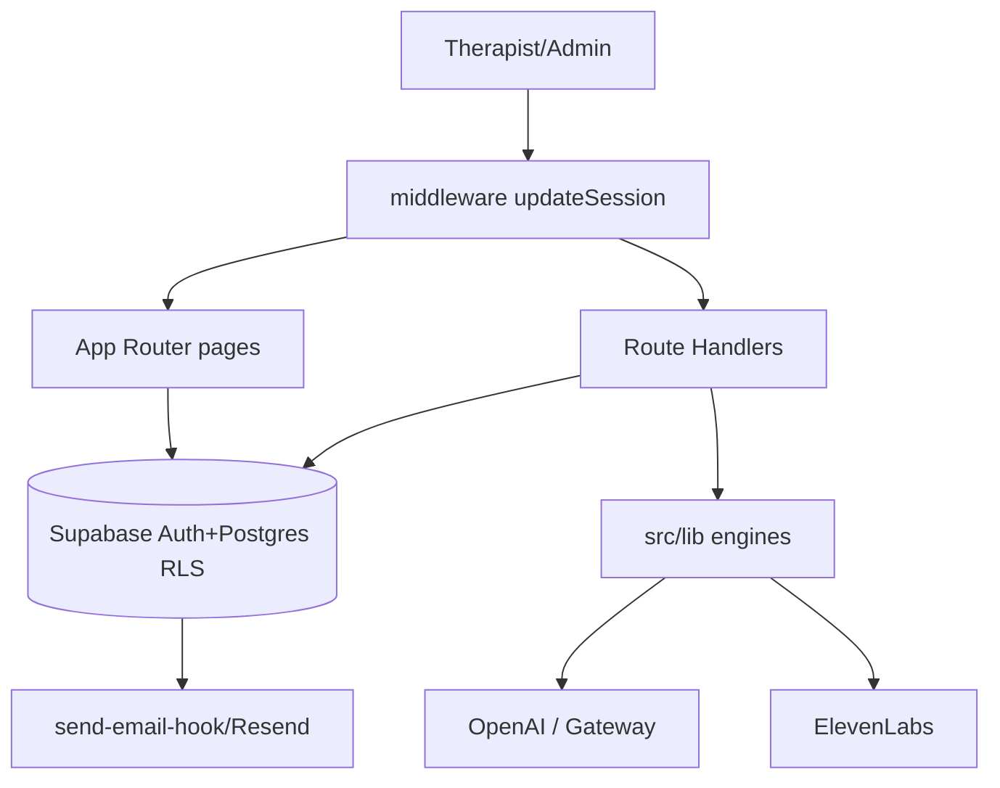
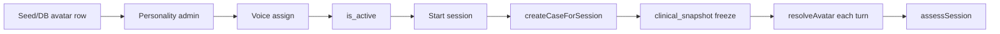
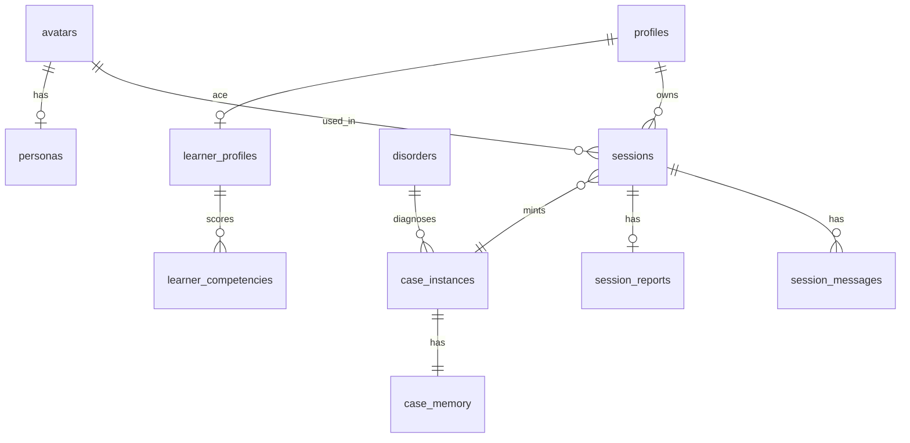

# VPsych — System Inventory & Function Catalog

**Document type:** Forensic current-state assessment (read-only)  
**Assessment date:** 2026-08-09  
**Repository:** `alhazayed/vpsych`  
**Branch:** `cursor/system-inventory-catalog-b432`  
**Commit:** `a75bade2572e0c5ac2c8a9deaff521db47c7d1c5`  
**Application code modified during audit:** **No**  
**Companion file:** [`VPsych_SYSTEM_INVENTORY.json`](./VPsych_SYSTEM_INVENTORY.json)

> Authoritative inventory of what VPsych currently contains. Not a redesign. Not an implementation plan. No secrets.

---

## 1. Executive summary

VPsych (`1.0.0-rc.1`) is a therapist-training platform: trainees run voice/text psychotherapy sessions against AI standardized patients; the platform writes **admin-only** performance reports. Sessions are bilingual (EN/AR) with natively authored personalities.

**Production-capable today:** Auth/roles, classic sessions, case minting, patient agent, assessment+HMAC reports, STT/TTS, admin reports, ACE/CGE (best-effort), i18n, rate limits, security headers.

**Limited / incomplete:** Unvalidated competency scores; ACE baseline 70 flattening dashboards; no in-app avatar create/publish; Therapy Room/VMHC/realtime flag-off; enterprise LMS schema underused; no Sentry; no PDF export.

**Do not casually change:** `session_messages`/`session_reports` RLS, HMAC `create_session_report`, `messageRpcClient` fallback, private `weightedOverall`, ACE soft-fail, CGE excluding `ace-bridge`, CSP allowlists.

---

## 2. Phase 0 — Audit baseline

| Field | Value |
|---|---|
| Repository | alhazayed/vpsych |
| Branch | `cursor/system-inventory-catalog-b432` |
| Commit | `a75bade2572e0c5ac2c8a9deaff521db47c7d1c5` |
| Package manager | npm |
| Framework | Next.js 16.2.12 App Router |
| Frontend | React 19.2.4, Tailwind v4, next-intl |
| Backend | Next.js Route Handlers |
| Database | Supabase Postgres + RLS (100 tables, 26 DB functions) |
| Hosting | Vercel |
| Authentication | Supabase Auth |
| AI providers | OpenAI SDK, Vercel AI Gateway |
| Voice | OpenAI STT, ElevenLabs TTS |
| Monitoring | In-app ops/CIDP; Sentry not wired |
| Testing | Vitest — 81 `*.test.ts` files |
| Linting / types / build | ESLint, `tsc --noEmit`, `next build` |
| Migrations | 74 |
| Edge Functions | send-email-hook |
| Canonical roles | `therapist` \| `admin` (`src/lib/types.ts`) |

Env **names** only: see `.env.example` and JSON `repository.env_variable_names`. Never commit or print values.

---

## 3. Architecture overview



**Session lifecycle:** `POST /api/sessions` → `createCaseForSession` → messages (`generatePatientReplyDetailed` + `insert_assistant_message`) → `POST .../end` → `assessSession` → report write → soft-fail bridges (education/ACE, validation, supervisor, enterprise, realtime).

Hard expiry: `MAX_SESSION_SECONDS = 40*60` (`src/lib/types.ts`).

---

## 4. Repository map (Phase 1)

| Path | Purpose | Status |
|---|---|---|
| `src/app/` | Pages + API | ACTIVE |
| `src/app/(app)/` | Authenticated shell | ACTIVE |
| `src/components/` | Client UI | ACTIVE |
| `src/lib/` | Engines + security | ACTIVE |
| `messages/` | i18n strings EN/AR | ACTIVE |
| `supabase/migrations/` | Schema of record | ACTIVE |
| `supabase/functions/send-email-hook/` | Auth email | ACTIVE |
| `personas/` | Clinical case JSON | ACTIVE |
| `schemas/` | Avatar/personality JSON Schema | ACTIVE |
| `docs/` | Specs + certifications | DOCS |
| `scripts/` | Migration parity, perf smoke | CI/OPS |
| `ops/` | CIDP dashboard JSON | OPS |
| `public/` | Static assets | ACTIVE |

### Engine directories under `src/lib/`

| Dir | Purpose | Status |
|---|---|---|
| ai | Provider, patient, assessment, prompts | PRODUCTION |
| voice | STT/TTS/pipeline | PRODUCTION |
| case-engine | Immutable case minting | PRODUCTION |
| scenario-templates | Template→case | PRODUCTION |
| instructor-presets | Instructor presets | PRODUCTION |
| personality-engine | Traits ≠ diagnosis | PRODUCTION |
| avatars | resolveAvatar | PRODUCTION |
| ace / cge | Curriculum + competency graph | FUNCTIONAL W/ LIMITATIONS |
| therapy-room | Immersive + VMHC | FLAG-OFF |
| clinical-voice | Prosody profiles | PRODUCTION |
| emotion, adaptation, humanization, conversation-behaviour, patient-memory, nbe, clinical-intelligence | Turn richness | ACTIVE |
| education, supervisor | Post-session bundles | ACTIVE |
| enterprise, validation, scientific, quality-ledger, vqi, avi, ale, cfi, eri, rrs | Research/quality/enterprise | PARTIAL |
| realtime | Streaming sim | FLAG-OFF |
| ops | CIDP/phase evidence | ADMIN |

---

## 5. Route map (Phase 2) — 36 pages, 62 route handlers

### 5.1 Pages

| Route | File | Classification |
|---|---|---|
| `/admin/avatars` | `src/app/(app)/admin/avatars/page.tsx` | ADMIN |
| `/admin/cases` | `src/app/(app)/admin/cases/page.tsx` | ADMIN |
| `/admin/cidp` | `src/app/(app)/admin/cidp/page.tsx` | ADMIN |
| `/admin/curriculum` | `src/app/(app)/admin/curriculum/page.tsx` | ADMIN |
| `/admin/enterprise` | `src/app/(app)/admin/enterprise/page.tsx` | ADMIN |
| `/admin/feedback` | `src/app/(app)/admin/feedback/page.tsx` | ADMIN |
| `/admin/graph` | `src/app/(app)/admin/graph/page.tsx` | ADMIN |
| `/admin/personality` | `src/app/(app)/admin/personality/page.tsx` | ADMIN |
| `/admin/presets` | `src/app/(app)/admin/presets/page.tsx` | ADMIN |
| `/admin/reports` | `src/app/(app)/admin/reports/page.tsx` | ADMIN |
| `/admin/reports/[sessionId]` | `src/app/(app)/admin/reports/[sessionId]/page.tsx` | ADMIN |
| `/admin/research` | `src/app/(app)/admin/research/page.tsx` | ADMIN |
| `/admin/supervisor` | `src/app/(app)/admin/supervisor/page.tsx` | ADMIN |
| `/admin/templates` | `src/app/(app)/admin/templates/page.tsx` | ADMIN |
| `/admin/voices` | `src/app/(app)/admin/voices/page.tsx` | ADMIN |
| `/auth/reset-password` | `src/app/auth/reset-password/page.tsx` | PUBLIC |
| `/avatars` | `src/app/(app)/avatars/page.tsx` | AUTHENTICATED / THERAPIST |
| `/clinic` | `src/app/(app)/clinic/page.tsx` | THERAPIST (feature-flagged) |
| `/clinic/chart/[appointmentId]` | `src/app/(app)/clinic/chart/[appointmentId]/page.tsx` | THERAPIST (feature-flagged) |
| `/clinic/day-end` | `src/app/(app)/clinic/day-end/page.tsx` | THERAPIST (feature-flagged) |
| `/clinic/room/[sessionId]` | `src/app/(app)/clinic/room/[sessionId]/page.tsx` | THERAPIST (feature-flagged) |
| `/clinic/room/[sessionId]/debrief` | `src/app/(app)/clinic/room/[sessionId]/debrief/page.tsx` | THERAPIST (feature-flagged) |
| `/clinic/room/[sessionId]/supervisor` | `src/app/(app)/clinic/room/[sessionId]/supervisor/page.tsx` | THERAPIST (feature-flagged) |
| `/feedback` | `src/app/(app)/feedback/page.tsx` | AUTHENTICATED / THERAPIST |
| `/learning` | `src/app/(app)/learning/page.tsx` | AUTHENTICATED / THERAPIST |
| `/learning/graph` | `src/app/(app)/learning/graph/page.tsx` | AUTHENTICATED / THERAPIST |
| `/learning/supervisor` | `src/app/(app)/learning/supervisor/page.tsx` | AUTHENTICATED / THERAPIST |
| `/login` | `src/app/login/page.tsx` | PUBLIC |
| `/page.tsx` | `src/app/page.tsx` | AUTHENTICATED / THERAPIST |
| `/privacy` | `src/app/privacy/page.tsx` | PUBLIC |
| `/sessions` | `src/app/(app)/sessions/page.tsx` | AUTHENTICATED / THERAPIST |
| `/sessions/[id]` | `src/app/(app)/sessions/[id]/page.tsx` | AUTHENTICATED / THERAPIST |
| `/sessions/[id]/complete` | `src/app/(app)/sessions/[id]/complete/page.tsx` | AUTHENTICATED / THERAPIST |
| `/signup` | `src/app/signup/page.tsx` | PUBLIC |
| `/terms` | `src/app/terms/page.tsx` | PUBLIC |
| `/validation` | `src/app/validation/page.tsx` | PUBLIC |

### 5.2 API / auth route handlers

| Methods | Route | File | Classification |
|---|---|---|---|
| `POST` | `/api/ace/adaptive-case` | `src/app/api/ace/adaptive-case/route.ts` | AUTHENTICATED |
| `GET` | `/api/ace/analytics` | `src/app/api/ace/analytics/route.ts` | AUTHENTICATED |
| `GET,POST` | `/api/ace/curriculum` | `src/app/api/ace/curriculum/route.ts` | AUTHENTICATED |
| `GET,PATCH` | `/api/ace/profile` | `src/app/api/ace/profile/route.ts` | AUTHENTICATED |
| `GET,PATCH` | `/api/admin/ace/learners` | `src/app/api/admin/ace/learners/route.ts` | ADMIN |
| `GET,POST` | `/api/admin/ale` | `src/app/api/admin/ale/route.ts` | ADMIN |
| `PATCH` | `/api/admin/avatars/[id]/voice` | `src/app/api/admin/avatars/[id]/voice/route.ts` | ADMIN |
| `GET,POST` | `/api/admin/avi` | `src/app/api/admin/avi/route.ts` | ADMIN |
| `POST` | `/api/admin/cases/preview` | `src/app/api/admin/cases/preview/route.ts` | ADMIN |
| `GET,POST` | `/api/admin/cfi` | `src/app/api/admin/cfi/route.ts` | ADMIN |
| `GET,PATCH` | `/api/admin/cge` | `src/app/api/admin/cge/route.ts` | ADMIN |
| `GET` | `/api/admin/disorders` | `src/app/api/admin/disorders/route.ts` | ADMIN |
| `GET` | `/api/admin/enterprise` | `src/app/api/admin/enterprise/route.ts` | ADMIN |
| `GET,POST` | `/api/admin/eri` | `src/app/api/admin/eri/route.ts` | ADMIN |
| `GET,PATCH` | `/api/admin/feedback` | `src/app/api/admin/feedback/route.ts` | ADMIN |
| `GET` | `/api/admin/ops/cidp` | `src/app/api/admin/ops/cidp/route.ts` | ADMIN |
| `GET` | `/api/admin/ops/cidp/weekly` | `src/app/api/admin/ops/cidp/weekly/route.ts` | ADMIN |
| `GET` | `/api/admin/ops/metrics` | `src/app/api/admin/ops/metrics/route.ts` | ADMIN |
| `GET` | `/api/admin/ops/phase14` | `src/app/api/admin/ops/phase14/route.ts` | ADMIN |
| `GET` | `/api/admin/ops/phase15` | `src/app/api/admin/ops/phase15/route.ts` | ADMIN |
| `GET` | `/api/admin/ops/phase16` | `src/app/api/admin/ops/phase16/route.ts` | ADMIN |
| `GET,POST,PUT` | `/api/admin/personality` | `src/app/api/admin/personality/route.ts` | ADMIN |
| `GET,POST` | `/api/admin/presets` | `src/app/api/admin/presets/route.ts` | ADMIN |
| `POST` | `/api/admin/presets/preview` | `src/app/api/admin/presets/preview/route.ts` | ADMIN |
| `GET` | `/api/admin/quality-ledger` | `src/app/api/admin/quality-ledger/route.ts` | ADMIN |
| `GET` | `/api/admin/realtime` | `src/app/api/admin/realtime/route.ts` | ADMIN |
| `GET` | `/api/admin/research/export` | `src/app/api/admin/research/export/route.ts` | ADMIN |
| `GET,POST` | `/api/admin/rrs` | `src/app/api/admin/rrs/route.ts` | ADMIN |
| `GET` | `/api/admin/supervisor` | `src/app/api/admin/supervisor/route.ts` | ADMIN |
| `GET,POST` | `/api/admin/templates` | `src/app/api/admin/templates/route.ts` | ADMIN |
| `POST` | `/api/admin/templates/preview` | `src/app/api/admin/templates/preview/route.ts` | ADMIN |
| `GET,POST` | `/api/admin/validation` | `src/app/api/admin/validation/route.ts` | ADMIN |
| `GET,PATCH` | `/api/admin/voice-profiles/[id]` | `src/app/api/admin/voice-profiles/[id]/route.ts` | ADMIN |
| `POST` | `/api/admin/voice-profiles/[id]/live-switch` | `src/app/api/admin/voice-profiles/[id]/live-switch/route.ts` | ADMIN |
| `GET,POST` | `/api/admin/vqi` | `src/app/api/admin/vqi/route.ts` | ADMIN |
| `GET` | `/api/cge/graph` | `src/app/api/cge/graph/route.ts` | AUTHENTICATED |
| `GET,POST` | `/api/cge/mastery` | `src/app/api/cge/mastery/route.ts` | AUTHENTICATED |
| `POST` | `/api/cge/rca` | `src/app/api/cge/rca/route.ts` | AUTHENTICATED |
| `PATCH` | `/api/clinic/appointments/[id]` | `src/app/api/clinic/appointments/[id]/route.ts` | AUTHENTICATED |
| `GET` | `/api/clinic/day` | `src/app/api/clinic/day/route.ts` | AUTHENTICATED |
| `POST` | `/api/clinic/day/[id]/close` | `src/app/api/clinic/day/[id]/close/route.ts` | AUTHENTICATED |
| `GET` | `/api/education/summary` | `src/app/api/education/summary/route.ts` | AUTHENTICATED |
| `GET` | `/api/enterprise/certificates/verify` | `src/app/api/enterprise/certificates/verify/route.ts` | PUBLIC |
| `GET` | `/api/enterprise/summary` | `src/app/api/enterprise/summary/route.ts` | AUTHENTICATED |
| `GET,POST` | `/api/feedback` | `src/app/api/feedback/route.ts` | AUTHENTICATED |
| `GET` | `/api/health` | `src/app/api/health/route.ts` | PUBLIC |
| `GET` | `/api/health/openai` | `src/app/api/health/openai/route.ts` | ADMIN |
| `GET` | `/api/realtime/summary` | `src/app/api/realtime/summary/route.ts` | AUTHENTICATED |
| `POST` | `/api/sessions` | `src/app/api/sessions/route.ts` | AUTHENTICATED |
| `GET,POST` | `/api/sessions/[id]/emotion` | `src/app/api/sessions/[id]/emotion/route.ts` | AUTHENTICATED |
| `POST` | `/api/sessions/[id]/end` | `src/app/api/sessions/[id]/end/route.ts` | AUTHENTICATED |
| `POST` | `/api/sessions/[id]/message` | `src/app/api/sessions/[id]/message/route.ts` | AUTHENTICATED |
| `POST` | `/api/sessions/[id]/message/stream` | `src/app/api/sessions/[id]/message/stream/route.ts` | AUTHENTICATED |
| `GET,POST` | `/api/sessions/[id]/notes` | `src/app/api/sessions/[id]/notes/route.ts` | AUTHENTICATED |
| `GET` | `/api/sessions/[id]/supervisor` | `src/app/api/sessions/[id]/supervisor/route.ts` | AUTHENTICATED |
| `PATCH` | `/api/sessions/[id]/therapy-room` | `src/app/api/sessions/[id]/therapy-room/route.ts` | AUTHENTICATED |
| `GET` | `/api/supervisor/summary` | `src/app/api/supervisor/summary/route.ts` | AUTHENTICATED |
| `GET,POST` | `/api/validation/invite` | `src/app/api/validation/invite/route.ts` | PUBLIC |
| `POST` | `/api/voice/transcribe` | `src/app/api/voice/transcribe/route.ts` | AUTHENTICATED |
| `POST` | `/api/voice/tts` | `src/app/api/voice/tts/route.ts` | AUTHENTICATED |
| `GET` | `/auth/callback` | `src/app/auth/callback/route.ts` | AUTHENTICATED |
| `GET` | `/auth/confirm` | `src/app/auth/confirm/route.ts` | AUTHENTICATED |

### 5.3 Middleware gates

Evidence: `src/middleware.ts` → `src/lib/supabase/middleware.ts`.

- Refresh Supabase session cookies
- Public allowlist: `/`, `/login`, `/signup`, `/auth/*`, `/privacy`, `/terms`, `/validation`, `/api/health`, `/api/validation/invite`, `/api/enterprise/certificates/verify`, robots/sitemap
- Unauthenticated non-public → `/login?next=` or API 401
- `/admin` + `/api/admin` require `profiles.role === "admin"`
- Locale cookie wins over `preferred_language`

### 5.4 Navigation entry points

`src/components/AppShell.tsx` + `messages/en.json` `nav.*`.

**Therapist:** `/avatars`, `/clinic` (if TRM), `/sessions`, `/learning`, `/learning/graph`, `/learning/supervisor`, `/feedback`.

**Admin:** `/admin/reports`, `/admin/avatars`, `/admin/personality`, `/admin/voices`, `/admin/cases`, `/admin/templates`, `/admin/presets`, `/admin/curriculum`, `/admin/graph`, `/admin/research`, `/admin/supervisor`, `/admin/enterprise`, `/admin/cidp`, `/admin/feedback`.

**Orphan i18n keys (not linked):** `nav.apiIntegrations`, `nav.securityKeys`.

---

## 6. User journeys (Phase 2 continued)

### Journey: Sign up
`/signup` → password policy (`password-policy.ts`) → Supabase signUp → trigger `handle_new_user` inserts `profiles` → email confirm via `send-email-hook` → `/auth/confirm` → `/avatars`.

### Journey: Login / password reset
`/login` → signInWithPassword → middleware session → `/avatars`. Reset: recovery email → `/auth/confirm` → `/auth/reset-password`.

### Journey: Therapy session (classic)
`/avatars` → `StartSessionButton` → `POST /api/sessions` (`createCaseForSession`, clinical_snapshot) → `/sessions/[id]` `VoiceSession` → STT/message/TTS loop → `POST .../end` → assess + report → `/sessions/[id]/complete`. Therapist sees completion/transcript; **full report admin-only**.

### Journey: Therapy Room / clinic (flag-on only)
`FEATURE_THERAPY_ROOM` → `/clinic` day board → chart → `/clinic/room/[sessionId]` → debrief/supervisor → day-end. Immersive mode also gated by `NEXT_PUBLIC_THERAPY_ROOM_MODE`.

### Journey: Learning / competencies
`/learning` → `GET /api/ace/profile` → `LearnerDashboard` (radar, plan, adaptive-case JSON). `/learning/graph` → CGE. `/learning/supervisor` → supervisor summary.

### Journey: Admin report review
`requireAdmin` → `/admin/reports` → `/admin/reports/[sessionId]` → `ReportView` + `logSecurityEvent(admin.report.view)`.

### Journey: Virtual patient management (actual)
Admin lists avatars (`/admin/avatars`) → voice assign → personality edit (`/admin/personality`) → case/template/preset **preview** APIs. **No create/publish avatar UI.** New patients require DB/seed/ops outside the product UI.



---

## 7. Feature inventory (Phase 3)

| Feature | Status | Entry / evidence |
|---|---|---|
| Authentication (signup/login/callback/reset) | PRODUCTION READY | /login, /signup, /auth/* |
| Roles therapist|admin via profiles.role | PRODUCTION READY | src/lib/types.ts, src/lib/auth.ts, src/middleware.ts |
| Virtual patient avatar catalog | FUNCTIONAL WITH LIMITATIONS | /avatars, /admin/avatars |
| Dynamic Clinical Case Engine | PRODUCTION READY | src/lib/case-engine, docs/DYNAMIC_CLINICAL_CASE_ENGINE.md |
| Therapy session (voice+text) | PRODUCTION READY | /sessions/[id] |
| STT OpenAI + TTS ElevenLabs | PRODUCTION READY |  |
| Post-session assessment + admin reports | FUNCTIONAL WITH LIMITATIONS | /admin/reports |
| Adaptive Curriculum Engine | FUNCTIONAL WITH LIMITATIONS | /learning |
| Competency Graph Engine | FUNCTIONAL WITH LIMITATIONS | /learning/graph |
| Therapy Room Mode / VMHC clinic | DEVELOPMENT ONLY / flag-off |  |
| Human Personality Engine | PRODUCTION READY | /admin/personality |
| Clinical Scenario Templates | PRODUCTION READY | /admin/templates |
| Instructor Presets | PRODUCTION READY | /admin/presets |
| Supervisor AI | FUNCTIONAL WITH LIMITATIONS | /learning/supervisor, /admin/supervisor |
| Enterprise / institutional platform | PARTIALLY IMPLEMENTED | /admin/enterprise |
| Scientific validation portal | FUNCTIONAL WITH LIMITATIONS | /validation, /admin/research |
| Institutional feedback | PRODUCTION READY | /feedback, /admin/feedback |
| Quality ledger + scientific indices | FUNCTIONAL WITH LIMITATIONS | Admin APIs; tables often empty |
| Bilingual EN/AR + RTL | PRODUCTION READY |  |
| API rate limiting | PRODUCTION READY |  |
| Security headers CSP/HSTS | PRODUCTION READY |  |
| Realtime simulation chrome | DEVELOPMENT ONLY |  |
| Long-term patient memory | FUNCTIONAL WITH LIMITATIONS |  |
| Emotion engine | PRODUCTION READY | Session path |
| PDF generation | UNUSED / ORPHANED | No PDF generator found in app dependencies |

**Present in code, weakly/not exposed in therapist UI:** scientific indices admin APIs (VQI/AVI/ALE/CFI/ERI/RRS), quality-ledger admin, enterprise LMS tables, NBE nonverbal plans, raw adaptive-case JSON, validation invite portal, CIDP ops panels.

**Not found:** PDF generation library/route; product CAPTCHA; Sentry SDK; scheduled pg_cron jobs.

---

## 8. Function catalog (Phase 4)

This is the primary catalog. **1082** exported TypeScript functions/handlers were mechanically enumerated under `src/` (see JSON `functions.entries`). Below: (A) load-bearing functions with full forensic cards; (B) complete export index by domain.

### 8.A Load-bearing function cards

------------------------------------------------------------
Function Name: requireUser / requireProfile / requireAdmin
File: src/lib/auth.ts
Line: ~1-40
Type: Server guard
Exported: yes
Purpose: Redirect-based auth for RSC/pages
INPUTS: none (session cookies)
OUTPUT: User/Profile or redirect
USED BY: (app)/layout, admin/session pages
CALLS: supabase getUser; profiles select
DATABASE: profiles read
EXTERNAL SERVICES: Supabase Auth
AUTHORIZATION: admin ⇒ role=admin
SIDE EFFECTS: redirect; audit on admin deny
ERROR HANDLING: redirect
STATUS: ACTIVE
RISK: HIGH
NOTES: Do not use in Route Handlers
------------------------------------------------------------

------------------------------------------------------------
Function Name: requireApiUser / requireApiAdmin
File: src/lib/api-auth.ts
Line: full file
Type: API guard
Exported: yes
Purpose: JSON 401/403 for APIs
INPUTS: Request context
OUTPUT: Auth bundle or error response
USED BY: /api/admin/* and many APIs
CALLS: getUser; logSecurityEvent
DATABASE: profiles; security_audit_events
EXTERNAL SERVICES: —
AUTHORIZATION: admin
SIDE EFFECTS: audit on deny
ERROR HANDLING: 401/403
STATUS: ACTIVE
RISK: CRITICAL
NOTES: Pairs with middleware admin gate
------------------------------------------------------------

------------------------------------------------------------
Function Name: updateSession
File: src/lib/supabase/middleware.ts
Line: full file
Type: Middleware
Exported: yes
Purpose: Session refresh, allowlist, admin gate, locale
INPUTS: NextRequest
OUTPUT: NextResponse
USED BY: src/middleware.ts
CALLS: createServerClient
DATABASE: profiles
EXTERNAL SERVICES: Supabase Auth
AUTHORIZATION: /admin,/api/admin
SIDE EFFECTS: cookies/redirects
ERROR HANDLING: 401/403
STATUS: ACTIVE
RISK: CRITICAL
NOTES: Public allowlist documented above
------------------------------------------------------------

------------------------------------------------------------
Function Name: rateLimit
File: src/lib/rate-limit.ts
Line: full file
Type: Utility
Exported: yes
Purpose: Hourly sliding-window limiter
INPUTS: key, limit, windowMs
OUTPUT: success/remaining/reset
USED BY: Every Route Handler
CALLS: Upstash or memory
DATABASE: —
EXTERNAL SERVICES: Upstash optional
AUTHORIZATION: —
SIDE EFFECTS: counter
ERROR HANDLING: caller 429
STATUS: ACTIVE
RISK: HIGH
NOTES: Memory fallback not multi-instance safe
------------------------------------------------------------

------------------------------------------------------------
Function Name: createCaseForSession
File: src/lib/case-engine/persist.ts
Line: export
Type: Service
Exported: yes
Purpose: Mint CaseInstance + clinical_snapshot
INPUTS: avatar + options
OUTPUT: case + snapshot
USED BY: POST /api/sessions
CALLS: generateCaseInstance / preset / freeze personality
DATABASE: case_instances, case_memory, disorders
EXTERNAL SERVICES: —
AUTHORIZATION: session create path
SIDE EFFECTS: DB writes
ERROR HANDLING: propagated
STATUS: ACTIVE
RISK: HIGH
NOTES: Diagnosis on snapshot not avatar
------------------------------------------------------------

------------------------------------------------------------
Function Name: resolveAvatar
File: src/lib/avatars/resolve.ts
Line: export
Type: Service
Exported: yes
Purpose: Avatar+locale+snapshot → ResolvedAvatar
INPUTS: avatar, language, opts
OUTPUT: ResolvedAvatar
USED BY: message/end routes
CALLS: pickPersonality; strip persona diagnosis
DATABASE: via caller
EXTERNAL SERVICES: —
AUTHORIZATION: —
SIDE EFFECTS: none
ERROR HANDLING: locale fallback
STATUS: ACTIVE
RISK: HIGH
NOTES: Locale never changes diagnosis
------------------------------------------------------------

------------------------------------------------------------
Function Name: generatePatientReplyDetailed
File: src/lib/ai/patient-agent.ts
Line: export
Type: AI
Exported: yes
Purpose: Patient turn generation
INPUTS: resolved avatar, history, state
OUTPUT: content + aiSource
USED BY: message + stream routes
CALLS: prompt-engine; OpenAI/gateway; CBE/humanization
DATABASE: via caller
EXTERNAL SERVICES: OpenAI/Gateway
AUTHORIZATION: owner
SIDE EFFECTS: AI call
ERROR HANDLING: persona_fallback
STATUS: ACTIVE
RISK: HIGH
NOTES: Must surface aiSource
------------------------------------------------------------

------------------------------------------------------------
Function Name: assessSession
File: src/lib/ai/assessment.ts
Line: export
Type: AI
Exported: yes
Purpose: Post-session rubric assessment
INPUTS: messages, rubric, lang
OUTPUT: scores/narrative/excerpts
USED BY: end route
CALLS: provider; parse; weightedOverall; heuristic
DATABASE: feeds report
EXTERNAL SERVICES: OpenAI/Gateway
AUTHORIZATION: owner end
SIDE EFFECTS: AI call
ERROR HANDLING: heuristicAssessment
STATUS: ACTIVE
RISK: CRITICAL
NOTES: Scores not validated
------------------------------------------------------------

------------------------------------------------------------
Function Name: weightedOverall
File: src/lib/ai/assessment.ts
Line: private
Type: Private helper
Exported: no
Purpose: Canonical 0–100 overall
INPUTS: score entries
OUTPUT: number
USED BY: assessSession
CALLS: —
DATABASE: —
EXTERNAL SERVICES: —
AUTHORIZATION: —
SIDE EFFECTS: none
ERROR HANDLING: —
STATUS: ACTIVE
RISK: HIGH
NOTES: Do not fork; architecture.test.ts
------------------------------------------------------------

------------------------------------------------------------
Function Name: heuristicAssessment
File: src/lib/ai/assessment.ts
Line: private
Type: Private helper
Exported: no
Purpose: Fallback scoring without model
INPUTS: transcript heuristics
OUTPUT: assessment payload
USED BY: assessSession
CALLS: keyword/turn heuristics
DATABASE: —
EXTERNAL SERVICES: —
AUTHORIZATION: —
SIDE EFFECTS: none
ERROR HANDLING: —
STATUS: ACTIVE
RISK: MEDIUM
NOTES: aiSource persona_fallback
------------------------------------------------------------

------------------------------------------------------------
Function Name: signSessionReport
File: src/lib/report-sign.ts
Line: export
Type: Security
Exported: yes
Purpose: HMAC-SHA256 report payload
INPUTS: sessionId, narrative, jsons
OUTPUT: hex signature
USED BY: end route
CALLS: crypto
DATABASE: —
EXTERNAL SERVICES: —
AUTHORIZATION: REPORT_WRITE_KEY
SIDE EFFECTS: none
ERROR HANDLING: misconfig 500
STATUS: ACTIVE
RISK: CRITICAL
NOTES: Must match Vault report_write_key
------------------------------------------------------------

------------------------------------------------------------
Function Name: create_session_report
File: supabase migrations
Line: RPC
Type: SECURITY DEFINER RPC
Exported: DB
Purpose: Insert-once signed report
INPUTS: p_session_id, narrative, scores, excerpts, sig
OUTPUT: report id
USED BY: end route
CALLS: —
DATABASE: session_reports write
EXTERNAL SERVICES: —
AUTHORIZATION: HMAC verify
SIDE EFFECTS: insert
ERROR HANDLING: SQL errors
STATUS: ACTIVE
RISK: CRITICAL
NOTES: Admin-only SELECT via RLS
------------------------------------------------------------

------------------------------------------------------------
Function Name: session_has_report
File: supabase migrations
Line: RPC
Type: SECURITY DEFINER RPC
Exported: DB
Purpose: Idempotency check
INPUTS: p_session_id
OUTPUT: boolean
USED BY: end route
CALLS: —
DATABASE: session_reports read
EXTERNAL SERVICES: —
AUTHORIZATION: owner/admin path
SIDE EFFECTS: none
ERROR HANDLING: warn+continue
STATUS: ACTIVE
RISK: HIGH
NOTES: —
------------------------------------------------------------

------------------------------------------------------------
Function Name: insert_assistant_message
File: supabase migrations
Line: RPC
Type: SECURITY DEFINER RPC
Exported: DB
Purpose: Insert assistant turn with guards
INPUTS: p_session_id, content
OUTPUT: message row
USED BY: message route
CALLS: —
DATABASE: session_messages
EXTERNAL SERVICES: —
AUTHORIZATION: owner+active+turn
SIDE EFFECTS: insert
ERROR HANDLING: SQL
STATUS: ACTIVE
RISK: CRITICAL
NOTES: RLS blocks direct assistant insert
------------------------------------------------------------

------------------------------------------------------------
Function Name: insert_system_message
File: supabase migrations
Line: RPC
Type: SECURITY DEFINER RPC
Exported: DB
Purpose: Insert system turn with guards
INPUTS: p_session_id, content
OUTPUT: message row
USED BY: sessions POST
CALLS: —
DATABASE: session_messages
EXTERNAL SERVICES: —
AUTHORIZATION: owner
SIDE EFFECTS: insert
ERROR HANDLING: SQL
STATUS: ACTIVE
RISK: HIGH
NOTES: —
------------------------------------------------------------

------------------------------------------------------------
Function Name: messageRpcClient
File: src/lib/supabase/admin.ts
Line: export
Type: Supabase helper
Exported: yes
Purpose: Prefer service role else user client
INPUTS: userClient
OUTPUT: SupabaseClient
USED BY: sessions start/message
CALLS: createServiceClient?
DATABASE: —
EXTERNAL SERVICES: —
AUTHORIZATION: RPC enforces auth
SIDE EFFECTS: none
ERROR HANDLING: null service ok
STATUS: ACTIVE
RISK: HIGH
NOTES: Hard-fail caused outage historically
------------------------------------------------------------

------------------------------------------------------------
Function Name: runAceAfterAssessment
File: src/lib/ace/session-hook.ts
Line: export (not barrel)
Type: Bridge
Exported: yes
Purpose: Best-effort ACE+CGE after assessment
INPUTS: assessment context
OUTPUT: void soft-fail
USED BY: education bridge → end
CALLS: ingest; learning plan; ace-bridge
DATABASE: learner_* tables
EXTERNAL SERVICES: —
AUTHORIZATION: owner
SIDE EFFECTS: DB updates
ERROR HANDLING: catch all
STATUS: ACTIVE
RISK: MEDIUM
NOTES: Never blocks report
------------------------------------------------------------

------------------------------------------------------------
Function Name: generateLearningPlan
File: src/lib/ace/curriculum.ts
Line: ~127-176
Type: ACE
Exported: yes
Purpose: primary_focus, goals, ETA sessions
INPUTS: profile, threshold
OUTPUT: LearningPlan
USED BY: ACE APIs, session-hook
CALLS: scoreOf
DATABASE: pure
EXTERNAL SERVICES: —
AUTHORIZATION: —
SIDE EFFECTS: none
ERROR HANDLING: —
STATUS: ACTIVE
RISK: MEDIUM
NOTES: estimated = max(1, ceil(gap/8))
------------------------------------------------------------

------------------------------------------------------------
Function Name: createEmptyCompetencies
File: src/lib/ace/engine.ts
Line: 35-42
Type: ACE
Exported: yes
Purpose: Seed all competencies score=70 samples=0
INPUTS: —
OUTPUT: LearnerCompetency[]
USED BY: createLearnerProfile, persist
CALLS: COMPETENCY_IDS
DATABASE: —
EXTERNAL SERVICES: —
AUTHORIZATION: —
SIDE EFFECTS: none
ERROR HANDLING: —
STATUS: ACTIVE
RISK: HIGH
NOTES: Root of flat dashboards
------------------------------------------------------------

------------------------------------------------------------
Function Name: runVoiceConversationTurn
File: src/lib/voice/conversation-pipeline.ts
Line: export
Type: Voice
Exported: yes
Purpose: STT→message→TTS
INPUTS: audio, sessionId, locale
OUTPUT: turn result
USED BY: VoiceSession, TherapyRoom
CALLS: transcribe; submit; play
DATABASE: via APIs
EXTERNAL SERVICES: OpenAI STT, ElevenLabs
AUTHORIZATION: cookie session
SIDE EFFECTS: network
ERROR HANDLING: UI errors
STATUS: ACTIVE
RISK: HIGH
NOTES: Text skips STT/TTS
------------------------------------------------------------

------------------------------------------------------------
Function Name: isTherapyRoomEnabled
File: src/lib/features.ts
Line: 9-13
Type: Feature flag
Exported: yes
Purpose: VMHC /clinic gate
INPUTS: env
OUTPUT: boolean
USED BY: AppShell, clinic pages
CALLS: —
DATABASE: —
EXTERNAL SERVICES: —
AUTHORIZATION: —
SIDE EFFECTS: none
ERROR HANDLING: —
STATUS: ACTIVE
RISK: LOW
NOTES: Distinct from THERAPY_ROOM_MODE
------------------------------------------------------------

------------------------------------------------------------
Function Name: isTherapyRoomModeEnabled
File: src/lib/therapy-room/feature-flag.ts
Line: export
Type: Feature flag
Exported: yes
Purpose: Classic vs immersive toggle
INPUTS: env NEXT_PUBLIC_THERAPY_ROOM_MODE
OUTPUT: boolean
USED BY: StartSessionButton, session page
CALLS: —
DATABASE: —
EXTERNAL SERVICES: —
AUTHORIZATION: —
SIDE EFFECTS: none
ERROR HANDLING: —
STATUS: ACTIVE
RISK: LOW
NOTES: Dual-flag debt
------------------------------------------------------------

------------------------------------------------------------
Function Name: logSecurityEvent
File: src/lib/security-audit.ts
Line: export
Type: Security
Exported: yes
Purpose: Write security_audit_events
INPUTS: action, meta
OUTPUT: void
USED BY: requireApiAdmin, report view
CALLS: rpc log_security_event
DATABASE: security_audit_events
EXTERNAL SERVICES: —
AUTHORIZATION: admin paths
SIDE EFFECTS: insert
ERROR HANDLING: soft fail
STATUS: ACTIVE
RISK: MEDIUM
NOTES: Partial coverage of admin mutations
------------------------------------------------------------

------------------------------------------------------------
Function Name: clientSafeError / sanitizeDbError
File: src/lib/api-errors.ts, safe-client-error.ts
Line: export
Type: Security
Exported: yes
Purpose: Strip provider/DB detail from clients
INPUTS: error
OUTPUT: safe string/JSON
USED BY: API routes
CALLS: —
DATABASE: —
EXTERNAL SERVICES: —
AUTHORIZATION: —
SIDE EFFECTS: none
ERROR HANDLING: —
STATUS: ACTIVE
RISK: HIGH
NOTES: Never leak env/SQL
------------------------------------------------------------

------------------------------------------------------------
Function Name: runEducationAfterAssessment
File: src/lib/education/session-bridge.ts
Line: export
Type: Bridge
Exported: yes
Purpose: Education bundle + ACE hook
INPUTS: assessment
OUTPUT: bundle
USED BY: end route
CALLS: runAceAfterAssessment
DATABASE: ACE tables
EXTERNAL SERVICES: —
AUTHORIZATION: owner
SIDE EFFECTS: DB
ERROR HANDLING: soft-fail
STATUS: ACTIVE
RISK: MEDIUM
NOTES: Architecture: end must not import ACE directly
------------------------------------------------------------

------------------------------------------------------------
Function Name: buildContentSecurityPolicy / securityHeaders
File: src/lib/security-headers.ts
Line: export
Type: Security
Exported: yes
Purpose: CSP/HSTS/COOP/CORP/PP
INPUTS: —
OUTPUT: header list
USED BY: next.config.ts
CALLS: —
DATABASE: —
EXTERNAL SERVICES: —
AUTHORIZATION: —
SIDE EFFECTS: none
ERROR HANDLING: —
STATUS: ACTIVE
RISK: HIGH
NOTES: Update tests when adding hosts
------------------------------------------------------------

------------------------------------------------------------
Function Name: Deno.serve send-email-hook
File: supabase/functions/send-email-hook/index.ts
Line: entry
Type: Edge Function
Exported: yes
Purpose: Auth emails via Resend
INPUTS: webhook payload
OUTPUT: HTTP
USED BY: Supabase Auth hook
CALLS: Resend API
DATABASE: —
EXTERNAL SERVICES: Resend
AUTHORIZATION: webhook signature
SIDE EFFECTS: email send
ERROR HANDLING: hook errors
STATUS: ACTIVE
RISK: HIGH
NOTES: verify_jwt=false; Standard Webhooks
------------------------------------------------------------

### 8.B Complete export index by domain

Mechanical enumeration of `export function` / `export async function` / exported const callables under `src/` (excluding `*.test.ts`). Route handlers listed in §5.2.

| Domain | Export count |
|---|---|
| `ace` | 25 |
| `adaptation` | 18 |
| `ai` | 27 |
| `ale` | 8 |
| `app-routes` | 4 |
| `avatars` | 8 |
| `avi` | 8 |
| `case-engine` | 26 |
| `cfi` | 7 |
| `cge` | 39 |
| `clinical-intelligence` | 62 |
| `clinical-voice` | 17 |
| `conversation-behaviour` | 10 |
| `education` | 24 |
| `emotion` | 23 |
| `enterprise` | 80 |
| `eri` | 8 |
| `humanization` | 16 |
| `i18n` | 2 |
| `instructor-presets` | 13 |
| `lib-root` | 42 |
| `middleware.ts` | 1 |
| `nbe` | 16 |
| `ops` | 43 |
| `patient-memory` | 28 |
| `personality-engine` | 12 |
| `quality-ledger` | 26 |
| `realtime` | 65 |
| `rrs` | 9 |
| `scenario-templates` | 7 |
| `scientific` | 15 |
| `supabase` | 4 |
| `supervisor` | 33 |
| `therapy-room` | 53 |
| `validation` | 60 |
| `voice` | 45 |
| `vqi` | 33 |

#### `ace` (25)

| Function | File | Line |
|---|---|---|
| `selectActiveRules` | `src/lib/ace/adaptive.ts` | 77 |
| `generateAdaptiveCase` | `src/lib/ace/adaptive.ts` | 110 |
| `detectRepetitionLoop` | `src/lib/ace/adaptive.ts` | 302 |
| `mapRubricToCompetencies` | `src/lib/ace/analytics.ts` | 12 |
| `updateCompetencyEma` | `src/lib/ace/analytics.ts` | 40 |
| `applySessionPerformance` | `src/lib/ace/analytics.ts` | 66 |
| `buildAnalytics` | `src/lib/ace/analytics.ts` | 146 |
| `inferMissFlagsFromNarrative` | `src/lib/ace/analytics.ts` | 197 |
| `scoreOf` | `src/lib/ace/catalog.ts` | 394 |
| `evaluateCertifications` | `src/lib/ace/certifications.ts` | 17 |
| `updateCertificationStatus` | `src/lib/ace/certifications.ts` | 45 |
| `generateSupervisorFeedback` | `src/lib/ace/coach.ts` | 10 |
| `buildRemediationCurriculum` | `src/lib/ace/curriculum.ts` | 11 |
| `generateCurriculum` | `src/lib/ace/curriculum.ts` | 83 |
| `advanceCurriculum` | `src/lib/ace/curriculum.ts` | 97 |
| `generateLearningPlan` | `src/lib/ace/curriculum.ts` | 127 |
| `createEmptyCompetencies` | `src/lib/ace/engine.ts` | 35 |
| `createLearnerProfile` | `src/lib/ace/engine.ts` | 45 |
| `ingestSessionAssessment` | `src/lib/ace/engine.ts` | 78 |
| `getLearningPlan` | `src/lib/ace/engine.ts` | 154 |
| `ensureLearnerProfile` | `src/lib/ace/persist.ts` | 11 |
| `persistLearnerUpdate` | `src/lib/ace/persist.ts` | 130 |
| `runAceAfterAssessment` | `src/lib/ace/session-hook.ts` | 19 |
| `simulateVirtualLearners` | `src/lib/ace/simulate.ts` | 58 |
| `verifySuccessCriteria` | `src/lib/ace/simulate.ts` | 268 |

#### `adaptation` (18)

| Function | File | Line |
|---|---|---|
| `createAdaptationState` | `src/lib/adaptation/engine.ts` | 54 |
| `applyAdaptationEffects` | `src/lib/adaptation/engine.ts` | 97 |
| `processTherapistTurn` | `src/lib/adaptation/engine.ts` | 169 |
| `beginNextSession` | `src/lib/adaptation/engine.ts` | 229 |
| `buildAdaptationDirective` | `src/lib/adaptation/expression.ts` | 11 |
| `formatAdaptationBlock` | `src/lib/adaptation/expression.ts` | 91 |
| `createRapportState` | `src/lib/adaptation/rapport.ts` | 17 |
| `updateRapport` | `src/lib/adaptation/rapport.ts` | 34 |
| `carryRapportToNextSession` | `src/lib/adaptation/rapport.ts` | 95 |
| `clamp01to100` | `src/lib/adaptation/signals.ts` | 35 |
| `signalTherapistBehaviour` | `src/lib/adaptation/signals.ts` | 43 |
| `embedAdaptationInMemory` | `src/lib/adaptation/store.ts` | 19 |
| `extractAdaptationFromMemory` | `src/lib/adaptation/store.ts` | 33 |
| `loadAdaptationState` | `src/lib/adaptation/store.ts` | 46 |
| `saveAdaptationState` | `src/lib/adaptation/store.ts` | 67 |
| `createTrustState` | `src/lib/adaptation/trust.ts` | 14 |
| `updateTrust` | `src/lib/adaptation/trust.ts` | 27 |
| `carryTrustToNextSession` | `src/lib/adaptation/trust.ts` | 69 |

#### `ai` (27)

| Function | File | Line |
|---|---|---|
| `extractJsonObject` | `src/lib/ai/assessment-parse.ts` | 43 |
| `normalizeAssessmentPayload` | `src/lib/ai/assessment-parse.ts` | 74 |
| `parseAssessmentModelText` | `src/lib/ai/assessment-parse.ts` | 97 |
| `assessSession` | `src/lib/ai/assessment.ts` | 443 |
| `hasOpenAIApiKey` | `src/lib/ai/openai/client.ts` | 6 |
| `getOpenAIClient` | `src/lib/ai/openai/client.ts` | 14 |
| `resetOpenAIClient` | `src/lib/ai/openai/client.ts` | 34 |
| `isOpenAIServiceError` | `src/lib/ai/openai/errors.ts` | 68 |
| `openaiErrorKind` | `src/lib/ai/openai/errors.ts` | 85 |
| `toOpenAIServiceError` | `src/lib/ai/openai/errors.ts` | 108 |
| `isReasoningModel` | `src/lib/ai/openai/service.ts` | 24 |
| `generatePatientReply` | `src/lib/ai/patient-agent.ts` | 81 |
| `generatePatientReplyDetailed` | `src/lib/ai/patient-agent.ts` | 98 |
| `generatePatientReplyStream` | `src/lib/ai/patient-agent.ts` | 281 |
| `renderPromptTemplate` | `src/lib/ai/prompt-engine.ts` | 98 |
| `assembleSystemPrompt` | `src/lib/ai/prompt-engine.ts` | 348 |
| `assemblePerTurnReinforcement` | `src/lib/ai/prompt-engine.ts` | 385 |
| `synthesizePromptInputFromFlat` | `src/lib/ai/prompt-engine.ts` | 408 |
| `hasGatewayKey` | `src/lib/ai/provider.ts` | 10 |
| `hasAnyAiKey` | `src/lib/ai/provider.ts` | 14 |
| `gatewayModelId` | `src/lib/ai/provider.ts` | 18 |
| `preferOpenAiSdk` | `src/lib/ai/provider.ts` | 27 |
| `openAiFallbackChatModel` | `src/lib/ai/provider.ts` | 37 |
| `normalizeReportLanguage` | `src/lib/ai/report-locale.ts` | 2 |
| `localizeRubricLabel` | `src/lib/ai/report-locale.ts` | 44 |
| `buildExaminerSystemPrompt` | `src/lib/ai/report-locale.ts` | 55 |
| `heuristicCopy` | `src/lib/ai/report-locale.ts` | 132 |

#### `ale` (8)

| Function | File | Line |
|---|---|---|
| `buildAleDashboard` | `src/lib/ale/aggregate.ts` | 48 |
| `buildAleOfflineCorpus` | `src/lib/ale/corpus.ts` | 105 |
| `difficultyRank` | `src/lib/ale/engine.ts` | 58 |
| `confidenceInterval` | `src/lib/ale/engine.ts` | 470 |
| `computeAdaptiveLearningEffectiveness` | `src/lib/ale/engine.ts` | 488 |
| `aleInputFromTrajectory` | `src/lib/ale/from-trajectory.ts` | 25 |
| `assertWeightMatrixValid` | `src/lib/ale/weights.ts` | 95 |
| `weightMap` | `src/lib/ale/weights.ts` | 106 |

#### `app-routes` (84)

| Function | File | Line |
|---|---|---|
| `POST` | `src/app/api/ace/adaptive-case/route.ts` | 7 |
| `GET` | `src/app/api/ace/analytics/route.ts` | 7 |
| `GET` | `src/app/api/ace/curriculum/route.ts` | 11 |
| `POST` | `src/app/api/ace/curriculum/route.ts` | 46 |
| `GET` | `src/app/api/ace/profile/route.ts` | 21 |
| `PATCH` | `src/app/api/ace/profile/route.ts` | 51 |
| `GET` | `src/app/api/admin/ace/learners/route.ts` | 7 |
| `PATCH` | `src/app/api/admin/ace/learners/route.ts` | 43 |
| `GET` | `src/app/api/admin/ale/route.ts` | 18 |
| `POST` | `src/app/api/admin/ale/route.ts` | 89 |
| `PATCH` | `src/app/api/admin/avatars/[id]/voice/route.ts` | 20 |
| `GET` | `src/app/api/admin/avi/route.ts` | 18 |
| `POST` | `src/app/api/admin/avi/route.ts` | 93 |
| `POST` | `src/app/api/admin/cases/preview/route.ts` | 17 |
| `GET` | `src/app/api/admin/cfi/route.ts` | 34 |
| `POST` | `src/app/api/admin/cfi/route.ts` | 108 |
| `GET` | `src/app/api/admin/cge/route.ts` | 7 |
| `PATCH` | `src/app/api/admin/cge/route.ts` | 48 |
| `GET` | `src/app/api/admin/disorders/route.ts` | 6 |
| `GET` | `src/app/api/admin/enterprise/route.ts` | 26 |
| `GET` | `src/app/api/admin/eri/route.ts` | 18 |
| `POST` | `src/app/api/admin/eri/route.ts` | 97 |
| `GET` | `src/app/api/admin/feedback/route.ts` | 20 |
| `PATCH` | `src/app/api/admin/feedback/route.ts` | 94 |
| `GET` | `src/app/api/admin/ops/cidp/route.ts` | 17 |
| `GET` | `src/app/api/admin/ops/cidp/weekly/route.ts` | 17 |
| `GET` | `src/app/api/admin/ops/metrics/route.ts` | 13 |
| `GET` | `src/app/api/admin/ops/phase14/route.ts` | 15 |
| `GET` | `src/app/api/admin/ops/phase15/route.ts` | 14 |
| `GET` | `src/app/api/admin/ops/phase16/route.ts` | 16 |
| `GET` | `src/app/api/admin/personality/route.ts` | 16 |
| `PUT` | `src/app/api/admin/personality/route.ts` | 82 |
| `POST` | `src/app/api/admin/personality/route.ts` | 143 |
| `POST` | `src/app/api/admin/presets/preview/route.ts` | 14 |
| `GET` | `src/app/api/admin/presets/route.ts` | 12 |
| `POST` | `src/app/api/admin/presets/route.ts` | 43 |
| `GET` | `src/app/api/admin/quality-ledger/route.ts` | 127 |
| `GET` | `src/app/api/admin/realtime/route.ts` | 20 |
| `GET` | `src/app/api/admin/research/export/route.ts` | 23 |
| `GET` | `src/app/api/admin/rrs/route.ts` | 18 |
| `POST` | `src/app/api/admin/rrs/route.ts` | 97 |
| `GET` | `src/app/api/admin/supervisor/route.ts` | 17 |
| `POST` | `src/app/api/admin/templates/preview/route.ts` | 12 |
| `GET` | `src/app/api/admin/templates/route.ts` | 7 |
| `POST` | `src/app/api/admin/templates/route.ts` | 38 |
| `GET` | `src/app/api/admin/validation/route.ts` | 28 |
| `POST` | `src/app/api/admin/validation/route.ts` | 119 |
| `POST` | `src/app/api/admin/voice-profiles/[id]/live-switch/route.ts` | 18 |
| `PATCH` | `src/app/api/admin/voice-profiles/[id]/route.ts` | 22 |
| `GET` | `src/app/api/admin/voice-profiles/[id]/route.ts` | 150 |
| `GET` | `src/app/api/admin/vqi/route.ts` | 40 |
| `POST` | `src/app/api/admin/vqi/route.ts` | 181 |
| `GET` | `src/app/api/cge/graph/route.ts` | 12 |
| `GET` | `src/app/api/cge/mastery/route.ts` | 13 |
| `POST` | `src/app/api/cge/mastery/route.ts` | 57 |
| `POST` | `src/app/api/cge/rca/route.ts` | 13 |
| `PATCH` | `src/app/api/clinic/appointments/[id]/route.ts` | 9 |
| `POST` | `src/app/api/clinic/day/[id]/close/route.ts` | 10 |
| `GET` | `src/app/api/clinic/day/route.ts` | 20 |
| `GET` | `src/app/api/education/summary/route.ts` | 18 |
| `GET` | `src/app/api/enterprise/certificates/verify/route.ts` | 13 |
| `GET` | `src/app/api/enterprise/summary/route.ts` | 14 |
| `POST` | `src/app/api/feedback/route.ts` | 17 |
| `GET` | `src/app/api/feedback/route.ts` | 102 |
| `GET` | `src/app/api/health/openai/route.ts` | 10 |
| `GET` | `src/app/api/health/route.ts` | 8 |
| `GET` | `src/app/api/realtime/summary/route.ts` | 16 |
| `GET` | `src/app/api/sessions/[id]/emotion/route.ts` | 56 |
| `POST` | `src/app/api/sessions/[id]/emotion/route.ts` | 140 |
| `POST` | `src/app/api/sessions/[id]/end/route.ts` | 64 |
| `POST` | `src/app/api/sessions/[id]/message/route.ts` | 54 |
| `POST` | `src/app/api/sessions/[id]/message/stream/route.ts` | 26 |
| `GET` | `src/app/api/sessions/[id]/notes/route.ts` | 23 |
| `POST` | `src/app/api/sessions/[id]/notes/route.ts` | 76 |
| `GET` | `src/app/api/sessions/[id]/supervisor/route.ts` | 20 |
| `PATCH` | `src/app/api/sessions/[id]/therapy-room/route.ts` | 13 |
| `POST` | `src/app/api/sessions/route.ts` | 25 |
| `GET` | `src/app/api/supervisor/summary/route.ts` | 16 |
| `GET` | `src/app/api/validation/invite/route.ts` | 30 |
| `POST` | `src/app/api/validation/invite/route.ts` | 60 |
| `POST` | `src/app/api/voice/transcribe/route.ts` | 34 |
| `POST` | `src/app/api/voice/tts/route.ts` | 50 |
| `GET` | `src/app/auth/callback/route.ts` | 9 |
| `GET` | `src/app/auth/confirm/route.ts` | 26 |

#### `avatars` (8)

| Function | File | Line |
|---|---|---|
| `isCaseDiagnosisOverride` | `src/lib/avatars/resolve.ts` | 57 |
| `stripPersonaCurrentStateBlock` | `src/lib/avatars/resolve.ts` | 78 |
| `stripPersonaSyndromeSpeechBlocks` | `src/lib/avatars/resolve.ts` | 95 |
| `adaptPersonalityForCaseSnapshot` | `src/lib/avatars/resolve.ts` | 207 |
| `normalizeAvatarLocale` | `src/lib/avatars/resolve.ts` | 277 |
| `pickPersonality` | `src/lib/avatars/resolve.ts` | 305 |
| `resolveAvatar` | `src/lib/avatars/resolve.ts` | 382 |
| `listAvailableLocales` | `src/lib/avatars/resolve.ts` | 587 |

#### `avi` (8)

| Function | File | Line |
|---|---|---|
| `buildAviDashboard` | `src/lib/avi/aggregate.ts` | 50 |
| `buildAviOfflineCorpus` | `src/lib/avi/corpus.ts` | 134 |
| `computeRepeatVariance` | `src/lib/avi/engine.ts` | 65 |
| `confidenceInterval` | `src/lib/avi/engine.ts` | 475 |
| `computeAssessmentValidityIndex` | `src/lib/avi/engine.ts` | 493 |
| `aviInputFromAssessment` | `src/lib/avi/from-assessment.ts` | 14 |
| `assertWeightMatrixValid` | `src/lib/avi/weights.ts` | 107 |
| `weightMap` | `src/lib/avi/weights.ts` | 118 |

#### `case-engine` (26)

| Function | File | Line |
|---|---|---|
| `authoredTherapyCuesFor` | `src/lib/case-engine/authored-therapy-cues.ts` | 82 |
| `formatAuthoredTherapyCuesForPrompt` | `src/lib/case-engine/authored-therapy-cues.ts` | 96 |
| `getBuiltinCatalog` | `src/lib/case-engine/catalog.ts` | 1153 |
| `findDisorderBySlug` | `src/lib/case-engine/catalog.ts` | 1162 |
| `findDifficulty` | `src/lib/case-engine/catalog.ts` | 1169 |
| `findTherapy` | `src/lib/case-engine/catalog.ts` | 1176 |
| `mergeDisclosureRules` | `src/lib/case-engine/generator.ts` | 30 |
| `createRng` | `src/lib/case-engine/generator.ts` | 50 |
| `randomizeContext` | `src/lib/case-engine/generator.ts` | 108 |
| `generateCaseInstance` | `src/lib/case-engine/generator.ts` | 245 |
| `enrichDisorderFromBuiltin` | `src/lib/case-engine/persist.ts` | 103 |
| `createCaseForSession` | `src/lib/case-engine/persist.ts` | 305 |
| `isCaseSnapshot` | `src/lib/case-engine/persist.ts` | 862 |
| `speechBehaviorForDisorder` | `src/lib/case-engine/speech-behavior.ts` | 156 |
| `formatSpeechBehaviorForPrompt` | `src/lib/case-engine/speech-behavior.ts` | 183 |
| `formatDifficultyBehaviorForPrompt` | `src/lib/case-engine/therapy-process.ts` | 108 |
| `therapyProcessForDisorder` | `src/lib/case-engine/therapy-process.ts` | 236 |
| `formatTherapyProcessForPrompt` | `src/lib/case-engine/therapy-process.ts` | 254 |
| `formatTherapyReactionForPrompt` | `src/lib/case-engine/therapy-process.ts` | 271 |
| `validateAgeDisorder` | `src/lib/case-engine/validation.ts` | 21 |
| `validateGenderDisorder` | `src/lib/case-engine/validation.ts` | 52 |
| `findComorbidityRule` | `src/lib/case-engine/validation.ts` | 72 |
| `validateComorbidities` | `src/lib/case-engine/validation.ts` | 84 |
| `validateDsmIcd` | `src/lib/case-engine/validation.ts` | 135 |
| `validateMedicationSafety` | `src/lib/case-engine/validation.ts` | 148 |
| `validateCaseGeneration` | `src/lib/case-engine/validation.ts` | 169 |

#### `cfi` (7)

| Function | File | Line |
|---|---|---|
| `buildCfiDashboard` | `src/lib/cfi/aggregate.ts` | 49 |
| `detectImpossibleTimeline` | `src/lib/cfi/engine.ts` | 53 |
| `confidenceInterval` | `src/lib/cfi/engine.ts` | 641 |
| `computeClinicalFidelityIndex` | `src/lib/cfi/engine.ts` | 659 |
| `cfiInputFromSnapshot` | `src/lib/cfi/from-snapshot.ts` | 17 |
| `assertWeightMatrixValid` | `src/lib/cfi/weights.ts` | 143 |
| `weightMap` | `src/lib/cfi/weights.ts` | 154 |

#### `cge` (39)

| Function | File | Line |
|---|---|---|
| `generateGraphAwareAdaptiveCase` | `src/lib/cge/ace-bridge.ts` | 19 |
| `graphSupervisorForProfile` | `src/lib/cge/ace-bridge.ts` | 130 |
| `daysSince` | `src/lib/cge/decay.ts` | 6 |
| `applyCompetencyDecay` | `src/lib/cge/decay.ts` | 16 |
| `createEmptyLearnerStates` | `src/lib/cge/engine.ts` | 36 |
| `getCompetencyGraph` | `src/lib/cge/engine.ts` | 52 |
| `getLearnerGraph` | `src/lib/cge/engine.ts` | 58 |
| `updateCompetencyScore` | `src/lib/cge/engine.ts` | 84 |
| `generateLearningPathFromGraph` | `src/lib/cge/engine.ts` | 93 |
| `recommendNextCases` | `src/lib/cge/engine.ts` | 106 |
| `analyzeRootCause` | `src/lib/cge/engine.ts` | 119 |
| `buildSupervisorReport` | `src/lib/cge/engine.ts` | 126 |
| `statesFromAceCompetencies` | `src/lib/cge/engine.ts` | 135 |
| `getBuiltinGraph` | `src/lib/cge/graph.ts` | 137 |
| `nodeById` | `src/lib/cge/graph.ts` | 141 |
| `buildForwardAdj` | `src/lib/cge/graph.ts` | 149 |
| `buildReverseAdj` | `src/lib/cge/graph.ts` | 162 |
| `requiredPrerequisites` | `src/lib/cge/graph.ts` | 177 |
| `findCycle` | `src/lib/cge/graph.ts` | 185 |
| `assertAcyclic` | `src/lib/cge/graph.ts` | 218 |
| `topologicalOrder` | `src/lib/cge/graph.ts` | 226 |
| `ancestors` | `src/lib/cge/graph.ts` | 256 |
| `descendants` | `src/lib/cge/graph.ts` | 274 |
| `prerequisiteChain` | `src/lib/cge/graph.ts` | 291 |
| `validatePrerequisites` | `src/lib/cge/graph.ts` | 348 |
| `stageIndex` | `src/lib/cge/mastery.ts` | 18 |
| `stageFromScore` | `src/lib/cge/mastery.ts` | 22 |
| `enforcePrerequisiteGate` | `src/lib/cge/mastery.ts` | 42 |
| `calculateMastery` | `src/lib/cge/mastery.ts` | 68 |
| `propagatePerformance` | `src/lib/cge/mastery.ts` | 95 |
| `isMastered` | `src/lib/cge/mastery.ts` | 138 |
| `runRootCauseAnalysis` | `src/lib/cge/rca.ts` | 26 |
| `blockedCompetencies` | `src/lib/cge/rca.ts` | 92 |
| `generateRemediationPlan` | `src/lib/cge/remediation.ts` | 41 |
| `recommendNextFromPlan` | `src/lib/cge/remediation.ts` | 129 |
| `simulateGraphLearners` | `src/lib/cge/simulate.ts` | 37 |
| `verifyCgeSuccessCriteria` | `src/lib/cge/simulate.ts` | 198 |
| `generateSupervisorGraphReport` | `src/lib/cge/supervisor.ts` | 12 |
| `summarizeLearnerGraph` | `src/lib/cge/supervisor.ts` | 97 |

#### `clinical-intelligence` (62)

| Function | File | Line |
|---|---|---|
| `therapyAllianceFromAdaptation` | `src/lib/clinical-intelligence/alliance.ts` | 14 |
| `defaultHomeworkAdherence` | `src/lib/clinical-intelligence/alliance.ts` | 29 |
| `defaultMedicationAdherence` | `src/lib/clinical-intelligence/alliance.ts` | 37 |
| `defaultTreatmentAdherence` | `src/lib/clinical-intelligence/alliance.ts` | 43 |
| `updateHomeworkAdherence` | `src/lib/clinical-intelligence/alliance.ts` | 64 |
| `recomputeTreatmentOverall` | `src/lib/clinical-intelligence/alliance.ts` | 96 |
| `buildBehaviorProfile` | `src/lib/clinical-intelligence/behavior.ts` | 11 |
| `clamp01to100` | `src/lib/clinical-intelligence/clamp.ts` | 3 |
| `clampDelta` | `src/lib/clinical-intelligence/clamp.ts` | 8 |
| `decidePatientTurn` | `src/lib/clinical-intelligence/decision.ts` | 110 |
| `formatProtectivesForPrompt` | `src/lib/clinical-intelligence/format-for-prompt.ts` | 14 |
| `formatMseForPrompt` | `src/lib/clinical-intelligence/format-for-prompt.ts` | 29 |
| `formatFormulationForPrompt` | `src/lib/clinical-intelligence/format-for-prompt.ts` | 51 |
| `formatTherapyResponseForPrompt` | `src/lib/clinical-intelligence/format-for-prompt.ts` | 85 |
| `formatDecisionPlanForPrompt` | `src/lib/clinical-intelligence/format-for-prompt.ts` | 105 |
| `promotePatientFormulation` | `src/lib/clinical-intelligence/formulation.ts` | 13 |
| `applyBeliefStrengthOverride` | `src/lib/clinical-intelligence/formulation.ts` | 46 |
| `loadDyadClinicalCarry` | `src/lib/clinical-intelligence/longitudinal.ts` | 34 |
| `resolveAdaptationForSession` | `src/lib/clinical-intelligence/longitudinal.ts` | 140 |
| `createMindState` | `src/lib/clinical-intelligence/mind-state.ts` | 32 |
| `extractMindState` | `src/lib/clinical-intelligence/mind-state.ts` | 78 |
| `embedMindState` | `src/lib/clinical-intelligence/mind-state.ts` | 89 |
| `appendDecisionTrace` | `src/lib/clinical-intelligence/mind-state.ts` | 99 |
| `findFormulationSeed` | `src/lib/clinical-intelligence/package-seeds.ts` | 594 |
| `buildFormulationFromSeed` | `src/lib/clinical-intelligence/package-seeds.ts` | 612 |
| `extendRiskProfile` | `src/lib/clinical-intelligence/promote.ts` | 27 |
| `promoteClinicalIntelligence` | `src/lib/clinical-intelligence/promote.ts` | 59 |
| `insightBandFromDifficulty` | `src/lib/clinical-intelligence/protectives.ts` | 15 |
| `promoteProtectiveFactors` | `src/lib/clinical-intelligence/protectives.ts` | 27 |
| `promoteMentalStatusExam` | `src/lib/clinical-intelligence/protectives.ts` | 53 |
| `protectiveEmotionPriors` | `src/lib/clinical-intelligence/protectives.ts` | 86 |
| `canTransitionRecovery` | `src/lib/clinical-intelligence/recovery.ts` | 46 |
| `transitionRecovery` | `src/lib/clinical-intelligence/recovery.ts` | 54 |
| `expectedStageForHorizon` | `src/lib/clinical-intelligence/recovery.ts` | 71 |
| `advanceRecoveryTrajectory` | `src/lib/clinical-intelligence/recovery.ts` | 118 |
| `computeRelapseRisk` | `src/lib/clinical-intelligence/recovery.ts` | 164 |
| `evolveStressReservoir` | `src/lib/clinical-intelligence/recovery.ts` | 193 |
| `evolveBeliefStrengths` | `src/lib/clinical-intelligence/recovery.ts` | 208 |
| `evolveInsightBand` | `src/lib/clinical-intelligence/recovery.ts` | 224 |
| `defaultRecoveryTrajectory` | `src/lib/clinical-intelligence/recovery.ts` | 252 |
| `simulateLongitudinalArc` | `src/lib/clinical-intelligence/recovery.ts` | 264 |
| `serializeFormulation` | `src/lib/clinical-intelligence/serialize.ts` | 19 |
| `deserializeFormulation` | `src/lib/clinical-intelligence/serialize.ts` | 23 |
| `serializeTherapyResponseProfile` | `src/lib/clinical-intelligence/serialize.ts` | 33 |
| `normalizeTherapyResponseProfile` | `src/lib/clinical-intelligence/serialize.ts` | 49 |
| `defaultBiasesForModality` | `src/lib/clinical-intelligence/serialize.ts` | 86 |
| `defaultTherapyResponseProfile` | `src/lib/clinical-intelligence/serialize.ts` | 138 |
| `serializeMindState` | `src/lib/clinical-intelligence/serialize.ts` | 168 |
| `deserializeMindState` | `src/lib/clinical-intelligence/serialize.ts` | 174 |
| `buildTherapyResponseProfile` | `src/lib/clinical-intelligence/therapy-response.ts` | 20 |
| `classifyTherapyIntervention` | `src/lib/clinical-intelligence/therapy-response.ts` | 31 |
| `therapyEffectForIntervention` | `src/lib/clinical-intelligence/therapy-response.ts` | 179 |
| `isInsightBand` | `src/lib/clinical-intelligence/validation.ts` | 65 |
| `isRecoveryStage` | `src/lib/clinical-intelligence/validation.ts` | 69 |
| `validateCoreBelief` | `src/lib/clinical-intelligence/validation.ts` | 73 |
| `validateBeliefSystem` | `src/lib/clinical-intelligence/validation.ts` | 99 |
| `validateProtectiveFactor` | `src/lib/clinical-intelligence/validation.ts` | 118 |
| `validateMentalStatusExam` | `src/lib/clinical-intelligence/validation.ts` | 136 |
| `validatePatientFormulation` | `src/lib/clinical-intelligence/validation.ts` | 151 |
| `validateTherapyResponseProfile` | `src/lib/clinical-intelligence/validation.ts` | 200 |
| `validatePatientDecisionPlan` | `src/lib/clinical-intelligence/validation.ts` | 224 |
| `validateMindState` | `src/lib/clinical-intelligence/validation.ts` | 244 |

#### `clinical-voice` (17)

| Function | File | Line |
|---|---|---|
| `isClinicalEnergy` | `src/lib/clinical-voice/defaults.ts` | 22 |
| `isClinicalProsody` | `src/lib/clinical-voice/defaults.ts` | 28 |
| `isClinicalBreathing` | `src/lib/clinical-voice/defaults.ts` | 39 |
| `clamp01` | `src/lib/clinical-voice/defaults.ts` | 49 |
| `clampRate` | `src/lib/clinical-voice/defaults.ts` | 54 |
| `normalizeClinicalEmotion` | `src/lib/clinical-voice/emotion-modulation.ts` | 89 |
| `emotionModulationFor` | `src/lib/clinical-voice/emotion-modulation.ts` | 113 |
| `emotionFromDisorderSlug` | `src/lib/clinical-voice/emotion-modulation.ts` | 123 |
| `applyEmotionModulation` | `src/lib/clinical-voice/manager.ts` | 76 |
| `resolveLiveEmotion` | `src/lib/clinical-voice/manager.ts` | 121 |
| `liveSwitchVoice` | `src/lib/clinical-voice/manager.ts` | 136 |
| `toClinicalVoiceProfile` | `src/lib/clinical-voice/manager.ts` | 170 |
| `elevenLabsSettingsFromEffective` | `src/lib/clinical-voice/manager.ts` | 204 |
| `clinicalParamsPatchFromBody` | `src/lib/clinical-voice/manager.ts` | 234 |
| `seedClinicalDefaultsForLanguage` | `src/lib/clinical-voice/manager.ts` | 258 |
| `validateClinicalVoiceParams` | `src/lib/clinical-voice/validation.ts` | 19 |
| `clinicalParamsFromRow` | `src/lib/clinical-voice/validation.ts` | 109 |

#### `conversation-behaviour` (10)

| Function | File | Line |
|---|---|---|
| `catalogEntry` | `src/lib/conversation-behaviour/catalog.ts` | 128 |
| `isConversationBehaviourEnabled` | `src/lib/conversation-behaviour/engine.ts` | 26 |
| `candidateWeights` | `src/lib/conversation-behaviour/engine.ts` | 68 |
| `formatConversationBehaviourBlock` | `src/lib/conversation-behaviour/engine.ts` | 265 |
| `planConversationBehaviour` | `src/lib/conversation-behaviour/engine.ts` | 283 |
| `mergeBehaviourIntoReinforcement` | `src/lib/conversation-behaviour/engine.ts` | 370 |
| `estimateRapport` | `src/lib/conversation-behaviour/rapport.ts` | 41 |
| `disclosureGateFromRapport` | `src/lib/conversation-behaviour/rapport.ts` | 102 |
| `classifySensitiveTopic` | `src/lib/conversation-behaviour/therapist-move.ts` | 44 |
| `classifyTherapistMove` | `src/lib/conversation-behaviour/therapist-move.ts` | 54 |

#### `education` (24)

| Function | File | Line |
|---|---|---|
| `buildEducationAnalytics` | `src/lib/education/analytics.ts` | 17 |
| `educationOverallFromProfile` | `src/lib/education/analytics.ts` | 72 |
| `evaluateCertificationMilestone` | `src/lib/education/certification.ts` | 35 |
| `buildClinicalReasoningGraph` | `src/lib/education/clinical-reasoning.ts` | 25 |
| `buildDiagnosticReasoningReport` | `src/lib/education/clinical-reasoning.ts` | 152 |
| `educationCompetencyById` | `src/lib/education/competency-framework.ts` | 207 |
| `scoreEducationCompetencies` | `src/lib/education/competency-framework.ts` | 228 |
| `weightedEducationOverall` | `src/lib/education/competency-framework.ts` | 258 |
| `generateEducationCurriculum` | `src/lib/education/curriculum.ts` | 33 |
| `expertLevelFromAce` | `src/lib/education/difficulty.ts` | 13 |
| `caseDifficultyForLevel` | `src/lib/education/difficulty.ts` | 31 |
| `buildDifficultyProfile` | `src/lib/education/difficulty.ts` | 56 |
| `buildExpertFeedback` | `src/lib/education/feedback.ts` | 37 |
| `formatTeachingBrief` | `src/lib/education/feedback.ts` | 137 |
| `buildTraineePortfolio` | `src/lib/education/portfolio.ts` | 18 |
| `projectLongitudinalLearning` | `src/lib/education/progress.ts` | 39 |
| `simulateLearnerArc` | `src/lib/education/progress.ts` | 99 |
| `milestoneRank` | `src/lib/education/progress.ts` | 153 |
| `buildEducationSessionBundle` | `src/lib/education/session-bridge.ts` | 29 |
| `runEducationAfterAssessment` | `src/lib/education/session-bridge.ts` | 78 |
| `analyzeInterviewProcess` | `src/lib/education/session-evaluation.ts` | 26 |
| `evaluateSession` | `src/lib/education/session-evaluation.ts` | 126 |
| `microSkillsFor` | `src/lib/education/teaching.ts` | 32 |
| `teachingPlanFromFeedback` | `src/lib/education/teaching.ts` | 42 |

#### `emotion` (23)

| Function | File | Line |
|---|---|---|
| `baselineForDisorder` | `src/lib/emotion/baselines.ts` | 30 |
| `inertiaForDisorder` | `src/lib/emotion/baselines.ts` | 183 |
| `classifyTherapistIntervention` | `src/lib/emotion/classify.ts` | 145 |
| `processEmotionTurn` | `src/lib/emotion/engine.ts` | 47 |
| `emotionSnapshot` | `src/lib/emotion/engine.ts` | 106 |
| `computeOpenness` | `src/lib/emotion/expression.ts` | 190 |
| `emotionSummary` | `src/lib/emotion/expression.ts` | 204 |
| `deriveExpression` | `src/lib/emotion/expression.ts` | 220 |
| `expressionPromptBlock` | `src/lib/emotion/expression.ts` | 237 |
| `effectForIntervention` | `src/lib/emotion/interventions.ts` | 212 |
| `trustGatedDeltas` | `src/lib/emotion/interventions.ts` | 223 |
| `mergeDeltas` | `src/lib/emotion/interventions.ts` | 251 |
| `clampEmotion` | `src/lib/emotion/state-machine.ts` | 36 |
| `clampVariables` | `src/lib/emotion/state-machine.ts` | 40 |
| `applyDeltas` | `src/lib/emotion/state-machine.ts` | 49 |
| `decayTowardBaseline` | `src/lib/emotion/state-machine.ts` | 68 |
| `selectMode` | `src/lib/emotion/state-machine.ts` | 105 |
| `initEmotionState` | `src/lib/emotion/state-machine.ts` | 128 |
| `tickEmotion` | `src/lib/emotion/state-machine.ts` | 171 |
| `parseEmotionState` | `src/lib/emotion/state-machine.ts` | 276 |
| `loadEmotionState` | `src/lib/emotion/store.ts` | 18 |
| `ensureEmotionState` | `src/lib/emotion/store.ts` | 40 |
| `saveEmotionState` | `src/lib/emotion/store.ts` | 65 |

#### `enterprise` (80)

| Function | File | Line |
|---|---|---|
| `buildAnalyticsDashboard` | `src/lib/enterprise/analytics.ts` | 26 |
| `integrationCatalog` | `src/lib/enterprise/api-contracts.ts` | 29 |
| `createWebhookEndpoint` | `src/lib/enterprise/api-contracts.ts` | 70 |
| `signWebhookPayload` | `src/lib/enterprise/api-contracts.ts` | 90 |
| `createLibrary` | `src/lib/enterprise/case-libraries.ts` | 14 |
| `addLibraryEntry` | `src/lib/enterprise/case-libraries.ts` | 35 |
| `submitForApproval` | `src/lib/enterprise/case-libraries.ts` | 66 |
| `approveLibrary` | `src/lib/enterprise/case-libraries.ts` | 73 |
| `rejectLibrary` | `src/lib/enterprise/case-libraries.ts` | 84 |
| `publishEntry` | `src/lib/enterprise/case-libraries.ts` | 88 |
| `canReadLibrary` | `src/lib/enterprise/case-libraries.ts` | 93 |
| `issueCertificate` | `src/lib/enterprise/certification.ts` | 36 |
| `revokeCertificate` | `src/lib/enterprise/certification.ts` | 82 |
| `verifyCertificate` | `src/lib/enterprise/certification.ts` | 86 |
| `evaluateOscePass` | `src/lib/enterprise/certification.ts` | 105 |
| `boardPrepProgress` | `src/lib/enterprise/certification.ts` | 120 |
| `createCourse` | `src/lib/enterprise/course-engine.ts` | 19 |
| `publishCourse` | `src/lib/enterprise/course-engine.ts` | 47 |
| `createModule` | `src/lib/enterprise/course-engine.ts` | 54 |
| `createLesson` | `src/lib/enterprise/course-engine.ts` | 73 |
| `attachLesson` | `src/lib/enterprise/course-engine.ts` | 97 |
| `createRotation` | `src/lib/enterprise/course-engine.ts` | 111 |
| `createLearningPath` | `src/lib/enterprise/course-engine.ts` | 137 |
| `createGraduationRequirement` | `src/lib/enterprise/course-engine.ts` | 155 |
| `evaluateGraduation` | `src/lib/enterprise/course-engine.ts` | 177 |
| `buildEnterpriseContext` | `src/lib/enterprise/engine.ts` | 37 |
| `runEnterpriseEngine` | `src/lib/enterprise/engine.ts` | 51 |
| `buildEnterpriseAdminOverview` | `src/lib/enterprise/engine.ts` | 122 |
| `normalizeFeedbackSeverity` | `src/lib/enterprise/feedback.ts` | 182 |
| `classifyFeedbackSeverity` | `src/lib/enterprise/feedback.ts` | 190 |
| `defaultPriorityForSeverity` | `src/lib/enterprise/feedback.ts` | 211 |
| `appendFeedbackAudit` | `src/lib/enterprise/feedback.ts` | 228 |
| `validateFeedbackInput` | `src/lib/enterprise/feedback.ts` | 243 |
| `validateFeedbackAdminPatch` | `src/lib/enterprise/feedback.ts` | 353 |
| `summarizeFeedback` | `src/lib/enterprise/feedback.ts` | 419 |
| `buildLongitudinalTrack` | `src/lib/enterprise/longitudinal.ts` | 8 |
| `buildObservabilitySnapshot` | `src/lib/enterprise/observability.ts` | 18 |
| `normalizeTenantType` | `src/lib/enterprise/organization.ts` | 16 |
| `organizationFromInstitutionRow` | `src/lib/enterprise/organization.ts` | 28 |
| `buildOrgHierarchy` | `src/lib/enterprise/organization.ts` | 63 |
| `hierarchySummary` | `src/lib/enterprise/organization.ts` | 77 |
| `mapLegacyMembershipRole` | `src/lib/enterprise/rbac.ts` | 186 |
| `platformRoleToEnterprise` | `src/lib/enterprise/rbac.ts` | 214 |
| `permissionsFor` | `src/lib/enterprise/rbac.ts` | 223 |
| `hasPermission` | `src/lib/enterprise/rbac.ts` | 227 |
| `assertPermission` | `src/lib/enterprise/rbac.ts` | 234 |
| `isCrossTenantRole` | `src/lib/enterprise/rbac.ts` | 246 |
| `listEnterpriseRoles` | `src/lib/enterprise/rbac.ts` | 250 |
| `rbacMatrix` | `src/lib/enterprise/rbac.ts` | 254 |
| `createResearchStudy` | `src/lib/enterprise/research.ts` | 9 |
| `activateStudy` | `src/lib/enterprise/research.ts` | 33 |
| `addParticipatingOrg` | `src/lib/enterprise/research.ts` | 40 |
| `registerDatasetKey` | `src/lib/enterprise/research.ts` | 56 |
| `buildExportManifest` | `src/lib/enterprise/research.ts` | 64 |
| `canOrgAccessStudy` | `src/lib/enterprise/research.ts` | 82 |
| `defaultAuthPolicy` | `src/lib/enterprise/security.ts` | 26 |
| `enableSso` | `src/lib/enterprise/security.ts` | 36 |
| `sessionStillValid` | `src/lib/enterprise/security.ts` | 48 |
| `recordAudit` | `src/lib/enterprise/security.ts` | 59 |
| `authorizeTenantAction` | `src/lib/enterprise/security.ts` | 81 |
| `secretRef` | `src/lib/enterprise/security.ts` | 108 |
| `buildSecurityDashboard` | `src/lib/enterprise/security.ts` | 125 |
| `runEnterpriseAfterAssessment` | `src/lib/enterprise/session-bridge.ts` | 23 |
| `storeEnterpriseBundle` | `src/lib/enterprise/store.ts` | 21 |
| `listEnterpriseBundles` | `src/lib/enterprise/store.ts` | 32 |
| `storeCertificate` | `src/lib/enterprise/store.ts` | 38 |
| `listCertificates` | `src/lib/enterprise/store.ts` | 44 |
| `listAllCertificates` | `src/lib/enterprise/store.ts` | 48 |
| `pushAudit` | `src/lib/enterprise/store.ts` | 54 |
| `listAudits` | `src/lib/enterprise/store.ts` | 59 |
| `storeStudy` | `src/lib/enterprise/store.ts` | 64 |
| `getStudy` | `src/lib/enterprise/store.ts` | 68 |
| `storeWebhook` | `src/lib/enterprise/store.ts` | 72 |
| `listWebhooks` | `src/lib/enterprise/store.ts` | 78 |
| `clearEnterpriseStoreForTests` | `src/lib/enterprise/store.ts` | 82 |
| `isTenantType` | `src/lib/enterprise/tenant.ts` | 23 |
| `assertTenantAccess` | `src/lib/enterprise/tenant.ts` | 31 |
| `verifyMutualIsolation` | `src/lib/enterprise/tenant.ts` | 78 |
| `stampSessionTenant` | `src/lib/enterprise/tenant.ts` | 102 |
| `buildEnterpriseVersionLock` | `src/lib/enterprise/versions.ts` | 38 |

#### `eri` (8)

| Function | File | Line |
|---|---|---|
| `buildEriDashboard` | `src/lib/eri/aggregate.ts` | 51 |
| `buildEriOfflineCorpus` | `src/lib/eri/corpus.ts` | 147 |
| `simulateInterRaterAgreement` | `src/lib/eri/engine.ts` | 56 |
| `confidenceInterval` | `src/lib/eri/engine.ts` | 538 |
| `computeEducationalReliabilityIndex` | `src/lib/eri/engine.ts` | 556 |
| `eriInputFromAssessment` | `src/lib/eri/from-assessment.ts` | 18 |
| `assertWeightMatrixValid` | `src/lib/eri/weights.ts` | 113 |
| `weightMap` | `src/lib/eri/weights.ts` | 124 |

#### `humanization` (16)

| Function | File | Line |
|---|---|---|
| `classifyTherapistMove` | `src/lib/humanization/classify-move.ts` | 8 |
| `applyClinicalGates` | `src/lib/humanization/clinical-gates.ts` | 38 |
| `isHumanizationGloballyEnabled` | `src/lib/humanization/config.ts` | 8 |
| `isHumanizationEnabledForSession` | `src/lib/humanization/config.ts` | 17 |
| `behaviorTick` | `src/lib/humanization/engines/behavior.ts` | 26 |
| `emotionTick` | `src/lib/humanization/engines/emotion.ts` | 118 |
| `memoryTick` | `src/lib/humanization/engines/memory.ts` | 101 |
| `voiceTick` | `src/lib/humanization/engines/voice.ts` | 22 |
| `formatBehaviorDirectives` | `src/lib/humanization/format.ts` | 15 |
| `formatHumanizationPromptCue` | `src/lib/humanization/format.ts` | 26 |
| `formatHumanizationPerTurnCue` | `src/lib/humanization/format.ts` | 56 |
| `nonverbalCuesFor` | `src/lib/humanization/format.ts` | 68 |
| `mergeHumanizationFidelity` | `src/lib/humanization/integrate.ts` | 12 |
| `appendHumanizationReinforcement` | `src/lib/humanization/integrate.ts` | 32 |
| `buildHumanizationTurn` | `src/lib/humanization/layer.ts` | 98 |
| `toClientHints` | `src/lib/humanization/layer.ts` | 210 |

#### `i18n` (2)

| Function | File | Line |
|---|---|---|
| `isAppLocale` | `src/i18n/config.ts` | 6 |
| `localeDirection` | `src/i18n/config.ts` | 10 |

#### `instructor-presets` (13)

| Function | File | Line |
|---|---|---|
| `findPresetBySlug` | `src/lib/instructor-presets/catalog.ts` | 606 |
| `findPresetById` | `src/lib/instructor-presets/catalog.ts` | 610 |
| `listBuiltinPresets` | `src/lib/instructor-presets/catalog.ts` | 614 |
| `mapDbRowToPreset` | `src/lib/instructor-presets/catalog.ts` | 623 |
| `timeLimitModifiers` | `src/lib/instructor-presets/engine.ts` | 64 |
| `resolvePreset` | `src/lib/instructor-presets/engine.ts` | 328 |
| `generateFromPreset` | `src/lib/instructor-presets/engine.ts` | 394 |
| `resolvePresetRef` | `src/lib/instructor-presets/engine.ts` | 522 |
| `modesForAssessment` | `src/lib/instructor-presets/grading.ts` | 59 |
| `generateInstructorReport` | `src/lib/instructor-presets/grading.ts` | 95 |
| `candidatesForObjectives` | `src/lib/instructor-presets/objective-map.ts` | 112 |
| `validateInstructorPreset` | `src/lib/instructor-presets/validation.ts` | 29 |
| `assertPresetValid` | `src/lib/instructor-presets/validation.ts` | 134 |

#### `lib-root` (42)

| Function | File | Line |
|---|---|---|
| `requireApiUser` | `src/lib/api-auth.ts` | 20 |
| `requireApiAdmin` | `src/lib/api-auth.ts` | 59 |
| `apiError` | `src/lib/api-auth.ts` | 85 |
| `clientSafeError` | `src/lib/api-errors.ts` | 6 |
| `requireUser` | `src/lib/auth.ts` | 6 |
| `requireProfile` | `src/lib/auth.ts` | 15 |
| `requireAdmin` | `src/lib/auth.ts` | 30 |
| `validateProductionEnv` | `src/lib/env.ts` | 36 |
| `isTherapyRoomEnabled` | `src/lib/features.ts` | 9 |
| `isRealtimeSimulationEnabled` | `src/lib/features.ts` | 16 |
| `localeNativeName` | `src/lib/locale-names.ts` | 13 |
| `localeNativeNames` | `src/lib/locale-names.ts` | 24 |
| `getStoredLocale` | `src/lib/locale.ts` | 9 |
| `localeCookieHeader` | `src/lib/locale.ts` | 15 |
| `parseMigrationFileName` | `src/lib/migration-parity.ts` | 14 |
| `loadLocalMigrations` | `src/lib/migration-parity.ts` | 26 |
| `compareMigrationParity` | `src/lib/migration-parity.ts` | 103 |
| `passwordChecks` | `src/lib/password-policy.ts` | 13 |
| `isPasswordPolicySatisfied` | `src/lib/password-policy.ts` | 22 |
| `passwordStrengthLevel` | `src/lib/password-policy.ts` | 29 |
| `resetRateLimitMemory` | `src/lib/rate-limit.ts` | 23 |
| `hasUpstashRedis` | `src/lib/rate-limit.ts` | 27 |
| `windowMsToDuration` | `src/lib/rate-limit.ts` | 35 |
| `rateLimitMemory` | `src/lib/rate-limit.ts` | 58 |
| `rateLimit` | `src/lib/rate-limit.ts` | 118 |
| `getReportWriteKey` | `src/lib/report-sign.ts` | 3 |
| `buildReportSignaturePayload` | `src/lib/report-sign.ts` | 9 |
| `signSessionReport` | `src/lib/report-sign.ts` | 18 |
| `resolveRequestId` | `src/lib/request-id.ts` | 21 |
| `requestIdHeaders` | `src/lib/request-id.ts` | 32 |
| `publicApiError` | `src/lib/safe-client-error.ts` | 16 |
| `sanitizeProviderError` | `src/lib/safe-client-error.ts` | 30 |
| `sanitizeDbError` | `src/lib/safe-client-error.ts` | 52 |
| `safeRedirectPath` | `src/lib/safe-redirect.ts` | 5 |
| `logSecurityEvent` | `src/lib/security-audit.ts` | 28 |
| `buildContentSecurityPolicy` | `src/lib/security-headers.ts` | 24 |
| `securityHeaders` | `src/lib/security-headers.ts` | 57 |
| `isSessionTimedOut` | `src/lib/session-expiry.ts` | 10 |
| `expireStaleSession` | `src/lib/session-expiry.ts` | 25 |
| `expireStaleSessionsForTherapist` | `src/lib/session-expiry.ts` | 69 |
| `remainingSeconds` | `src/lib/session-timer.ts` | 3 |
| `formatTimer` | `src/lib/session-timer.ts` | 13 |

#### `middleware.ts` (1)

| Function | File | Line |
|---|---|---|
| `middleware` | `src/middleware.ts` | 4 |

#### `nbe` (16)

| Function | File | Line |
|---|---|---|
| `createAnimationScheduler` | `src/lib/nbe/animation-scheduler.ts` | 31 |
| `runBehaviorEngine` | `src/lib/nbe/behavior-engine.ts` | 32 |
| `deriveNonverbalBehavior` | `src/lib/nbe/bridge.ts` | 80 |
| `applyAnimationState` | `src/lib/nbe/bridge.ts` | 138 |
| `planNonverbal` | `src/lib/nbe/bridge.ts` | 153 |
| `affectFromDisorder` | `src/lib/nbe/emotion.ts` | 106 |
| `emotionFromAffect` | `src/lib/nbe/emotion.ts` | 120 |
| `resolveEmotionInput` | `src/lib/nbe/emotion.ts` | 152 |
| `hashSeed` | `src/lib/nbe/seed.ts` | 6 |
| `seededInt` | `src/lib/nbe/seed.ts` | 16 |
| `seededUnit` | `src/lib/nbe/seed.ts` | 22 |
| `clamp01` | `src/lib/nbe/seed.ts` | 34 |
| `clamp` | `src/lib/nbe/seed.ts` | 39 |
| `buildBehaviorTimeline` | `src/lib/nbe/timeline.ts` | 27 |
| `timelineFromPlan` | `src/lib/nbe/timeline.ts` | 35 |
| `remapTimelineLoop` | `src/lib/nbe/timeline.ts` | 164 |

#### `ops` (43)

| Function | File | Line |
|---|---|---|
| `buildCidpDashboards` | `src/lib/ops/cidp-dashboards.ts` | 103 |
| `summarizePilotPortfolio` | `src/lib/ops/cidp-pilot.ts` | 63 |
| `emptyPilotPortfolio` | `src/lib/ops/cidp-pilot.ts` | 113 |
| `buildCidpSuccessMetrics` | `src/lib/ops/cidp-success-metrics.ts` | 37 |
| `buildWeeklyReports` | `src/lib/ops/cidp-weekly-reports.ts` | 44 |
| `buildProductionOpsSnapshot` | `src/lib/ops/metrics.ts` | 47 |
| `buildClinicalEvidence` | `src/lib/ops/phase14-evidence.ts` | 61 |
| `buildEducationalEvidence` | `src/lib/ops/phase14-evidence.ts` | 123 |
| `buildResearchEvidence` | `src/lib/ops/phase14-evidence.ts` | 176 |
| `evaluateGaReadiness` | `src/lib/ops/phase14-ga-gates.ts` | 115 |
| `summarizeLessons` | `src/lib/ops/phase14-lessons.ts` | 39 |
| `defaultPhase14Lessons` | `src/lib/ops/phase14-lessons.ts` | 55 |
| `buildPhase14Readiness` | `src/lib/ops/phase14-readiness.ts` | 69 |
| `riskScore` | `src/lib/ops/phase14-risk-register.ts` | 69 |
| `isCriticalRisk` | `src/lib/ops/phase14-risk-register.ts` | 74 |
| `summarizeRiskRegister` | `src/lib/ops/phase14-risk-register.ts` | 78 |
| `defaultPhase14RiskRegister` | `src/lib/ops/phase14-risk-register.ts` | 126 |
| `buildSuccessTrends` | `src/lib/ops/phase14-trends.ts` | 91 |
| `buildSecurityCertification` | `src/lib/ops/phase15-certification.ts` | 60 |
| `buildDisasterRecoveryCertification` | `src/lib/ops/phase15-certification.ts` | 113 |
| `buildInfrastructureCertification` | `src/lib/ops/phase15-certification.ts` | 154 |
| `buildClinicalCertification` | `src/lib/ops/phase15-certification.ts` | 189 |
| `buildEducationalCertification` | `src/lib/ops/phase15-certification.ts` | 237 |
| `buildResearchCertification` | `src/lib/ops/phase15-certification.ts` | 266 |
| `buildOperationalCertification` | `src/lib/ops/phase15-certification.ts` | 295 |
| `buildPhase15Certifications` | `src/lib/ops/phase15-certification.ts` | 335 |
| `evaluatePhase15Authorization` | `src/lib/ops/phase15-ga-authorization.ts` | 98 |
| `buildPilotCompletionReport` | `src/lib/ops/phase15-pilot-completion.ts` | 52 |
| `buildPhase15Readiness` | `src/lib/ops/phase15-readiness.ts` | 63 |
| `buildClinicalEvidenceDashboard` | `src/lib/ops/phase16-dashboards.ts` | 91 |
| `buildEducationEvidenceDashboard` | `src/lib/ops/phase16-dashboards.ts` | 140 |
| `buildResearchEvidenceDashboard` | `src/lib/ops/phase16-dashboards.ts` | 190 |
| `buildSecurityEvidenceDashboard` | `src/lib/ops/phase16-dashboards.ts` | 231 |
| `buildOperationsEvidenceDashboard` | `src/lib/ops/phase16-dashboards.ts` | 272 |
| `buildExecutiveEvidenceDashboard` | `src/lib/ops/phase16-dashboards.ts` | 312 |
| `buildPhase16Dashboards` | `src/lib/ops/phase16-dashboards.ts` | 341 |
| `observedNumberOrPending` | `src/lib/ops/phase16-evidence-state.ts` | 51 |
| `displayEvidence` | `src/lib/ops/phase16-evidence-state.ts` | 62 |
| `allObserved` | `src/lib/ops/phase16-evidence-state.ts` | 69 |
| `buildPhase16Execution` | `src/lib/ops/phase16-execution.ts` | 62 |
| `evaluatePhase16GaGates` | `src/lib/ops/phase16-ga-gates.ts` | 87 |
| `buildInstitutionPilotDashboard` | `src/lib/ops/phase16-institutions.ts` | 53 |
| `buildPhase16ExecutiveReport` | `src/lib/ops/phase16-reports.ts` | 39 |

#### `patient-memory` (28)

| Function | File | Line |
|---|---|---|
| `compressMemoryStore` | `src/lib/patient-memory/compress.ts` | 59 |
| `needsCompression` | `src/lib/patient-memory/compress.ts` | 184 |
| `extractFromUtterance` | `src/lib/patient-memory/extract.ts` | 149 |
| `extractFromTranscript` | `src/lib/patient-memory/extract.ts` | 229 |
| `seedFromPersonaIdentity` | `src/lib/patient-memory/extract.ts` | 249 |
| `dyadKey` | `src/lib/patient-memory/memory-store.ts` | 10 |
| `getMemoryStoreMemory` | `src/lib/patient-memory/memory-store.ts` | 14 |
| `putMemoryStoreMemory` | `src/lib/patient-memory/memory-store.ts` | 21 |
| `clearPatientMemoryMemoryForTests` | `src/lib/patient-memory/memory-store.ts` | 35 |
| `patientMemoryMemoryCount` | `src/lib/patient-memory/memory-store.ts` | 39 |
| `listMemoryStoresMemory` | `src/lib/patient-memory/memory-store.ts` | 43 |
| `loadPatientMemory` | `src/lib/patient-memory/persist.ts` | 27 |
| `savePatientMemory` | `src/lib/patient-memory/persist.ts` | 94 |
| `formatMemoryPromptBlock` | `src/lib/patient-memory/prompt.ts` | 8 |
| `formatReferenceCues` | `src/lib/patient-memory/prompt.ts` | 40 |
| `injectMemoryIntoSystemPrompt` | `src/lib/patient-memory/prompt.ts` | 81 |
| `retrieveMemories` | `src/lib/patient-memory/retrieve.ts` | 61 |
| `selectMemoryEntries` | `src/lib/patient-memory/retrieve.ts` | 133 |
| `prepareMemoryForTurn` | `src/lib/patient-memory/session-hook.ts` | 29 |
| `runPatientMemoryAfterSession` | `src/lib/patient-memory/session-hook.ts` | 96 |
| `emptyPatientMemoryStore` | `src/lib/patient-memory/store.ts` | 14 |
| `isPatientMemoryStore` | `src/lib/patient-memory/store.ts` | 35 |
| `hasEquivalentFact` | `src/lib/patient-memory/store.ts` | 55 |
| `makeMemoryEntryId` | `src/lib/patient-memory/store.ts` | 69 |
| `appendMemoryEntries` | `src/lib/patient-memory/store.ts` | 81 |
| `appendSessionSummary` | `src/lib/patient-memory/store.ts` | 128 |
| `buildSessionSummaryText` | `src/lib/patient-memory/summarize.ts` | 28 |
| `summarizeSessionIntoStore` | `src/lib/patient-memory/summarize.ts` | 63 |

#### `personality-engine` (12)

| Function | File | Line |
|---|---|---|
| `listBuiltinPersonalitySlugs` | `src/lib/personality-engine/catalog.ts` | 333 |
| `getBuiltinPersonality` | `src/lib/personality-engine/catalog.ts` | 337 |
| `synthesizeHumanPersonalityFromAvatar` | `src/lib/personality-engine/defaults.ts` | 8 |
| `formatHumanPersonalityForPrompt` | `src/lib/personality-engine/format-for-prompt.ts` | 12 |
| `formatHumanPersonalityPerTurnCue` | `src/lib/personality-engine/format-for-prompt.ts` | 49 |
| `freezeHumanPersonalityForCase` | `src/lib/personality-engine/freeze.ts` | 19 |
| `loadAvatarHumanPersonalityMap` | `src/lib/personality-engine/persist.ts` | 12 |
| `saveHumanPersonalityProfile` | `src/lib/personality-engine/persist.ts` | 31 |
| `resolveHumanPersonality` | `src/lib/personality-engine/resolve.ts` | 49 |
| `personalityDistinctnessScore` | `src/lib/personality-engine/resolve.ts` | 76 |
| `validateHumanPersonality` | `src/lib/personality-engine/validation.ts` | 71 |
| `isHumanPersonalityProfile` | `src/lib/personality-engine/validation.ts` | 294 |

#### `quality-ledger` (26)

| Function | File | Line |
|---|---|---|
| `buildTimeline` | `src/lib/quality-ledger/aggregate.ts` | 20 |
| `buildBenchmarks` | `src/lib/quality-ledger/aggregate.ts` | 66 |
| `buildQualityLedgerDashboard` | `src/lib/quality-ledger/aggregate.ts` | 145 |
| `exportLedgerJson` | `src/lib/quality-ledger/aggregate.ts` | 218 |
| `exportLedgerCsv` | `src/lib/quality-ledger/aggregate.ts` | 233 |
| `exportAnonymousResearchDataset` | `src/lib/quality-ledger/aggregate.ts` | 284 |
| `exportLedgerExcelPackage` | `src/lib/quality-ledger/aggregate.ts` | 329 |
| `exportFhirCompatibleBundle` | `src/lib/quality-ledger/aggregate.ts` | 361 |
| `buildQualityLedgerOfflineCorpus` | `src/lib/quality-ledger/corpus.ts` | 79 |
| `buildQualityLedgerEntry` | `src/lib/quality-ledger/engine.ts` | 62 |
| `ledgerEntryToRpcPayload` | `src/lib/quality-ledger/engine.ts` | 259 |
| `buildLedgerFromAssessment` | `src/lib/quality-ledger/from-assessment.ts` | 130 |
| `sha256Hex` | `src/lib/quality-ledger/hash.ts` | 7 |
| `stableStringify` | `src/lib/quality-ledger/hash.ts` | 11 |
| `hashPayload` | `src/lib/quality-ledger/hash.ts` | 23 |
| `hashText` | `src/lib/quality-ledger/hash.ts` | 27 |
| `persistQualityLedger` | `src/lib/quality-ledger/persist.ts` | 30 |
| `sealAssessmentQualityLedger` | `src/lib/quality-ledger/persist.ts` | 92 |
| `appendCorrectionLedger` | `src/lib/quality-ledger/persist.ts` | 125 |
| `loadOfflineLedgerCorpus` | `src/lib/quality-ledger/persist.ts` | 151 |
| `appendQualityLedgerMemory` | `src/lib/quality-ledger/store.ts` | 12 |
| `getQualityLedger` | `src/lib/quality-ledger/store.ts` | 45 |
| `getQualityLedgerBySession` | `src/lib/quality-ledger/store.ts` | 49 |
| `listQualityLedgers` | `src/lib/quality-ledger/store.ts` | 56 |
| `clearQualityLedgerMemoryForTests` | `src/lib/quality-ledger/store.ts` | 80 |
| `qualityLedgerMemoryCount` | `src/lib/quality-ledger/store.ts` | 86 |

#### `realtime` (65)

| Function | File | Line |
|---|---|---|
| `createAccessibilityControls` | `src/lib/realtime/accessibility.ts` | 16 |
| `clampSpeed` | `src/lib/realtime/accessibility.ts` | 28 |
| `announceForScreenReader` | `src/lib/realtime/accessibility.ts` | 46 |
| `createAudioBufferManager` | `src/lib/realtime/audio-buffer.ts` | 17 |
| `createAvatarController` | `src/lib/realtime/avatar-controller.ts` | 37 |
| `visemeClass` | `src/lib/realtime/avatar-controller.ts` | 99 |
| `submitStreamingConversationTurn` | `src/lib/realtime/client-pipeline.ts` | 19 |
| `runRealtimeEngine` | `src/lib/realtime/engine.ts` | 54 |
| `buildRealtimeDashboard` | `src/lib/realtime/engine.ts` | 126 |
| `createRealtimeRuntime` | `src/lib/realtime/engine.ts` | 138 |
| `isRealtimeSimulationEnabled` | `src/lib/realtime/feature-flag.ts` | 8 |
| `isRealtimeStreamingEnabled` | `src/lib/realtime/feature-flag.ts` | 16 |
| `planInterrupt` | `src/lib/realtime/interrupt-handling.ts` | 17 |
| `gatewayStateAfterInterrupt` | `src/lib/realtime/interrupt-handling.ts` | 64 |
| `createLatencyController` | `src/lib/realtime/latency-controller.ts` | 32 |
| `createTokenStreamController` | `src/lib/realtime/llm-streaming.ts` | 30 |
| `encodeSse` | `src/lib/realtime/llm-streaming.ts` | 128 |
| `createSseResponse` | `src/lib/realtime/llm-streaming.ts` | 132 |
| `toMediaTrackConstraints` | `src/lib/realtime/microphone-pipeline.ts` | 28 |
| `createMicrophonePipeline` | `src/lib/realtime/microphone-pipeline.ts` | 39 |
| `detectSpeechLocale` | `src/lib/realtime/multilingual.ts` | 15 |
| `isRtlLocale` | `src/lib/realtime/multilingual.ts` | 29 |
| `createMultilingualSession` | `src/lib/realtime/multilingual.ts` | 34 |
| `applyRuntimeLanguageSwitch` | `src/lib/realtime/multilingual.ts` | 47 |
| `observeUtterance` | `src/lib/realtime/multilingual.ts` | 63 |
| `toBidirectionalLine` | `src/lib/realtime/multilingual.ts` | 79 |
| `speechLocaleForProviders` | `src/lib/realtime/multilingual.ts` | 93 |
| `buildNonverbalPresentation` | `src/lib/realtime/nonverbal-sync.ts` | 27 |
| `createRealtimeMetricsStore` | `src/lib/realtime/observability.ts` | 29 |
| `clearRealtimeMetricsForTests` | `src/lib/realtime/observability.ts` | 86 |
| `adaptQuality` | `src/lib/realtime/quality-adaptation.ts` | 10 |
| `estimateNetworkFromRtt` | `src/lib/realtime/quality-adaptation.ts` | 57 |
| `createReconnectController` | `src/lib/realtime/reconnect.ts` | 20 |
| `connectionAfterReconnect` | `src/lib/realtime/reconnect.ts` | 58 |
| `createSecurityContext` | `src/lib/realtime/security.ts` | 9 |
| `markPermissionValidated` | `src/lib/realtime/security.ts` | 27 |
| `rotateStreamToken` | `src/lib/realtime/security.ts` | 33 |
| `isTokenExpired` | `src/lib/realtime/security.ts` | 46 |
| `buildReplayId` | `src/lib/realtime/security.ts` | 55 |
| `createReplayGuard` | `src/lib/realtime/security.ts` | 66 |
| `runRealtimeAfterAssessment` | `src/lib/realtime/session-bridge.ts` | 24 |
| `createInitialSessionExperience` | `src/lib/realtime/session-experience.ts` | 14 |
| `enterSessionFloor` | `src/lib/realtime/session-experience.ts` | 37 |
| `patchConnection` | `src/lib/realtime/session-experience.ts` | 48 |
| `patchVoiceGateway` | `src/lib/realtime/session-experience.ts` | 56 |
| `patchNetwork` | `src/lib/realtime/session-experience.ts` | 68 |
| `tickSessionTimer` | `src/lib/realtime/session-experience.ts` | 82 |
| `pauseSession` | `src/lib/realtime/session-experience.ts` | 98 |
| `resumeSession` | `src/lib/realtime/session-experience.ts` | 110 |
| `emergencyTerminate` | `src/lib/realtime/session-experience.ts` | 122 |
| `createSilenceDetector` | `src/lib/realtime/silence-detection.ts` | 19 |
| `createSpeakerPipeline` | `src/lib/realtime/speaker-pipeline.ts` | 14 |
| `normalizePeakScale` | `src/lib/realtime/speaker-pipeline.ts` | 62 |
| `buildStatusEvent` | `src/lib/realtime/stream-message.ts` | 15 |
| `progressiveRevealEvents` | `src/lib/realtime/stream-message.ts` | 32 |
| `sseEncoder` | `src/lib/realtime/stream-message.ts` | 60 |
| `createStreamingAudioManager` | `src/lib/realtime/streaming-audio.ts` | 9 |
| `chunkTextForSpeech` | `src/lib/realtime/streaming-audio.ts` | 55 |
| `detectTurnPhase` | `src/lib/realtime/turn-detection.ts` | 17 |
| `shouldCommitTherapistTurn` | `src/lib/realtime/turn-detection.ts` | 29 |
| `createVad` | `src/lib/realtime/vad.ts` | 17 |
| `computeRms` | `src/lib/realtime/vad.ts` | 44 |
| `buildRealtimeVersionLock` | `src/lib/realtime/versions.ts` | 39 |
| `createVoiceGateway` | `src/lib/realtime/voice-gateway.ts` | 27 |
| `buildVoicePersonality` | `src/lib/realtime/voice-personality.ts` | 26 |

#### `rrs` (9)

| Function | File | Line |
|---|---|---|
| `buildRrsDashboard` | `src/lib/rrs/aggregate.ts` | 24 |
| `buildRrsOfflineCorpus` | `src/lib/rrs/corpus.ts` | 12 |
| `confidenceInterval` | `src/lib/rrs/engine.ts` | 500 |
| `buildVersionMatrix` | `src/lib/rrs/engine.ts` | 518 |
| `buildReproducibilityMatrix` | `src/lib/rrs/engine.ts` | 556 |
| `computeResearchReadinessScore` | `src/lib/rrs/engine.ts` | 593 |
| `rrsInputFromPlatform` | `src/lib/rrs/from-platform.ts` | 36 |
| `assertWeightMatrixValid` | `src/lib/rrs/weights.ts` | 129 |
| `weightMap` | `src/lib/rrs/weights.ts` | 140 |

#### `scenario-templates` (7)

| Function | File | Line |
|---|---|---|
| `findTemplateBySlug` | `src/lib/scenario-templates/catalog.ts` | 239 |
| `findTemplateById` | `src/lib/scenario-templates/catalog.ts` | 245 |
| `listBuiltinTemplates` | `src/lib/scenario-templates/catalog.ts` | 251 |
| `generateFromTemplate` | `src/lib/scenario-templates/generate.ts` | 57 |
| `templateSeverityToCaseSeverity` | `src/lib/scenario-templates/types.ts` | 126 |
| `competenciesToRubricItems` | `src/lib/scenario-templates/types.ts` | 134 |
| `validateTemplate` | `src/lib/scenario-templates/validation.ts` | 24 |

#### `scientific` (15)

| Function | File | Line |
|---|---|---|
| `evidenceForSlug` | `src/lib/scientific/evidence.ts` | 550 |
| `evidenceMatrixSummary` | `src/lib/scientific/evidence.ts` | 554 |
| `localeScoreParity` | `src/lib/scientific/fairness.ts` | 17 |
| `assessFairnessControls` | `src/lib/scientific/fairness.ts` | 48 |
| `simulateEducationalOutcomes` | `src/lib/scientific/outcomes-simulate.ts` | 131 |
| `mean` | `src/lib/scientific/psychometrics.ts` | 5 |
| `variance` | `src/lib/scientific/psychometrics.ts` | 10 |
| `stddev` | `src/lib/scientific/psychometrics.ts` | 16 |
| `cronbachAlpha` | `src/lib/scientific/psychometrics.ts` | 21 |
| `pearson` | `src/lib/scientific/psychometrics.ts` | 39 |
| `itemTotalDiscrimination` | `src/lib/scientific/psychometrics.ts` | 71 |
| `summarizePsychometrics` | `src/lib/scientific/psychometrics.ts` | 80 |
| `runScientificValidation` | `src/lib/scientific/score.ts` | 67 |
| `buildGenerationScientificMeta` | `src/lib/scientific/versions.ts` | 39 |
| `buildAssessmentProvenance` | `src/lib/scientific/versions.ts` | 59 |

#### `supabase` (5)

| Function | File | Line |
|---|---|---|
| `createServiceClient` | `src/lib/supabase/admin.ts` | 18 |
| `messageRpcClient` | `src/lib/supabase/admin.ts` | 35 |
| `createClient` | `src/lib/supabase/client.ts` | 3 |
| `updateSession` | `src/lib/supabase/middleware.ts` | 46 |
| `createClient` | `src/lib/supabase/server.ts` | 4 |

#### `supervisor` (33)

| Function | File | Line |
|---|---|---|
| `evaluateSupervisorCertification` | `src/lib/supervisor/certification-engine.ts` | 21 |
| `levelFromScore` | `src/lib/supervisor/competency-engine.ts` | 26 |
| `levelRank` | `src/lib/supervisor/competency-engine.ts` | 35 |
| `nextLevel` | `src/lib/supervisor/competency-engine.ts` | 39 |
| `skillDefinitionById` | `src/lib/supervisor/competency-engine.ts` | 249 |
| `criteriaForNextLevel` | `src/lib/supervisor/competency-engine.ts` | 255 |
| `buildCompetencyProgression` | `src/lib/supervisor/competency-engine.ts` | 284 |
| `emptyEvidence` | `src/lib/supervisor/competency-engine.ts` | 315 |
| `buildClinicalSupervisor` | `src/lib/supervisor/domain-supervisors.ts` | 33 |
| `buildCommunicationSupervisor` | `src/lib/supervisor/domain-supervisors.ts` | 69 |
| `buildPsychotherapySupervisor` | `src/lib/supervisor/domain-supervisors.ts` | 103 |
| `buildRiskSupervisor` | `src/lib/supervisor/domain-supervisors.ts` | 135 |
| `buildDsmSupervisor` | `src/lib/supervisor/domain-supervisors.ts` | 159 |
| `runSupervisorEngine` | `src/lib/supervisor/engine.ts` | 29 |
| `buildSupervisorDashboard` | `src/lib/supervisor/engine.ts` | 80 |
| `buildExpertReview` | `src/lib/supervisor/expert-review.ts` | 22 |
| `generateSupervisionFeedback` | `src/lib/supervisor/feedback-generator.ts` | 59 |
| `generateLearningRecommendations` | `src/lib/supervisor/learning-recommendations.ts` | 10 |
| `detectModalities` | `src/lib/supervisor/modality-detector.ts` | 128 |
| `recognizedFromCase` | `src/lib/supervisor/modality-detector.ts` | 190 |
| `buildSupervisorPortfolio` | `src/lib/supervisor/portfolio-engine.ts` | 18 |
| `buildProgressSnapshot` | `src/lib/supervisor/progress-engine.ts` | 12 |
| `buildProgressGraph` | `src/lib/supervisor/progress-engine.ts` | 55 |
| `buildReflectivePractice` | `src/lib/supervisor/reflective-practice.ts` | 13 |
| `runSupervisorAfterAssessment` | `src/lib/supervisor/session-bridge.ts` | 32 |
| `buildSessionReview` | `src/lib/supervisor/session-review.ts` | 15 |
| `storeSupervisorBundle` | `src/lib/supervisor/store.ts` | 11 |
| `getSupervisorBundle` | `src/lib/supervisor/store.ts` | 21 |
| `listSupervisorBundlesForUser` | `src/lib/supervisor/store.ts` | 27 |
| `clearSupervisorStoreForTests` | `src/lib/supervisor/store.ts` | 36 |
| `evaluateTherapistSkills` | `src/lib/supervisor/therapist-evaluation.ts` | 89 |
| `weightedTherapistOverall` | `src/lib/supervisor/therapist-evaluation.ts` | 565 |
| `buildSupervisorVersionLock` | `src/lib/supervisor/versions.ts` | 30 |

#### `therapy-room` (53)

| Function | File | Line |
|---|---|---|
| `startRoomAmbience` | `src/lib/therapy-room/ambience.ts` | 24 |
| `totalArrivalMs` | `src/lib/therapy-room/arrival.ts` | 23 |
| `totalDepartureMs` | `src/lib/therapy-room/arrival.ts` | 27 |
| `beatStartTimes` | `src/lib/therapy-room/arrival.ts` | 34 |
| `chartSectionsForDifficulty` | `src/lib/therapy-room/chart-visibility.ts` | 45 |
| `isChartSectionVisible` | `src/lib/therapy-room/chart-visibility.ts` | 52 |
| `buildPreSessionChart` | `src/lib/therapy-room/chart.ts` | 25 |
| `patientInitials` | `src/lib/therapy-room/clinic-schedule.ts` | 12 |
| `patientFirstName` | `src/lib/therapy-room/clinic-schedule.ts` | 20 |
| `urgencyFromRisk` | `src/lib/therapy-room/clinic-schedule.ts` | 24 |
| `referralSourceForSlot` | `src/lib/therapy-room/clinic-schedule.ts` | 48 |
| `buildAppointmentCard` | `src/lib/therapy-room/clinic-schedule.ts` | 81 |
| `clinicDayDateKey` | `src/lib/therapy-room/clinic-schedule.ts` | 109 |
| `closeClinicDay` | `src/lib/therapy-room/close-day.ts` | 13 |
| `canTransition` | `src/lib/therapy-room/conversation-fsm.ts` | 106 |
| `nextConversationState` | `src/lib/therapy-room/conversation-fsm.ts` | 113 |
| `transition` | `src/lib/therapy-room/conversation-fsm.ts` | 120 |
| `micAllowed` | `src/lib/therapy-room/conversation-fsm.ts` | 132 |
| `playbackAllowed` | `src/lib/therapy-room/conversation-fsm.ts` | 137 |
| `listenLoopBlocked` | `src/lib/therapy-room/conversation-fsm.ts` | 142 |
| `statusKeyForState` | `src/lib/therapy-room/conversation-fsm.ts` | 152 |
| `createConversationFsm` | `src/lib/therapy-room/conversation-fsm.ts` | 179 |
| `listLegalTransitions` | `src/lib/therapy-room/conversation-fsm.ts` | 226 |
| `createConversationTelemetry` | `src/lib/therapy-room/conversation-telemetry.ts` | 51 |
| `buildDailyClinicSummary` | `src/lib/therapy-room/daily-summary.ts` | 12 |
| `isTherapyRoomModeEnabled` | `src/lib/therapy-room/feature-flag.ts` | 6 |
| `parseInteractionMode` | `src/lib/therapy-room/feature-flag.ts` | 13 |
| `shouldUseTherapyRoom` | `src/lib/therapy-room/feature-flag.ts` | 24 |
| `computeImmersionIndex` | `src/lib/therapy-room/immersion-index.ts` | 26 |
| `createImmersionTracker` | `src/lib/therapy-room/immersion-index.ts` | 102 |
| `registerImmersionAdapter` | `src/lib/therapy-room/immersion.ts` | 16 |
| `listImmersionAdapters` | `src/lib/therapy-room/immersion.ts` | 26 |
| `publishImmersionEvent` | `src/lib/therapy-room/immersion.ts` | 30 |
| `publishRoomPhase` | `src/lib/therapy-room/immersion.ts` | 49 |
| `clearImmersionAdapters` | `src/lib/therapy-room/immersion.ts` | 56 |
| `shouldPatientInterruptTherapist` | `src/lib/therapy-room/interruption.ts` | 7 |
| `templateForFormat` | `src/lib/therapy-room/notes.ts` | 22 |
| `assertNotesExcludedFromPatientContext` | `src/lib/therapy-room/notes.ts` | 28 |
| `resolvePatientNonverbal` | `src/lib/therapy-room/patient-behavior.ts` | 35 |
| `deterministicJitter` | `src/lib/therapy-room/pme-bridge.ts` | 264 |
| `derivePatientBehavior` | `src/lib/therapy-room/pme-bridge.ts` | 274 |
| `thinkingLatencyMs` | `src/lib/therapy-room/pme-bridge.ts` | 318 |
| `buildSupervisorBriefing` | `src/lib/therapy-room/supervisor.ts` | 23 |
| `resolveTherapyRoomTheme` | `src/lib/therapy-room/themes.ts` | 115 |
| `allTherapyRoomThemeIds` | `src/lib/therapy-room/themes.ts` | 122 |
| `rms` | `src/lib/therapy-room/vad.ts` | 104 |
| `resolveSilenceMs` | `src/lib/therapy-room/vad.ts` | 116 |
| `evaluateVadFrame` | `src/lib/therapy-room/vad.ts` | 134 |
| `startHandsFreeVad` | `src/lib/therapy-room/vad.ts` | 192 |
| `startBargeInMonitor` | `src/lib/therapy-room/vad.ts` | 345 |
| `voiceModulationForDisorder` | `src/lib/therapy-room/voice-modulation.ts` | 5 |
| `applyBrowserVoiceModulation` | `src/lib/therapy-room/voice-modulation.ts` | 21 |
| `applyHtmlAudioModulation` | `src/lib/therapy-room/voice-modulation.ts` | 30 |

#### `validation` (60)

| Function | File | Line |
|---|---|---|
| `buildAuditReports` | `src/lib/validation/audit.ts` | 35 |
| `buildBenchmarkSuite` | `src/lib/validation/clinical-benchmark.ts` | 37 |
| `compareAgainstBenchmarks` | `src/lib/validation/clinical-benchmark.ts` | 45 |
| `sourcesCovered` | `src/lib/validation/clinical-benchmark.ts` | 109 |
| `scoreConsistency` | `src/lib/validation/consistency.ts` | 8 |
| `buildValidationOfflineCorpus` | `src/lib/validation/corpus.ts` | 9 |
| `buildExpertRatingOfflineCorpus` | `src/lib/validation/corpus.ts` | 26 |
| `runValidationPipeline` | `src/lib/validation/engine.ts` | 36 |
| `buildValidationDashboard` | `src/lib/validation/engine.ts` | 105 |
| `clinicalObservablesFromSnapshot` | `src/lib/validation/from-observables.ts` | 19 |
| `assessmentObservablesFromScores` | `src/lib/validation/from-observables.ts` | 74 |
| `buildSessionObservables` | `src/lib/validation/from-observables.ts` | 100 |
| `distanceToGold` | `src/lib/validation/ground-truth.ts` | 74 |
| `groundTruthScorecard` | `src/lib/validation/ground-truth.ts` | 97 |
| `clamp01to100` | `src/lib/validation/helpers.ts` | 5 |
| `weightedMean` | `src/lib/validation/helpers.ts` | 10 |
| `approxCi` | `src/lib/validation/helpers.ts` | 23 |
| `mean` | `src/lib/validation/helpers.ts` | 37 |
| `variance` | `src/lib/validation/helpers.ts` | 42 |
| `stddev` | `src/lib/validation/helpers.ts` | 48 |
| `pearson` | `src/lib/validation/helpers.ts` | 53 |
| `hashUnit` | `src/lib/validation/helpers.ts` | 72 |
| `stableId` | `src/lib/validation/helpers.ts` | 81 |
| `percentAgreement` | `src/lib/validation/inter-rater.ts` | 22 |
| `cohenKappa` | `src/lib/validation/inter-rater.ts` | 49 |
| `icc1` | `src/lib/validation/inter-rater.ts` | 84 |
| `weightedAgreement` | `src/lib/validation/inter-rater.ts` | 104 |
| `computeInterRater` | `src/lib/validation/inter-rater.ts` | 159 |
| `computeAllInterRater` | `src/lib/validation/inter-rater.ts` | 201 |
| `ratingVariance` | `src/lib/validation/inter-rater.ts` | 251 |
| `ratingPearson` | `src/lib/validation/inter-rater.ts` | 255 |
| `configuredInviteCodes` | `src/lib/validation/invite.ts` | 14 |
| `normalizeInviteCode` | `src/lib/validation/invite.ts` | 32 |
| `isValidInviteCode` | `src/lib/validation/invite.ts` | 41 |
| `accessCookieValueForCode` | `src/lib/validation/invite.ts` | 67 |
| `isValidAccessCookie` | `src/lib/validation/invite.ts` | 72 |
| `evaluateLongitudinal` | `src/lib/validation/longitudinal.ts` | 74 |
| `simulateLongitudinalCorpus` | `src/lib/validation/longitudinal.ts` | 130 |
| `buildQualityMetrics` | `src/lib/validation/metrics.ts` | 13 |
| `evaluatePsychometrics` | `src/lib/validation/psychometric-engine.ts` | 37 |
| `buildPublicationSupport` | `src/lib/validation/publication.ts` | 22 |
| `scoreRealism` | `src/lib/validation/realism.ts` | 79 |
| `scoreReliability` | `src/lib/validation/reliability.ts` | 14 |
| `anonymizeRun` | `src/lib/validation/research-dataset.ts` | 27 |
| `anonymizeRating` | `src/lib/validation/research-dataset.ts` | 61 |
| `exportRunsCsv` | `src/lib/validation/research-dataset.ts` | 77 |
| `buildFhirResearchBundle` | `src/lib/validation/research-dataset.ts` | 109 |
| `buildResearchDatasetPackage` | `src/lib/validation/research-dataset.ts` | 159 |
| `researchExportJson` | `src/lib/validation/research-dataset.ts` | 196 |
| `detectImpossibleTimeline` | `src/lib/validation/scenario-validator.ts` | 41 |
| `validateScenarioDsm` | `src/lib/validation/scenario-validator.ts` | 54 |
| `runValidationAfterAssessment` | `src/lib/validation/session-bridge.ts` | 25 |
| `storeValidationRun` | `src/lib/validation/store.ts` | 17 |
| `listValidationRuns` | `src/lib/validation/store.ts` | 27 |
| `getValidationRun` | `src/lib/validation/store.ts` | 33 |
| `storeExpertRating` | `src/lib/validation/store.ts` | 37 |
| `listExpertRatings` | `src/lib/validation/store.ts` | 51 |
| `listValidationAuditLog` | `src/lib/validation/store.ts` | 57 |
| `clearValidationStoreForTests` | `src/lib/validation/store.ts` | 61 |
| `buildValidationVersionLock` | `src/lib/validation/versions.ts` | 30 |

#### `voice` (45)

| Function | File | Line |
|---|---|---|
| `synthesizeSpeech` | `src/lib/voice/client.ts` | 16 |
| `speakWithBrowser` | `src/lib/voice/client.ts` | 70 |
| `sessionLocaleFrom` | `src/lib/voice/client.ts` | 94 |
| `normalizeSpeechLocale` | `src/lib/voice/config.ts` | 10 |
| `azureSpeechLocale` | `src/lib/voice/config.ts` | 21 |
| `browserSpeechLocale` | `src/lib/voice/config.ts` | 25 |
| `isValidElevenLabsVoiceId` | `src/lib/voice/config.ts` | 36 |
| `resolveElevenLabsVoiceId` | `src/lib/voice/config.ts` | 42 |
| `previewSampleText` | `src/lib/voice/config.ts` | 60 |
| `hasAzureSpeech` | `src/lib/voice/config.ts` | 66 |
| `hasElevenLabs` | `src/lib/voice/config.ts` | 72 |
| `resolvePipelineLocale` | `src/lib/voice/conversation-pipeline.ts` | 49 |
| `transcribeTherapistSpeech` | `src/lib/voice/conversation-pipeline.ts` | 60 |
| `submitConversationTurn` | `src/lib/voice/conversation-pipeline.ts` | 94 |
| `playPatientSpeech` | `src/lib/voice/conversation-pipeline.ts` | 160 |
| `runVoiceConversationTurn` | `src/lib/voice/conversation-pipeline.ts` | 348 |
| `elevenLabsTimeoutMs` | `src/lib/voice/elevenlabs/service.ts` | 84 |
| `isValidElevenLabsApiKey` | `src/lib/voice/elevenlabs/service.ts` | 106 |
| `resetElevenLabsCache` | `src/lib/voice/elevenlabs/service.ts` | 113 |
| `elevenLabsCacheSize` | `src/lib/voice/elevenlabs/service.ts` | 117 |
| `normalizeSpeechPace` | `src/lib/voice/prosody.ts` | 34 |
| `normalizeSpeechEnergy` | `src/lib/voice/prosody.ts` | 49 |
| `voiceSettingsForPaceEnergy` | `src/lib/voice/prosody.ts` | 58 |
| `voiceSettingsForSpeechProfile` | `src/lib/voice/prosody.ts` | 82 |
| `resolveVoiceSettings` | `src/lib/voice/prosody.ts` | 92 |
| `browserSpeechRateForPace` | `src/lib/voice/prosody.ts` | 113 |
| `startMicWavRecording` | `src/lib/voice/record-wav.ts` | 61 |
| `coerceVoiceProfile` | `src/lib/voice/registry.ts` | 28 |
| `isActiveVoiceProfile` | `src/lib/voice/registry.ts` | 36 |
| `resolveAvatarSpeechVoice` | `src/lib/voice/registry.ts` | 48 |
| `projectAvatarVoiceFields` | `src/lib/voice/registry.ts` | 96 |
| `legacyColumnsFromProfile` | `src/lib/voice/registry.ts` | 126 |
| `clearLegacyColumnsFromProfile` | `src/lib/voice/registry.ts` | 141 |
| `resolveTtsVoice` | `src/lib/voice/resolve-tts-voice.ts` | 59 |
| `openAISpeechLanguage` | `src/lib/voice/stt.ts` | 8 |
| `speechLocaleTag` | `src/lib/voice/stt.ts` | 15 |
| `emptyAudioError` | `src/lib/voice/stt.ts` | 36 |
| `audioTooLargeError` | `src/lib/voice/stt.ts` | 44 |
| `audioTypeNotAllowedError` | `src/lib/voice/stt.ts` | 52 |
| `isAllowedSttMime` | `src/lib/voice/stt.ts` | 60 |
| `notConfiguredError` | `src/lib/voice/stt.ts` | 69 |
| `guessAudioExtension` | `src/lib/voice/stt.ts` | 78 |
| `buildTranscribeFormData` | `src/lib/voice/stt.ts` | 92 |
| `parseTranscribeResponse` | `src/lib/voice/stt.ts` | 104 |
| `transcribeWithOpenAI` | `src/lib/voice/transcribe-client.ts` | 24 |

#### `vqi` (33)

| Function | File | Line |
|---|---|---|
| `aggregateEntityVqi` | `src/lib/vqi/aggregate.ts` | 35 |
| `buildVqiDashboard` | `src/lib/vqi/aggregate.ts` | 55 |
| `compareToBenchmark` | `src/lib/vqi/benchmark.ts` | 7 |
| `buildBenchmarkSuite` | `src/lib/vqi/benchmark.ts` | 24 |
| `issueQualityCertificate` | `src/lib/vqi/certificate.ts` | 12 |
| `buildVqiOfflineCorpus` | `src/lib/vqi/corpus.ts` | 64 |
| `classifyMaturity` | `src/lib/vqi/engine.ts` | 35 |
| `maturityLabel` | `src/lib/vqi/engine.ts` | 43 |
| `resolveEffectiveWeights` | `src/lib/vqi/engine.ts` | 61 |
| `confidenceInterval` | `src/lib/vqi/engine.ts` | 89 |
| `computeVPsychQualityIndex` | `src/lib/vqi/engine.ts` | 152 |
| `exportVqiJson` | `src/lib/vqi/export.ts` | 8 |
| `exportVqiCsv` | `src/lib/vqi/export.ts` | 22 |
| `exportVqiExcelPackage` | `src/lib/vqi/export.ts` | 59 |
| `exportVqiPdfPayload` | `src/lib/vqi/export.ts` | 89 |
| `exportResearchDataset` | `src/lib/vqi/export.ts` | 109 |
| `requestVqiRecalculation` | `src/lib/vqi/hooks.ts` | 29 |
| `drainVqiRecalculationQueue` | `src/lib/vqi/hooks.ts` | 44 |
| `peekVqiRecalculationQueue` | `src/lib/vqi/hooks.ts` | 48 |
| `listMetricDefinitions` | `src/lib/vqi/registry.ts` | 74 |
| `getMetricDefinition` | `src/lib/vqi/registry.ts` | 78 |
| `registerMetricDefinition` | `src/lib/vqi/registry.ts` | 84 |
| `metricVersions` | `src/lib/vqi/registry.ts` | 90 |
| `validateVqiScience` | `src/lib/vqi/science.ts` | 21 |
| `buildTrendSeries` | `src/lib/vqi/trends.ts` | 31 |
| `detectQualityDrift` | `src/lib/vqi/trends.ts` | 60 |
| `listWeightSets` | `src/lib/vqi/weight-store.ts` | 26 |
| `getWeightSet` | `src/lib/vqi/weight-store.ts` | 33 |
| `getActiveWeightSet` | `src/lib/vqi/weight-store.ts` | 40 |
| `createWeightSetVersion` | `src/lib/vqi/weight-store.ts` | 49 |
| `freezeWeightSet` | `src/lib/vqi/weight-store.ts` | 76 |
| `createDefaultWeightSet` | `src/lib/vqi/weights.ts` | 68 |
| `assertWeightSetValid` | `src/lib/vqi/weights.ts` | 84 |

---

## 9. Database catalog (Phase 5) — 100 tables

Source: `CREATE TABLE` across `supabase/migrations/` (unique names). All enable RLS.

### 9.1 Tables

| Table | Domain (inferred) | PHI/sensitive | App `.from` usage | Status |
|---|---|---|---|---|
| `academic_years` | enterprise | LOW | SCHEMA | PARTIAL/UNUSED BY APP |
| `adaptive_case_history` | ACE | LOW | SCHEMA | PRESENT |
| `adaptive_learning_effectiveness_scores` | quality/scientific | LOW | SCHEMA | PRESENT |
| `adaptive_rules` | ACE | LOW | SCHEMA | PRESENT |
| `assessment_validity_scores` | quality/scientific | LOW | SCHEMA | PRESENT |
| `assignment_completions` | enterprise | LOW | SCHEMA | PARTIAL/UNUSED BY APP |
| `avatars` | virtual patient | LIKELY | HOT | PRODUCTION |
| `case_instances` | case engine | LOW | HOT | PRODUCTION |
| `case_memory` | case engine | LOW | HOT | PRODUCTION |
| `certifications` | ACE | LOW | SCHEMA | PRESENT |
| `cge_attempts` | CGE | LOW | SCHEMA | PRESENT |
| `cge_decay` | CGE | LOW | SCHEMA | PRESENT |
| `cge_edges` | CGE | LOW | HOT | PRODUCTION |
| `cge_graph_versions` | CGE | LOW | SCHEMA | PRESENT |
| `cge_mastery_history` | CGE | LOW | SCHEMA | PRESENT |
| `cge_nodes` | CGE | LOW | HOT | PRODUCTION |
| `cge_remediation_plans` | CGE | LOW | SCHEMA | PRESENT |
| `class_memberships` | enterprise | LOW | SCHEMA | PARTIAL/UNUSED BY APP |
| `classes` | enterprise | LOW | SCHEMA | PARTIAL/UNUSED BY APP |
| `clinic_appointments` | therapy room | LOW | HOT | PRODUCTION |
| `clinic_days` | therapy room | LOW | HOT | PRODUCTION |
| `clinical_fidelity_scores` | quality/scientific | LOW | SCHEMA | PRESENT |
| `clinical_templates` | scenario templates | LOW | HOT | PRODUCTION |
| `coach_feedback` | ACE | LOW | SCHEMA | PRESENT |
| `cohorts` | enterprise | LOW | SCHEMA | PARTIAL/UNUSED BY APP |
| `comorbidity_rules` | case engine | LOW | SCHEMA | PRESENT |
| `competency_domains` | ACE | LOW | HOT | PRODUCTION |
| `competency_scores` | ACE | LOW | SCHEMA | PRESENT |
| `curriculum_progress` | ACE | LOW | SCHEMA | PRESENT |
| `departments` | enterprise | LOW | SCHEMA | PARTIAL/UNUSED BY APP |
| `difficulty_profiles` | case engine | LOW | SCHEMA | PRESENT |
| `disorders` | case engine | LOW | HOT | PRODUCTION |
| `educational_reliability_scores` | quality/scientific | LOW | SCHEMA | PRESENT |
| `enterprise_audit_events` | enterprise | LOW | SCHEMA | PARTIAL/UNUSED BY APP |
| `enterprise_campuses` | enterprise | LOW | SCHEMA | PARTIAL/UNUSED BY APP |
| `enterprise_case_libraries` | enterprise | LOW | SCHEMA | PARTIAL/UNUSED BY APP |
| `enterprise_case_library_entries` | enterprise | LOW | SCHEMA | PARTIAL/UNUSED BY APP |
| `enterprise_certificates` | enterprise | LOW | SCHEMA | PARTIAL/UNUSED BY APP |
| `enterprise_clinical_rotations` | enterprise | LOW | SCHEMA | PARTIAL/UNUSED BY APP |
| `enterprise_course_lessons` | enterprise | LOW | SCHEMA | PARTIAL/UNUSED BY APP |
| `enterprise_course_modules` | enterprise | LOW | SCHEMA | PARTIAL/UNUSED BY APP |
| `enterprise_courses` | enterprise | LOW | SCHEMA | PARTIAL/UNUSED BY APP |
| `enterprise_graduation_requirements` | enterprise | LOW | SCHEMA | PARTIAL/UNUSED BY APP |
| `enterprise_learning_paths` | enterprise | LOW | SCHEMA | PARTIAL/UNUSED BY APP |
| `enterprise_research_studies` | enterprise | LOW | SCHEMA | PARTIAL/UNUSED BY APP |
| `enterprise_webhooks` | enterprise | LOW | SCHEMA | PARTIAL/UNUSED BY APP |
| `institution_memberships` | enterprise | LOW | SCHEMA | PARTIAL/UNUSED BY APP |
| `institutional_feedback` | feedback | LOW | HOT | PRODUCTION |
| `institutions` | enterprise | LOW | SCHEMA | PARTIAL/UNUSED BY APP |
| `instructor_presets` | instructor presets | LOW | HOT | PRODUCTION |
| `learner_competencies` | ACE | LOW | HOT | PRODUCTION |
| `learner_profiles` | ACE | LOW | HOT | PRODUCTION |
| `learning_assignments` | enterprise | LOW | SCHEMA | PARTIAL/UNUSED BY APP |
| `learning_paths` | ACE | LOW | SCHEMA | PRESENT |
| `patient_long_term_memory` | virtual patient | YES | HOT | PRODUCTION |
| `performance_trends` | ACE | LOW | SCHEMA | PRESENT |
| `personas` | virtual patient | LIKELY | HOT | PRODUCTION |
| `preset_competencies` | instructor presets | LOW | SCHEMA | PRESENT |
| `preset_constraints` | instructor presets | LOW | SCHEMA | PRESENT |
| `preset_grading` | instructor presets | LOW | SCHEMA | PRESENT |
| `preset_objectives` | instructor presets | LOW | SCHEMA | PRESENT |
| `preset_templates` | instructor presets | LOW | SCHEMA | PRESENT |
| `preset_versions` | instructor presets | LOW | SCHEMA | PRESENT |
| `profiles` | identity/security | YES | HOT | PRODUCTION |
| `programs` | enterprise | LOW | SCHEMA | PARTIAL/UNUSED BY APP |
| `quality_algorithms` | quality/scientific | LOW | SCHEMA | PRESENT |
| `quality_benchmarks` | quality/scientific | LOW | SCHEMA | PRESENT |
| `quality_competency_snapshots` | quality/scientific | LOW | SCHEMA | PRESENT |
| `quality_confidence` | quality/scientific | LOW | SCHEMA | PRESENT |
| `quality_events` | quality/scientific | LOW | SCHEMA | PRESENT |
| `quality_ledger_access_audit` | quality/scientific | LOW | SCHEMA | PRESENT |
| `quality_ledgers` | quality/scientific | LOW | SCHEMA | PRESENT |
| `quality_metric_definitions` | quality/scientific | LOW | SCHEMA | PRESENT |
| `quality_metric_versions` | quality/scientific | LOW | SCHEMA | PRESENT |
| `quality_release_history` | quality/scientific | LOW | SCHEMA | PRESENT |
| `quality_scores` | quality/scientific | LOW | SCHEMA | PRESENT |
| `quality_snapshots` | quality/scientific | LOW | SCHEMA | PRESENT |
| `quality_trends` | quality/scientific | LOW | SCHEMA | PRESENT |
| `quality_weight_sets` | quality/scientific | LOW | SCHEMA | PRESENT |
| `research_readiness_scores` | quality/scientific | LOW | SCHEMA | PRESENT |
| `security_audit_events` | identity/security | LOW | HOT | PRODUCTION |
| `session_messages` | sessions | YES | HOT | PRODUCTION |
| `session_private_notes` | sessions | YES | HOT | PRODUCTION |
| `session_reports` | sessions | YES | HOT | PRODUCTION |
| `sessions` | sessions | YES | HOT | PRODUCTION |
| `template_comorbidities` | scenario templates | LOW | SCHEMA | PRESENT |
| `template_competencies` | scenario templates | LOW | SCHEMA | PRESENT |
| `template_diagnoses` | scenario templates | LOW | SCHEMA | PRESENT |
| `template_objectives` | scenario templates | LOW | SCHEMA | PRESENT |
| `template_versions` | scenario templates | LOW | SCHEMA | PRESENT |
| `terms` | enterprise | LOW | SCHEMA | PARTIAL/UNUSED BY APP |
| `therapy_profiles` | case engine | LOW | SCHEMA | PRESENT |
| `validation_audit_events` | validation | LOW | SCHEMA | PRESENT |
| `validation_expert_ratings` | validation | LOW | SCHEMA | PRESENT |
| `validation_runs` | validation | LOW | SCHEMA | PRESENT |
| `voice_profiles` | virtual patient | LIKELY | HOT | PRODUCTION |
| `vpsych_quality_scores` | quality/scientific | LOW | SCHEMA | PRESENT |
| `vqi_benchmark_snapshots` | quality/scientific | LOW | SCHEMA | PRESENT |
| `vqi_certificates` | quality/scientific | LOW | SCHEMA | PRESENT |
| `vqi_trend_points` | quality/scientific | LOW | SCHEMA | PRESENT |

### 9.2 Views

- `competency_attempts`
- `competency_decay`
- `competency_edges`
- `competency_nodes`
- `competency_prerequisites`
- `generated_case_instances`
- `graph_versions`
- `mastery_history`
- `remediation_plans`

### 9.3 Enums (34)

`ace_certification_status`, `ace_curriculum_mode`, `ace_profession`, `ace_training_level`, `assessment_type`, `assignment_completion_status`, `assignment_status`, `case_difficulty`, `cge_edge_kind`, `cge_mastery_stage`, `cge_node_difficulty`, `clinic_appointment_status`, `clinic_note_format`, `clinic_urgency`, `clinical_specialty`, `comorbidity_tier`, `enterprise_certificate_kind`, `enterprise_course_status`, `enterprise_library_visibility`, `enterprise_membership_role`, `enterprise_tenant_type`, `feedback_mode`, `grading_mode`, `learning_level`, `learning_objective_key`, `memory_mode`, `message_role`, `randomization_level`, `risk_level`, `session_status`, `target_learner`, `template_severity`, `therapy_modality`, `user_role`

### 9.4 Triggers (14)

- `learner_profiles_guard`
- `on_auth_user_created`
- `profiles_role_guard`
- `quality_competency_no_update`
- `quality_confidence_no_update`
- `quality_ledgers_no_update`
- `quality_scores_no_update`
- `quality_snapshots_no_update`
- `session_update_guard`
- `trg_finish_session_on_report`
- `trg_learner_competency_insert_guard`
- `trg_learner_profile_insert_guard`
- `trg_sync_avatar_flat_from_v2`
- `voice_profiles_set_updated_at`

### 9.5 DB functions / RPCs (26)

| Function | App `.rpc` used? | Notes |
|---|---|---|
| `append_quality_ledger` | YES | |
| `apply_ace_session_progress` | NO (SQL/policy/trigger) | |
| `can_manage_institution` | NO (SQL/policy/trigger) | |
| `create_session_report` | YES | |
| `current_user_role` | NO (SQL/policy/trigger) | |
| `enforce_learner_competency_insert_guard` | NO (SQL/policy/trigger) | |
| `enforce_learner_profile_guard` | NO (SQL/policy/trigger) | |
| `enforce_learner_profile_insert_guard` | NO (SQL/policy/trigger) | |
| `enforce_profile_role_guard` | NO (SQL/policy/trigger) | |
| `enforce_session_update_guard` | NO (SQL/policy/trigger) | |
| `finish_session_on_report` | NO (SQL/policy/trigger) | |
| `handle_new_user` | NO (SQL/policy/trigger) | |
| `has_institution_role` | NO (SQL/policy/trigger) | |
| `insert_assistant_message` | YES | |
| `insert_system_message` | YES | |
| `is_admin` | NO (SQL/policy/trigger) | |
| `is_institution_member` | NO (SQL/policy/trigger) | |
| `is_platform_admin` | NO (SQL/policy/trigger) | |
| `log_quality_ledger_access` | YES | |
| `log_security_event` | YES | |
| `purge_training_sessions_older_than` | NO (SQL/policy/trigger) | |
| `quality_ledger_reject_mutation` | NO (SQL/policy/trigger) | |
| `session_has_report` | YES | |
| `sync_avatar_flat_from_v2` | NO (SQL/policy/trigger) | |
| `user_institution_ids` | NO (SQL/policy/trigger) | |
| `voice_profiles_set_updated_at` | NO (SQL/policy/trigger) | |

### 9.6 Relationship map (conceptual)



### 9.7 Migrations (74 files)

<details><summary>Full migration filename list</summary>

- `20260730132727_vpsych_initial_schema.sql`
- `20260730133755_seed_preset_avatars.sql`
- `20260730152831_harden_security_definer_grants.sql`
- `20260730181421_harden_session_reports.sql`
- `20260730181603_fix_session_guard_search_path.sql`
- `20260731095540_add_preferred_language_to_profiles.sql`
- `20260731102805_multilingual_support.sql`
- `20260731110213_optimize_rls_initplan_and_fk_index.sql`
- `20260731180158_avatar_schema_v2.sql`
- `20260731181033_avatar_v2_seed_personalities.sql`
- `20260731181632_avatar_voice_ids.sql`
- `20260731184908_report_language_from_session.sql`
- `20260731191943_avatar_voice_casting_and_available_locales.sql`
- `20260731205101_voice_profiles_registry.sql`
- `20260801123356_reban_demo_accounts.sql`
- `20260801160000_premade_elevenlabs_voices.sql`
- `20260802085425_security_audit_events.sql`
- `20260802180922_dynamic_clinical_case_engine.sql`
- `20260802181535_clinical_scenario_templates.sql`
- `20260802182201_instructor_preset_engine.sql`
- `20260802182947_adaptive_curriculum_engine_schema.sql`
- `20260802183019_adaptive_curriculum_engine_rls.sql`
- `20260802183726_competency_graph_engine_schema.sql`
- `20260802183803_competency_graph_engine_seed_nodes_a.sql`
- `20260802183817_competency_graph_engine_seed_nodes_b.sql`
- `20260802183823_competency_graph_engine_seed_edges.sql`
- `20260802183840_competency_graph_engine_rls.sql`
- `20260802230703_production_security_hardening.sql`
- `20260802230721_production_security_hardening_guards.sql`
- `20260802230739_production_security_hardening_ace_rls.sql`
- `20260802230748_production_security_hardening_cge_rls.sql`
- `20260802232358_restore_session_message_rpc_grants.sql`
- `20260803011144_ace_session_progress_rpc.sql`
- `20260803021426_database_certification_hardening.sql`
- `20260803033503_clinical_certification_coding_fixes.sql`
- `20260803044719_performance_indexes_and_rls_initplan.sql`
- `20260803050605_data_integrity_certification.sql`
- `20260803050919_devops_revoke_trigger_rpc_grants.sql`
- `20260803164011_fix_profiles_update_rls_recursion.sql`
- `20260803171321_supabase_cert_revoke_privileged_rpcs.sql`
- `20260803175005_restore_session_message_rpc_grants.sql`
- `20260803180636_seed_template_objectives_competencies.sql`
- `20260803181537_persona_engine_maya_voice_casting.sql`
- `20260803182858_seed_template_diagnoses_comorbidities.sql`
- `20260803183449_clinical_certification_coding_fixes.sql`
- `20260803185203_instructor_presets_consultant_learner.sql`
- `20260803185358_instructor_presets_cbme_seed.sql`
- `20260803194707_enterprise_security_cert_hardening.sql`
- `20260803201325_enterprise_compliance_consent_retention.sql`
- `20260803202305_enterprise_institutional_foundation.sql`
- `20260803202511_enterprise_institutional_foundation_m18.sql`
- `20260803202534_institutional_session_tenancy_m23.sql`
- `20260804055602_restore_session_message_rpc_grants_v1.sql`
- `20260804085304_reconciliation_rpc_execute_grants.sql`
- `20260805130453_restore_session_message_rpc_owner_auth.sql`
- `20260805214500_quality_ledger_and_scientific_indices.sql`
- `20260806130513_cqg_harden_privileged_rpcs_ql_rls.sql`
- `20260806130749_cqg_append_ledger_body_gate.sql`
- `20260806131452_cqg_freeze_snapshot_signed_messages.sql`
- `20260806131604_cqg_freeze_snapshot_signed_messages_body.sql`
- `20260806135528_therapy_room_mode.sql`
- `20260806140000_therapy_room_vmhc.sql`
- `20260806143023_restore_session_message_rpc_owner_auth_qa.sql`
- `20260807093000_human_personality_engine.sql`
- `20260807094500_long_term_patient_memory.sql`
- `20260807112000_patient_ltm_rls_initplan.sql`
- `20260807120000_clinical_voice_profiles.sql`
- `20260807160000_scientific_validation_platform.sql`
- `20260807180000_enterprise_platform_stage10.sql`
- `20260807184117_institutional_feedback_ga.sql`
- `20260807184247_scientific_validation_platform.sql`
- `20260807184355_enterprise_platform_stage10.sql`
- `20260807185919_institutional_feedback_cidp.sql`
- `20260807191209_institutional_feedback_cidp_ops.sql`

</details>

**Scheduled jobs:** none (`pg_cron` not present). Retention via callable `purge_training_sessions_older_than` only.

---

## 10. Supabase inventory (Phase 6)

| Concern | Location | Status |
|---|---|---|
| Browser client | `src/lib/supabase/client.ts` | ACTIVE |
| Server client | `src/lib/supabase/server.ts` | ACTIVE |
| Middleware client | `src/lib/supabase/middleware.ts` | ACTIVE |
| Service role | `src/lib/supabase/admin.ts` | ACTIVE (optional) |
| Auth | Supabase Auth + profiles trigger | ACTIVE |
| Realtime product | `lib/realtime` feature-flagged | FLAG-OFF |
| Edge Function | `send-email-hook` | ACTIVE |
| Storage buckets as primary product store | not primary | N/A |

RPC details: see §9.5 and load-bearing cards in §8.A. Authorization helpers `is_admin`, `current_user_role`, institution helpers used in **policies**, not typically called from TS.

---

## 11. Authentication & authorization (Phase 7)

**Provider:** Supabase Auth. **Roles:** `therapist` | `admin` in `profiles.role` (never `user_metadata`).

| Resource | Anonymous | Therapist | Admin |
|---|---|---|---|
| Public marketing/legal/auth | YES | YES | YES |
| Clinical session | NO | YES (own) | YES (via admin tools; ownership rules vary) |
| Avatar catalog read | NO | YES | YES |
| session_reports | NO | NO (RLS) | YES |
| Admin dashboard | NO | NO | YES |
| Audit logs | NO | NO | YES |
| User role changes | NO | NO (trigger blocks escalation) | service/SQL ops |
| Validation portal | invite cookie | — | admin research |

Checks occur at: middleware (edge), `require*` (pages), `requireApi*` (APIs), RLS (DB), SECURITY DEFINER RPCs (message/report).

Enterprise RBAC (`faculty`, `resident`, … in `lib/enterprise/rbac.ts`) is a **parallel** model for institutional features — not `profiles.role` values.

---

## 12. Virtual Patient / Avatar system (Phase 8)

**Storage:** `avatars` (v2 jsonb: `clinical_core`, `personalities`, voice fields, `human_personality`, `available_locales`), `personas`, `voice_profiles`, disorder catalogs, case instances.

**Runtime:** `createCaseForSession` freezes diagnosis + `human_personality` onto `sessions.clinical_snapshot`; each turn `resolveAvatar(..., {caseSnapshot})`.

**Why creating additional avatars is difficult (documented, not fixed):**
1. No admin Create Avatar page or full mint API — `/admin/avatars` is list + voice display.
2. Avatar v2 schema requires multi-locale native personalities (en-US + ar-JO authored separately).
3. Personality Engine is a separate admin surface (`/admin/personality`).
4. Voice casting is a separate admin surface (`/admin/voices`).
5. Case/disorder packages, templates, and presets are separate engines with preview-only UIs.
6. Hidden dependencies: `is_active`, slug uniqueness, schema_version, prompt modules, CVP params.
7. Operational path today: SQL/seed/`personas/*.json` + migrations — technical concepts exposed to admins who only need “add a patient”.

Evidence: `src/app/(app)/admin/avatars/page.tsx`, `PersonalityEnginePanel`, `VoiceManagementPanel`, `schemas/avatar.v2.json`, `docs/AVATAR_ARCHITECTURE.md`.

---

## 13. Therapy Room (Phase 9)

| Aspect | Implementation |
|---|---|
| Default UX | `VoiceSession` |
| Immersive flag | `NEXT_PUBLIC_THERAPY_ROOM_MODE` → `TherapyRoomSession` when `interaction_mode=therapy_room` |
| VMHC flag | `FEATURE_THERAPY_ROOM` → `/clinic/*` |
| Pipeline | mic → `/api/voice/transcribe` → `/api/sessions/:id/message` → `/api/voice/tts` |
| Hands-free | VAD + conversation FSM (`lib/therapy-room/vad.ts`, `conversation-fsm.ts`) |
| Interruption | barge-in monitor in therapy-room VAD |
| Arabic | locale `ar`; `ELEVENLABS_VOICE_ID_AR`; native `ar-JO` personality — quality depends on casting |
| Timing | shared 40-minute server expiry |
| Notes | `session_private_notes` + `/api/sessions/[id]/notes` |
| Status | Implemented · **Disabled by default** |

---

## 14. AI architecture (Phase 10)

| Path | Provider selection | Fallback |
|---|---|---|
| Patient chat | OpenAI SDK preferred if key (unless forced gateway) → Gateway | `persona_fallback` replies |
| Assessment | same | `heuristicAssessment` |
| STT | OpenAI | error to client |
| TTS | ElevenLabs | browser speak helper exists |

Defaults: chat `gpt-5`, STT `gpt-4o-transcribe`, gateway model `AI_MODEL` or `openai/gpt-4o-mini`, fallback chat `gpt-4o-mini`. Prompt assembly: `prompt-engine.ts` modules. Assessment parse: Zod in `assessment-parse.ts`.

AI clinical outputs: patient utterances, assessment scores/narrative/excerpts, supervisor/education copy, adaptive case suggestions — all formative; **not validated** for credentialing.

---

## 15. Competency engine deep audit (Phase 11)

### Trace
Session end → `assessSession` → `runEducationAfterAssessment` → `runAceAfterAssessment` → map rubric→EMA → `generateLearningPlan` → CGE `generateGraphAwareAdaptiveCase` + remediation.

### Suspicious value classification

| Observation | Actual source | Class |
|---|---|---|
| Scores appear as 70 | `createEmptyCompetencies()` / persist seed / analytics fill / CGE empty states | DEFAULT / DATABASE seed |
| Identical strengths & focus areas | `LearnerDashboard` sorts same radar for top & weak; flat 70s | CALCULATED from DEFAULT |
| Missing primaryFocus | `generateLearningPlan` sets null when no competency < threshold | CALCULATED |
| `~1 sessions to threshold` | `Math.max(1, Math.ceil(gap/8))` even if gap=0 | CALCULATED (floor bug/behavior) |
| Deliberate practice HIGH copy | supervisor/learning-recommendations templates when scores low | LLM/template hybrid |
| reflection/validation/open_questions = 0 | transcript heuristic counters on short/fallback sessions | CALCULATED / REAL DATA sparse |
| Raw adaptive-case JSON in UI | `LearnerDashboard` `JSON.stringify(json.case)` | FRONTEND display of REAL/GENERATED |

**Confirmed:** baseline 70 is intentional neutral at threshold (`ace/engine.ts` comment). **Hypothesis (not fix):** dashboards look “done” or “identical” for new learners until `samples >= 1`. Scores remain **unvalidated** (`docs/KNOWN_LIMITATIONS.md`).

---

## 16. Reporting (Phase 12)

| Artifact | Origin | Audience |
|---|---|---|
| session_reports | `assessSession` + HMAC/service insert | Admin only |
| ReportView | admin page | Admin |
| Competency radar | ACE analytics from learner_competencies | Therapist `/learning` |
| Learning plan | `generateLearningPlan` | Therapist |
| Supervisor summary | `runSupervisorAfterAssessment` / APIs | Therapist + admin |
| Education summary | `/api/education/summary` | Therapist |
| Research export | `/api/admin/research/export` | Admin |
| PDF | **Not implemented** in app deps | — |

---

## 17. Admin dashboard (Phase 13)

| Page | What it does | Backend | Operational clarity |
|---|---|---|---|
| `/admin/reports` | List/view reports | Supabase select | Clear |
| `/admin/avatars` | List avatars + voice info | Supabase | **No create** — hard for admins |
| `/admin/personality` | Edit human personality | `/api/admin/personality` | Technical trait UI |
| `/admin/voices` | Voice profiles, live-switch, assign | voice-profiles APIs | Powerful, technical |
| `/admin/cases` | Case preview | `/api/admin/cases/preview` | Preview JSON |
| `/admin/templates` | Template list/preview/clone | templates APIs | JSON-heavy |
| `/admin/presets` | Preset list/preview/clone/archive | presets APIs | JSON-heavy |
| `/admin/curriculum` | ACE instructor | ace learners API | Technical |
| `/admin/graph` | CGE instructor | `/api/admin/cge` | Technical |
| `/admin/research` | Validation dashboard/export | validation APIs | Specialist |
| `/admin/supervisor` | Supervisor overview | admin supervisor API | Read-oriented |
| `/admin/enterprise` | Enterprise KPIs | admin enterprise API | Partial product |
| `/admin/cidp` | Pilot/ops evidence | ops phase APIs | Ops-only |
| `/admin/feedback` | Triage feedback | admin feedback API | Clear |

Admin APIs **without** dedicated pages: VQI/AVI/ALE/CFI/ERI/RRS, quality-ledger, realtime, disorders, ops/metrics, research/export (export reachable via research panel).

---

## 18. External integrations (Phase 14)

| Service | Purpose | Auth method | Failure behavior | Status |
|---|---|---|---|---|
| Supabase | Auth, Postgres, RLS, Edge Functions | env: NEXT_PUBLIC_SUPABASE_URL, NEXT_PUBLIC_SUPABASE_ANON_KEY, SUPABASE_SERVICE_ROLE_KEY | App cannot auth/query | ACTIVE |
| OpenAI | Chat patient replies, assessment, STT | env: OPENAI_API_KEY, OPENAI_CHAT_MODEL, OPENAI_STT_MODEL | Falls back to gateway then persona_fallback/heuristic | ACTIVE |
| Vercel AI Gateway | Alternate chat provider | env: AI_GATEWAY_API_KEY, AI_MODEL | persona_fallback / heuristic | ACTIVE when set |
| ElevenLabs | TTS | env: ELEVENLABS_API_KEY, ELEVENLABS_MODEL_ID, ELEVENLABS_VOICE_ID_EN, ELEVENLABS_VOICE_ID_AR | TTS errors surfaced; browser speak fallback exists | ACTIVE |
| Upstash Redis | Distributed rate limits | env: UPSTASH_REDIS_REST_URL, UPSTASH_REDIS_REST_TOKEN | In-memory limiter (not multi-instance safe) | OPTIONAL |
| Resend | Auth emails via send-email-hook | env: RESEND_API_KEY, SEND_EMAIL_HOOK_SECRET, AUTH_EMAIL_FROM | Auth emails fail | ACTIVE (edge) |
| Vercel | Hosting/deploy | env: VERCEL_* | — | ACTIVE |
| Sentry | APM/error tracking | env: — | N/A | NOT WIRED |
| CAPTCHA | Bot protection | env: — | — | ABSENT |

---

## 19. Security inventory (Phase 15)

| Control | Verdict | Evidence |
|---|---|---|
| RLS on all tables | PASS | migrations ENABLE ROW LEVEL SECURITY |
| session_messages user-only insert | PASS | policies + DEFINER RPCs |
| session_reports admin read | PASS | RLS + admin pages |
| Rate limiting | PASS | `rate-limit.ts` + route handlers |
| HMAC reports | PASS | `report-sign.ts` + RPC |
| Security headers | PASS | `security-headers.ts` + next.config |
| Password policy | PASS | `password-policy.ts` |
| Safe redirects | PASS | `safe-redirect.ts` |
| Error sanitization | PASS | `api-errors.ts`, `safe-client-error.ts` |
| Demo account bans | PASS | migrations reban `*.vpsych.test` |
| CSRF explicit tokens | WARNING | relies on cookie SameSite=Lax |
| PHI scrubbing general | WARNING | feedback heuristic only |
| CAPTCHA | ABSENT | intentional / not present |
| Sentry | WARNING | not in package.json |
| Upstash optional | WARNING | horizontal rate-limit risk |

No evidence-based **FAIL** marked for listed controls in this audit snapshot.

---

## 20. Testing inventory (Phase 16) — 81 files

- Config: `vitest.config.ts` (`environment: node`, `include: src/**/*.test.ts`)
- CI: `.github/workflows/ci.yml` — lint → typecheck → test → migrations → perf-smoke → build
- Guardrails: `src/lib/architecture.test.ts`
- **No** `.test.tsx` component tests; **no** Playwright/Cypress E2E in repo
- Assessment reliability harness **not on main**

<details><summary>All test files</summary>

- `src/lib/ace/ace.test.ts`
- `src/lib/adaptation/adaptation.test.ts`
- `src/lib/ai/assessment-parse.test.ts`
- `src/lib/ai/assessment.test.ts`
- `src/lib/ai/openai/openai.test.ts`
- `src/lib/ai/patient-agent.test.ts`
- `src/lib/ai/prompt-engine.test.ts`
- `src/lib/ai/provider.test.ts`
- `src/lib/ai/report-locale.test.ts`
- `src/lib/ai/w3-icd11-rubric.test.ts`
- `src/lib/ale/ale.test.ts`
- `src/lib/api-auth.test.ts`
- `src/lib/api-errors.test.ts`
- `src/lib/architecture.test.ts`
- `src/lib/auth-recovery.test.ts`
- `src/lib/avatars/resolve.test.ts`
- `src/lib/avi/avi.test.ts`
- `src/lib/case-engine/authored-therapy-cues.test.ts`
- `src/lib/case-engine/generator.test.ts`
- `src/lib/case-engine/therapy-process.test.ts`
- `src/lib/case-engine/validation.test.ts`
- `src/lib/case-engine/w2-remediation-scenarios.test.ts`
- `src/lib/case-engine/w3-hcf-fidelity.test.ts`
- `src/lib/cfi/cfi.test.ts`
- `src/lib/cge/cge.test.ts`
- `src/lib/clinical-intelligence/clinical-intelligence.test.ts`
- `src/lib/clinical-intelligence/longitudinal.test.ts`
- `src/lib/clinical-intelligence/performance.test.ts`
- `src/lib/clinical-voice/manager.test.ts`
- `src/lib/conversation-behaviour/conversation-behaviour.test.ts`
- `src/lib/education/education.test.ts`
- `src/lib/emotion/emotion.test.ts`
- `src/lib/enterprise/enterprise.test.ts`
- `src/lib/enterprise/feedback.test.ts`
- `src/lib/eri/eri.test.ts`
- `src/lib/features.test.ts`
- `src/lib/humanization/humanization.test.ts`
- `src/lib/instructor-presets/consultant-learner.test.ts`
- `src/lib/instructor-presets/generate.test.ts`
- `src/lib/instructor-presets/w3-presets.test.ts`
- `src/lib/integration/engine-pipeline.integration.test.ts`
- `src/lib/locale-names.test.ts`
- `src/lib/migration-parity.test.ts`
- `src/lib/nbe/nbe.test.ts`
- `src/lib/ops/cidp-dashboards.test.ts`
- `src/lib/ops/cidp-execution.test.ts`
- `src/lib/ops/ops.test.ts`
- `src/lib/ops/phase14.test.ts`
- `src/lib/ops/phase15.test.ts`
- `src/lib/ops/phase16.test.ts`
- `src/lib/password-policy.test.ts`
- `src/lib/patient-memory/patient-memory.test.ts`
- `src/lib/personality-engine/personality-engine.test.ts`
- `src/lib/quality-ledger/quality-ledger.test.ts`
- `src/lib/rate-limit.test.ts`
- `src/lib/realtime/realtime.test.ts`
- `src/lib/report-sign.test.ts`
- `src/lib/rrs/rrs.test.ts`
- `src/lib/safe-client-error.test.ts`
- `src/lib/safe-redirect.test.ts`
- `src/lib/scenario-templates/generate.test.ts`
- `src/lib/scientific/scientific-validation.test.ts`
- `src/lib/security-audit.test.ts`
- `src/lib/security-headers.test.ts`
- `src/lib/session-expiry.test.ts`
- `src/lib/session-timer.test.ts`
- `src/lib/supabase/admin.test.ts`
- `src/lib/supervisor/supervisor.test.ts`
- `src/lib/therapy-room/hands-free-conversation.test.ts`
- `src/lib/therapy-room/therapy-room.test.ts`
- `src/lib/validation/invite.test.ts`
- `src/lib/validation/validation-framework.test.ts`
- `src/lib/voice/config.test.ts`
- `src/lib/voice/conversation-pipeline.test.ts`
- `src/lib/voice/elevenlabs/service.test.ts`
- `src/lib/voice/prosody.test.ts`
- `src/lib/voice/registry.test.ts`
- `src/lib/voice/resolve-tts-voice.test.ts`
- `src/lib/voice/stt-limits.test.ts`
- `src/lib/voice/stt.test.ts`
- `src/lib/vqi/vqi.test.ts`

</details>

---

## 21. Dead / orphaned / duplicated (Phase 17)

| Item | Evidence | Class |
|---|---|---|
| `hasAzureSpeech` | `voice/config.ts`; no callers | DEAD EXPORT |
| Dual TRM flags | `features.ts` vs `therapy-room/feature-flag.ts` | DUPLICATED GATE |
| Duplicate migration copies | scientific_validation ×2, enterprise_stage10 ×2 | PARITY COPIES |
| Orphan nav keys | `apiIntegrations`, `securityKeys` | ORPHAN I18N |
| Enterprise LMS tables | few/no `.from` in src | SCHEMA AHEAD OF PRODUCT |
| apply_ace_session_progress RPC | defined; not `.rpc` from src | UNDERUSED RPC |
| Demo corpora | quality-ledger/vqi corpus fixtures | TEST/DEMO DATA |
| Realtime simulation | flag-off | DEV ONLY |

---

## 22. Current-state classification (Phase 18)

| System | Status |
|---|---|
| 🟢 Auth & roles | PRODUCTION READY |
| 🟢 Classic voice/text sessions | PRODUCTION READY |
| 🟢 Case minting & patient agent | PRODUCTION READY |
| 🟢 Admin reports + HMAC | PRODUCTION READY |
| 🟢 Voice STT/TTS | PRODUCTION READY |
| 🟢 i18n EN/AR | PRODUCTION READY |
| 🟡 ACE/CGE learning | FUNCTIONAL WITH LIMITATIONS |
| 🟡 Assessment validity | FUNCTIONAL WITH LIMITATIONS |
| 🔵 Therapy Room / VMHC | DEVELOPMENT ONLY |
| 🔵 Realtime simulation | DEVELOPMENT ONLY |
| 🟠 Enterprise LMS | PARTIALLY IMPLEMENTED |
| 🟠 Scientific indices UI | PARTIALLY IMPLEMENTED |
| 🟠 Avatar authoring UX | PARTIALLY IMPLEMENTED |
| ⚪ PDF exports | UNUSED / ORPHANED |
| ⚪ Azure Speech STT | UNUSED / ORPHANED |

---

## 23. Functional dependency maps (Phase 19)

```mermaid
flowchart TD
  start[POST /api/sessions] --> case[createCaseForSession]
  case --> snap[clinical_snapshot]
  snap --> page[VoiceSession / TherapyRoom]
  page --> stt[transcribe]
  stt --> msg[POST message]
  msg --> resolve[resolveAvatar]
  resolve --> reply[generatePatientReplyDetailed]
  reply --> rpc[insert_assistant_message]
  reply --> tts[ElevenLabs TTS]
  page --> end[POST end]
  end --> assess[assessSession]
  assess --> report[create_session_report / service insert]
  assess --> edu[runEducationAfterAssessment]
  edu --> ace[runAceAfterAssessment]
  ace --> plan[generateLearningPlan]
  ace --> cge[generateGraphAwareAdaptiveCase]
```

Avatar ops (actual): DB seed → personality save → voice assign → is_active → session use → assessment. **Publish/create APIs absent.**

---

## 24. Product capability map (Phase 20)

| Capability | Implementation | User | Entry | Backend | DB | AI | Status | Limitations |
|---|---|---|---|---|---|---|---|---|
| Practice session | VoiceSession | Therapist | /avatars | sessions APIs | sessions/messages | patient agent | 🟢 | 40 min cap |
| Voice I/O | pipeline | Therapist | session UI | voice APIs | — | STT/TTS | 🟢 | needs keys |
| Assessment report | assessSession | Admin | /admin/reports | end route | session_reports | assess | 🟡 | unvalidated scores |
| Adaptive learning | ACE | Therapist | /learning | ace APIs | learner_* | — | 🟡 | baseline 70 |
| Competency graph | CGE | Therapist | /learning/graph | cge APIs | cge_* | — | 🟡 | best-effort |
| Therapy Room | therapy-room | Therapist | /clinic | clinic APIs | clinic_* | same AI | 🔵 | flags off |
| VP authoring | partial admin | Admin | /admin/* | personality/voice | avatars | — | 🟠 | no create UI |
| Enterprise LMS | schema+summary | Admin | /admin/enterprise | enterprise APIs | enterprise_* | — | 🟠 | incomplete product |
| Validation study | portal | Experts | /validation | invite+admin | validation_* | — | 🟡 | invite-gated |
| PDF export | — | — | — | — | — | — | ⚪ | not present |

---

## 25. WHAT VPsych CAN DO TODAY (Phase 21)

- Register and log in therapists; promote admins via SQL `profiles.role`.
- Select a seeded virtual patient and run a timed voice or text session in EN or AR.
- Generate patient replies via OpenAI/Gateway with explicit fallback provenance.
- Transcribe therapist speech and synthesize patient speech.
- Mint a fresh clinical case snapshot per session (diagnosis not owned permanently by persona).
- End a session and persist an admin-only scored report (when report write secrets configured).
- Update ACE/CGE learner state best-effort after assessment.
- Let admins review reports, tweak personalities/voices, preview cases/templates/presets.
- Collect institutional feedback; run invite-gated validation portal.
- Enforce rate limits, security headers, password policy, and RLS boundaries.

---

## 26. CURRENT LIMITATIONS (Phase 22)

- Competency scores not validated for high-stakes use
- Therapists cannot read full session_reports (by design)
- Therapy Room / clinic off by default
- Avatar catalog limited; no create UI
- Enterprise multi-tenant product incomplete despite schema
- No PDF export in application dependencies
- No product cron; retention RPC unscheduled
- Assessment reliability harness not on main
- CAPTCHA absent on auth
- Heuristic/persona fallbacks when AI keys missing
- Dual Therapy Room feature flags confuse enablement
- Learner UI shows raw adaptive-case JSON
- estimated_sessions_to_threshold never below 1
- No component/E2E test suite

---

## 27. CRITICAL FINDINGS (Phase 23)

### P0 — Competency scores not clinically validated
- **Evidence:** docs/KNOWN_LIMITATIONS.md, docs/FEATURE_INVENTORY.md, CLAUDE.md
- **Confidence:** HIGH
- **Recommended next investigation:** Confirm against production data/UI without changing code in this audit.

### P0 — Session end requires REPORT_WRITE_KEY or SERVICE_ROLE else 500
- **Evidence:** src/app/api/sessions/[id]/end/route.ts, README.md
- **Confidence:** HIGH
- **Recommended next investigation:** Confirm against production data/UI without changing code in this audit.

### P1 — ACE/CGE baseline score 70 produces flat identical dashboards
- **Evidence:** src/lib/ace/engine.ts, src/components/ace/LearnerDashboard.tsx
- **Confidence:** HIGH
- **Recommended next investigation:** Confirm against production data/UI without changing code in this audit.

### P1 — estimated_sessions_to_threshold floored at 1 even when gap=0
- **Evidence:** src/lib/ace/curriculum.ts:159
- **Confidence:** HIGH
- **Recommended next investigation:** Confirm against production data/UI without changing code in this audit.

### P1 — No in-app Virtual Patient create/publish workflow
- **Evidence:** src/app/(app)/admin/avatars/page.tsx, AppShell nav
- **Confidence:** HIGH
- **Recommended next investigation:** Confirm against production data/UI without changing code in this audit.

### P2 — Adaptive case shown as raw JSON in learner UI
- **Evidence:** src/components/ace/LearnerDashboard.tsx:81
- **Confidence:** HIGH
- **Recommended next investigation:** Confirm against production data/UI without changing code in this audit.

### P2 — Dual Therapy Room feature flags confuse ops
- **Evidence:** src/lib/features.ts, src/lib/therapy-room/feature-flag.ts, .env.example
- **Confidence:** HIGH
- **Recommended next investigation:** Confirm against production data/UI without changing code in this audit.

### P2 — Enterprise LMS schema largely unused by app .from()
- **Evidence:** migrations stage10, src/ usage audit
- **Confidence:** MEDIUM
- **Recommended next investigation:** Confirm against production data/UI without changing code in this audit.

### P2 — Sentry/APM not wired; monitoring residual
- **Evidence:** package.json, docs/KNOWN_LIMITATIONS.md
- **Confidence:** HIGH
- **Recommended next investigation:** Confirm against production data/UI without changing code in this audit.

### P3 — Orphan nav i18n keys apiIntegrations/securityKeys
- **Evidence:** messages/en.json, AppShell.tsx
- **Confidence:** HIGH
- **Recommended next investigation:** Confirm against production data/UI without changing code in this audit.

### P3 — Dead export hasAzureSpeech
- **Evidence:** src/lib/voice/config.ts
- **Confidence:** HIGH
- **Recommended next investigation:** Confirm against production data/UI without changing code in this audit.

### P1 — Upstash optional — rate limits not horizontal without Redis
- **Evidence:** src/lib/rate-limit.ts
- **Confidence:** HIGH
- **Recommended next investigation:** Confirm against production data/UI without changing code in this audit.

---

## 28. What should NOT be changed (working / security-critical)

1. RLS: user-only inserts on `session_messages`; admin-only `session_reports` reads
2. HMAC contract for `create_session_report` / Vault key parity
3. `messageRpcClient` soft fallback (do not hard-require service role)
4. Private `weightedOverall` single ownership
5. ACE/education soft-fail after assessment
6. CGE barrel excluding `ace-bridge` (cycle prevention)
7. Roles only in `profiles.role`
8. Security headers module + tests when adding hosts
9. Demo `*.vpsych.test` account bans
10. Native (non-translated) EN/AR personality authorship rule

---

## 29. Highest-priority future work areas (investigation only)

1. Competency measurement validity / remove misleading baseline UX
2. Virtual Patient authoring UX (create/validate/test/publish) without exposing raw schema
3. Horizontal rate limiting (Upstash) + observability (Sentry)
4. Therapy Room flag consolidation + production readiness if product wants it
5. Enterprise schema vs product gap reconciliation

---

## 30. Major unknowns

- Live production row counts / which enterprise tables are empty vs populated
- Whether Upstash and report write keys are set in each deployed environment
- Arabic TTS perceptual quality per avatar casting in production
- Exact production avatar catalog size beyond seed expectations
- Email hook / Resend deliverability in current project settings

---

## 31. AUDIT COMPLETENESS CHECK

| Class | Found | Catalogued | Notes |
|---|---|---|---|
| Exported TS functions/handlers | 1082 | 1082 in JSON + index §8.B; 27 full cards | Full INPUT/OUTPUT cards for all 1000+ would be unreadable; JSON holds mechanical index |
| Pages | 36 | 36 | §5.1 |
| Route handlers | 62 | 62 | §5.2 |
| Tables | 100 | 100 | §9.1 |
| DB functions/RPCs | 26 | 26 | §9.5 |
| Edge Functions | 1 | 1 | send-email-hook |
| External integrations | 9 | 9 | §18 |
| Named RLS policies (extracted) | 199 | listed in JSON | Dynamic DO-block policies also exist |
| Test files | 81 | 81 | §20 |

**Discrepancy notes:** CLAUDE.md historically cited ~61 migrations / ~80 tables; this commit has **74** migrations and **100** unique tables after later stages. Feature inventory doc baseline may lag schema. Function “found” count is export surface; private helpers beyond load-bearing cards are not individually carded but exist inside modules covered by domain indexes and tests.

---

## 32. Appendix — Roles, env names, personas

**Roles:** `therapist`, `admin`.

**Persona library files:** `personas/maya-chen.case.json`, `personas/jordan-hale.case.json`, `personas/clinical-examination.json`, `personas/index.json`.

**Env names (no values):**

- `NEXT_PUBLIC_SUPABASE_URL`
- `NEXT_PUBLIC_SUPABASE_ANON_KEY`
- `AI_GATEWAY_API_KEY`
- `AI_MODEL`
- `OPENAI_API_KEY`
- `OPENAI_CHAT_MODEL`
- `OPENAI_STT_MODEL`
- `ELEVENLABS_API_KEY`
- `ELEVENLABS_MODEL_ID`
- `ELEVENLABS_VOICE_ID_EN`
- `ELEVENLABS_VOICE_ID_AR`
- `NEXT_PUBLIC_APP_URL`

Additional names referenced in code: `SUPABASE_SERVICE_ROLE_KEY`, `REPORT_WRITE_KEY`, `UPSTASH_REDIS_REST_URL`, `UPSTASH_REDIS_REST_TOKEN`, `VALIDATION_INVITE_CODES`, `HUMANIZATION_ENABLED`, `CBE_ENABLED`, `FEATURE_*`, `NEXT_PUBLIC_FEATURE_*`, `NEXT_PUBLIC_THERAPY_ROOM_MODE`, `OPENAI_CHAT_PROVIDER`, `OPENAI_FALLBACK_CHAT_MODEL`, `OPENAI_MAX_RETRIES`, `OPENAI_TIMEOUT_MS`, `ELEVENLABS_CACHE_*`, `ELEVENLABS_TIMEOUT_MS`, `RESEND_API_KEY`, `SEND_EMAIL_HOOK_SECRET`, `AUTH_EMAIL_FROM`, `APP_URL` (edge).

---

## 33. Final executive answers

1. **What it is:** AI standardized-patient trainer for therapists with admin assessment reports.
2. **What it can do:** Auth, bilingual sessions, case minting, voice I/O, assessment reports, ACE/CGE learning, admin tooling, feedback/validation portals.
3. **Major subsystems:** Auth, Sessions, Case/Persona/Personality, AI, Voice, Assessment/Reports, ACE/CGE, Therapy Room, Enterprise/Quality/Ops.
4. **Production-ready:** Core session+report path, authz/RLS, classic voice UI, i18n.
5. **Incomplete:** Avatar authoring UX, enterprise LMS product, scientific index population, TRM defaults.
6. **Broken:** No single subsystem marked FAIL-broken in code audit; misconfigured report secrets cause session-end 500s (ops). Competency UX is misleading (baseline), not crash-broken.
7. **Hard for admins:** Creating/publishing virtual patients; JSON-heavy previews; dual flags; many engines.
8. **Hard for clinicians:** Cannot see full reports; learning dashboard can look flat/odd (70s, ~1 sessions, raw JSON).
9. **Technically complex:** Case snapshot invariants, prompt modules, ACE↔CGE bridge, report HMAC, multi-engine session end.
10. **Do not change:** §28 list.
11. **Top 5 future areas:** §29.
12. **Unknowns:** §30.

---

*End of inventory. Generated for commit `a75bade2572e0c5ac2c8a9deaff521db47c7d1c5` without modifying application behavior.*