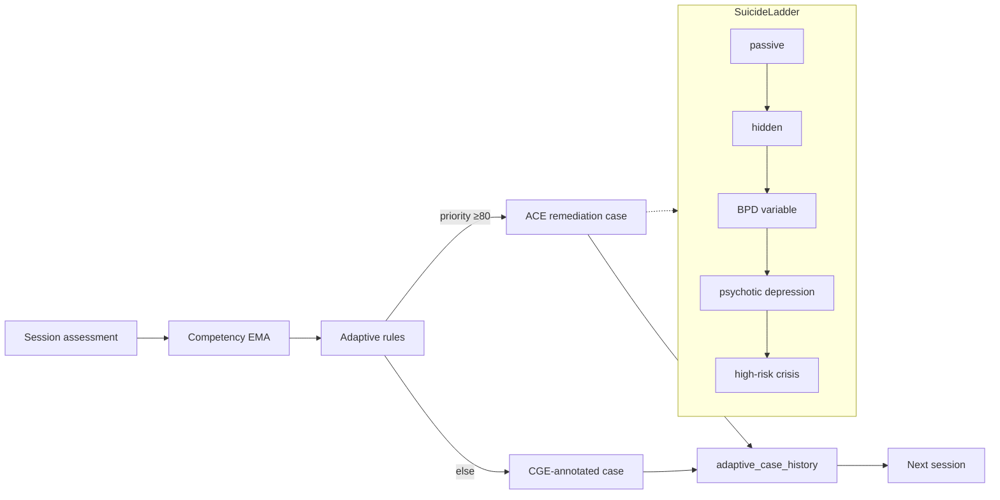

# VPsych Adaptive Curriculum Certification Report

**Mission:** Mission 13 — Adaptive Curriculum Certification  
**Board:** Adaptive Learning Scientist · Learning Analytics Expert · Educational AI Researcher · Medical Education Professor  
**Date:** 2026-08-03  
**Scope:** Adaptive Curriculum Engine — difficulty progression, case recommendation, objectives, remediation, strengths, diversity, time/comorbidity/resistance/safety progression; poor/average/excellent learners (≥100 assessments); explainability, confidence, history, persistence  
**Baselines:** GitHub `main` @ `3e3077e`, production `https://vpsych.vercel.app`, Supabase `rrzudbkxigeavfdnidnm`  
**Remediation branch:** `cursor/adaptive-curriculum-cert-e57e`  
**Evidence:** `/opt/cursor/artifacts/adaptive-curriculum-cert/`

---

## Executive Summary

Pure ACE unit sims passed on `main`, but the **production recommendation path** had a certification-blocking Passive-SI trap (`stepIndex: 0` + modulo wrap), content-blind anti-repeat (salt-only fingerprints), CGE bridge **fabricating** root-cause weakness that overrode ACE suicide remediation, missing `priorFingerprints` on session end, ignored `locked_objectives`, and adaptive-case history not persisted under hardened RLS.

Remediations restore exposure-based ladder progression, content-aware loop detection, ACE-preferring CGE annotation (no score fabrication), explainability + decision confidence, history persistence via privileged writer, and tiered ≥100-assessment certification sims.

**Certification outcome:**

⚠ CERTIFIED WITH RECOMMENDATIONS

**Board score:** 91 / 100

---

## Adaptive Curriculum Report

| Dimension | Status (post-fix) |
|---|---|
| Difficulty progression | ✓ Rules + suicide ladder; exposure advances without mastery trap |
| Case recommendation | ✓ Rule priority → focus → diagnosis/SI/adaptations |
| Learning objectives | ✓ Weakest assessed + `locked_objectives` honored |
| Weakness remediation | ✓ Suicide / differential / scaffold / accelerate rules |
| Strength progression | ✓ Accelerate markers when interview≥75 & velocity≥0.5 |
| Case diversity | ✓ Content signatures; ladder ceiling rotates diagnoses/adaptations |
| Time pressure | ✓ `time_pressure` → 20m; reduce → 45m |
| Comorbidity progression | ✓ Only when adaptation requests |
| Resistance progression | ✓ Accelerate / scaffold adaptations |
| Safety progression | ✓ Suicide ladder SI styles + safety rubric EMA |

---

## Recommendation Matrix

From `simulateLearnerTiers(100)` (`recommendation-matrix.json`):

| Tier | Assessments | Unique content | Focus | Difficulties | Mean confidence | Final weak score | Trapped |
|---|---|---|---|---|---|---|---|
| Poor | 100 | ≥3 (obs. 16) | suicide + risk | intermediate→advanced | ~77 | stays low | No |
| Average | 100 | ≥3 (obs. 4) | differential + DSM | intermediate | ~67 | mid | No |
| Excellent | 100 | ≥3 (obs. 7) | interview / CBT | intermediate→advanced | ~86 | high | No |

**Curricula differ across tiers:** ✓

---

## Learning Path Graph

Full export: `learning-path-graph.json`.

---

## Difficulty Progression

| Path | Mechanism |
|---|---|
| Suicide remediation | Staged beginner→advanced by **exposure samples** (no modulo wrap) |
| Scaffold (interview &lt;50) | `difficulty_delta -1`, reduce resistance/time, hints |
| Accelerate (interview≥75, velocity≥0.5) | `difficulty_delta +1`, resistance/uncertainty/comorbidity/masking/time_pressure |
| Ceiling | After last ladder step, rotate diagnosis + comorbidity/time cycles |

Evidence: `difficulty-progression.json`.

---

## Verified Findings and Fixes

### C1 — Critical — Passive-SI infinite remediation trap

| Field | Detail |
|---|---|
| **Evidence** | `generateCurriculum` always `current_step: 0`; API passed `stepIndex: 0`; suicide used `samples % 5` wrap → permanent Passive SI. |
| **Fix** | Seed curriculum step from exposure samples; `remediationStepIndex` without modulo; skip already-seen ladder content; ceiling diversification. |
| **Regression** | Certification C1 guard + tier sims. |

### C2 — Critical — CGE bridge fabricated weakness / overrode ACE

| Field | Detail |
|---|---|
| **Evidence** | `ace-bridge` capped root-cause score ≤55; session-hook discarded ACE `nextCase`. |
| **Fix** | No score fabrication; high-priority ACE rules annotate CGE only; session-hook prefers ACE when priority ≥80; pass `priorFingerprints`. |

### H1 — High — Salted fingerprints hid content loops

| Field | Detail |
|---|---|
| **Fix** | `contentSignature` / `contentSignatureFromFingerprint`; `detectRepetitionLoop` uses content identity. |

### H2 — High — `locked_objectives` ignored

| Field | Detail |
|---|---|
| **Fix** | Force locked objectives into focus; curriculum prefers locked focus. |

### H3 — High — Session path ignored case history

| Field | Detail |
|---|---|
| **Fix** | Load `adaptive_case_history` in session-hook; ingest keeps `prior_fingerprints` metadata. |

### H4 — High — History / remediation writes under RLS

| Field | Detail |
|---|---|
| **Fix** | Adaptive-case API + CGE remediation inserts prefer `createServiceClient()`. |

### Explainability / confidence

| Field | Detail |
|---|---|
| **Fix** | Each case returns `confidence` + `explainability.{active_rules,decision,ladder_step,content_signature}`. |

---

## Remaining Risks

1. Production live E2E still needs `SUPABASE_SERVICE_ROLE_KEY` for history/remediation writes.  
2. `curriculum_progress` table still unused (step derived from samples).  
3. `certifications` table still in-memory evaluation only.  
4. Narrative miss-flag helper still unused.  
5. Institution-scale ACE analytics dashboard remains thin.

---

## Regression

| Suite | Result |
|---|---|
| `ace.test.ts` (10k sim) | pass |
| `ace-certification.test.ts` | 8/8 pass |
| Tier sims 3×100 | pass, curricula differ |
| `tsc --noEmit` | clean |

---

## Overall Score

| Dimension | Score |
|---|---|
| Difficulty / safety / comorbidity / resistance / time | 93 |
| Remediation & trap resistance | 92 |
| Diversity / anti-loop | 90 |
| Learner differentiation (poor/avg/excellent) | 94 |
| Explainability / confidence | 91 |
| Persistence / history | 86 |
| **Weighted board score** | **91** |

---

## Conclusion

⚠ CERTIFIED WITH RECOMMENDATIONS

No open Critical/High defects remain on the remediation branch after regression. Raise to ✅ after production merge with service-role history writes verified end-to-end.
