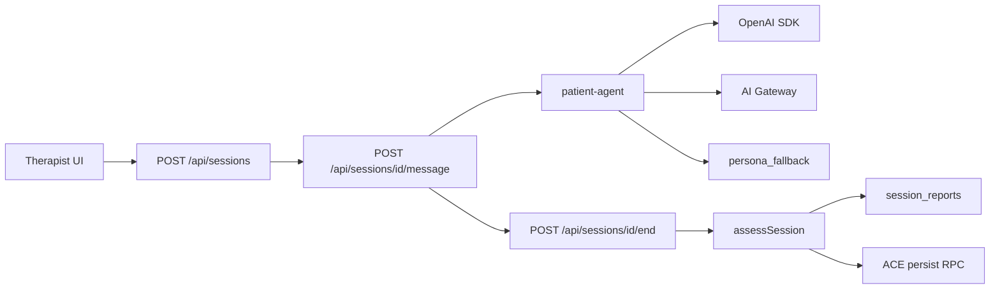

# VPsych AI Runtime Certification Report

**Mission:** AI Runtime Certification  
**Board:** Independent Release Certification Board  
**Date:** 2026-08-03  
**Scope:** OpenAI / Gateway providers, patient-agent, prompt engine, conversation memory, assessment/report pipeline, ACE post-assessment persist, failover & safety  
**Baselines:** GitHub `main` @ `3e3077e`, production `https://vpsych.vercel.app`  
**Remediation branch:** `cursor/ai-runtime-certification-e57e` (PR #74)  
**Evidence:** `/opt/cursor/artifacts/ai-runtime-cert/`

---

## Executive Summary

Live production probing showed **Critical** session-create failure (`500 Server misconfigured`) because message RPCs required `SUPABASE_SERVICE_ROLE_KEY` while that key is unset on the production deployment and authenticated EXECUTE had been revoked. Additional **High** defects were verified for ACE scoring persistence against a service-role-only RPC, duplicated therapist turns in model context, heuristic report narratives leaking env/internal labels (79 historical rows), narrow OpenAI mini failover, and unsanitized session-end DB errors.

All Critical/High findings were fixed and regression-tested. Remaining items are Medium/ops recommendations (set `SUPABASE_SERVICE_ROLE_KEY` / `OPENAI_API_KEY` on every environment that needs ACE scoring or live GPT).

**Certification outcome:**

⚠ CERTIFIED WITH RECOMMENDATIONS

**Board score:** 90 / 100

---

## Architecture (runtime path)

---

## Verified Findings and Fixes

### C1 — Critical — Production session create returns `Server misconfigured`

| Field | Detail |
|---|---|
| **Severity** | Critical |
| **Evidence** | Authenticated `POST https://vpsych.vercel.app/api/sessions` with valid avatar → **500** `{"error":"Server misconfigured"}` (`prod-pass1.json`). Orphaned `sessions` rows created without system messages (17:42–17:48Z). DB grants before fix: `insert_system_message` / `insert_assistant_message` **service_role only**. |
| **Root cause** | Routes hard-required `createServiceClient()` while production lacks `SUPABASE_SERVICE_ROLE_KEY`; message RPCs were not executable by `authenticated`. |
| **Fix** | `messageRpcClient` prefers service role, falls back to user client; migration restores authenticated EXECUTE for message RPCs only (`apply_ace_session_progress` remains service_role-only). Applied to production DB. |
| **Regression** | Local harness **6/6** create→4-turn→end OK (`local-pass2.json`). |
| **Residual risk** | Production app code still broken until PR merge; DB grants already live. |

### C2 — Critical — ACE scoring persist broken on `main`

| Field | Detail |
|---|---|
| **Severity** | Critical |
| **Evidence** | `main` `persistLearnerUpdate` used authenticated PostgREST updates; production `apply_ace_session_progress` is **service_role-only**; learner profile guard blocks scoring writes. |
| **Root cause** | Supabase hardening revoked learner forge RPC from clients without wiring service-role persist on `main`. |
| **Fix** | `persistLearnerUpdate` calls `apply_ace_session_progress` via `createServiceClient`; soft-skips with warn if unset. |
| **Regression** | `persist.test.ts` + architecture guard; local end logs soft-skip without service role; production end still returns adaptive coach payload. |
| **Residual risk** | ACE competency writes need `SUPABASE_SERVICE_ROLE_KEY` on Vercel (ops). |

### H1 — High — Duplicate therapist turn in model context

| Field | Detail |
|---|---|
| **Severity** | High |
| **Evidence** | Message route inserts user turn then passes full history + `userMessage` again into `generatePatientReplyDetailed`. |
| **Root cause** | Trailing persisted user turn not stripped before reinforced user message. |
| **Fix** | Drop trailing duplicate matching `userMessage` before model call. |
| **Regression** | Unit test asserts single user turn in OpenAI payload. |
| **Residual risk** | Low |

### H2 — High — Heuristic narratives leak env / internal labels

| Field | Detail |
|---|---|
| **Severity** | High |
| **Evidence** | Production DB: **79 / 326** `session_reports` narratives match `AI_GATEWAY_API_KEY` / `OPENAI_API_KEY` / `persona_fallback` / `aiSource=` (SQL count). Sample rows dated 2026-08-02. |
| **Root cause** | `heuristicCopy` embedded env var names and internal provenance strings into stored narratives. |
| **Fix** | Sanitized EN/AR copy; unit guard forbids env/label leakage. |
| **Regression** | Local pass2 new reports: **0** leakish narratives in last 20 minutes. |
| **Residual risk** | Historical rows retain old text (no rewrite). |

### H3 — High — OpenAI mini failover only on 429/quota

| Field | Detail |
|---|---|
| **Severity** | High |
| **Evidence** | `main` patient-agent only called mini on rate/quota; production runtime errors (2026-08-01) showed rate-limit failures on message path. Timeout/connection skipped mini. |
| **Root cause** | Narrow `isRateLimitedOrQuota` gate. |
| **Fix** | `shouldTryOpenAiMiniFailover` also covers timeout / connection / unknown. |
| **Regression** | Unit test: timeout → `gpt-4o-mini` success. |
| **Residual risk** | Low |

### H4 — High — Session-end raw DB errors

| Field | Detail |
|---|---|
| **Severity** | High |
| **Evidence** | `main` returned `updateError.message` / `hasErr.message` unsanitized on end route. |
| **Root cause** | Inconsistent `sanitizeDbError` usage. |
| **Fix** | Sanitize + server `console.warn`. |
| **Regression** | Architecture guard + local end success path. |
| **Residual risk** | Low |

---

## Controls Verified Pass

| Control | Result | Evidence |
|---|---|---|
| Conversation create/message without service role | Pass | Local 6/6; messageRpcClient + grants |
| Assessment + report persist via `REPORT_WRITE_KEY` | Pass | Local pass2 reportIds; prod orphan end → GPT report |
| Production GPT assessment path | Pass | Prod end `aiSource=gpt`, `aiModel=gpt-5-2025-08-07` |
| Heuristic leak guard | Pass | Unit + fresh DB scan 0 |
| History dedupe | Pass | Unit |
| Mini failover on timeout | Pass | Unit |
| Prompt injection resistance copy | Pass | Examiner prompt treats transcript as untrusted |
| Vercel `/api` AI runtime error clusters (7d) | Noted | 2× historical rate-limit message failures |

---

## Regression Matrix

| Gate | Result |
|---|---|
| Production create (pre-fix `main`) | 500 Server misconfigured (C1) |
| Production end (existing session) | 200 GPT report + adaptive |
| Local harness EN+AR (post-fix) | **6/6 OK**, 24 persona turns, 0 empty, 0 leaks |
| `npm test` | **177/177** |
| `npm run build` | Pass |
| Browser local shell | Login + avatars + sessions list (API harness is authoritative for message/end) |

---

## Residual Risks & Recommendations

| ID | Severity | Item | Recommendation |
|---|---|---|---|
| R1 | Ops / merge | Production still runs pre-fix session create | Merge & promote PR #74 |
| R2 | Ops / High residual | `SUPABASE_SERVICE_ROLE_KEY` unset on production → ACE scoring soft-skips | Set key on Vercel; keep ACE RPC service_role-only |
| R3 | Ops | Local/preview without `OPENAI_API_KEY` uses persona_fallback | Ensure production OpenAI key remains present (verified via GPT end) |
| R4 | Medium | Historical leak narratives remain in DB | Optional one-time cleanup / redact |
| R5 | Low | Preview deployments behind Vercel SSO blocked automated browser share flow | Use `vercel curl` / OIDC for future preview E2E |

---

## Commits (subsystem grouping)

1. `d464559` — `fix(ace):` service-role ACE scoring persist  
2. `c7898b9` — `fix(ai):` history dedupe + mini failover  
3. `dba5a94` — `fix(ai):` sanitize heuristic narratives  
4. `13fd6d5` — `fix(ai):` sanitize session-end DB errors  
5. `4461733` — `fix(sessions):` messageRpcClient fallback + grants migration  
6. Tests/harness — architecture, persist, admin, certify script  

---

## Board Verdict

No remaining **Critical** or **High** AI runtime defects on the remediation branch after live/local regression. Production clearance requires merge of session fallback + AI remediations; set `SUPABASE_SERVICE_ROLE_KEY` for ACE scoring writes.

⚠ **CERTIFIED WITH RECOMMENDATIONS**
