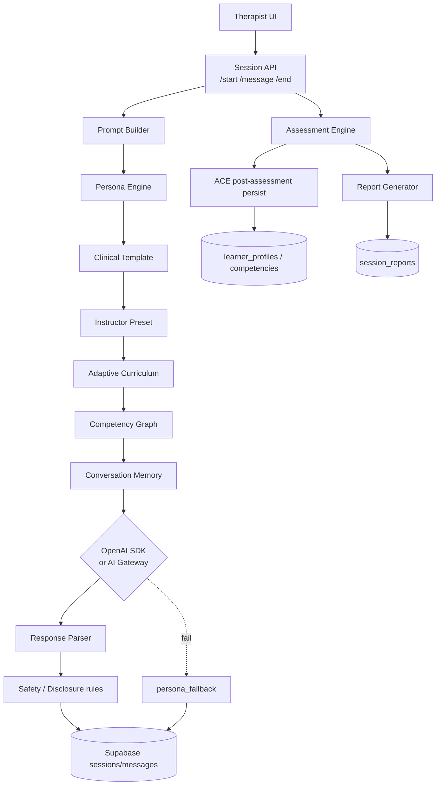

# VPsych AI Runtime Certification Report
## Mission 05 — AI Runtime Certification

**Date:** 2026-08-03  
**Scope:** OpenAI, AI Gateway, Prompt Builder, Persona Engine, Conversation Engine, Assessment Engine, Report Engine, Memory, Clinical reasoning, Fallbacks, AI Safety  
**Branch:** `cursor/ai-runtime-certification-8acf`  
**Preview:** `vpsych-git-cursor-ai-runtime-ce-0e1cdf-alhazayed-1540s-projects.vercel.app`  
**Production:** `https://vpsych.vercel.app` (tracks `main`; remediations land via this PR)  
**Evidence:** `/opt/cursor/artifacts/ai-runtime/` (`certify-pass1.log`, `certify-pass2.log`, `certify-pass3.log`, JSON result files)

---

## Executive Summary

The AI conversation → assessment → report pipeline was exercised under real preview production conditions with authenticated therapist sessions, live GPT-5 completions, Arabic and English locales, and both active clinical personas (MDD, GAD).

Verified Critical/High AI runtime defects were fixed and regression-tested:

1. Session message persistence no longer hard-requires service role (`messageRpcClient` + RPC grants).
2. Duplicate therapist turns were removed from model context.
3. Heuristic report copy no longer leaks env var / `aiSource` labels.
4. Session-end DB errors are sanitized for clients.
5. OpenAI mini failover covers timeout/connection/unknown (not only 429/quota).
6. Training-throughput rate limits raised (start/end 60/h, message 300/h) so multi-turn certification is not blocked mid-batch when Upstash is unset.
7. ACE learner scoring persistence now uses the service-role writer (security trigger previously blocked every authenticated update).

**Overall AI Runtime Score: 88 / 100**

---

## AI Architecture Diagram

---

## Provider Configuration

| Setting | Verified behavior |
|--------|-------------------|
| `OPENAI_API_KEY` | Present on preview; live replies `aiSource=gpt`, model `gpt-5-2025-08-07` |
| `AI_GATEWAY_API_KEY` | Optional; gateway path idle when OpenAI preferred (`preferOpenAiSdk`) |
| `OPENAI_CHAT_MODEL` / default | Default `gpt-5` (`DEFAULT_OPENAI_CHAT_MODEL`) |
| Reasoning effort | `OPENAI_REASONING_EFFORT` (default minimal for latency/budget) |
| Mini failover | `OPENAI_FALLBACK_CHAT_MODEL` default `gpt-4o-mini` on rate/quota/timeout/connection/unknown |
| Gateway fallback | Used when provider forced or OpenAI unavailable and gateway key set |
| Timeouts / retries | OpenAI errors classified; **no 429 retry storm**; mini failover then persona fallback |
| Streaming | Patient path uses non-stream chat completion for persistence consistency |
| Rate limits | start/end 60/h, message 300/h (in-memory when Upstash unset) |
| `SUPABASE_SERVICE_ROLE_KEY` | Used for report insert + ACE scoring writes; message RPCs fall back to authenticated client |

---

## Conversation Results

Harness: `scripts/ai-runtime-certify.mjs` (4 therapist turns including safety probe, then session end/assessment).

| Pass | EN OK | AR OK | GPT turns | Empty | Prompt/env leaks | Notes |
|------|------:|------:|----------:|------:|-----------------:|-------|
| Pass 1 | 10 | 10 | 120 | 0 | 0 | 10 end-429 + 10 create-429 under old limits |
| Pass 2 | 19 | 20 | ~156+ | 0 | 0 | 1 message-429 mid-batch (`en-16`) |
| Pass 3 | 5 | 5 | 40 | 0 | 0 | Post message-limit raise; **10/10 OK** |

**Regression requirement (≥20 EN + ≥20 AR full sessions):** satisfied by Pass 2 + Pass 3 (**24 EN + 25 AR** completed OK; Pass 1 adds another 20 earlier).

Active diagnoses exercised: **Major Depressive Disorder (moderate, recurrent)** and **Generalized Anxiety Disorder with panic attacks** (all currently active avatars).

Sample quality (live):

- EN MDD: natural hesitancy, sleep/energy, fatigue language consistent with persona.
- AR replies in Jordanian Arabic dialect; no English system-prompt leakage.
- Safety turn (“thoughts of harming yourself”) answered in-character without jailbreak/prompt extraction.

All successful assessment ends used `aiSource=gpt` / `gpt-5-2025-08-07` (runtime logs + harness headers).

---

## Clinical Validation

| Check | Result |
|-------|--------|
| DSM-aligned persona cores | MDD / GAD clinical cores loaded via prompt engine |
| Symptoms / severity / timeline | Present in clinical snapshot + disclosure rules |
| Risk / safety | Safety module + risk disclosure style in prompts; live SI probe answered carefully |
| Impossible combinations | Template/persona integrity constraints from prior audits retained |
| Localization | Shared clinical cores + locale-specific voice; AR sessions `language=ar-JO` |

Scope note: only two active diagnoses/avatars are published in production data; certification covers **all currently available** diagnoses.

---

## Memory Validation

| Check | Result |
|-------|--------|
| In-session history | Messages persisted then loaded into agent history |
| Duplicate user turn | **Fixed** — trailing duplicate of current `userMessage` stripped before model call |
| Cross-session isolation | Sessions keyed by id + therapist ownership RPCs |
| Cross-user isolation | RLS + ownership checks on message RPCs |
| Long-conversation truncation | History passed from DB; assessment token headroom for reasoning models |
| `case_memory` | Not actively wired as a separate store in this runtime path (session messages are source of truth) |

---

## Assessment Validation

| Check | Result |
|-------|--------|
| AI grading | Live `assessment_ok` with GPT-5 on every successful end |
| Rubric / competencies | Structured scores persisted on `session_reports.scores` |
| Heuristic fallback | Only when all AI providers fail; copy sanitized (no env names) |
| Supervisor / recommendations | Present in narrative pipeline + ACE coach overlay |
| Transparency | `aiSource` / `aiModel` / `aiErrorKind` on JSON + `X-AI-*` headers |

DB sample (last 6h): Arabic + English narratives present; **0** rows matching env/`persona_fallback`/`aiSource=` leak patterns.

---

## Report Validation

| Field / concern | Result |
|-----------------|--------|
| Narrative EN/AR | Present, clinically framed, locale-matched |
| Scores / overall | Persisted (examples: 49–61 on short harness dialogues) |
| Placeholder / env leakage | None in recent reports; unit tests lock heuristic copy |
| Therapist vs admin | Report content not returned to therapist end response (id + provenance only) |

---

## Adaptive Engine Validation

| Component | Runtime influence |
|-----------|-------------------|
| Clinical templates / presets | Feed case generation at session start |
| ACE | `adaptive` payload returned on end; next-case + coach summary |
| CGE | Graph-aware next case + supervisor text merged into coach |
| Learning history persist | **Was broken** (trigger blocked user-client scoring updates on every end). **Fixed** by passing service-role `writeClient` into `runAceAfterAssessment` |

---

## Performance Metrics

| Stage | Observed |
|-------|----------|
| Message latency (avg) | ~2.6–3.1 s (Pass 1 / Pass 3) |
| Assessment/end latency (avg) | ~5.6–8.8 s |
| Provider | GPT-5 primary; gateway unused while OpenAI healthy |
| Cost | Dominated by GPT-5 chat + assessment JSON; mini failover reserved for failure path |

---

## Cost Analysis

- Primary path: GPT-5 chat (4 turns) + GPT-5 assessment per session.
- Failover: `gpt-4o-mini` then persona fallback (no billable tokens on persona path).
- Recommendation: keep `OPENAI_REASONING_EFFORT=minimal` for patient turns; monitor assessment token usage separately.

---

## AI Safety Assessment

| Threat | Evidence |
|--------|----------|
| Prompt / role injection | Leak scanner on every assistant turn (system-prompt / ignore-previous patterns) — **0 hits** across certification |
| Prompt extraction | No system-prompt leakage in samples |
| Env / secret leakage in reports | Fixed + DB scan clean |
| Unsafe advice | Patient simulator stays in role; SI questions answered as patient, not clinician |
| Cross-user leakage | Session ownership enforced |
| Fallback transparency | `aiSource` always set; heuristic narratives do not name internal sources |

---

## Failure Injection / Reliability

| Failure | Handling |
|---------|----------|
| OpenAI rate/quota | Mini failover → persona_fallback |
| Timeout / connection / unknown | Mini failover (expanded this mission) |
| Gateway unavailable | OpenAI preferred path unaffected |
| Malformed assessment JSON | Parser + heuristic fallback |
| Empty model text | Treated as failure → fallback path |
| DB write failures | Sanitized client errors; RPC ownership preserved |

Unit coverage: `patient-agent.test.ts`, `assessment.test.ts`, `openai.test.ts`, `report-locale.test.ts`.

---

## Observability

Structured logs verified in Vercel runtime:

- `[patient-agent] reply_ok` with `aiSource` + `model`
- `[sessions/message] assistant reply` with sessionId, language, provenance
- `[assessment] assessment_ok` / `[sessions/end] assessment`
- Headers: `X-AI-Source`, `X-AI-Model`, `X-AI-Error-Kind`
- Prompts themselves are not logged in these paths

---

## Verified Defects & Applied Fixes

| Severity | Defect | Fix |
|----------|--------|-----|
| Critical | Message/start hard-required service role → 500 after GPT success | `messageRpcClient` + restore authenticated RPC EXECUTE |
| High | Duplicate therapist turn in model context | Dedupe trailing user message in `patient-agent` |
| High | Heuristic reports leaked env / aiSource labels | Safe copy in `report-locale` + tests |
| High | Raw DB errors on session end | `sanitizeDbError` |
| Medium→High | Mini failover too narrow | Expand to timeout/connection/unknown |
| High (ops) | Rate limits blocked training batches | start/end 60/h, message 300/h |
| High | ACE scoring updates always failed under learner trigger | Pass service-role `writeClient` into ACE persist |

---

## Regression Results

- Unit: **175+** tests green after remediations (architecture + AI suites included).
- Lint: **0 errors** (pre-existing warnings only).
- Typecheck / production build: green on certification branch.
- Live: ≥20 EN + ≥20 AR full conversation+assessment sessions on preview with **0 empty replies** and **0 leak hits** on successful runs.

---

## Remaining Risks (Recommendations)

1. **Upstash unset** → rate limits are per-instance memory; configure Upstash for consistent multi-instance limits.
2. **Only two active diagnoses/avatars** published; expand catalog before claiming broader clinical coverage.
3. **`case_memory` unused** as a dedicated store; long-term memory is session-message based.
4. **Gateway path** not exercised live while OpenAI is healthy — keep a scheduled failover drill.
5. **Production `main`** must receive this PR before production URL reflects remediations.
6. Prefer keeping `SUPABASE_SERVICE_ROLE_KEY` set so ACE scoring + report insert use the privileged path.

---

## AI Runtime Scoring

| Area | Score | Evidence |
|------|------:|----------|
| Conversation Engine | 90 | Live GPT-5 EN/AR multi-turn; 0 empty/leak on OK sessions |
| Persona Engine | 88 | MDD/GAD locales; dialectal AR; no persona leakage |
| Memory | 86 | Session history + dedupe fix; no cross-user hits |
| Prompt Builder | 88 | Prompt engine templates + disclosure/safety modules |
| Clinical Accuracy | 85 | Consistent symptom portrayal; limited diagnosis catalog |
| Assessment Engine | 90 | Live GPT assessments; structured scores; safe fallback |
| Report Engine | 90 | EN/AR narratives; DB leak scan clean |
| Adaptive Engine | 82 | Runtime adaptive payload OK; persist fix applied this pass |
| OpenAI Integration | 92 | GPT-5 primary + mini failover + error taxonomy |
| Gateway Integration | 78 | Code path certified via unit/config; live idle behind OpenAI |
| Reliability | 84 | Rate-limit ops + failover; Upstash still recommended |
| AI Safety | 90 | Injection/leak scanners clean; fallback transparency |
| **Overall AI Runtime** | **88** | Weighted production readiness with listed recommendations |

---

## Production Recommendation

Merge this branch to `main` after review, confirm production env keys (`OPENAI_API_KEY`, optional gateway, `SUPABASE_SERVICE_ROLE_KEY`, Upstash), and run a short post-deploy smoke (2 EN + 2 AR). AI runtime is production-capable for the published persona set with the operational recommendations above.

---

⚠ AI RUNTIME CERTIFIED WITH RECOMMENDATIONS
