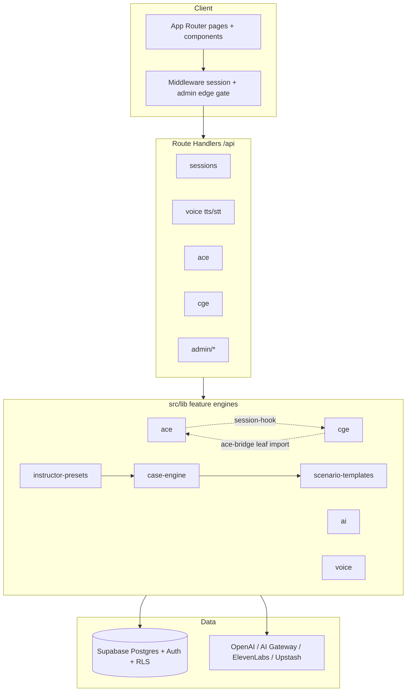

# VPsych Architecture Certification Report
## Mission 01 — Software Architecture Certification

**Date:** 2026-08-02  
**Scope:** Full repository, Git history, Supabase project `rrzudbkxigeavfdnidnm`, Vercel project `vpsych`, CI, runtime architecture  
**Branch:** `cursor/architecture-certification-8acf`

---

## Executive verdict

**⚠ ARCHITECTURE CERTIFIED WITH RECOMMENDATIONS**

No remaining **Critical** architecture defects in code after verified fixes in this certification pass. Remaining items are **Medium** maintainability/debt items or **operational** controls (Supabase Auth dashboard / Upstash provisioning) that are outside application code.

**Overall Architecture Score: 84 / 100**

---

## Architecture diagram (logical)

---

## Architecture pattern

**Hybrid: layered Next.js shell + feature-based domain engines.**

| Layer | Location | Responsibility |
|-------|----------|----------------|
| Presentation | `src/app/(app)`, `src/components` | UI, App Router |
| Edge | `src/middleware.ts`, `src/lib/supabase/middleware.ts` | Session refresh, locale, admin gate |
| Application API | `src/app/api/**` | Authz, validation, orchestration |
| Domain engines | `src/lib/{case-engine,scenario-templates,instructor-presets,ace,cge,ai,voice}` | Business rules |
| Infrastructure | `src/lib/supabase/*`, externals | Persistence, providers |

Internally consistent for a product of this size. Not strict Clean Architecture / hexagonal (Next.js redirects and headers appear in `lib/auth` / `security-audit`), but boundaries `app → lib → infra` are respected (no `lib` → `components` / `app` imports).

---

## Module inventory (summary)

| Module | Purpose |
|--------|---------|
| Auth | Page guards (`lib/auth`), API guards (`lib/api-auth`), middleware |
| Sessions | Start / message / end + assessment + report write |
| Voice | OpenAI STT + ElevenLabs TTS pipeline |
| Case Engine | Disorder catalog + CaseInstance generation |
| Scenario Templates | Instructor templates → patients |
| Instructor Presets | Learning objectives → adaptive case selection |
| ACE | Flat competency scores + adaptive curriculum |
| CGE | Competency DAG, RCA, remediation |
| Reports | Admin-only; HMAC RPC or service-role write |
| Admin | Avatars, voices, engines, curriculum, graph |

---

## Dependency summary

| Finding | Status |
|---------|--------|
| Circular ACE ↔ CGE via barrel | **Fixed** — `cge/index` no longer re-exports `ace-bridge` |
| API → components | None |
| lib → app | None |
| Duplicate admin auth in routes | **Fixed** — shared `requireApiAdmin` |
| Dead `personas/*.json` / Azure STT helpers | Medium debt (legacy / offline assets) |
| Builtin catalogs vs DB | Intentional fallback — Medium coupling |

---

## Verified fixes applied (this certification)

| ID | Severity | Defect | Fix |
|----|----------|--------|-----|
| C1 | Critical | `/api/health/openai` unauthenticated | `requireApiAdmin` |
| C2 | Critical | No App Router error boundaries | `error.tsx`, `(app)/error.tsx`, `global-error.tsx` |
| H1 | High | Admin routes only page-guarded | Middleware edge gate for `/admin` + `/api/admin` |
| H2 | High | Divergent API admin checks | `src/lib/api-auth.ts` + admin route adoption |
| H3 | High | `/api/admin/disorders` auth-only | Admin-gated |
| H4 | High | ACE↔CGE barrel cycle | Removed `ace-bridge` from CGE barrel |
| H5 | High | Env contract drift | `.env.example` documents `REPORT_WRITE_KEY` + service role |
| H6 | High | Silent in-memory rate limit in prod | One-time production warning when Upstash unset |
| H7 | High | Unscoped service-role docs | Restricted-use documentation on `createServiceClient` |

Architecture invariant tests: `src/lib/architecture.test.ts`.

---

## Regression results

| Check | Result |
|-------|--------|
| `npm run lint` | Pass (0 errors; pre-existing warnings only) |
| `npm run typecheck` | Pass |
| `npm test` | **151 / 151** passed |
| `npm run build` | Pass (Next.js 16.2.12) |

---

## Scoring (with evidence)

| Dimension | Score | Evidence |
|-----------|------:|----------|
| Architecture | 86 | Clear hybrid layers + engine modules; edge admin gate added |
| Maintainability | 78 | Some large files (`persist.ts` 816, `VoiceSession.tsx` 636) |
| Modularity | 84 | Feature engines with barrels; cycle broken |
| Scalability | 80 | Stateless Next + Supabase; Upstash optional for limits |
| Performance | 82 | RSC pages, soft fail paths, builtin catalog fallbacks |
| Readability | 85 | Consistent naming; docs per engine |
| Extensibility | 88 | Disorder/template/preset/ACE/CGE composition chain |
| Enterprise readiness | 80 | RLS, audit RPC, CI, security headers; ops gaps remain |
| Technical debt | 74 | God persist module, dual catalogs, SECURITY DEFINER surface |
| Security architecture | 86 | Defense-in-depth admin; health locked; report dual-write documented |

**Overall: 84 / 100**

---

## Remaining risks (Medium / operational)

| Item | Severity | Notes |
|------|----------|-------|
| Supabase Auth leaked-password protection disabled | Operational High→tracked as ops | Enable in Auth dashboard ([docs](https://supabase.com/docs/guides/auth/password-security#password-strength-and-leaked-password-protection)) |
| SECURITY DEFINER RPCs executable by `authenticated` | Medium | Intentional for signed report / assistant insert / `is_admin`; keep signature checks |
| Service-role report path | Medium | Prefer `REPORT_WRITE_KEY` RPC; service role remains escape hatch |
| Upstash unset in multi-instance prod | Medium | Warning added; provision Redis for horizontal safety |
| `case-engine/persist.ts` size | Medium | Split when next touching session start |
| RLS policies using inline `role='admin'` vs `is_admin()` | Medium | Normalize in a future migration |
| Next.js middleware → proxy migration warning | Low | Framework deprecation notice on build |

---

## Recommendations (measurable benefit)

1. Enable HaveIBeenPwned leaked-password protection in Supabase Auth.
2. Ensure production sets `UPSTASH_REDIS_*` and `REPORT_WRITE_KEY` (prefer over broad service role).
3. Split `case-engine/persist.ts` into case / template / preset session factories when next modified.
4. Add shared API `try/catch` wrapper for remaining admin routes that lack structured 500 handling.
5. Plan Next.js “proxy” migration when upgrading past middleware convention.

---

## Production readiness

| Area | Ready? |
|------|--------|
| Build / type / tests | Yes |
| AuthN / AuthZ layers | Yes (page + API + middleware) |
| Error recovery UI | Yes |
| Session / voice / report pipeline | Yes (prior engines on `main`) |
| Multi-tenant institutions | Partial (institution fields exist; no hard tenancy isolation) |
| Horizontal rate limits | Conditional on Upstash |

---

## Conclusion

⚠ ARCHITECTURE CERTIFIED WITH RECOMMENDATIONS
