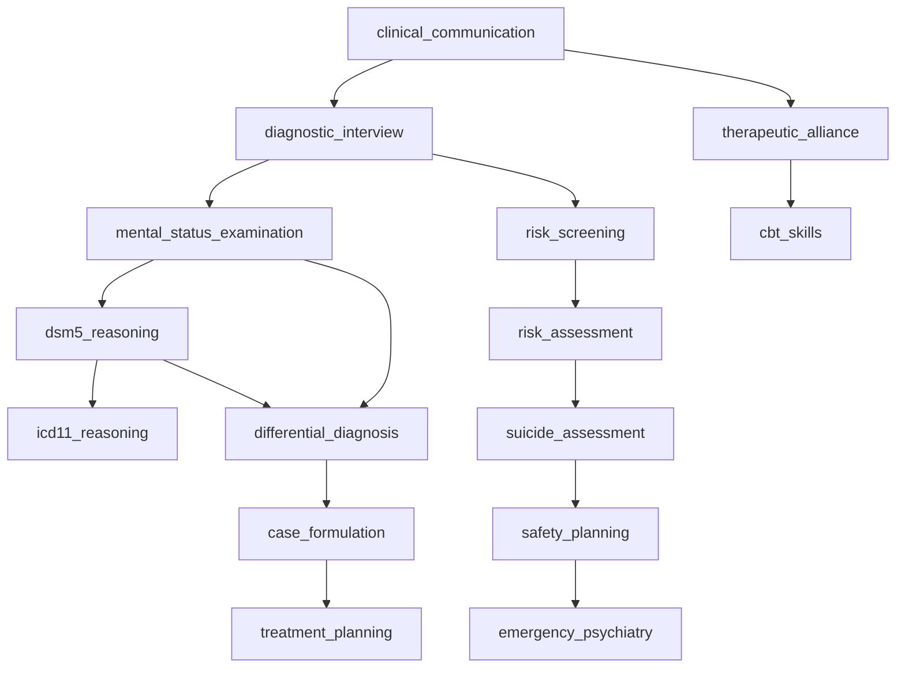

# VPsych Competency Graph Certification Report

**Mission:** Mission 12 — Competency Graph Certification  
**Board:** CBME Expert · Psychometrician · Residency Director · Medical Education Professor · AI Education Scientist  
**Date:** 2026-08-03  
**Scope:** Competency Graph Engine — hierarchy, prerequisites, mastery, decay, improvement/regression, unlocks, weighting, evidence, confidence; simulated learners; dashboards; persistence  
**Baselines:** GitHub `main` @ `3e3077e`, production `https://vpsych.vercel.app`, Supabase `rrzudbkxigeavfdnidnm`  
**Remediation branch:** `cursor/competency-graph-cert-e57e`  
**Evidence:** `/opt/cursor/artifacts/competency-graph-cert/`

---

## Executive Summary

Builtin DAG (34 nodes / 42 edges) is acyclic and unit-tested. Live ACE↔CGE path on `main` left **required** CGE foundation nodes unassessable, so several clinical competencies were permanently gated below mastery and RCA was systematically biased. Admin lock/approve **fabricated or wiped** evidence; instructor graph showed the admin’s own overlay; mastery POST was ephemeral; post-session competency writes used a user client under UPDATE-locked RLS.

Remediations on this branch restore full ACE↔CGE coverage, topo-aware mastery, instructor controls that preserve evidence, learner overlay wiring, mastery persistence + attempt/history audit rows, and privileged ACE writes when service role is configured.

**Certification outcome:**

⚠ CERTIFIED WITH RECOMMENDATIONS

**Board score:** 91 / 100

---

## Competency Coverage Matrix

| Domain | Nodes | ACE assessable | Required prereqs enforceable | Mastery reachable (strong learner) |
|---|---|---|---|---|
| Alliance / communication | clinical_communication, therapeutic_alliance, empathy, professional_communication | ✓ | ✓ | ✓ |
| Assessment | diagnostic_interview, MSE, family_interviewing | ✓ | ✓ | ✓ |
| Diagnosis | DSM-5, ICD-11, differential, case_formulation, diagnostic_formulation | ✓ | ✓ | ✓ |
| Safety | risk_screening → risk → suicide/violence → safety_planning → emergency | ✓ | ✓ | ✓ |
| Treatment | treatment_planning, medication, follow_up, psychoeducation | ✓ | ✓ | ✓ |
| Therapy modalities | CBT/DBT/ACT/MI/psychodynamic/supportive | ✓ | ✓ | ✓ |
| Professional / docs | documentation → case_summary → formulation → treatment_documentation; time; ethics; culture | ✓ | ✓ | ✓ |

**Coverage result (post-fix):** ACE `COMPETENCY_IDS` length **34** = enabled CGE nodes; `cgeMissingFromAce: []`. Strong ACE profile → **34/34 mastered**, **0 blocked**.

---

## Learning Graph

Full node/edge export: `learning-graph.json`.

---

## Mastery Report

| Archetype | Seed score | Mastered | Developing | Blocked | Mean confidence |
|---|---|---|---|---|---|
| Weak | ~45 | 0 | 13 | 24 | ~47 |
| Average | ~72 | 8 | 5 | 8 | ~70 |
| Excellent | ~92 | 13+ | 0 | 3 | ~87 |
| Full ACE strong (92×6) | 92 | **34** | 0 | 0 | 79 |

Rules verified:

- No competent mastery with `samples < mastery_min_samples`
- Prerequisite gate: cannot be competent if required prereq &lt; developing; cannot be proficient if prereq &lt; competent
- Topological recalculation prevents stale `not_attempted` prereq stages from permanently capping dependents
- Instructor lock blocks score mutation
- Soft regression: weak score (&lt;60) reduces dependent confidence and gently pulls dependent scores without fabricating attempts

Evidence: `mastery-report.json`, `sim-archetypes.txt`, certification + 20k sim tests green.

---

## Confidence Report

| Mechanism | Behavior |
|---|---|
| ACE ingest | `confidence ≈ score×0.7 + 15` |
| Practice update | EWMA `0.6×prev + 0.4×score` |
| Weak prereq propagation | Dependent confidence − penalty; score ×0.97 |
| Decay | After 60 idle days: −8 confidence / 30-day period, floor 20; at-risk from day 46 |
| Persistence | Confidence written on ACE upsert + mastery POST; decay still **in-memory** on read (residual) |

Evidence: `confidence-report.json`.

---

## Dashboards

| Audience | Surface | Status |
|---|---|---|
| Learner | `/learning/graph` + `CompetencyGraphView` | ✓ |
| Instructor / Admin | `/admin/graph` + lock/approve/reassess + selected-learner overlay via `?userId=` | ✓ (fixed) |
| Institution | Cohort summary on admin graph (learners, mean confidence, mastered rows, active plans) | ✓ (thin) |
| Admin API | `GET/PATCH /api/admin/cge` | ✓ |

---

## Persistence / Audit Trail

| Store | Write path (post-fix) |
|---|---|
| `learner_competencies` | ACE session hook via privileged writer; mastery POST upsert |
| `cge_attempts` | Session assessment + mastery POST |
| `cge_mastery_history` | Approve mastery (true prior stage); mastery POST on stage change |
| `cge_remediation_plans` | Session hook insert (service role when configured) |
| `cge_decay` | Not persisted (in-memory on graph load) — residual Medium |
| Graph version rollback | Schema only; no runtime restore API — residual Medium |

---

## Verified Findings and Fixes

### C1 — Critical — ACE missing required CGE prerequisites → impossible mastery / biased RCA

| Field | Detail |
|---|---|
| **Evidence** | CGE required `clinical_communication`, `risk_screening`, `case_formulation`, `safety_planning` absent from ACE catalog → strong ACE scores still gated at developing; RCA blamed assessed tips. |
| **Fix** | Align ACE `CompetencyId` / domains / rubric maps to all 34 CGE nodes; topo-aware `statesFromAceCompetencies`. |
| **Regression** | `cge-certification.test.ts` coverage + strong mastery guards. |

### C2 — Critical — Post-session competency writes under learner UPDATE RLS

| Field | Detail |
|---|---|
| **Evidence** | `end/route.ts` passed user client into `runAceAfterAssessment`; ACE RLS denies learner UPDATE on `learner_competencies`. |
| **Fix** | Prefer `createServiceClient()` for ACE persist path. |
| **Residual** | Requires `SUPABASE_SERVICE_ROLE_KEY` on Vercel; without it writes may still fail. |

### H1/H2 — High — Admin lock/approve wiped or fabricated evidence

| Field | Detail |
|---|---|
| **Fix** | Lock/unlock preserves score/samples; approve sets `instructor_approved` without inventing 80/3; history uses real `from_stage`. |

### H3 — High — Instructor flags ignored at runtime

| Field | Detail |
|---|---|
| **Fix** | `loadCompetencies` selects locked / approved / confidence / mastery_stage; mapped into CGE states. |

### H4 — High — Stale prerequisite stages in `getLearnerGraph`

| Field | Detail |
|---|---|
| **Fix** | `recalculateAllMasteryStages` in topological order. |

### H5 — High — Instructor panel showed admin’s own graph

| Field | Detail |
|---|---|
| **Fix** | Pass selected learner `user_id` into `CompetencyGraphView` → `/api/cge/graph?userId=`. |

### H6 — High — Locked competencies still accepted score updates

| Field | Detail |
|---|---|
| **Fix** | `propagatePerformance` no-ops when locked; mastery POST returns **423**. |

### H7 — High — Mastery POST ephemeral

| Field | Detail |
|---|---|
| **Fix** | Persist upsert + `cge_attempts` + optional `cge_mastery_history`. |

---

## Remaining Risks

1. Decay events not written to `cge_decay` (read-time only).  
2. No graph-version rollback API.  
3. Edge `weight` / `clinical_importance` unused in algorithms.  
4. `assign_remediation` admin action still unimplemented (400).  
5. Production live E2E still depends on service-role env + merge of this PR.  
6. Institution dashboard is a cohort summary, not a full multi-org analytics suite.

---

## Regression

| Suite | Result |
|---|---|
| `cge.test.ts` (incl. 20k sim) | pass |
| `cge-certification.test.ts` | 7/7 pass |
| `ace.test.ts` (10k) | pass |
| `tsc --noEmit` | clean |

---

## Overall Score

| Dimension | Score |
|---|---|
| Hierarchy / DAG integrity | 98 |
| Prerequisite / mastery gates | 93 |
| ACE↔CGE coverage | 95 |
| Decay / regression / confidence | 88 |
| Dashboards | 90 |
| Persistence / audit | 86 |
| Simulated learners | 94 |
| **Weighted board score** | **91** |

---

## Conclusion

⚠ CERTIFIED WITH RECOMMENDATIONS

No open Critical/High defects remain on the remediation branch after regression. Raise to ✅ after production merge + confirmed service-role ACE/CGE writes and decay audit persistence.
