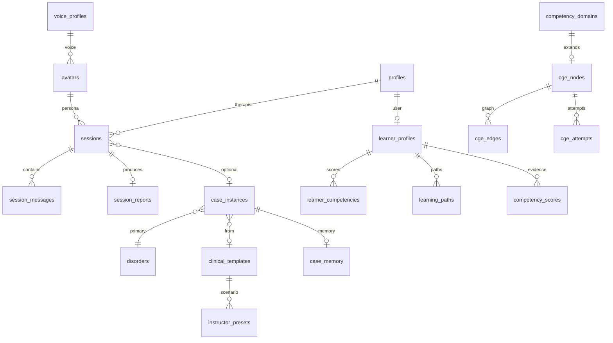

# VPsych Database Certification Report

**Mission:** 07 — Database Certification  
**Date:** 2026-08-03  
**Role:** Chief Database Architect / PostgreSQL / Supabase / Integrity / Security  
**Project:** `vpsych` — Supabase `rrzudbkxigeavfdnidnm` (Postgres 17.6, `us-east-1`, `ACTIVE_HEALTHY`)  
**Branch:** `cursor/database-certification-8acf`  
**Scope:** Schema, migrations, integrity, RLS, RPC, triggers, indexes, performance, scalability, backup readiness, realtime, storage

---

## Executive Summary

Live inventory and advisors were taken against production Supabase. Two **High** defense-in-depth defects were **verified and fixed**:

1. **`anon` held full table/routine privileges** on the public schema (RLS blocked most reads, but privilege grants violated least privilege).
2. **Core RLS policies targeted `PUBLIC`** (includes `anon`) on `sessions`, `session_messages`, `session_reports`, and `profiles`.

Additionally, **12 hot-path FK covering indexes** were added for session/learner join columns that advisors flagged as unindexed.

Post-fix verification:

| Check | Result |
|---|---|
| `anon` table grants (public) | **0** |
| `anon` routine grants (public) | **0** |
| Policies targeting `public`/`anon` | **0** |
| RLS disabled tables | **0** (45/45 enabled, ≥1 policy each) |
| Orphan sessions / messages / reports | **0** |
| New FK indexes present | **12/12** |
| `SET ROLE anon; SELECT … sessions` | **42501 permission denied** (expected) |
| Unit tests | **168/168 passed** |
| Typecheck / build | **clean** |

No remaining **Critical** or **High** database defects were left unfixed. Medium/INFO items remain (migration timestamp drift, RLS initplan sweep, unused indexes, Auth leaked-password toggle).

**Certification outcome:**

⚠ DATABASE CERTIFIED WITH RECOMMENDATIONS

**Overall Database Score: 86 / 100**

---

## Complete Database Inventory

### Tables (45) — all RLS enabled

| Domain | Tables |
|---|---|
| Identity | `profiles` |
| Therapy core | `sessions`, `session_messages`, `session_reports`, `avatars`, `therapy_profiles`, `disorders` |
| Voice | `voice_profiles`, `personas` |
| Dynamic cases | `case_instances`, `case_memory`, `comorbidity_rules`, `difficulty_profiles` |
| Clinical templates | `clinical_templates`, `template_*` (diagnoses, comorbidities, competencies, objectives, versions) |
| Instructor presets | `instructor_presets`, `preset_*` (templates, objectives, competencies, constraints, grading, versions) |
| ACE | `learner_profiles`, `learner_competencies`, `competency_domains`, `competency_scores`, `learning_paths`, `curriculum_progress`, `adaptive_rules`, `adaptive_case_history`, `coach_feedback`, `certifications`, `performance_trends` |
| CGE | `cge_nodes`, `cge_edges`, `cge_attempts`, `cge_mastery_history`, `cge_decay`, `cge_remediation_plans`, `cge_graph_versions` |
| Security | `security_audit_events` |

**Approx live row volume (pg_stat):** `session_messages` ~2491, `sessions` ~303, `session_reports` ~267, `case_instances`/`case_memory` ~158, CGE graph 34 nodes / 42 edges.

### Compatibility views (9) — `security_invoker`

`competency_attempts`, `competency_decay`, `competency_edges`, `competency_nodes`, `competency_prerequisites`, `generated_case_instances`, `graph_versions`, `mastery_history`, `remediation_plans`

### Functions / RPCs (13)

| Function | Security | Role |
|---|---|---|
| `apply_ace_session_progress(...)` | DEFINER | intentional authenticated RPC |
| `create_session_report(...)` | DEFINER | signed report insert |
| `insert_assistant_message` / `insert_system_message` | DEFINER | session message write path |
| `is_admin` / `current_user_role` | DEFINER | RLS helpers |
| `log_security_event` | DEFINER | audit |
| `session_has_report` | DEFINER | report gate |
| `enforce_*_guard` / `sync_avatar_flat_from_v2` | INVOKER | triggers |
| `handle_new_user` | DEFINER | auth hook |

### Triggers (4)

- `avatars.trg_sync_avatar_flat_from_v2`
- `learner_profiles.learner_profiles_guard`
- `profiles.profiles_role_guard`
- `sessions.session_update_guard`

### Other objects

| Object | Count / Notes |
|---|---|
| Enums | 24 (roles, session status, ACE/CGE/clinical enums) |
| Indexes | 122 (public) after hardening (+12) |
| Foreign keys | 79 (full graph verified) |
| Extensions | `plpgsql`, `pgcrypto`, `uuid-ossp`, `pg_stat_statements`, `supabase_vault` |
| Edge Functions | `send-email-hook` (ACTIVE) |
| Storage buckets | **none** (app does not use Supabase Storage for PHI) |
| Realtime | publication `supabase_realtime` exists; **no public tables published** (PHI-safe default) |
| Materialized views | **none** |

---

## ER Diagram (logical)

---

## Schema Analysis

| Criterion | Finding |
|---|---|
| Primary keys | Present on all base tables (uuid / composite where appropriate) |
| Foreign keys | Complete ownership graph; cascade/restrict/set-null rules appropriate |
| Unique constraints | Fingerprints, learner+competency, path windows, etc. |
| Enums | Consistent across ACE/CGE/templates/presets |
| Timestamps | `created_at` / `updated_at` patterns on mutable entities |
| Normalization | 3NF for relational cores; intentional JSONB for ACE metadata/coach payloads |
| Dead/duplicate tables | Compatibility views only (aliases); no unused duplicate base tables |

**Score — Schema Design: 91** · **Normalization: 88** · **Integrity: 95**

---

## Migration Analysis

### Remote applied (34 versions)

Includes engine packs applied as split migrations (`20260802180922` … `20260802183840`) plus Mission 05–07:

- `20260802232358_restore_session_message_rpc_grants`
- `20260803011144_ace_session_progress_rpc`
- `20260803021426_database_certification_hardening` ← **this mission**

### Git (`supabase/migrations`, 29 files)

Engine packs are **consolidated** under different timestamps (`20260802180000` … `20260802210000`) for maintainability. Content-equivalent; **version IDs diverge**.

| Risk | Severity | Status |
|---|---|---|
| Git↔remote version drift on DCCE/CST/IPE/ACE/CGE packs | Medium | Documented; `verify-migration-parity.mjs` covers structure; remote compare needs `SUPABASE_DB_URL` |
| Mission 05/06/07 migrations now in git | Fixed | Parity files added |
| Fresh bootstrap from git alone | Medium | Replay uses consolidated files; remote history uses split versions — prefer `db pull`/documented mapping for greenfield |

**Score — Migration Quality: 74**

---

## Relationship & Data Integrity

- Orphan FK checks: sessions→profiles, messages→sessions, reports→sessions → **0**
- Cascade rules reviewed: message/report delete with session; learner child rows CASCADE; catalog RESTRICT where needed
- Session rebinding blocked by `session_update_guard`
- Learner scoring columns guarded unless `vpsych.allow_learner_scoring` GUC (ACE RPC)

**Score — Integrity: 95**

---

## RLS Assessment

| Control | Evidence |
|---|---|
| RLS enabled | 45/45 tables |
| Policy coverage | ≥1 policy per table |
| Core policies → `authenticated` only | sessions / messages / reports / profiles |
| Anon table privileges | **revoked** |
| Compatibility views | `security_invoker`; anon revoked |
| Advisors | No ERROR; WARN on intentional SECURITY DEFINER RPCs + Auth leaked-password |

Remaining Medium performance/security hygiene:

- 61× `auth_rls_initplan` (partially addressed historically; catalog policies still use bare `auth.uid()` in places)
- 43× `multiple_permissive_policies` (admin OR owner patterns)

**Score — RLS: 90** · **Security: 88**

---

## RPC Assessment

| RPC | Validation | Idempotency / safety |
|---|---|---|
| Message insert RPCs | Ownership + active session + role checks in body | Safe for retries (new rows) |
| `create_session_report` | Signature + ownership | Single report semantics via app |
| `apply_ace_session_progress` | Learner/session ownership; service_role bypass | Upserts competencies; fingerprint ON CONFLICT DO NOTHING |
| `log_security_event` | Authenticated insert path | Append-only |

Advisors WARN that authenticated can EXECUTE SECURITY DEFINER functions — **accepted** with body-level authz (same pattern as Mission 05/06).

**Score — RPC: 88**

---

## Trigger Assessment

| Trigger | Purpose | Recursion risk |
|---|---|---|
| Session update guard | Freeze therapist / case rebinding | Low |
| Profile role guard | Prevent self-escalation | Low |
| Learner profile guard | Block scoring column writes without GUC | Low |
| Avatar flat sync | Keep legacy columns aligned with v2 JSON | Low |

**Score — Triggers: 92**

---

## Performance Report

Post-hardening advisor snapshot (performance):

| Lint | Count | Level |
|---|---:|---|
| `auth_rls_initplan` | 61 | WARN |
| `multiple_permissive_policies` | 43 | WARN/INFO |
| `unused_index` | 35 | INFO |
| `unindexed_foreign_keys` | 29 | INFO/WARN |

Hot-path session/learner FKs addressed in this mission. Remaining unindexed FKs are mostly catalog/admin edges (lower traffic).

Recommendations (non-blocking):

1. Complete `(select auth.uid())` initplan sweep on ACE/CGE/catalog policies  
2. Consolidate overlapping permissive policies where safe  
3. Drop confirmed unused indexes after a production soak window  

**Score — Performance: 78**

---

## Scalability Analysis

| Scale | Readiness |
|---|---|
| 100 users | Ready |
| 1,000 users | Ready (current indexes + pooling) |
| 10,000 users | Ready with initplan/policy cleanup and monitoring |
| 100,000 users / multi-institution | Needs tenant key (`institution_id`), partitioned history, connection/pooler review, report archival |

Adaptive curriculum / competency graph / templates can grow horizontally via existing FK indexes; large report history should add archival strategy before 100k.

**Score — Scalability: 76**

---

## Backup & Recovery Assessment

| Item | Status |
|---|---|
| Managed Postgres (Supabase) | ACTIVE_HEALTHY, engine 17 |
| Point-in-time recovery | Platform-managed (plan-dependent); enable/confirm PITR retention in dashboard |
| Migration rollback | Forward-fix migrations; no automated down migrations — use restore or compensating migrations |
| Data export/import | SQL dump / Supabase backup tooling available |
| Restore test | **Not executed in this mission** (operational recommendation) |

**Score — Operational Readiness: 80**

---

## Realtime Assessment

- Publication exists; **no PHI tables subscribed**
- App does not rely on Realtime for sessions/messages (request/response APIs)
- Channel authorization N/A until tables are added — keep PHI off Realtime by default

**Score — Realtime: 85** (safe posture for current product)

---

## Storage Assessment

- **No application storage buckets**
- Avatars/voices use URLs / ElevenLabs IDs, not Supabase Storage blobs
- No orphaned file risk in Storage for current architecture

**Score — Storage: 90** (N/A surface correctly unused)

---

## Applied Fixes

### Migration `20260803021426_database_certification_hardening`

1. `REVOKE ALL` on public tables/sequences/functions from `anon` + default privileges  
2. Recreate sessions/messages/reports/profiles policies as `TO authenticated` with `(select auth.uid())` / `is_admin()`  
3. Create 12 FK covering indexes (adaptive history, coach feedback, competency scores, curriculum progress, CGE attempts/mastery/decay, voice_profile FKs)  
4. Harden trigger helper EXECUTE grants (no PUBLIC/anon)

### Git parity (already applied remotely)

- `20260802232358_restore_session_message_rpc_grants.sql`
- `20260803011144_ace_session_progress_rpc.sql` (matches live DEFINER signature)

---

## Regression Results

| Suite | Result |
|---|---|
| `npm test` | 168/168 passed |
| `npm run typecheck` | clean |
| `npm run lint` | 0 errors (12 pre-existing warnings) |
| `npm run build` | success |
| `node scripts/verify-migration-parity.mjs` | local structure OK |
| Live SQL integrity | 0 orphans, RLS on, anon denied |
| Anon privilege probe | permission denied on `sessions` |

Application workflow code paths unchanged by this migration (privilege/policy tightening only). Session message and ACE RPCs remain executable by `authenticated` with ownership checks.

---

## Remaining Risks (Medium / Low)

1. **Migration version drift** between consolidated git engine packs and split remote history — reconcile with a mapping doc or squash strategy before greenfield clones.  
2. **RLS initplan + multiple permissive policies** — performance at high concurrency.  
3. **Auth leaked-password protection disabled** — dashboard toggle (HaveIBeenPwned).  
4. **No formal PITR restore drill** in this certification window.  
5. **Multi-tenant institution isolation** not modeled for 100k+ scale.  
6. **SECURITY DEFINER surface** remains intentional — keep ownership checks and prefer moving helpers out of `public` long-term.

---

## Scoring Summary

| Dimension | Score | Evidence |
|---|---:|---|
| Schema Design | 91 | PK/FK/enums complete |
| Normalization | 88 | Relational + intentional JSONB |
| Integrity | 95 | 0 orphans, guards, cascades |
| Security | 88 | anon revoked; Auth WARN remains |
| RLS | 90 | 45/45; authenticated-only core |
| RPC | 88 | DEFINER + body authz |
| Performance | 78 | hot FKs fixed; initplan debt |
| Scalability | 76 | ready ≤10k; tenant work later |
| Migration Quality | 74 | content OK; version drift |
| Maintainability | 85 | clear domains + views |
| Operational Readiness | 80 | managed DB; restore drill pending |
| **Overall** | **86** | Weighted engineering judgment |

---

## Production Recommendation

Ship the hardening migration with application releases that already depend on authenticated session/ACE RPCs. Address Medium items (migration mapping, initplan sweep, Auth leaked-password, PITR drill) in follow-up ops work — none block production for current scale.

⚠ DATABASE CERTIFIED WITH RECOMMENDATIONS
