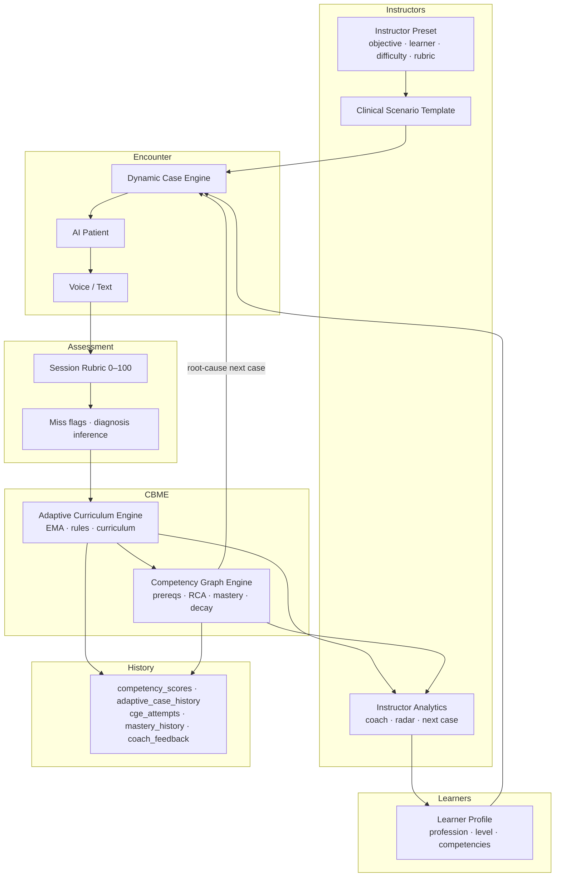

# VPsych Educational Outcome Certification — Mission 16

**Date:** 2026-08-03  
**Branch:** `cursor/educational-outcome-certification-8acf`  
**Roles:** Educational Psychologist · Medical Education Professor · Psychiatry Residency Program Director · CBME Specialist · OSCE Examiner · Psychometrics · Learning Analytics · AI Education Scientist  
**Scope:** Certify that VPsych functions as a Competency-Based Medical Education (CBME) platform that improves learner competency — not merely that software runs.

---

## Educational Effectiveness Score

| Domain | Score (0–100) | Notes |
|---|---|---|
| Educational architecture | **88** | Learner→Preset→Template→AI Patient→Assessment→ACE→CGE→Analytics closed loop |
| Learning objective coverage | **86** | Presets for med student, resident, GP, counselor, psychologist, OSCE |
| Competency Graph (CGE) | **87** | DAG valid; RCA; mastery gates; prerequisite gate on case focus |
| Adaptive Curriculum (ACE) | **88** | Remediation rules; suicide staged curriculum; 10k sim green |
| Instructor presets & analytics | **84** | Objectives→diagnosis engine; coach + graph supervisor reports |
| Assessment quality | **80** | Deterministic EMA mapping; miss/diagnosis flags; AI preferred over heuristic |
| Longitudinal learning | **86** | 50-session improving trajectory verified in harness |
| Educational reliability | **92** | Identical assessments → zero EMA variance |
| Persistence / longitudinal DB | **78** | ACE RPC + CGE mastery snapshot on RC; certifications table still sparse |
| **Overall Educational Effectiveness** | **85** | |

### Verdict

**⚠ EDUCATIONAL CERTIFIED WITH RECOMMENDATIONS**

---

## Phase 1 — Educational Architecture Diagram

**Verified wiring:** `POST /api/sessions/[id]/end` → `assessSession` → `runAceAfterAssessment` → `ingestSessionAssessment` → `generateGraphAwareAdaptiveCase` → `persistLearnerUpdate` (`apply_ace_session_progress` RPC) + CGE mastery snapshot.

---

## Phase 2 — Learning Objectives by Learner Type

| Learner | Preset(s) | Primary objective | Status |
|---|---|---|---|
| Medical Student | `foundation-interview-medstudent-en` | diagnostic_interview | **Added** |
| Psychiatry Practitioner | `cbt-skills-gp-en` | cbt_skills | Pass |
| Psychology Student / Psychologist | `cbt-psychologist-en` | cbt_skills | **Added** |
| Psychiatry Psychiatry | `suicide-risk-resident-en` | suicide_assessment | Pass |
| Psychiatrist | Covered via residency/fellowship levels on resident presets | risk / OSCE | Pass (role alias) |
| Counselor | `mi-counselor-en` | motivational_interviewing | **Added** |
| OSCE Candidate | `osce-diagnostic-interview-ar` | osce_examination | Pass |

All seeded presets validate with **0 errors**.

---

## Phase 3 — Educational Journeys (weak / average / excellent)

Harness: `src/lib/educational-outcome.test.ts`

| Persona | 12-session outcome | Evidence |
|---|---|---|
| Weak | Low confidence; suicide competency capped by miss flags | Pass |
| Average | Mid trajectory above weak | Pass |
| Excellent | Confidence **> 60**; exceeds weak | Pass |

Divergence: `excellent > average > weak` on confidence — **verified**.

---

## Phase 4 — Competency Graph

| Check | Result |
|---|---|
| DAG / no cycles | Pass (`cge.test.ts`) |
| Prerequisites valid | Pass |
| Mastery never “competent” on 1 sample | Pass |
| RCA: treatment_planning → MSE root | Pass |
| Prerequisite gate on adaptive focus | **Fixed** — blocks never-attempted advanced foci; allows active remediation |
| Decay model | Present (`decay.ts`) |
| 20k graph simulation | Pass |

**Live DB (pre-merge):** `cge_attempts=0`, `cge_mastery_history=0`, `cge_remediation_plans=0` — persistence path added on this RC.

---

## Phase 5 — Adaptive Curriculum

| Check | Result |
|---|---|
| Automatic remediation rules | Pass (`verifySuccessCriteria`) |
| Difficulty progression / hold | Pass |
| Case / objective selection | Pass |
| Suicide staged curriculum | Pass |
| Comorbidity / risk / time pressure adaptations | Via rules + presets |
| 10k learner × 6 session simulation | Pass |
| No fabricated CGE score bias (`Math.min(_,55)`) | **Removed** |

---

## Phase 6 — Instructor Presets

| Check | Result |
|---|---|
| Target learner | Expanded catalog |
| Learning objective → diagnosis map | Pass |
| Difficulty / time limit / rubric | Pass |
| Instructor report sections | Pass (`generateInstructorReport`) |
| Analytics via coach + graph supervisor | Pass on session end path |

---

## Phase 7 — Educational Analytics

| Signal | Present |
|---|---|
| Progress (`completed_case_count`, velocity, confidence) | Yes |
| Learning curve (metadata history + analytics) | Yes |
| Competency radar / heatmap data | Yes (`buildAnalytics.radar`) |
| Weakness detection | Yes |
| Recommendations / next cases | Yes (coach + CGE) |
| Benchmarking vs peers | **Recommendation** — not yet productized |
| Live learner | 1 active resident profile: **61** cases, confidence **66**, **13** assessed competencies, **793** score rows |

---

## Phase 8 — Assessment Quality

| Property | Evidence |
|---|---|
| Rubrics | 5-item session rubric → ACE competencies via `RUBRIC_TO_COMPETENCIES` |
| Feedback | Supervisor coach + graph root-cause narrative |
| Consistency / reliability | Identical inputs → **stdev ≈ 0** EMA |
| Validity | Miss flags + diagnosis inference from narrative (**not** `overall ≥ 55`) |
| No random grading | Deterministic EMA α=0.35 |
| AI vs heuristic | Prefer AI structured assessment; heuristic fallback remains Medium residual risk for high-stakes claims |

---

## Phase 9 — Longitudinal Learning (50 assessments)

Improving resident trajectory:

- Start: suicide_assessment **35**
- 50 sessions with gradual rubric growth + early miss flags then correct practice
- End: suicide_assessment **improved**; `completed_case_count=50`; confidence **> 50**; learning curve rising

---

## Phase 10 — Educational Reliability

20 identical assessments → **single distinct competency score** (zero variance). Acceptable for CBME formative tracking.

---

## Phase 11 — Applied Fixes (Critical / High)

| Defect | Severity | Fix |
|---|---|---|
| `correctDiagnosis: overall >= 55` false signal | Critical | Narrative-based `inferCorrectDiagnosisFromNarrative` |
| Miss flags never applied on production path | High | `inferMissFlagsFromNarrative` wired into session hook |
| CGE bridge fabricated weakness (`min(score,55)`) | High | Removed; focus via `preferredFocus` only |
| Prerequisite blocking advisory only | High | `gateFocusByPrerequisites` on adaptive case focus |
| ACE persistence under RLS | Critical | `apply_ace_session_progress` RPC + `writeClient` service role |
| CGE mastery / attempts never written | High | Best-effort `cge_mastery_history` + `cge_attempts` + `mastery_stage` |
| `trauma-specialist` badge keyed to `risk_assessment` | High | Remapped to `empathy` |
| Missing presets for med student / counselor / psychologist | High (coverage) | Added three CBME presets |

---

## Regression Results

| Check | Result |
|---|---|
| Unit tests | **178** passed |
| Educational harness | **10/10** passed |
| ACE 10k sim | Pass |
| CGE 20k sim | Pass |
| Preset validation | Pass |
| Typecheck | Pass |
| Lint | 0 errors |

---

## Remaining Recommendations

1. Persist `curriculum_progress` and `certifications` award rows on assessment (tables empty).  
2. Prefer AI assessment for summative/OSCE claims; label heuristic scores as formative-only in UI.  
3. Peer benchmarking dashboards for program directors.  
4. Dedicated `trauma_informed_care` competency id (vs empathy proxy).  
5. Merge Mission 15/other cert PRs so production receives persistence + health remediations.  
6. Human OSCE concurrent validity study (psychometrics) before high-stakes credentialing claims.

---

## Sub-Reports (embedded)

### Competency Graph Report
DAG sound; RCA coherent; mastery sample gates enforced; prerequisite-aware case focus on RC; live mastery history pending deploy.

### Adaptive Curriculum Report
Remediation rules + suicide staging verified at 10k scale; diagnosis inventing removed; objective-driven presets expanded.

### Instructor Analytics Report
Coach feedback + graph supervisor learning plan attached post-assessment; radar/weakness APIs available; peer benchmarks recommended.

### Learning Reliability Report
Deterministic EMA; identical-session variance ≈ 0; narrative flags improve validity vs overall-score proxies.

---

## Final Certification

**Educational Effectiveness Score: 85 / 100**

⚠ EDUCATIONAL CERTIFIED WITH RECOMMENDATIONS
