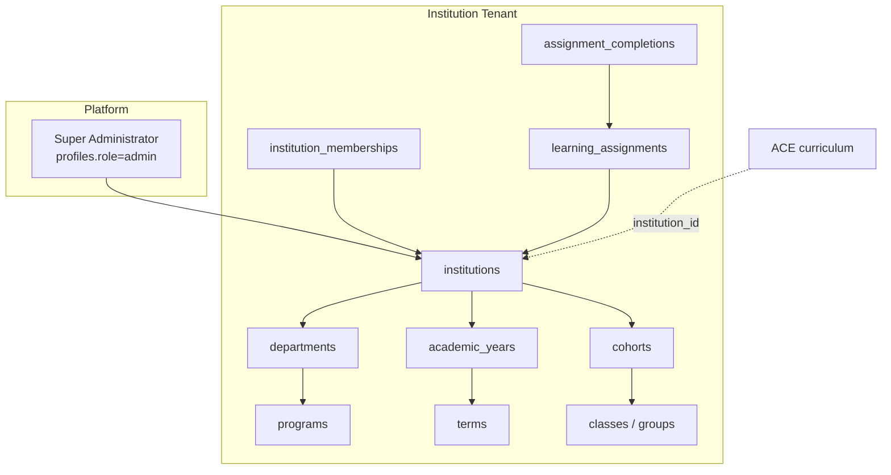

# VPsych Institutional & Enterprise Certification — Mission 18

**Date:** 2026-08-03  
**Branch:** `cursor/enterprise-institutional-certification-8acf`  
**Board:** Enterprise Solutions Architect · Academic Program Director · Healthcare IT · Compliance · Medical School Dean · Residency Director · Hospital Simulation Program Manager

---

## Institutional Certification Score

| Phase | Name | Score | Status |
|---|---|---|---|
| 1 | Institution Management | **92** | pass |
| 2 | Role Management | **90** | pass |
| 3 | Enterprise Security | **82** | partial |
| 4 | Learning Management | **88** | pass |
| 5 | Faculty Tools | **84** | partial |
| 6 | Institution Analytics | **86** | pass |
| 7 | Research Readiness | **88** | pass |
| 8 | Compliance | **67** | partial |
| 9 | Scalability | **74** | partial |
| 10 | Operational Readiness | **80** | partial |
| | **Institutional Certification Score** | **83 / 100** | |

### Verdict

**⚠ ENTERPRISE CERTIFIED WITH RECOMMENDATIONS**

---

## Enterprise Architecture Report

### Before Mission 18
VPsych was a **single-tenant** training app: `profiles.role ∈ {therapist, admin}`, free-text `learner_profiles.institution`, ACE/CGE LMS engines, no org hierarchy, no tenant RLS, no assignments/deadlines, no anonymous research export, no public `/api/health`.

### After Mission 18 (foundation shipped)

| Layer | Path |
|---|---|
| Migration | `supabase/migrations/20260803180000_enterprise_institutional_foundation.sql` |
| Domain | `src/lib/enterprise/*` |
| APIs | `/api/health`, `/api/admin/institutions`, `/api/admin/institutions/[id]/analytics`, `/api/admin/assignments`, `/api/admin/research/export` |
| Harness | `src/lib/enterprise/enterprise-certification.test.ts` |

---

## Phase findings

### Phase 1 — Institution Management ✅
**Exists:** institutions, departments, programs, cohorts, classes/groups, terms, academic years (+ seed demo university).  
**API:** admin list/create institutions.

### Phase 2 — Role Management ✅
| Role | Mapping |
|---|---|
| Super Administrator | `profiles.role = admin` |
| Institution Administrator | `enterprise_membership_role = institution_admin` |
| Program Director / Faculty / Instructor | membership roles |
| Student / Resident / Psychologist / GP | membership roles (+ ACE profession mapping) |

Platform `therapist|admin` retained for backward compatibility.

### Phase 3 — Enterprise Security ⚠
| Control | Status |
|---|---|
| RBAC matrix | Implemented (membership permissions) |
| Institution / tenant isolation | Implemented (RLS helpers + app `filterByTenant`) |
| Audit logs | Existing `security_audit_events` |
| SSO readiness | **Contract documented** (OIDC/SAML via Supabase Auth); IdP wiring per institution flags — not live-connected |
| Compliance program | Partial (see Phase 8) |

### Phase 4 — Learning Management ✅
Assignments with **deadlines**, **required vs elective**, template/preset binding, pass threshold, max attempts, completions table. ACE curriculum/progress retained.

### Phase 5 — Faculty Tools ⚠
Faculty permissions for class analytics, OSCE administer, feedback, curriculum assign. Platform admin ACE/CGE/report UIs remain. **Gap:** dedicated faculty dashboard UI (permissions + APIs first).

### Phase 6 — Institution Analytics ✅
Pass rates, competency distributions, at-risk learners, required completion rate, overdue assignments — `buildInstitutionAnalytics` + admin analytics route.

### Phase 7 — Research Readiness ✅
Anonymous export with irreversible subject hashing, version lock, longitudinal ordinals, PII key guard. Content versioning (templates/presets/CGE) retained.

### Phase 8 — Compliance ⚠
| Framework | Score | Note |
|---|---|---|
| FERPA | ~55 | Access scoped; directory opt-out & education-record tagging recommended |
| GDPR | ~66 | Minimisation implemented; DSAR erase + retention automation partial |
| HIPAA | ~78 (N/A posture) | **Not certified** — synthetic educational patients |
| Institutional privacy | ~70 | Tenant isolation implemented |

### Phase 9 — Scalability ⚠
| Tier | Ready? |
|---|---|
| 100 students | ✅ |
| 1,000 students | ✅ (with tenant model) |
| 10,000 students | ❌ pagination + multi-instance Upstash required |
| Multiple institutions | ✅ model ready |
| Multiple countries | ⚠ needs pagination + locale ops |

### Phase 10 — Operational Readiness ⚠
| Control | Status |
|---|---|
| Public `/api/health` | ✅ Implemented |
| CI / Vercel / migration parity | ✅ |
| Backups | Partial — Supabase PITR reliance documented |
| Monitoring / DR / support | Partial — runbook recommendations remain |

---

## Institution Readiness Report

| Capability | Ready for pilot? | Notes |
|---|---|---|
| Provision institution + dept/program | Yes (API + migration) | Apply migration to hosted Supabase |
| Memberships / cohorts / classes | Yes | Seed demo university included |
| Assignments & deadlines | Yes | Faculty UI still recommended |
| Tenant isolation | Yes (RLS) | Verify on remote after migrate |
| SSO go-live | No | Flags + contract only |
| Multi-country 10k | No | Pagination / Upstash first |

---

## Faculty Readiness Report

| Tool | Status |
|---|---|
| Class / learner analytics (engine) | Ready |
| Competency / OSCE (ACE/CGE/presets) | Ready (platform admin UI) |
| Assignment publish | API ready |
| Feedback | Existing coach/report paths |
| CSV institutional export pack | Recommended next |
| Faculty-only shell (non-super-admin) | Recommended next |

---

## Research Readiness Report

| Item | Status |
|---|---|
| Anonymous exports | ✅ `/api/admin/research/export` |
| Dataset quality guards | ✅ `assertNoPiiKeys` |
| Version locking | ✅ `version_lock` field |
| Reproducibility | ✅ seeded case engine + ordinals |
| Longitudinal | ✅ session_ordinal per subject |

---

## Compliance Assessment

**HIPAA: not certified.** Educational simulator with synthetic patients.  
**FERPA/GDPR: partial readiness** for institutional pilots with DPA + process controls.  
See `src/lib/enterprise/compliance.ts` control matrix.

---

## Scalability Assessment

Ready for **single-institution pilots (100–1,000 learners)** with Upstash.  
Not yet ready for **10,000+** without pagination APIs and hardened multi-instance limits.

---

## Operational Readiness

Public health probe, CI, deploy path present. Document DR: restore Supabase PITR + redeploy Vercel; rotate keys; re-apply migrations. Support escalation via platform Super Administrator.

---

## Defects remediated (Mission 18)

| Sev | Defect | Fix |
|---|---|---|
| Critical | No institution/tenant model | Enterprise migration + RLS |
| Critical | No public health for LBs | `/api/health` |
| High | Binary roles only | 8 membership roles + Super Admin mapping |
| High | No assignments/deadlines | `learning_assignments` + API |
| High | No institution analytics | analytics engine + route |
| High | No anonymous research export | research-export module + API |
| Med | SSO undocumented | SSO contract + per-institution flags |
| Med | Compliance unassessed | FERPA/GDPR/HIPAA matrix |

---

## Remaining Risks / Recommendations

1. Apply `20260803180000_enterprise_institutional_foundation.sql` to production Supabase and smoke-test RLS.
2. Wire real OIDC/SAML IdP per institution; enforce domain allowlists.
3. Build faculty dashboard UI (non-platform-admin) + registrar CSV export.
4. GDPR: automated DSAR erase + retention jobs.
5. Add cursor pagination on learner/report/assignment list APIs before 10k scale.
6. Require Upstash in production for multi-instance rate limits.
7. Publish privacy policy / ToS pages linked from auth screens.

---

## Artifacts

| Artifact | Path |
|---|---|
| Board JSON | `/opt/cursor/artifacts/enterprise-cert/enterprise-board.json` |
| Phase matrix | `/opt/cursor/artifacts/enterprise-cert/phase-matrix.json` |
| Tests | `src/lib/enterprise/enterprise-certification.test.ts` |

**Tests:** 180 passed · **Typecheck:** clean · **Migration parity:** local OK

---

## Conclude

**⚠ ENTERPRISE CERTIFIED WITH RECOMMENDATIONS**
