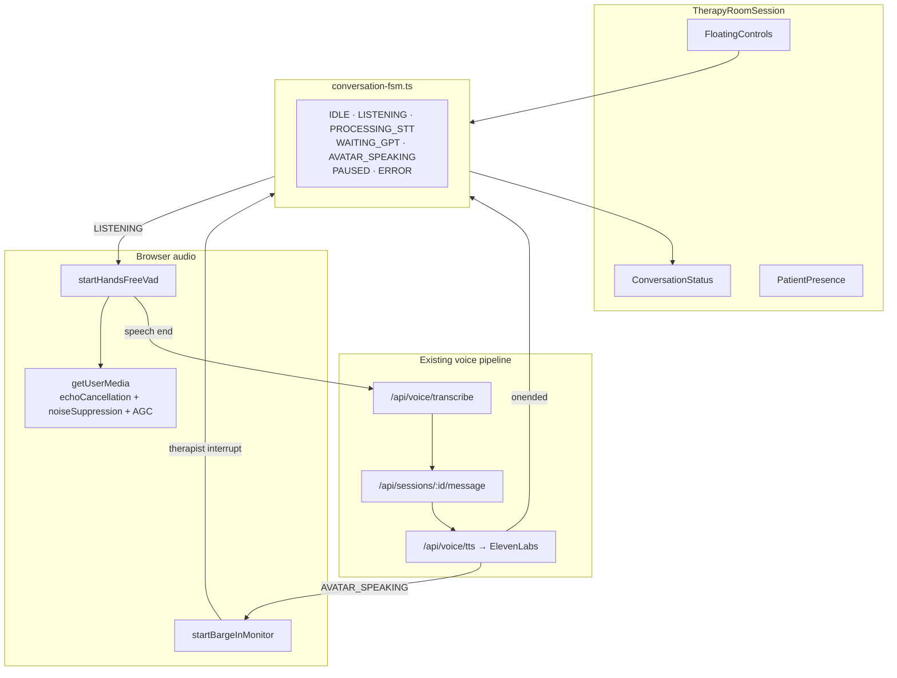
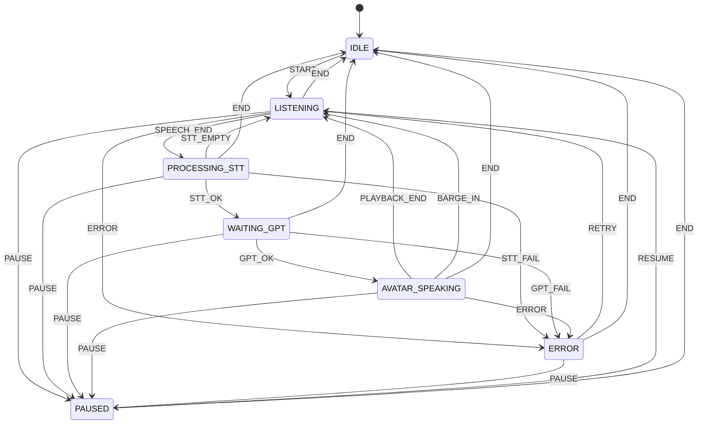
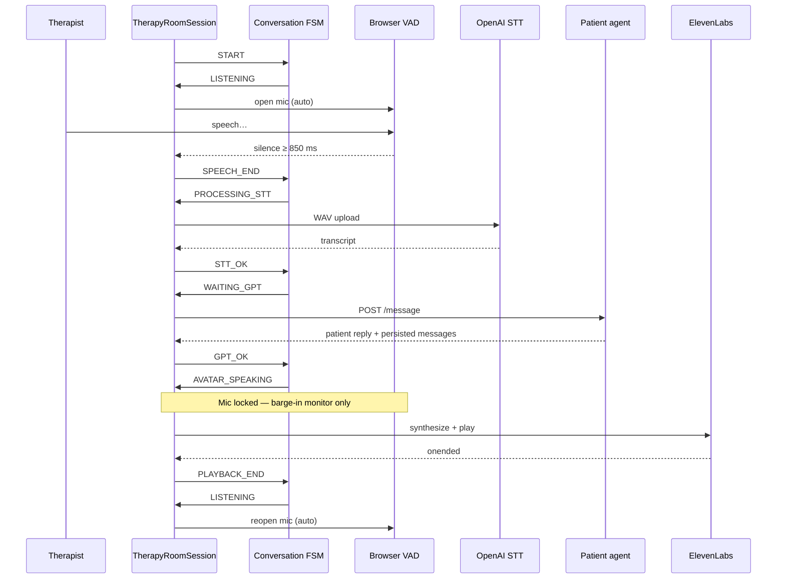
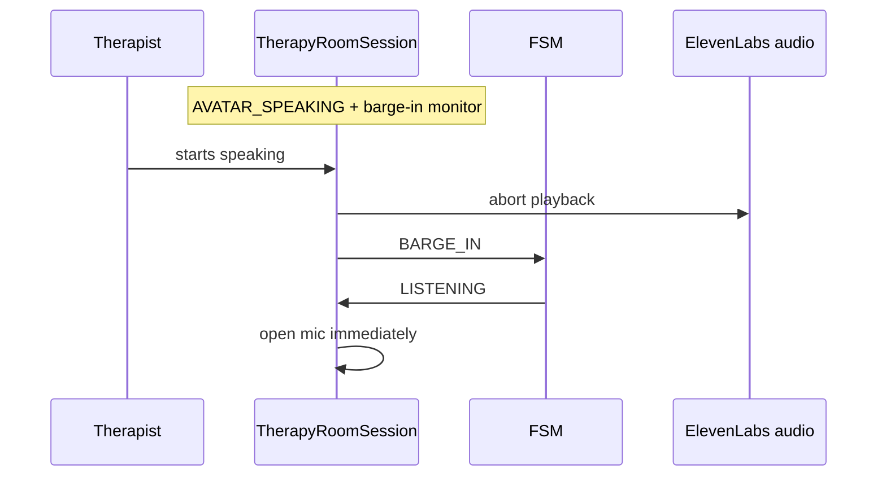

# True Hands-Free Therapy Room

**Status:** Production-ready (optional behind `NEXT_PUBLIC_THERAPY_ROOM_MODE`)  
**Mission:** Continuous full-duplex clinician–patient voice conversation — no
repeated microphone clicks.

Classic `VoiceSession` remains the default click-to-talk UI. Therapy Room Mode
uses this hands-free loop when `sessions.interaction_mode = therapy_room`.

## Therapist interaction model

The therapist only presses:

1. **Start Session** (mic opens automatically)
2. **Pause** / **Resume** (optional)
3. **End Session**

There is no per-turn microphone toggle.

## Target workflow

```
Start Session
  → Microphone opens automatically
  → Therapist speaks
  → VAD detects end of speech (700–1000 ms silence)
  → Recording ends
  → Speech-to-Text
  → GPT patient reply
  → ElevenLabs playback
  → Playback completion event
  → Microphone reopens automatically (<300 ms target)
  → Repeat until Pause or End Session
```

## 1. Architecture diagram



## 2. Conversation state machine



Illegal transitions are rejected. A generation counter invalidates in-flight
STT/GPT/TTS work on Pause, Barge-in, Retry, and End — preventing duplicate
requests and overlapping recordings.

## 3. Sequence diagram (one hands-free turn)



### Barge-in



## Implementation map

| Concern | Module |
|---|---|
| FSM | `src/lib/therapy-room/conversation-fsm.ts` |
| VAD + barge-in | `src/lib/therapy-room/vad.ts` |
| Audio constraints | `src/lib/therapy-room/audio-constraints.ts` |
| Telemetry (no PHI) | `src/lib/therapy-room/conversation-telemetry.ts` |
| Orchestration UI | `src/components/therapy-room/TherapyRoomSession.tsx` |
| Status + mic indicator | `src/components/therapy-room/ConversationStatus.tsx` |
| STT / GPT / TTS | `src/lib/voice/conversation-pipeline.ts` (AbortSignal on play + message) |

## Voice Activity Detection

- Web Audio `ScriptProcessor` + RMS energy (muted gain path — never routes mic to speakers)
- Default silence: **850 ms** (clamped to **700–1000 ms**)
- `minSpeechMs` 400 — ignores coughs / blips
- Intra-sentence pauses shorter than silence timeout do not end the turn
- Constraints: `echoCancellation`, `noiseSuppression`, `autoGainControl`
- Works for English and Arabic (language handled at STT locale, not VAD)

## Avatar playback lock

While FSM state is `AVATAR_SPEAKING`:

- Capture VAD is not started
- Only the barge-in monitor listens (no STT upload of avatar audio)
- Playback completion uses `HTMLAudioElement` `ended` / AbortSignal — not timers

## Pause / Resume / End

| Action | Behavior |
|---|---|
| Pause | Cancel VAD, abort STT/GPT/TTS, FSM → PAUSED |
| Resume | FSM → LISTENING, mic opens automatically |
| End | Stop mic + playback, abort pending work, persist notes/immersion/telemetry counters, `POST /end`, report path unchanged |

## User feedback

`ConversationStatus` always shows one of:

Listening… · Hearing you… · Thinking… · Avatar speaking… · Paused · Reconnecting… · error + Retry

Mic pulse indicator while `LISTENING`; hot pulse while therapist speech is detected.

## Error recovery

| Failure | Recovery |
|---|---|
| Mic permission | ERROR + Retry (transcript preserved) |
| STT empty | STT_EMPTY → LISTENING (auto) |
| STT / GPT / network | ERROR + Retry |
| TTS / playback abort | interrupted → continue or ERROR |
| Session expired | End Session path |

Transcript remains server-side via existing message RPCs — never lost on client error.

## Telemetry

Recorded client-side and merged into `immersion_metrics.conversationTelemetry` at end:

- speech / STT / GPT / TTS / playback / mic-reopen latencies
- turns, barge-ins, errors, retries, pauses

**Never** records raw microphone audio or transcript text.

## Security

- No API keys in the browser beyond existing anon / public config
- Auth, RLS, rate limits, report HMAC, admin-only reports unchanged
- WAV blobs exist only in memory for STT upload

## Accessibility

- Keyboard: `P` pause/resume, `N` notes, `R` retry on error, `Ctrl/Cmd+E` end, `Esc` panels
- `role="status"` + `aria-live="polite"` on conversation status
- Visible mic indicator; high-contrast error + Retry
- RTL via existing next-intl locale direction
- Text fallback input when voice unavailable

## Performance budgets

| Metric | Target |
|---|---|
| Speech end → STT begins | < 200 ms |
| Mic reopen after playback | < 300 ms |
| Silence detect | 700–1000 ms (default 850) |
| GPT / TTS | Same as classic VoiceSession pipeline |

## Browser compatibility

| Browser | Notes |
|---|---|
| Desktop Chrome / Edge | Fully supported (Web Audio + getUserMedia + Autoplay after user gesture on Start) |
| Desktop Firefox | Supported; ScriptProcessor path |
| Safari iOS | Requires prior user gesture (Start Session); AudioContext resume on boot; autoplay after gesture |
| Chrome Android | Supported with echoCancellation |

Autoplay: session Start is the user gesture that unlocks AudioContext + later TTS `audio.play()`. AbortSignal cancels playback on barge-in without relying on timers.

## Deployment notes

1. Ensure `NEXT_PUBLIC_THERAPY_ROOM_MODE=true` on the target environment.
2. Migration `20260806133411_therapy_room_mode.sql` (and VMHC follow-ups if used) applied.
3. Existing voice env: `OPENAI_API_KEY` (STT + GPT), `ELEVENLABS_API_KEY` (TTS), report write key / service role for `/end`.
4. No new secrets. No schema change required for the FSM itself — telemetry nests under `immersion_metrics` JSON.
5. Roll out behind the existing feature flag; classic VoiceSession remains default.
6. Smoke: Start Therapy Room session → speak → wait for silence → hear patient → speak again without touching mic → Pause → Resume → End → complete page.

## Testing

```bash
npm test -- src/lib/therapy-room/hands-free-conversation.test.ts
npm test -- src/lib/architecture.test.ts
npm test
```

Coverage includes: continuous loop, silence vs short pause, max duration, barge-in, pause/resume, empty STT, network ERROR→RETRY, AGC constraints, telemetry without PHI, architecture guardrails.

## Production certification

See `docs/HANDS_FREE_THERAPY_ROOM_CERTIFICATION.md`.
