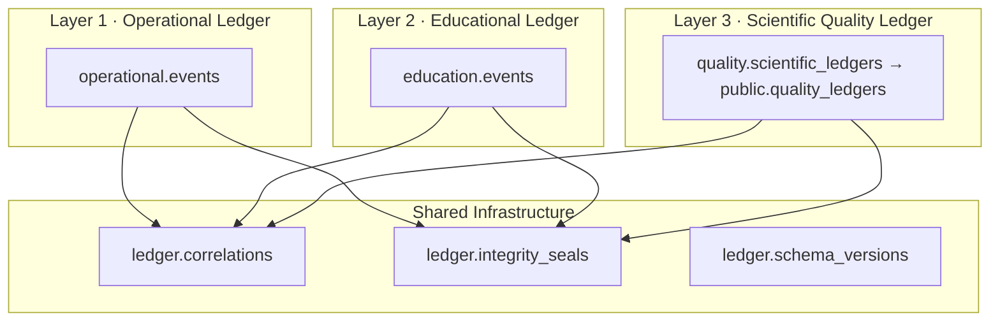

# VPsych Enterprise Multi-Ledger Platform v1.0

**Board:** Enterprise Architecture · Healthcare Data · Security · Medical Education Informatics  
**Implementation:** `src/lib/ledgers/` · Dashboard: `/admin/ledgers` · API: `/api/admin/ledgers`  
**Migration:** `supabase/migrations/20260803270000_multi_ledger_platform.sql`  
**Depends on:** Scientific Quality Ledger (`quality_ledgers` / Layer 3)

Three **independent but interconnected** immutable event stores form the permanent backbone of VPsych.

---

## Architecture

| Layer | Schema | Purpose | Access |
|---|---|---|---|
| **Operational** | `operational.*` | Technical / security / infrastructure audit | Admins only |
| **Educational** | `education.*` | Complete learner interaction history | Learner + instructor + admin |
| **Scientific Quality** | `quality.*` (+ `public.quality_ledgers`) | Permanent scientific evidence (CFI→VQI) | Researchers + admins |

Cross-ledger links use **references only** (assessment / session / learner / template / persona / release / deployment / model / prompt IDs) via `ledger.correlations`.

---

## Event flow

1. **Session start** → Operational `api.sessions.start` + Educational `assessment_started` (+ template/preset used) + correlation open  
2. **Session end** → Operational `api.sessions.end` (+ AI fallback if any) + Educational `assessment_completed` / `adaptive_decision` / `competency_updated` + **Quality Ledger seal** + correlation with `scientific_ledger_id`  
3. **Admin deny / security audit** → dual-write `security_audit_events` + Operational Ledger  

All seals are **best-effort** and never block the primary UX path.

---

## Immutability & integrity

- `BEFORE UPDATE OR DELETE` triggers on operational + education + correlation + seals  
- Every record carries `content_hash` (sha256)  
- `ledger.integrity_seals` stores per-record seals  
- Corrections on Scientific Quality continue to append new versions (existing Quality Ledger contract)

---

## RPCs

| Function | Role |
|---|---|
| `append_operational_event(jsonb)` | Insert Layer 1 |
| `append_educational_event(jsonb)` | Insert Layer 2 |
| `link_ledger_correlation(jsonb)` | Cross-ledger graph |
| `append_quality_ledger(jsonb)` | Layer 3 (existing) |

Public views: `operational_ledger_events`, `educational_ledger_events`, `ledger_correlations`.

---

## Dashboards & exports

- **UI:** `/admin/ledgers` — three-layer overview, recent events, cross-ledger replay  
- **Also:** `/admin/quality-ledger` for deep Scientific Quality inspection  
- **Exports:** CSV · JSON · anonymous research (`?format=`)

---

## Replay

`GET /api/admin/ledgers?session=<uuid>` returns a unified timeline:

`operational → education → quality → correlation`

Reconstructs infrastructure → education → scientific quality for accreditation and incident review.

---

## Scientific data dictionary (shared refs)

| ID | Meaning |
|---|---|
| `correlation_id` | Cross-ledger join key for one assessment journey |
| `session_id` / `assessment_id` | Clinical session identity |
| `scientific_ledger_id` | FK-style reference to Quality Ledger row |
| `content_hash` | Integrity seal |
| `schema_version` | Per-layer version lock |

---

## Developer notes

- Offline corpus: `seedMultiLedgerOfflineCorpus()` when migration not applied  
- Library entry: `@/lib/ledgers`  
- Session bridge: `sealSessionStartLedgers` / `sealSessionCompleteLedgers`  
- Tests: `src/lib/ledgers/ledgers.test.ts`

---

## Administrator notes

1. Apply migrations through Quality Ledger (`…260000`) then Multi-Ledger (`…270000`)  
2. Monitor `/admin/ledgers` for layer balance and authorization denials  
3. Use anonymous export for IRB / research sharing  
4. Use session replay for accreditation sampling  

---

## Research notes

- Educational + Quality anonymous exports strip learner/instructor UUIDs  
- Operational ledger is **not** included in anonymous research packs (may contain IP/UA)  
- Scientific reproducibility remains anchored on Quality Ledger provenance + snapshots  
