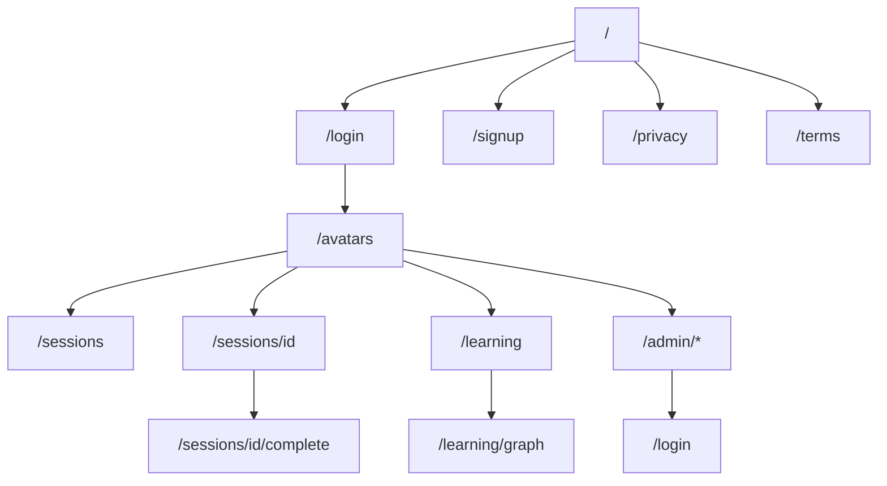

# VPsych Navigation & User Flow Certification Report
## Mission 04 — Navigation & User Flow Certification

**Date:** 2026-08-02  
**Branch:** `cursor/navigation-certification-8acf`  
**PR:** https://github.com/alhazayed/vpsych/pull/46  
**Preview:** `vpsych-git-cursor-navigation-ce-89ba60-…`  
**Evidence:** `/opt/cursor/artifacts/screenshots/navigation/` (33 screenshots)

---

## Executive summary

Complete navigation and user-flow certification covered route discovery, protected redirects, menus, legal/support links, therapist and admin journeys, mobile admin navigation, EN/AR switching, and API auth navigation contracts.

**Verified Critical/High navigation defects were fixed, regression-tested on preview, and retested in browser.**

**Overall Navigation Score: 88 / 100**

---

## Complete route map

### Public
| Route | Notes |
|-------|-------|
| `/` | Landing; logged-in server-redirects to `/avatars` |
| `/login`, `/signup` | Auth; authed users honor `?next=` |
| `/auth/callback` | Code exchange |
| `/privacy`, `/terms` | New legal destinations |

### Therapist (protected)
`/avatars` · `/sessions` · `/sessions/[id]` · `/sessions/[id]/complete` · `/learning` · `/learning/graph`

### Admin (edge + page gated)
`/admin/reports` · `/admin/reports/[sessionId]` · `/admin/avatars` · `/admin/voices` · `/admin/cases` · `/admin/templates` · `/admin/presets` · `/admin/curriculum` · `/admin/graph`

### Error / recovery
| Mechanism | Status |
|-----------|--------|
| `not-found.tsx` | Custom 404 |
| `error.tsx` / `(app)/error.tsx` / `global-error.tsx` | Retry + recovery links |
| Anon protected page | → `/login?next=<path+query>` |
| Anon API | JSON `401` |
| Non-admin `/admin/*` | → `/avatars` |
| Non-admin `/api/admin/*` | JSON `403` |

### Navigation graph (primary)

---

## Verified user journeys

| Journey | Result | Evidence |
|---------|--------|----------|
| Anonymous landing → anchors → Privacy/Terms | PASS | `01`–`07` |
| Login Support → FAQ; Forgot need-email; legal links | PASS | `08`–`10` |
| Deep link `/avatars` → login with `next` | PASS | `11` + API |
| `/login?error=auth` message | PASS | `12` |
| EN ↔ AR RTL/LTR | PASS | `13`–`14` |
| Therapist nav (4 destinations) | PASS | `15`–`18` |
| Start Maya session (no misconfigured) | PASS | `19` + API create 200 |
| Therapist logout | PASS | `20` |
| Admin full nav (8 destinations) | PASS | `22`–`29` |
| Mobile primary + More sheet + Escape | PASS | `30`–`33` |
| Therapist blocked from `/admin/reports` | PASS | `34` + API 307→`/avatars` |

**Instructor** is not a separate DB role; instructor tooling is admin-gated (Presets/Curriculum/Graph) — verified under Admin journey.

---

## Broken links / redirect report

### Fixed this mission
| Issue | Severity | Fix |
|-------|----------|-----|
| Anon `/api/*` redirected to HTML login | Critical | JSON `401` |
| `next=` dropped query (`?tab=`) | High | Preserve `path + search` |
| Forgot Password non-clickable | High | `resetPasswordForEmail` |
| Privacy/Terms/Support spans | High | `/privacy`, `/terms`, `/#faq` |
| Auth callback error ignored | High | Surface `error=auth` |
| Admin mobile nav overcrowded | High | More sheet |
| Missing 404 / legal pages | High | Added pages |
| Session create blocked without service role | Critical (journey) | `messageRpcClient` fallback |

### Remaining (Medium / ops)
| Item | Notes |
|------|-------|
| Landing “Watch Demo” | Anchors `#features` (no separate demo route) |
| Signup Solutions/Clinical Tools | Both → `/#features` |
| Password reset email delivery | Depends on Supabase Auth SMTP |
| Anon unknown paths | Hit auth gate (`login?next=…`) before app 404 (expected for protected surface) |
| No external docs/GitHub/social links | None present in product UI |

---

## Protected route verification

| Actor | Protected page | Result |
|-------|----------------|--------|
| Anon | `/avatars`, `/admin/reports` | 307 → login + `next` |
| Anon | `POST /api/sessions` | **401 JSON** |
| Anon | `/sessions?tab=history` | `next=%2Fsessions%3Ftab%3Dhistory` |
| Therapist | `/admin/reports` | 307 → `/avatars` |
| Admin | all `/admin/*` listed | 200 |

---

## Accessibility summary

- Mobile More sheet: `role="dialog"`, Escape closes, outside click closes, `aria-expanded` on trigger.
- Login errors: `role="alert"`; reset info: `role="status"`.
- Language switcher remains keyboard reachable.
- Full screen-reader / skip-link audit not completed → Medium residual risk.

---

## Performance summary (preview)

| Navigation | Latency |
|------------|---------|
| Public pages | ~100–220ms TTFB class responses |
| Therapist pages | ~200–460ms |
| Admin pages | ~190–630ms |
| Session create API | ~814ms |

No abnormal multi-second client navigations observed in the certification pass.

---

## Regression results

| Check | Result |
|-------|--------|
| Lint | 0 errors |
| Typecheck | PASS |
| Tests | **173 / 173** |
| Build | PASS (routes include `/privacy`, `/terms`) |
| Preview browser journeys | PASS |
| Preview API route matrix | PASS |

---

## Scores (evidence-based)

| Area | Score | Evidence |
|------|------:|----------|
| Routing | 92 | Public/protected/admin matrix + 404 |
| Navigation menus | 90 | Desktop sidebar + mobile More |
| Buttons & links | 88 | Legal/support/forgot wired; demo CTA Medium |
| User journeys | 90 | Anonymous / therapist / admin complete |
| Protected routes | 94 | API 401 + admin gate verified |
| Language switching | 88 | Login EN/AR RTL |
| Accessibility | 74 | Dialog/ARIA basics; no full a11y suite |
| Performance | 86 | Sub-second navigations in sample |
| **Overall** | **88** | |

---

## Remaining risks

1. Production still on pre-fix `main` until PR merges (includes session journey blocker).
2. Prefer `SUPABASE_SERVICE_ROLE_KEY` + Auth SMTP + Upstash for ops hardening.
3. No dedicated Instructor role — admin stands in for instructor workflows.
4. External help/docs links intentionally absent.

---

## Production recommendation

Merge **PR #46**, redeploy, smoke: anon legal links → therapist session start → admin More/mobile → therapist admin deny.

---

## Certification verdict

⚠ NAVIGATION CERTIFIED WITH RECOMMENDATIONS
