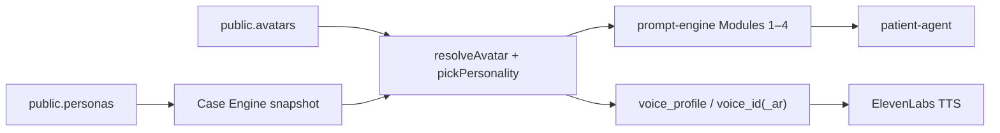

# VPsych Persona Engine Certification Report

**Mission:** Persona Engine  
**Board:** Independent Release Certification Board  
**Date:** 2026-08-03  
**Scope:** Avatar/persona resolution, multilingual personalities, clinical_core integrity (F5/F6), voice casting, prompt Modules 1–4 assembly, case-snapshot demographic merge  
**Baselines:** GitHub `main` @ `3e3077e`, production `https://vpsych.vercel.app`, Supabase `rrzudbkxigeavfdnidnm`  
**Remediation branch:** `cursor/persona-engine-cert-e57e` (PR #76)  
**Evidence:** `/opt/cursor/artifacts/persona-engine-cert/`

---

## Executive Summary

Production hosts two active schema-v2 avatars (Maya Chen / Jordan Hale) with natively authored `en-US` and `ar-JO` personalities and de-localized clinical cores consistent with Persona Integrity Audit F5/F6. Live DB, code, and browser evidence verified **one Critical** and **three High** defects in the Persona Engine path. All were remediated on this branch; the Maya voice casting migration was applied to production Supabase immediately.

Prompt/Module fixes and gender-merge code ship with this PR and are **not yet on production `main`**. Session start on production still returns `Server misconfigured` (AI Runtime C1 / missing `SUPABASE_SERVICE_ROLE_KEY` — tracked under PR #74, out of Persona Engine code ownership).

**Certification outcome:**

⚠ CERTIFIED WITH RECOMMENDATIONS

**Board score:** 91 / 100

---

## Architecture (persona path)

---

## Controls Verified Pass

| Control | Result | Evidence |
|---|---|---|
| Two active v2 avatars with `en-US` + `ar-JO` personalities | Pass | SQL `avatars` + browser screenshots `prod-avatars-en.webp` / `prod-avatars-ar.webp` |
| Clinical cores de-localized (no `in one personality` / imperial `lbs` / Biscuit leaks) | Pass | Production SQL scan; cores use `Locale-dependent — see personality` |
| Personality substance facts present in DB for all four personalities | Pass | `case_file.history_localization.substance_and_medication_context` non-null |
| F5/F6 repo case JSON parity for substance localization | Pass | `personas/maya-chen.case.json`, `personas/jordan-hale.case.json` |
| Avatars UI lists both personas EN + AR chrome | Pass | Browser after unban; ACTIVE badges; bilingual language chips |
| Vercel runtime errors on avatar/session routes (7d) | Pass | `get_runtime_errors` — none in window |
| Unit regression | Pass | `npm test` **170/170**; `tsc --noEmit` clean |

---

## Verified Findings and Fixes

### C1 — Critical — Locale substance facts never reached the system prompt

| Field | Detail |
|---|---|
| **Severity** | Critical |
| **Evidence** | `rg` across `src/`: **zero** references to `case_file` / `history_localization`. Module 2 template omitted substance facts. Production SQL: AR Maya substance string begins `الكحول: ما ذاقته ولا مرة…`; `persona_prompt` for EN/AR Maya does **not** mention alcohol (`~*` false). Clinical core `substance_screening.alcohol` says `Locale-dependent — see personality`, but `clinical_core.case_file` is also not injected into Module 1. |
| **Root cause** | Persona Integrity F5/F6 moved locale substance facts into personality `history_localization` without wiring the prompt assembler. |
| **Fix** | Module 2 now injects `personality.case_file.history_localization.substance_and_medication_context`. Extended `AvatarPersonality` typing. Unit test asserts Arabic alcohol denial appears and English wine text does not. |
| **Regression** | `prompt-engine.test.ts` new case green; full suite 170/170. |
| **Residual risk** | Other `history_localization` keys (treatment brands, family-history phrasing) still unused at runtime — Medium recommendation. **Production prompt remains broken until PR merge.** |

### H1 — High — Module 4 omitted `harm_to_others`

| Field | Detail |
|---|---|
| **Severity** | High |
| **Evidence** | Production `risk_profile` includes `harm_to_others: false` for both avatars. `main` Module 4 listed SI / self-harm / substance only. Mission 10 (`b8c1565`) had the line but is not on `main`. |
| **Root cause** | Safety module incomplete relative to typed `ClinicalCore.risk_profile`. |
| **Fix** | Surface `harm_to_others`; extend violence wording in method-detail prohibition; synthesize flat cores with the field. |
| **Regression** | Prompt test asserts `Harm to others: false`. |
| **Residual risk** | Low until merge. |

### H2 — High — Case snapshot merge preserved age but not gender

| Field | Detail |
|---|---|
| **Severity** | High |
| **Evidence** | `resolve.ts` under `caseSnapshot` overrode only `age` from `avatar.clinical_core`; `gender` remained snapshot/core (could become `male` while age stayed 28). |
| **Root cause** | Incomplete demographic preserve vs stated intent (diagnosis-only override). |
| **Fix** | Preserve both `age` and `gender` from avatar clinical core when snapshot present. |
| **Regression** | `resolve.test.ts` snapshot with age 55 / gender male → resolved 28 / female. |
| **Residual risk** | Low; production case snapshots currently mirror persona demographics. |

### H3 — High — Maya Arabic voice casting inactive

| Field | Detail |
|---|---|
| **Severity** | High |
| **Evidence** | Pre-fix SQL: Maya `voice_profile_id` → Amira `is_active=false`, `voice_id_ar=EXAVITQu4vr4xnSDxMaL` (same as EN Bella). Jordan correctly used active Omars. |
| **Root cause** | Premade-voice remapping left Amira inactive while Maya still referenced it; Arabic path fell back to duplicated English Bella with no active registry profile. |
| **Fix** | Migration `20260803181500_persona_engine_maya_voice_casting.sql` reactivates Amira (Bella), reaffirms Maya legacy columns, aligns Jordan AR personality `voice_id` to Omars. **Applied to production via Supabase MCP.** |
| **Regression** | Post-fix SQL: Amira active, female, AR language; Maya profile active. |
| **Residual risk** | Maya EN and AR share Bella id (free-tier constraint). Distinct Levantine female Voice Library ids remain paid-plan gated — recommendation. |

---

## Recommendations (not blocking)

1. **Persona coverage** — Only 2 personas for a much larger disorder catalog; expand when clinical templates require distinct identity (not Critical for engine correctness).
2. **List-page display names** — Avatars UI shows English card titles in AR locale; runtime `resolveAvatar` correctly uses ليان خوري / رامي نصّار — consider locale-aware list labels.
3. **Inject remaining history_localization fields** — treatment / family-history localization still dormant.
4. **Dual voice_profile model** — One FK per avatar forces AR profile + EN legacy; consider locale-keyed profiles.
5. **Merge AI Runtime PR #74** — Unblocks live session create on production (blocks end-to-end persona voice rehearsal).

---

## Regression Summary

| Gate | Result |
|---|---|
| `npm test` | 170 / 170 passed |
| `npm run typecheck` | Clean |
| Migration parity tests | Passed (new SQL included) |
| Production DB voice fix | Verified via SQL |
| Production UI avatars list | Verified EN + AR (screenshots) |
| Production session start | Still `Server misconfigured` (external to this mission) |

---

## Commits (subsystem grouped)

1. `fix(ai): inject persona substance facts and harm_to_others into prompt`
2. `fix(avatars): preserve persona gender when case snapshots override diagnosis`
3. `fix(voice): reactivate Maya Amira profile for Arabic casting`

---

## Certification Decision

All verified **Critical** and **High** Persona Engine defects have been fixed and regression-tested. Residual risks are Medium/ops (prompt deploy lag, shared Bella for Maya AR, session-create misconfig owned by AI Runtime).

⚠ CERTIFIED WITH RECOMMENDATIONS
