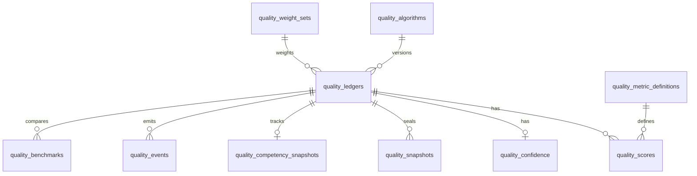

# VPsych Quality Ledger Engine v1.0

**Board:** Chief Scientific Officer · Database Architect · Healthcare Data Science · Psychometrics  
**Role:** Permanent immutable scientific audit trail  
**Implementation:** `src/lib/quality-ledger/` · Dashboard: `/admin/quality-ledger` · API: `/api/admin/quality-ledger`  
**Migration:** `supabase/migrations/20260803260000_quality_ledger_engine.sql`

The Quality Ledger is **not** a log, cache, or analytics store. It is the **source of truth** for every scientific quality metric generated by VPsych. Records are never updated or deleted.

---

## Architecture

### Core tables

| Table | Purpose |
|---|---|
| `quality_ledgers` | Immutable assessment ledger header + rollup metrics + provenance |
| `quality_scores` | Normalized per-metric scores (CFI/ERI/AVI/ALE/RRS/VQI) |
| `quality_confidence` | Multi-domain confidence bundle |
| `quality_snapshots` | Frozen template/persona/prompt/rubric/graph/ACE/schema payloads |
| `quality_competency_snapshots` | Before/after competency + improvement/regression/velocity |
| `quality_events` | Timeline events |
| `quality_trends` / `quality_benchmarks` | Analytics aggregates |
| `quality_release_history` | Platform release quality summary |
| `quality_algorithms` | Algorithm version registry |
| `quality_ledger_access_audit` | Access audit for PHI-sensitive reads |

Reuses VQI tables: `quality_metric_definitions`, `quality_weight_sets`.

---

## Immutability

- `BEFORE UPDATE OR DELETE` triggers raise on ledger core tables
- Corrections use `event_type = 'correction'` + `previous_ledger_id`
- Unique index: one active `assessment_completed` ledger per `session_id`
- Append via `append_quality_ledger(jsonb)` SECURITY DEFINER RPC only
- Admin SELECT RLS; learners may read own headers; no client INSERT/UPDATE/DELETE

---

## Assessment integration

`POST /api/sessions/[id]/end` calls `sealAssessmentQualityLedger` after ACE (best-effort; never blocks report write).

Each seal computes/stores:

- Session & clinical identity (template, persona, diagnosis, language, voice, preset)
- AI provider/model/fallback + duration/turns/word count
- **CFI, ERI, AVI, ALE, RRS, VQI** with CI + breakdown
- Confidence domains + weight matrix + reasoning summary
- Immutable snapshots (case, schema, rubric, prompt, CGE, ACE, scoring rules)
- Competency before/after delta
- Audit: git SHA, migration version, deployment, environment, content hash

---

## Exports

| Format | Query |
|---|---|
| CSV | `?format=csv` |
| JSON | `?format=json` |
| Excel package | `?format=excel` |
| Anonymous research | `?format=anonymous` |
| FHIR-compatible bundle | `?format=fhir` |

Anonymous exports strip learner/instructor UUIDs.

---

## Dashboard

`/admin/quality-ledger` — search/filter surfaces via diagnosis aggregates, timelines, benchmarks, replay (full JSON), and exports.

---

## Scientific data dictionary (selected)

| Field | Type | Meaning |
|---|---|---|
| `content_hash` | sha256 | Integrity seal over session + scores + prompt hashes |
| `vqi`…`rrs` | 0–100 | Rollup scientific metrics |
| `prompt_hash` / `system_prompt_hash` | sha256 | Prompt reproducibility without storing full PHI prompts |
| `quality_algorithm_version` | semver | Ledger algorithm lock |
| `previous_ledger_id` | uuid | Correction lineage |

---

## Reproducibility contract

Every historical assessment can be reconstructed from:

1. Ledger header (model, versions, hashes)
2. `quality_snapshots` payloads
3. `quality_scores` + weight matrix
4. Platform algorithm registry

Offline corpus (`buildQualityLedgerOfflineCorpus`) supports admin UI before migration apply.

---

## Tests

`src/lib/quality-ledger/quality-ledger.test.ts` — hashing, immutability, assessment seal, corrections, exports, dashboard.
