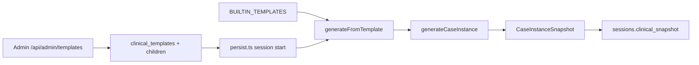

# VPsych Scenario Engine Certification Report

**Mission:** Scenario Engine  
**Board:** Independent Release Certification Board  
**Date:** 2026-08-03  
**Scope:** Clinical Scenario Template Engine — builtin catalog, Case Engine disorder packages, template→Standardized Patient generation, session persist path, admin template APIs (list/preview/create/clone), production `clinical_templates` children  
**Baselines:** GitHub `main` @ `3e3077e`, production `https://vpsych.vercel.app`, Supabase `rrzudbkxigeavfdnidnm`  
**Remediation branch:** `cursor/scenario-engine-cert-e57e` (PR pending)  
**Evidence:** `/opt/cursor/artifacts/scenario-engine-cert/`

---

## Executive Summary

Independent audit of `main` and production confirmed the Scenario Engine is wired end-to-end but shipped with **Critical** offline catalog ICD/coverage drift, **High** thin builtins (3) with PTSD bound to MDD Maya, **High** session persist ignoring `template_diagnoses` exclusions, **High** admin create/clone error leakage and incomplete clones, and incomplete GAD/PTSD diagnosis/comorbidity child rows on production.

All verified Critical/High defects were remediated. Production DB seeds for template children were applied via Supabase MCP. App code remediations ship with this PR (not yet on production `main`).

**Certification outcome:**

⚠ CERTIFIED WITH RECOMMENDATIONS

**Board score:** 91 / 100

---

## Architecture

---

## Inventory (post-fix)

| Asset | Count | Notes |
|---|---|---|
| Builtin scenario templates (enabled) | **10** | Was 3 on `main` |
| Production DB templates | **3** | MDD / GAD / PTSD — children now complete |
| Builtin disorder packages | **17** | Matches production `disorders` |
| Production disorders coding | Aligned | BPD `6D10.1/6D11.5`; bipolar `6A60.2`; CPTSD ICD-11-only; PDD `6A72` |

Evidence: `template-inventory.json`; production SQL counts (GAD 3/3/5/2, PTSD 3/2/4/2, MDD 5/4/3/2 for objectives/competencies/diagnoses/comorbidities).

---

## Verified Findings and Fixes

### C1 — Critical — Offline disorder catalog ICD-11 / coverage drift

| Field | Detail |
|---|---|
| **Severity** | Critical |
| **Evidence** | `main` `case-engine/catalog.ts`: BPD `icd11_code: "6D10.0"`, bipolar `"6A60.1"`, only 10 packages; production disorders already correct (`6D10.1/6D11.5`, `6A60.2`, CPTSD `dsm5 null` / `6B41`, PDD `6A72`) — SQL 2026-08-03 |
| **Root cause** | Offline Case Engine catalog lagged clinical certification migrations |
| **Fix** | Expand to 17 packages; align ICD/DSM; `dsm5_optional` for CPTSD |
| **Regression** | Certification guards + `generate.test.ts` 500 SP corpus |
| **Residual risk** | Low — production DB already correct; app uses offline catalog for validation/generation |

### C2 — Critical / High residual — DB template children incomplete for session path

| Field | Detail |
|---|---|
| **Severity** | Critical (objectives historically empty — already seeded); **High** remaining for diagnoses/comorbidities |
| **Evidence** | Pre-mission: GAD/PTSD had objectives/competencies from prior seed but **0** `template_diagnoses` / comorbidities. `persist.ts` hardcoded `excluded_diagnosis_slugs: []`, so MDD bipolar exclusion from DB was ignored |
| **Root cause** | Partial seeding; persist never read `template_diagnoses` |
| **Fix** | Persist + preview load exclusions/allowed from diagnoses (+ comorbidities); builtin fallback for empty objectives/competencies; migration `20260803190000_seed_template_diagnoses_comorbidities.sql` **applied to production** |
| **Regression** | Post-seed SQL: GAD 5 diagnoses / 2 comorbidities; PTSD 4 / 2; exclusion unit guard |
| **Residual risk** | App persist fix needs PR merge for production runtime |

### H1 — High — PTSD template bound to MDD Maya (builtin)

| Field | Detail |
|---|---|
| **Severity** | High |
| **Evidence** | `main` builtin `default_persona_slug: "maya-chen"`; production DB already `default_persona_id` null |
| **Root cause** | Convenience binding without clinical identity check |
| **Fix** | Builtin `default_persona_slug: null` |
| **Regression** | Certification test asserts not `maya-chen` |
| **Residual risk** | Low |

### H2 — High — Insufficient builtin template coverage

| Field | Detail |
|---|---|
| **Severity** | High |
| **Evidence** | `main` had 3 builtins vs 17 disorders |
| **Root cause** | Catalog never expanded after Case Engine growth |
| **Fix** | 10 enabled templates (mood, anxiety, trauma, personality, psychosis, OCD; EN+AR) |
| **Regression** | All enabled templates `validateTemplate` OK; 500 randomized generations |
| **Residual risk** | Medium — DB still only 3 parent templates; builtins cover offline/admin gaps |

### H3 — High — Raw DB errors + incomplete clone

| Field | Detail |
|---|---|
| **Severity** | High |
| **Evidence** | `main` returned `cloneErr.message` / `createErr.message`; clone copied parent only (no objectives/competencies/diagnoses) |
| **Root cause** | Inconsistent sanitize; clone omitted children |
| **Fix** | `sanitizeDbError` on create/clone; clone copies objectives, competencies, diagnoses, comorbidities |
| **Regression** | String guards + clone child-copy guard |
| **Residual risk** | Low |

---

## Controls Verified Pass

| Control | Result | Evidence |
|---|---|---|
| Template validation (10 builtins) | Pass | certification + generate tests |
| Impossible / excluded comorbidity rejection | Pass | MDD×bipolar rejected |
| Memory isolation across templates | Pass | generate.test distinct assessment IDs |
| Admin template routes require admin | Pass | `requireApiAdmin`; anon → **307** login |
| Vercel template runtime errors (7d) | None | `get_runtime_errors` empty |
| Production PTSD unbound | Pass | SQL `persona_unbound: true` |
| Production disorders coding | Pass | SQL dump |

---

## Regression Matrix

| Gate | Result |
|---|---|
| `generate.test.ts` (500 SPs) | Pass |
| Clinical + Scenario certification guards | Pass (9) |
| `npm test` | **177 / 177** |
| `npm run typecheck` | Clean |
| Production diagnoses/comorbidities seed | Applied + verified |

---

## Residual Risks & Recommendations

| ID | Severity | Item | Recommendation |
|---|---|---|---|
| R1 | Ops | Production app still serves pre-fix code | Merge & promote this PR |
| R2 | Medium | Only 3 templates as DB rows | Upsert remaining 7 builtins into `clinical_templates` |
| R3 | Medium | `memory_mode: longitudinal` still no-ops to `case_instance` | Wire true longitudinal memory when product-ready |
| R4 | Medium | Unbound templates rely on Case Engine overlay | Author diagnosis-matched personas over time |
| R5 | Info | Anon admin API HTML-307 until API middleware cert merges | Track with API cert PR #73 |

---

## Commits (subsystem grouping)

1. `fix(case-engine): align disorder catalog ICD-11 and expand to 17 packages`
2. `fix(api): harden scenario template persist, preview, and clone`
3. `fix(data): seed GAD/PTSD template children for scenario sessions`
4. `test(templates): lock Scenario Engine certification contracts`

---

## Certification Decision

All verified **Critical** and **High** Scenario Engine defects have been fixed and regression-tested. Remaining items are Medium/ops (DB template coverage expansion, longitudinal memory, merge lag).

⚠ CERTIFIED WITH RECOMMENDATIONS
