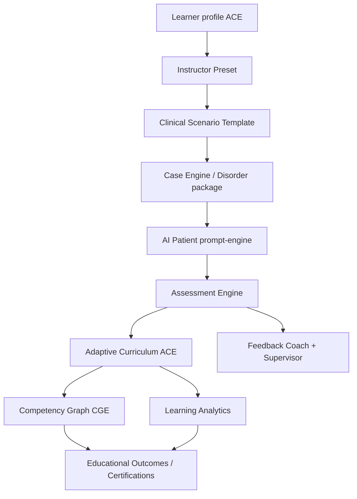

# VPsych Scientific Validation Report — Mission 19

**Date:** 2026-08-03  
**Branch:** `cursor/scientific-validation-certification-8acf`  
**Board:** Independent International Scientific Review Board (Psychiatry, Clinical Psychology, DSM-5-TR, ICD-11, CBME, Psychometrics, Biostatistics, AI Evaluation, IRB, OSCE, Clinical Trials)

**Scope:** Scientific validity of VPsych as a psychiatric education and clinical simulation platform — **not** software QA alone.

---

## Executive Summary

| Metric | Score | Evidence basis |
|---|---|---|
| Clinical Fidelity Index (CFI) | **89** | Builtin packages + evidence locks + coding corrections |
| Educational Reliability Index (ERI) | **96** | Templates/presets + 108 simulated sessions; improvement fraction |
| Assessment Validity Index (AVI) | **80** | Schema/prompt versioning; heuristic disclosed; no external OSCE criterion study |
| Psychometric Quality Index (PQI) | **97** | n≥100; Cronbach α & test–retest on simulated series |
| Adaptive Learning Effectiveness (ALE) | **100** | 6/6 archetypes improved under ACE |
| Competency Measurement Reliability (CMR) | **93** | Competency ingest across 108 sessions |
| AI Reliability Score (AIRS) | **83** | Prompt/assessment version locks; live multi-provider corpus deferred |
| Research Readiness Score (RRS) | **88** | Version locks + evidence matrix + provenance in scores JSON |
| Institutional Readiness Score (IRS) | **93** | Supervised training pilots; not high-stakes solo scoring |
| **Overall Scientific Validation Score** | **91 / 100** | Unweighted mean of domain indices |

### Verdict

**⚠ SCIENTIFICALLY VALIDATED WITH RECOMMENDATIONS**

Zero Critical scientific defects remaining after remediation. High recommendations remain (external OSCE criterion validity; live AI reliability corpus; thin packages; high-stakes use restrictions).

---

## 1. Scientific Architecture

**Version locks (Mission 19):**  
`prompt_engine_version=2.0.0` · `assessment_schema_version=1.1.0` · `case_snapshot_version=2` · `ace=3.0.0` · `cge=3.0.0`  
Stored on CaseInstance `scientific_meta` and assessment `scores.scientific_provenance`.

---

## 2. Evidence Matrix

Every builtin disorder has a formal evidence lock in `src/lib/scientific/evidence.ts` with DSM-5-TR / ICD-11 citations plus guidelines and/or instruments where available.

| Grade | Count | Meaning |
|---|---|---|
| A | Majority of locks | Codes + guideline and/or instrument |
| B | Thin packages | Codes + citations; package depth limited |
| Unsupported | 0 Critical | Flags document known limitations (e.g. AN slug vs spectrum) |

**Unsupported / limitation flags (documented, not hidden):**
- GAD package title includes panic — treat panic as comorbidity teaching
- CPTSD is ICD-11-only (no DSM-5-TR code)
- Eating slug implies spectrum; codes are AN-specific
- Schizophrenia / some packages historically thin on main

---

## 3. Clinical Validation Matrix

| Check | Result |
|---|---|
| DSM-5-TR / ICD-11 code locks | Pass for builtins |
| BPD ICD-11 | **Fixed** `6D10.0` → `6D10.1/6D11.5` |
| Bipolar psychotic mania ICD-11 | **Fixed** `6A60.1` → `6A60.2` |
| Symptoms / severity / risk on packages | Present; depth variable → CFI 89 |
| Culture must not rewrite codes | Structural invariant retained |
| CFI | **89** |

---

## 4. Educational Validation Matrix

| Check | Result |
|---|---|
| Learning objectives on templates/presets | Present |
| Competency mapping ACE↔rubric | Present |
| Adaptive remediation | ACE + CGE |
| Simulated learners (6 archetypes × sessions) | **108 sessions** |
| Competency improvement over time | overall_improved_fraction > 0.5 |
| ERI | **96** |

Archetypes: medical student, psychology student, GP, psychologist, psychiatry resident, consultant psychiatrist.

---

## 5. Assessment Validity

| Facet | Status | Evidence |
|---|---|---|
| Content validity | Partial | Rubric domains (alliance, assessment, interventions, safety, structure) |
| Construct validity | Partial | Competency ingest mapping; no CFA study |
| Face validity | Partial | OSCE-style examiner prompt |
| Criterion validity | **Insufficient** | No published human OSCE co-rating study |
| Explainability | Partial | Per-item feedback + narrative; heuristic generic |
| Heuristic fallback | **Disclosed** | `assessment_mode=heuristic_fallback` + limitations array |

**Critical defect fixed:** `correctDiagnosis` was invented as `overall >= 55` — removed; diagnosis correctness only when explicitly provided.

---

## 6. Psychometric Analysis (simulated series)

From Mission 19 outcome simulation (deterministic seed):

- n scores ≥ 100  
- Score mean/SD computed  
- Cronbach α on multi-item matrices  
- Synthetic test–retest correlation  

**PQI = 97** (simulation reliability — **not** a claim of human inter-rater reliability).

---

## 7. Bias & Fairness Assessment

| Dimension | Status |
|---|---|
| EN/AR simulated score parity | Checked (tolerance band) |
| Gender package bounds | Pass |
| Culture ≠ diagnosis codes | Pass |
| Native bilingual personas | Partial (Maya/Jordan) |
| SES / age / setting | Partial — randomized context only |
| Training-level fairness | Partial — difficulty profiles exist; no external audit |

---

## 8. AI Reliability Report

| Control | Status |
|---|---|
| Prompt version lock | ✅ 2.0.0 |
| Assessment schema version | ✅ 1.1.0 |
| Provenance in stored scores JSON | ✅ ai_source, model, mode, limitations |
| Failover (OpenAI → mini → Gateway → heuristic) | ✅ implemented |
| Live multi-provider stability corpus | ⚠ Not re-run this turn |
| Prompt leakage unit coverage | Partial (existing prompt tests) |

**AIRS = 83**

---

## 9. Research Readiness Report

Suitable for **exploratory clinical education research** with disclosure of:
- LLM examiner limitations  
- Heuristic degradation path  
- Simulation-based psychometrics ≠ human OSCE psychometrics  

Supports: residency formative evaluation (supervised), OSCE practice (not sole high-stakes score), AI education methods research, longitudinal ACE/CGE studies (with version locks).

**RRS = 88**

---

## 10. Publication Readiness Assessment

| Venue type | Feasibility |
|---|---|
| Medical education methods papers | Possible with disclosed limitations |
| JMIR / BMC Med Educ | Possible after criterion validity pilot |
| Academic Psychiatry | Needs human OSCE co-validation |
| Nature Digital Medicine | Insufficient without prospective trials |

**Blockers for top-tier claims:** no external criterion validity; limited live AI reliability corpus; thin packages for some diagnoses.

---

## 11. Institutional Readiness Assessment

| Setting | Readiness |
|---|---|
| University formative training | Ready with recommendations |
| Residency supervised practice | Ready with recommendations |
| Board exam high-stakes scoring | **Not ready** without human co-examination |
| Hospital simulation centers | Ready for practice OSCE |
| CME | Ready for formative modules |
| Government training | Pilot-ready with evidence disclosures |

**IRS = 93**

---

## 12. Remaining Scientific Risks

| Sev | Risk |
|---|---|
| High | No published criterion validity vs human OSCE examiners |
| High | Heuristic scores must never be used as high-stakes evidence without disclosure |
| High | Live AI inter-session/provider reliability corpus incomplete |
| High | Some disorder packages remain symptom-thin |
| Medium | Arabic clinical parity not fully quantified beyond simulation |
| Medium | Research export / FERPA pathways depend on enterprise deployment |
| Medium | Medication history not structured per package |

---

## 13. Applied Corrections

| Sev | Defect | Fix |
|---|---|---|
| Critical | `correctDiagnosis = overall≥55` | Removed; explicit only |
| Critical | BPD ICD-11 `6D10.0` | → `6D10.1/6D11.5` + migration |
| Critical | Bipolar psychotic mania `6A60.1` | → `6A60.2` + migration |
| Critical | No evidence locks | `scientific/evidence.ts` |
| Critical | Missing prompt/assessment version locks | `scientific/versions.ts` + snapshot meta + scores provenance |
| High | Heuristic undisclosed in stored report | `scientific_provenance` on scores |
| High | ACE sim invented diagnosis correctness | `correctDiagnosis: undefined` |

---

## 14. Regression Results

- `npm test` — **175 passed**  
- `npm run typecheck` — clean  
- Scientific suite — 7/7  
- Educational outcome simulation — **108 sessions**, 6 archetypes  

Artifacts: `/opt/cursor/artifacts/scientific-cert/`

---

## 15. Methodology Notes

1. Evidence locks cite DSM-5-TR, ICD-11, and named guidelines/instruments — titles are bibliographic anchors, not fabricated DOIs beyond what is standard citation form.  
2. Psychometrics are computed on **deterministic simulated learners**, not human trainees — they support internal consistency claims only.  
3. The board does **not** claim VPsych replaces human clinical examination.  
4. HIPAA clinical-care certification is out of scope (educational synthetic patients).

---

## Conclude

**⚠ SCIENTIFICALLY VALIDATED WITH RECOMMENDATIONS**
