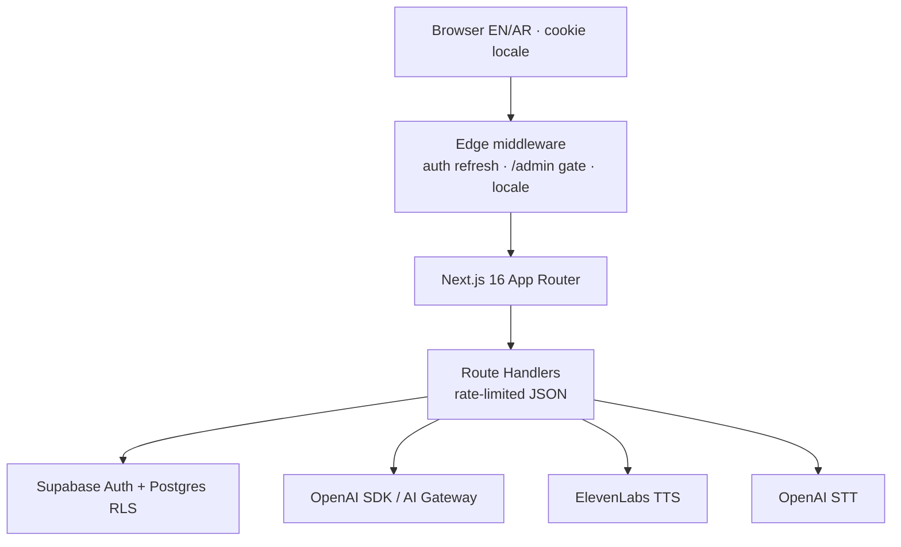
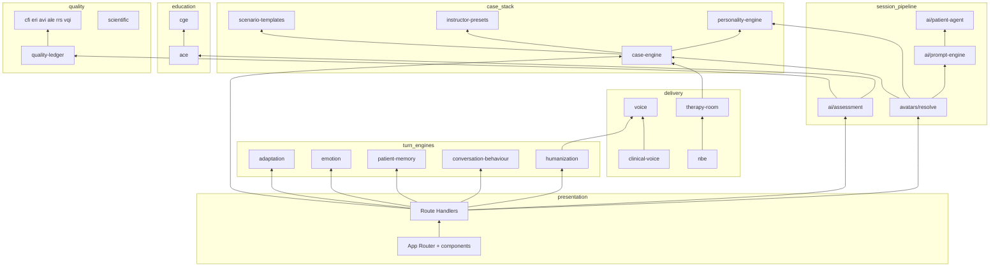
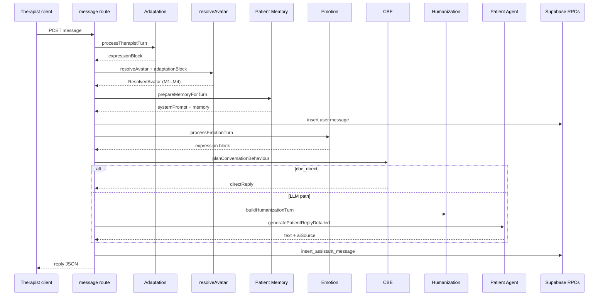
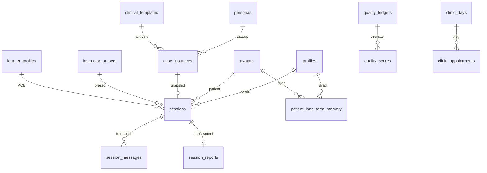

# VPsych Software Architecture & System Boundaries

**Stage:** 2 — Architecture & System Boundaries  
**Status:** Phase Complete · Needs Human Review  
**Evidence baseline:** git `main` as of documentation date · migrations **66** · API routes **42**  
**Rule:** This document describes the **actual implementation**. It is the canonical architecture reference. Engine-specific deep dives remain in `docs/*_ENGINE.md`; this file owns boundaries, ownership, dependencies, and runtime contracts.

**Rationale:** A senior engineer must understand the complete system from architecture alone. Guesswork is forbidden; every claim below is grounded in `src/` and `supabase/migrations/`.

**Clinical information model (Stage 3):** [`clinical/CLINICAL_DATA_MODEL.md`](./clinical/CLINICAL_DATA_MODEL.md) — canonical patient ontology, lifecycle, DSM/ICD, gaps, and roadmap. Engines must not invent a parallel patient model.

---

## 1. Platform identity

| Attribute | Value |
|-----------|-------|
| Product | Therapist-training platform (AI standardized patients) |
| Not | A medical device; not clinically validated scoring |
| Locales | `en` / `ar` (cookie-driven; native personalities, never machine-translated) |
| Stack | Next.js 16 App Router · React 19 · TypeScript strict · Tailwind v4 · Supabase Auth+Postgres+RLS · OpenAI / AI Gateway · ElevenLabs · next-intl · Vitest · Vercel |
| Hard session limit | `MAX_SESSION_SECONDS` = 40 min (`src/lib/types.ts`), enforced server-side |

**Clinical invariants (non-negotiable):**

1. A persona never permanently owns a disorder — diagnosis lives on immutable `sessions.clinical_snapshot` / `case_instances`.
2. Human personality is independent of GPT and of diagnosis (Module 2b).
3. ACE / CGE / Emotion / Adaptation / Memory / CBE / Humanization / Quality Ledger are **best-effort** where marked ★ — they must not block report persistence.
4. Synthetic patients remain fictional; scores are **not validated**.
5. Roles live in `profiles.role`, never `user_metadata`.
6. Therapist-facing APIs never return `session_reports` bodies.

---

## 2. Runtime topology



**Hosting:** Vercel (serverless Route Handlers + Edge middleware).  
**Data region:** Supabase project (ops-configured).  
**Optional Redis:** Upstash for horizontal rate limits; otherwise in-memory (not multi-instance safe).

---

## 3. Subsystem catalogue

### 3.1 Engines (domain owners)

| ID | Module path | Purpose | Production posture |
|----|-------------|---------|-------------------|
| **DCCE** | `lib/case-engine` | Mint immutable CaseInstance + clinical snapshot per session | Production |
| **CSTE** | `lib/scenario-templates` | Clinical scenario templates → case generation | Production |
| **IPE** | `lib/instructor-presets` | Instructor presets → constrained cases + grading metadata | Production |
| **HPE** | `lib/personality-engine` | Structured human traits (Module 2b); freeze onto snapshot | Production |
| **Emotion** | `lib/emotion` | Multi-variable emotional state machine + expression packet | Production ★ |
| **Adaptation** | `lib/adaptation` | Rapport / trust / withdrawal / disclosure stance | Production ★ |
| **LTM** | `lib/patient-memory` | Therapist↔avatar longitudinal facts | Production ★ |
| **CBE** | `lib/conversation-behaviour` | Deterministic turn behaviour planner | Production ★ (`CBE_ENABLED` default on) |
| **Humanization** | `lib/humanization` | Micro-realism cues + voice hints | Production ★ (`HUMANIZATION_ENABLED` default on) |
| **CVP** | `lib/clinical-voice` | Clinical TTS delivery params + emotion modulation | Production |
| **NBE** | `lib/nbe` | Nonverbal / animation timeline from affect | Code present; TRM consumers |
| **ACE** | `lib/ace` | Adaptive curriculum after assessment | Production ★ |
| **CGE** | `lib/cge` | Competency graph, mastery, RCA, remediation | Production ★ |
| **Assessment** | `lib/ai/assessment.ts` | Post-session scoring + narrative | Production |
| **Prompt Engine** | `lib/ai/prompt-engine.ts` | Modules 1–4 system prompt assembly | Production |
| **Patient Agent** | `lib/ai/patient-agent.ts` | LLM reply generation + `aiSource` | Production |
| **QL** | `lib/quality-ledger` | Immutable sealed scientific audit trail | Production ★ |
| **CFI** | `lib/cfi` | Clinical Fidelity Index (pure scorer) | Production (admin/research) |
| **ERI** | `lib/eri` | Educational Reliability Index | Production (admin/research) |
| **AVI** | `lib/avi` | Assessment Validity Index | Production (admin/research) |
| **ALE** | `lib/ale` | Adaptive Learning Effectiveness | Production (admin/research) |
| **RRS** | `lib/rrs` | Research Readiness Score | Production (admin/research) |
| **VQI** | `lib/vqi` | Composite VPsych Quality Index | Production (admin/research) |
| **Scientific** | `lib/scientific` | Version locks, psychometrics board, corpora | Production (validation tooling) |
| **TRM** | `lib/therapy-room` | Immersive UI helpers + VMHC clinic day | Flag-gated off by default |
| **Voice** | `lib/voice` | STT, TTS, prosody, browser pipeline | Production |
| **Avatar Resolve** | `lib/avatars/resolve.ts` | Avatar + locale + snapshot → `ResolvedAvatar` | Production |

★ = soft-fail / best-effort on the session path.

### 3.2 Runtime / platform services (not engines)

| Service | Path | Responsibility |
|---------|------|----------------|
| Auth (pages) | `lib/auth.ts` | `requireUser` / `requireProfile` / `requireAdmin` → redirect |
| Auth (API) | `lib/api-auth.ts` | `requireApiUser` / `requireApiAdmin` → JSON 401/403 |
| Middleware | `middleware.ts` + `lib/supabase/middleware.ts` | Session refresh, public paths, admin edge gate, locale |
| Supabase clients | `lib/supabase/{server,client,middleware,admin}.ts` | SSR, browser, edge, service role + `messageRpcClient` |
| Rate limit | `lib/rate-limit.ts` | Per-key budgets; Upstash or memory |
| Report HMAC | `lib/report-sign.ts` | Signed `create_session_report` payload |
| Security audit | `lib/security-audit.ts` | Best-effort `log_security_event` |
| Security headers | `lib/security-headers.ts` | CSP/HSTS/COOP data for `next.config` |
| API errors | `lib/api-errors.ts`, `lib/safe-client-error.ts` | Never leak provider/DB/env detail |
| Session timer | `lib/session-timer.ts`, `lib/session-expiry.ts` | Remaining time + stale expire |
| Password / redirect | `lib/password-policy.ts`, `lib/safe-redirect.ts` | Auth hygiene |
| Features | `lib/features.ts` | VMHC clinic flag (`FEATURE_THERAPY_ROOM`) |
| Validation invite | `lib/validation/invite.ts` | Expert portal invite codes |
| i18n | `src/i18n/`, `messages/{en,ar}.json` | UI strings |
| AI provider | `lib/ai/provider.ts`, `lib/ai/openai/` | Official SDK vs Gateway selection |

### 3.3 Intentionally absent / not on main product path

| Capability | Status | Evidence |
|------------|--------|----------|
| Product Realtime / SSE / webhooks | **Unused** | No EventEmitter, Realtime channels, or webhooks in `src/` |
| In-app notifications | **Absent** | Auth emails via Supabase only |
| Storage buckets | **None** | 0 in migrations |
| Materialized views | **None** | 0 in migrations |
| Hands-Free Therapy Engine (HFTE) as separate product | Experimental / open PRs historically | TRM hands-free FSM exists behind TRM flag |
| PME / TRE / HCTF / CQI / EOI / CVL excellence engines | Draft / open PRs — **not** production architecture | `ARCHITECTURE_STATE.md` |

---

## 4. Ownership matrix

Every capability has **exactly one owner**. Shared storage is allowed only via **namespaced contracts**.

| Capability / state | Owner | Persistence | Mutation contract |
|--------------------|-------|-------------|-------------------|
| Diagnosis / case snapshot | **Case Engine** | `case_instances`, `sessions.clinical_snapshot` | Immutable after mint; session update guard freezes snapshot fields |
| Scenario template definition | **Scenario Templates** | `clinical_templates` + children | Admin write |
| Instructor preset definition | **Instructor Presets** | `instructor_presets` + children | Admin write |
| Human personality traits | **Personality Engine** | `avatars.human_personality`; frozen copy on snapshot | Admin authorship; freeze at case mint |
| Emotion state | **Emotion Engine** | `case_memory.memory.emotion` | Emotion store only |
| Adaptation / rapport / trust | **Adaptation Engine** | `case_memory.memory.patient_adaptation` | Adaptation store only |
| Longitudinal patient facts | **Patient Memory** | `patient_long_term_memory` | LTM store only |
| Conversation behaviour plan (per turn) | **CBE** | Ephemeral | Stateless planner |
| Humanization turn plan | **Humanization** | Ephemeral (may *read* case_memory) | Must not write emotion/adaptation keys |
| Clinical TTS params | **Clinical Voice** | `voice_profiles` clinical columns | Admin APIs |
| Voice registry / TTS resolution | **Voice** | `voice_profiles`, avatar FKs | Voice resolve + admin assign |
| Nonverbal animation timeline | **NBE** | In-memory client scheduler | Client TRM only |
| Prompt Modules 1–4 template | **Prompt Engine** | Code | Assembler only; others contribute *blocks* |
| Patient LLM reply | **Patient Agent** | Via message RPC | Always sets `aiSource` |
| Session assessment scores | **Assessment** | `session_reports` via RPC/service role | Insert-once |
| Learner competency trajectory | **ACE** | ACE tables; may write CGE remediation via session-hook | Best-effort post-end |
| Competency graph topology | **CGE** | `cge_*` tables (writes primarily via ACE hook / admin) | Graph algorithms in CGE |
| Quality ledger seal | **Quality Ledger** | `quality_ledgers` via `append_quality_ledger` | Append-only; no UPDATE/DELETE |
| Scientific index formulas | **CFI/ERI/AVI/ALE/RRS/VQI** each | Score tables mostly admin/offline | Pure compute in lib |
| Authn identity | **Supabase Auth** | `auth.users` | Platform |
| Authz role | **profiles.role** | `profiles` | Role guard trigger; admin only escalation |
| Private clinical notes | **TRM / notes API** | `session_private_notes` | **Never** enter patient message API |
| Clinic day schedule | **TRM/VMHC** | `clinic_days`, `clinic_appointments` | Flag-gated |
| Security audit trail | **security-audit** | `security_audit_events` | RPC insert |

### 4.1 Ownership conflicts (identified)

| Conflict | Evidence | Severity | Consolidation recommendation |
|----------|----------|----------|------------------------------|
| **Dual `case_memory` writers** (Emotion + Adaptation) | `emotion/store.ts`, `adaptation/store.ts` both upsert jsonb | Medium | Keep namespaced keys (`emotion`, `patient_adaptation`). Add a single `case_memory` repository module that merges patches atomically to prevent last-write-wins races. |
| **Humanization reads `case_memory` without owning it** | message route loads memory for humanization | Low | Document as read-only consumer; never write. Prefer injecting Emotion/Adaptation *outputs* as typed inputs instead of raw jsonb. |
| **Two Therapy Room flags** | `NEXT_PUBLIC_THERAPY_ROOM_MODE` vs `FEATURE_THERAPY_ROOM` / `NEXT_PUBLIC_FEATURE_THERAPY_ROOM` | Medium | Unify under one flag matrix (TRM UI vs VMHC clinic) documented in `features.ts`. |
| **ACE ↔ CGE mutual imports** | `ace` ↔ `cge/ace-bridge` | Medium (managed) | Keep barrel exclusion + `architecture.test.ts`. Long-term: extract `ace-bridge` to `lib/ace-cge/` with one-way deps. |
| **case-engine ↔ scenario-templates ↔ instructor-presets** | Mutual value imports | Medium | Extract shared types/catalog interfaces to `lib/case-contracts/`; engines import contracts only. |
| **scientific ↔ metric engines ↔ VQI cycles** | Corpus/version coupling | High for maintainability | Split `scientific/versions.ts` + psychometrics into `lib/scientific-core/` with **no** imports of corpora/`score.ts`. Corpora stay one-way consumers. |
| **CBE vs Humanization overlap** (silence, hesitation, disclosure) | Both inject prompt cues | Medium | Define precedence: CBE owns *gating/silence short-circuit*; Humanization owns *micro-prosody cues*. Document in prompt contract (done in §7). |
| **Instructor preset grader vs Assessment `weightedOverall`** | Dual scoring | Low (intentional) | Keep separate — different purposes (`TECHNICAL_DEBT.md`). |

---

## 5. Dependency graph

### 5.1 Intended layering (architectural)



### 5.2 Detected circular dependencies (engine-level)

From static import analysis of `src/lib/**/*.ts` (non-test):

| Cycle class | Example path | Mitigation today | Required remediation |
|-------------|--------------|------------------|----------------------|
| ACE ↔ CGE | `ace` → `cge` → `ace` | CGE barrel omits `ace-bridge`; architecture test | Extract bridge package |
| Case ↔ Templates ↔ Presets | mutual | None automated | Shared contracts module |
| Case ↔ CFI | generator meta | Soft | Case must not import CFI engine; pass scores at boundary |
| Scientific hub cycles | `scientific` ↔ `vqi`/`eri`/`avi`/`ale`/`rrs`/`case-engine`/`ace` | Informal discipline | Split versions core from corpora/score |

**Implicit / hidden coupling:**

| Kind | Detail |
|------|--------|
| Prompt coupling | Many engines append strings to `system_prompt` / reinforcement after `assembleSystemPrompt` — order is load-bearing (see §7) |
| Database coupling | Emotion + Adaptation share `case_memory` row without transactional merge |
| Runtime coupling | Message route orchestrates engines inline (god-route) — correct for v1; future: `lib/session-turn/` orchestrator |
| Header coupling | Clients may depend on `X-AI-Source`, `X-CBE-*`, `X-Humanization` |

**Recommendation:** Do **not** rewrite the message route in this stage. Document the orchestrator as the sole composition root for turn engines. Future expansions register as plugins with declared prompt slots.

---

## 6. Runtime pipelines

### 6.1 Session create — `POST /api/sessions`

```
Request
  → getUser (401)
  → rateLimit start:30/h
  → validate avatarId
  → load active avatar
  → resolve locale (body > preset > profile > avatar)
  → createCaseForSession()          // Case Engine (+ template/preset)
  → shouldUseTherapyRoom(mode)      // flag-gated
  → INSERT sessions (clinical_snapshot, case_instance_id, …)
  → insert_system_message RPC
  → Response { sessionId, diagnosis meta, maxDurationSec, … }
```

**Failure:** case mint failure → 500; inactive avatar → 404; missing migrations → legacy column fallback insert (documented resilience, not preferred path).

### 6.2 Message turn — `POST /api/sessions/[id]/message` (canonical)

```
Request (message ≤4000)
  → Auth + ownership + active + timer (else expire → 409)
  → ★ Adaptation: load → processTherapistTurn → save (case_memory.patient_adaptation)
  → resolveAvatar(avatar, language, { caseSnapshot, adaptationBlock })
       └─ assembleSystemPrompt Modules 1→2→2b→3→4
  → ★ Patient Memory: prepareMemoryForTurn → append LTM block to system prompt
  → INSERT user message (RLS role=user)
  → Load history; turnIndex = assistant count
  → ★ Emotion: processEmotionTurn → append expressionPromptBlock
  → ★ CBE: planConversationBehaviour (optional directReply / promptBlock)
  → ★ Humanization: buildHumanizationTurn → prompt_cue + per_turn_cue
  → generatePatientReplyDetailed OR cbe_direct
  → insert_assistant_message RPC
  → Response + emotion/CBE/humanization payloads + X-AI-Source headers
```



### 6.3 Session end — `POST /api/sessions/[id]/end`

```
Auth + end:20/h + ownership
  → mark completed|expired
  → session_has_report? → alreadyExists
  → load messages → resolveAvatar → assessSession()
  → ★ runAceAfterAssessment()
  → ★ runPatientMemoryAfterSession()
  → write report (service role INSERT OR HMAC create_session_report)
  → ★ sealAssessmentQualityLedger() (+ in-process VQI recalc queue)
  → { ok, reportId, ledgerId, adaptive?, aiSource }  // no report body
```

**Hard failure:** neither `SUPABASE_SERVICE_ROLE_KEY` nor `REPORT_WRITE_KEY` → 500.

### 6.4 Voice client pipeline — `lib/voice/conversation-pipeline.ts`

```
Audio → POST /api/voice/transcribe (STT)
      → POST /api/sessions/:id/message
      → POST /api/voice/tts (ElevenLabs + CVP modulation)
      → browser Audio (speechSynthesis fallback)
```

Text-only sessions skip STT/TTS; same message API. Transcript persistence is always server-side.

### 6.5 Therapy Room / hands-free (flag-gated)

When `NEXT_PUBLIC_THERAPY_ROOM_MODE` is on, `TherapyRoomSession` uses conversation FSM (`LISTENING` → `PROCESSING_STT` → `WAITING_GPT` → …). Private notes use `/therapy-room` and `/notes` — **architecture test forbids** feeding notes into the patient message API.

---

## 7. Prompt architecture

**Version lock:** `PROMPT_ENGINE_VERSION` in `lib/scientific/versions.ts` (currently `"2.0.0"`).  
**Owner of template:** `lib/ai/prompt-engine.ts`.  
**Owner of projection:** `lib/avatars/resolve.ts`.

### 7.1 Module order (system prompt)

| Order | Module | Owner | Content | Token impact |
|------:|--------|-------|---------|--------------|
| 1 | CLINICAL | Prompt Engine + Case Engine cues + Adaptation block + optional Humanization fidelity slot | Diagnosis, symptoms, speech/difficulty/therapy-process, syndrome authority | High |
| 2 | AVATAR | Authored `AvatarPersonality` | Identity, idioms, culture (locale-native) | High |
| 2b | HUMAN PERSONALITY | Personality Engine | Structured traits | Medium |
| 3 | LANGUAGE | Personality `language_module` | Dialect rules EN/AR | Medium |
| 4 | SAFETY | Personality `safety_module` | Boundaries; **overrides 1–3** | Medium |

### 7.2 Post-assembly injection order (message route)

| Step | Block | Owner | Failure |
|------|-------|-------|---------|
| A | Module 1 `adaptation_block` (via resolve) | Adaptation | Soft ★ |
| B | LONG-TERM MEMORY append | Patient Memory | Soft ★ |
| C | Emotion expression block | Emotion | Soft ★ |
| D | Humanization `prompt_cue` on system | Humanization | Soft ★ |
| E | Per-turn: locale + personality cue + CBE `promptBlock` + Humanization `per_turn_cue` on **user** turn | Prompt Engine / CBE / Humanization | Soft ★ |

**Precedence on conflict:**

1. Module 4 Safety  
2. Module 1 Clinical (syndrome authority over Module 2 current-state)  
3. CBE disclosure gate / `cbe_direct` (may skip LLM)  
4. Emotion expression (affect)  
5. Adaptation stance  
6. Humanization micro-cues  
7. Module 2 / 2b identity colouring  

### 7.3 Assessment prompts (separate path)

- Examiner system prompt: `lib/ai/report-locale.ts`  
- Parse: `lib/ai/assessment-parse.ts` (Zod)  
- Overall score: private `weightedOverall()` in `assessment.ts` — **do not fork**

---

## 8. State ownership detail

| State variable | Type | Owner | Readers | Writers |
|----------------|------|-------|---------|---------|
| `clinical_snapshot` | jsonb on session | Case Engine | resolve, assessment, engines | Case mint only (guarded) |
| `case_memory.memory.emotion` | jsonb | Emotion | Emotion, Humanization (raw read) | Emotion store |
| `case_memory.memory.patient_adaptation` | jsonb | Adaptation | Adaptation | Adaptation store |
| `patient_long_term_memory` | table | LTM | Message/end hooks | LTM persist |
| `EmotionExpression` packet | response field | Emotion | Client UI / NBE | Emotion |
| CBE plan | ephemeral | CBE | Message route | CBE |
| Humanization plan / voiceHints | ephemeral | Humanization | Message route, TTS client | Humanization |
| `LearnerProfile` | ACE tables | ACE | ACE/CGE APIs | ACE persist / RPC |
| CGE mastery | cge_* / learner fields | CGE (+ ACE hook writes) | CGE APIs | ACE session-hook / admin |
| `session_reports` | table | Assessment write path | Admin only | Signed RPC / service role |
| `quality_ledgers` | table | Quality Ledger | Admin | `append_quality_ledger` |
| Voice cache | process memory | Voice/ElevenLabs | TTS | Voice service |
| TRM FSM | client memory | therapy-room | TRM UI | TRM FSM |
| VQI pending recalc | in-process queue | `vqi/hooks.ts` | QL seal | QL seal |

**Contract:** No engine may mutate another engine's namespaced state except through a documented API owned by that engine.

---

## 9. Event architecture

**Finding:** There is **no** product event bus, webhook system, or Supabase Realtime subscription path in `src/`.

| Mechanism | Kind | Producer | Consumer | Retry / idempotency |
|-----------|------|----------|----------|---------------------|
| `log_security_event` RPC | Audit write | api-auth denied, admin voice changes, etc. | Admin audit reads | Best-effort; never throws into request |
| `requestVqiRecalculation` | In-process queue | Quality ledger seal | Drain for auditability | Process-local only — **not** durable |
| HTTP response headers | Observability | message/end routes | Clients/ops | N/A |
| DB triggers | Sync/guards | INSERT/UPDATE | Enforce invariants | Transactional |
| `finish_session_on_report` | Trigger | report insert | sessions status | Once per report |

**Execution order on end:** assess → ACE ★ → LTM ★ → report write → QL seal ★.  
**Idempotency:** `session_has_report` before assessment; report insert-once; QL append-only.

---

## 10. Database architecture

**Migrations:** 66 files in `supabase/migrations/` (ledger docs at 54 are stale — see debt).  
**Tables:** 83 · **Enums:** 30 · **Views:** 9 · **Triggers:** 14 · **Named indexes:** ~138 · **RLS policies:** ~172 · **Storage buckets:** 0 · **Matviews:** 0  
**Extensions (app):** `pgcrypto`; platform: `supabase_vault`, `plpgsql`.

### 10.1 Domain map



### 10.2 Table groups

| Group | Tables (summary) |
|-------|------------------|
| Core | `profiles`, `avatars`, `sessions`, `session_messages`, `session_reports` |
| Voice | `voice_profiles` |
| Security | `security_audit_events` |
| Case engine | `personas`, `disorders`, `comorbidity_rules`, `difficulty_profiles`, `therapy_profiles`, `case_instances`, `case_memory` |
| Templates | `clinical_templates`, `template_versions`, `template_diagnoses`, `template_comorbidities`, `template_objectives`, `template_competencies` |
| Presets | `instructor_presets`, `preset_objectives`, `preset_competencies`, `preset_constraints`, `preset_templates`, `preset_versions`, `preset_grading` |
| ACE | `competency_domains`, `adaptive_rules`, `learner_profiles`, `learner_competencies`, `competency_scores`, `learning_paths`, `curriculum_progress`, `adaptive_case_history`, `performance_trends`, `certifications`, `coach_feedback` |
| CGE | `cge_nodes`, `cge_edges`, `cge_graph_versions`, `cge_attempts`, `cge_mastery_history`, `cge_decay`, `cge_remediation_plans` |
| Enterprise | `institutions`, `departments`, `programs`, `academic_years`, `terms`, `cohorts`, `classes`, `institution_memberships`, `class_memberships`, `learning_assignments`, `assignment_completions` |
| Quality / VQI | CFI/ERI/AVI/ALE/RRS score tables, metric registry, VQI tables, `quality_ledgers` + children, access audit |
| TRM/VMHC | `clinic_days`, `clinic_appointments`, `session_private_notes` |
| LTM | `patient_long_term_memory` |

### 10.3 Critical RPCs

| RPC | Purpose | EXECUTE |
|-----|---------|---------|
| `insert_assistant_message` / `insert_system_message` | Secure transcript writes | authenticated + service_role |
| `create_session_report` | HMAC insert-once report | authenticated + service_role |
| `session_has_report` | Idempotency | authenticated + service_role |
| `apply_ace_session_progress` | ACE persist | **service_role only** |
| `append_quality_ledger` | Seal QL | **service_role only** |
| `log_security_event` | Audit | authenticated + service_role (body gates) |
| `is_admin` / `current_user_role` | Authz helpers | authenticated + service_role |
| Institution helpers | Tenancy | authenticated + service_role |
| `purge_training_sessions_older_than` | Retention | authenticated + service_role |

### 10.4 RLS highlights

- All 83 tables have RLS enabled.  
- `session_messages`: client INSERT only `role = 'user'`.  
- `session_reports`: admin read; no client insert policy.  
- `quality_ledgers`: admin SELECT only; append via RPC; mutation triggers reject UPDATE/DELETE.  
- Prefer `(select auth.uid())` / `(select is_admin())` initplan pattern.

### 10.5 Views

`generated_case_instances` + CGE compatibility aliases (`competency_nodes`, …) — all `security_invoker = true`.

---

## 11. API map

**Convention:** Auth → rate limit → validate → work → sanitized JSON.  
**Note:** Many therapist routes call `getUser()` directly; middleware still rejects unauthenticated `/api/*` except public paths.

### 11.1 Sessions & voice

| Method | Path | Auth | Rate /h | Owner deps |
|--------|------|------|---------|------------|
| POST | `/api/sessions` | user | start:30 | Case Engine |
| POST | `/api/sessions/[id]/message` | owner | msg:120 | Turn engines + Patient Agent |
| POST | `/api/sessions/[id]/end` | owner | end:20 | Assessment, ACE, LTM, QL |
| GET/POST | `/api/sessions/[id]/emotion` | owner/admin | 60/120 | Emotion |
| PATCH | `/api/sessions/[id]/therapy-room` | owner | trm:60 | TRM |
| GET/POST | `/api/sessions/[id]/notes` | user + TRM flag | 120/60 | TRM notes |
| GET | `/api/sessions/[id]/supervisor` | user + TRM flag | 40 | TRM (never reports) |
| POST | `/api/voice/transcribe` | user | stt:120 | OpenAI STT |
| POST | `/api/voice/tts` | user | tts:60 | ElevenLabs + CVP |

### 11.2 ACE / CGE

| Path | Methods | Rate | Notes |
|------|---------|------|-------|
| `/api/ace/profile` | GET, PATCH | 60 | Learner self |
| `/api/ace/curriculum` | GET, POST | 60 | Curriculum/coach |
| `/api/ace/analytics` | GET | 60 | Admin may pass userId |
| `/api/ace/adaptive-case` | POST | 40 | Next case |
| `/api/cge/graph` | GET | 60 | Graph |
| `/api/cge/mastery` | GET, POST | 40 | Mastery |
| `/api/cge/rca` | POST | 40 | RCA |

### 11.3 Clinic (404 if VMHC flag off)

| Path | Methods | Rate |
|------|---------|------|
| `/api/clinic/day` | GET | 60 |
| `/api/clinic/day/[id]/close` | POST | 20 |
| `/api/clinic/appointments/[id]` | PATCH | 60 |

### 11.4 Admin (`requireApiAdmin` + edge gate)

Personality, disorders, templates (+preview), presets (+preview), cases/preview, voice-profiles (+live-switch), avatar voice assign, ACE learners, CGE admin, CFI/ERI/AVI/ALE/RRS/VQI, quality-ledger, research/export (rate 30).

**Gap finding:** Several admin scientific dashboards have **no** `rateLimit` call — recommend aligning to 30–60/h for consistency (debt, not Stage 2 code change unless hardening is requested).

### 11.5 Public

| Path | Auth | Rate |
|------|------|------|
| `/api/health` | none | none |
| `/api/health/openai` | admin | none |
| `/api/validation/invite` | none | IP 60/20 |

### 11.6 Failure modes (shared)

| Status | Meaning |
|--------|---------|
| 401 | Unauthenticated |
| 403 | Forbidden / non-admin |
| 404 | Missing resource or feature flag off |
| 409 | Inactive / expired session |
| 429 | Rate limited (+ `Retry-After`) |
| 500 | Persistence / report key missing |
| 502 | Patient reply generation failure |

---

## 12. Engine contracts (summary cards)

Each card: **Purpose · Inputs · Outputs · DB · Prompts · Flags · Failure · Extensions**.

### Case Engine (`lib/case-engine`)
- **Purpose:** Fresh immutable clinical case per session.  
- **In:** avatar, optional disorder/template/preset/seed. **Out:** `CaseInstanceSnapshot` + DB row.  
- **DB:** personas, disorders, case_instances, case_memory, templates/presets reads.  
- **Prompts:** Module 1 speech/difficulty/therapy-process/authored cues.  
- **Failure:** hard-fail session start if mint fails.  
- **Extend:** new disorders/templates without changing session API.

### Scenario Templates / Instructor Presets
- **Purpose:** Structured generation constraints.  
- **Out:** validated assessment packages consumed by Case Engine.  
- **Failure:** `{ ok:false, issues[] }`.  
- **Extend:** new template fields via migrations + validators.

### Personality Engine
- **Purpose:** Trait profile independent of diagnosis/GPT.  
- **Out:** Module 2b text; frozen on snapshot.  
- **DB:** `avatars.human_personality`.  
- **Extend:** new trait dimensions via schema `human-personality.v1.json`.

### Emotion Engine
- **Purpose:** Affect state machine → expression.  
- **State:** `case_memory.memory.emotion`.  
- **Prompts:** expression block. **Failure:** soft ★.  
- **Extend:** new intervention classifiers; do not own rapport (Adaptation).

### Adaptation Engine
- **Purpose:** Therapist-behaviour → rapport/trust/stance.  
- **State:** `case_memory.memory.patient_adaptation`.  
- **Prompts:** MODULE ADAPTATION via resolve. **Failure:** soft ★.

### Patient Memory (LTM)
- **Purpose:** Cross-session dyad facts.  
- **DB:** `patient_long_term_memory`.  
- **Prompts:** LONG-TERM MEMORY block. **Failure:** soft ★ on message/end.

### Conversation Behaviour Engine
- **Purpose:** Deterministic turn behaviours; may short-circuit LLM.  
- **Flag:** `CBE_ENABLED` (default on). **Failure:** soft ★.  
- **Extend:** new behaviour catalog entries; keep RNG seeded.

### Humanization Engine
- **Purpose:** Micro-realism + client voice hints.  
- **Flag:** `HUMANIZATION_ENABLED` (default on; needs snapshot). **Failure:** soft ★.  
- **Extend:** new gated behaviours; clinical gates must block unsafe cues.

### Clinical Voice / Voice / NBE
- **CVP:** delivery params from emotion. **Voice:** STT/TTS/pipeline. **NBE:** animation for TRM.  
- **Extend:** new prosody mappings; animation clips without touching prompt engine.

### ACE / CGE
- **ACE:** post-assessment curriculum. **CGE:** competency graph.  
- **Failure:** ACE never throws (`runAceAfterAssessment`).  
- **Cycle:** managed via ace-bridge exclusion.

### Assessment / Reporting
- **Assessment:** scores + narrative (unvalidated). **Report:** admin-only persistence.  
- **Security:** HMAC or service role; therapist APIs omit body.

### Quality stack (CFI→VQI→QL)
- Pure scorers + sealed ledger. Admin/research path. Score tables may be empty in ops.  
- **Extend:** new metric = new engine + registry row + QL hook; do not fork VQI weights ad hoc.

### Therapy Room / VMHC
- Immersive UI + clinic day. Dual flags. Default off. Classic `VoiceSession` remains default.

### AI Provider
- OpenAI SDK default when key set; Gateway alternative; no key → `persona_fallback`. Always propagate `aiSource`.

---

## 13. Feature flags & configuration

| Flag / env | Default | Effect |
|------------|---------|--------|
| `NEXT_PUBLIC_THERAPY_ROOM_MODE` | off | TRM immersive UI |
| `FEATURE_THERAPY_ROOM` / `NEXT_PUBLIC_FEATURE_THERAPY_ROOM` | off | VMHC clinic APIs/UI |
| `CBE_ENABLED` | **on** | Conversation behaviour |
| `HUMANIZATION_ENABLED` | **on** | Humanization layer |
| `OPENAI_API_KEY` / `AI_GATEWAY_API_KEY` | unset | Persona fallback if both missing |
| `OPENAI_CHAT_PROVIDER` | auto | Force `openai` \| `gateway` |
| `ELEVENLABS_API_KEY` | unset | TTS unavailable |
| `REPORT_WRITE_KEY` / `SUPABASE_SERVICE_ROLE_KEY` | unset | End route 500 if both missing |
| `UPSTASH_REDIS_*` | unset | In-memory rate limit |
| `VALIDATION_INVITE_CODES` | — | Expert portal |

---

## 14. Security architecture (boundaries)

| Control | Location |
|---------|----------|
| Auth refresh + admin edge gate | middleware |
| Role from `profiles.role` | auth / api-auth / triggers |
| Rate limits | every product Route Handler (admin scientific exceptions noted) |
| Client-safe errors | `clientSafeError` / `sanitizeDbError` |
| CSP / HSTS / COOP / CORP | `security-headers.ts` |
| Message insert RPCs | ownership, active, turn order |
| Report HMAC + Vault | `create_session_report` |
| QL append service_role only | CQG migrations |
| Demo accounts banned | migrations |
| OpenAI health admin-only | architecture test |

---

## 15. Extension points (safe without rewrite)

Register new clinical engines by:

1. Owning a **namespaced state key** or dedicated table.  
2. Exporting a pure `plan*` / `process*` function.  
3. Hooking **only** the message/end composition root with try/catch ★ if non-critical.  
4. Injecting into a **declared prompt slot** (Module 1 fidelity, post-assemble append, or per-turn reinforcement) — never rewriting Modules 2–4.  
5. Adding architecture tests for wiring + non-overwrite invariants (`integration/engine-pipeline.integration.test.ts` pattern).

| Future engine | Safe hook | Must not |
|---------------|-----------|----------|
| Attachment Engine | Adaptation sibling; own `case_memory` key | Overwrite `patient_adaptation` |
| Defence Mechanisms | Case Engine therapy-process / CBE catalog | Bypass Module 1 syndrome authority |
| Cognitive Bias Engine | Per-turn reinforcement | Alter assessment weights silently |
| Clinical Formulation | Post-session assessment adjunct | Claim validation |
| DSM/ICD packaging | `disorders` catalog + migrations | Store diagnosis on avatar permanently |
| Cultural Context | Module 2 authorship (native locale) | Machine-translate Module 2 |
| Family Dynamics | Template/comorbidity + memory facts | Break case immutability |
| Risk Prediction | Module 4 / safety; supervisor path | Expose as medical device output |
| Animation packs | NBE timeline | Couple to LLM text generation |
| Durable events | New outbox table + worker | Fake durability with in-process VQI queue |

---

## 16. Quality findings (Stage 2 audit)

| Check | Result |
|-------|--------|
| Circular imports | **Present** (ACE↔CGE managed; scientific/case/template hub cycles unmanaged) |
| Duplicated ownership | **case_memory** dual writers; dual TRM flags; CBE↔Humanization cue overlap (documented) |
| Dead modules | `hasAzureSpeech` residue (debt); Azure/Deepgram env comments unused |
| Unreachable services | Realtime unused; enterprise memberships schema-ready but product-incomplete |
| Abandoned migrations | None detected — 66 sequential files; do not edit applied migrations |
| Undocumented APIs | Previously fragmented across cert docs — **this document is the API map** |
| Undocumented prompt modules | Catalogued in §7 |
| Architecture tests | `src/lib/architecture.test.ts` enforces key invariants |
| Docs drift | `ARCHITECTURE_STATE.md` / `CANONICAL_MIGRATION_LEDGER.md` / `CLAUDE.md` counts stale vs 66 migrations |

### Technical debt filed from this audit

| ID | Severity | Item |
|----|----------|------|
| ARCH-S2-01 | High | Split `scientific` versions core from corpora to remove import cycles |
| ARCH-S2-02 | Medium | Atomic `case_memory` patch helper for Emotion + Adaptation |
| ARCH-S2-03 | Medium | Unify Therapy Room / VMHC feature flags |
| ARCH-S2-04 | Medium | Extract `lib/case-contracts` to break Case↔Template↔Preset cycles |
| ARCH-S2-05 | Low | Rate-limit remaining admin scientific GET/POST routes |
| ARCH-S2-06 | Low | Extract message-route orchestrator (`lib/session-turn`) without behaviour change |
| ARCH-S2-07 | Medium | Refresh migration ledger + CLAUDE.md counts to 66 |

---

## 17. Documentation map

| Need | Document |
|------|----------|
| **This file — boundaries & contracts** | `docs/SOFTWARE_ARCHITECTURE.md` |
| Snapshot / ops topology | `docs/ARCHITECTURE_STATE.md` |
| Engine deep dives | `docs/*_ENGINE.md`, `LONG_TERM_PATIENT_MEMORY.md`, `THERAPY_ROOM_MODE.md`, etc. |
| Security | `PRODUCTION_SECURITY_CERTIFICATION.md`, `SECURITY_CERTIFICATION.md` |
| Debt | `TECHNICAL_DEBT.md` |
| Developer onboarding | `CLAUDE.md` |
| Feature inventory | `FEATURE_INVENTORY.md` |

---

## 18. Stage 2 certification

| Criterion | Met? | Evidence |
|-----------|------|----------|
| Architecture documentation complete | **Yes** | This document |
| Ownership explicit | **Yes** | §4 |
| Dependencies documented | **Yes** | §5 (including cycles) |
| Runtime pipeline documented | **Yes** | §6 (matches `message/route.ts` order) |
| Every engine has a contract | **Yes** | §3 + §12 |
| Every subsystem has a purpose | **Yes** | §3 |
| No undocumented architectural components remain | **Yes** within audited tree; open PR-only engines explicitly excluded |
| Reflects actual implementation | **Yes** | Code-traced; not aspirational |

**Release status for Stage 2:** **Phase Complete · Needs Human Review**

**Rationale for not “Production Ready”:** Stage 2 certifies *documentation and boundary clarity*, not production freeze. Unmanaged import cycles (ARCH-S2-01/04) and dual `case_memory` writers (ARCH-S2-02) are accepted documented debt — remediation is Stage follow-on work, not silently ignored.

### Rollback strategy

This stage is documentation-only. Rollback = revert the docs commit. No schema or runtime change.

### Future considerations

1. Promote ARCH-S2-01/02/03 into an Architecture Hardening stage before large new engines.  
2. Keep `architecture.test.ts` as the executable constitution; extend it when adding engines.  
3. Re-run migration parity against live `schema_migrations` when certifying DB docs (ledger currently stale).

---

*End of Stage 2 architecture baseline.*
