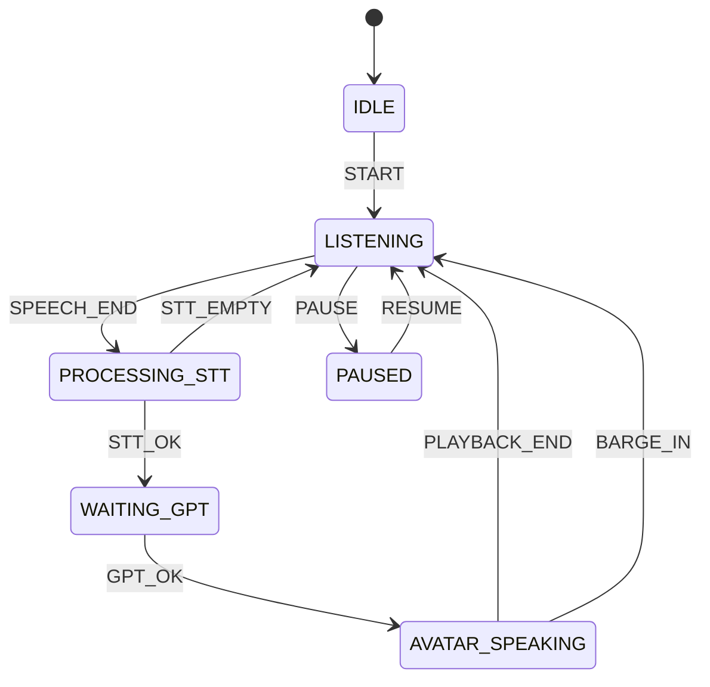

# Voice Interaction Hardening — Architecture Audit

**Date:** 2026-08-08  
**Branch:** `cursor/voice-interaction-hardening-audit-49e0`  
**Status:** AUDIT ONLY — no production behavior changed in this document  
**Priority defects:** (1) Arabic TTS pronunciation (2) premature avatar turn-taking

---

## 1. Current voice architecture

There are **two live client paths** plus one unused library stack:

| Path | When used | Turn detection | Barge-in |
|------|-----------|----------------|----------|
| **Classic `VoiceSession`** | Default (`interaction_mode != therapy_room` or TRM flag off) | Manual mic toggle (push-to-talk). Optional browser SpeechRecognition finals on STT fallback | Manual stop only |
| **Therapy Room hands-free (`TherapyRoomSession`)** | `NEXT_PUBLIC_THERAPY_ROOM_MODE=true` **and** session `interaction_mode = therapy_room` | Energy VAD, default **850 ms** silence after ≥400 ms speech | Therapist→avatar barge-in (≥280 ms speech @ RMS 0.02) |
| **`lib/realtime/*` gateway** | Not mounted in session UI | Library defaults (850 ms) | Unused by live clients |

Production currently has `NEXT_PUBLIC_THERAPY_ROOM_MODE=true` (Vercel). Classic VoiceSession remains the code default when sessions are not started in therapy-room mode.

### Runtime path (TRM — the interruption-sensitive path)

```
MICROPHONE (getUserMedia + echoCancellation/NS/AGC)
  → Web Audio ScriptProcessor RMS frames
  → energy VAD (startHandsFreeVad / evaluateVadFrame)
  → SPEECH_END when quiet ≥ silenceMs (700–1000, default 850)
  → FSM: LISTENING → PROCESSING_STT
  → WAV encode → POST /api/voice/transcribe (batch OpenAI STT — no interim)
  → FSM: WAITING_GPT
  → POST /api/sessions/:id/message (patient reply; clinical engines unchanged)
  → FSM: AVATAR_SPEAKING
  → Arabic: prepareArabicSpeech (ASPE) inside /api/voice/tts when locale=ar
  → ElevenLabs TTS (model + voice) → <audio> playback
  → PLAYBACK_END → LISTENING (mic auto-reopen)
       └─ parallel barge-in monitor may BARGE_IN → cancel TTS → LISTENING
```

### Runtime path (classic VoiceSession)

```
User toggles mic ON → startMicWavRecording (no VAD)
(+ optional WebSpeech interimOnly → draft UI only)
User toggles mic OFF → stop → STT → message → TTS → play
```

### Architecture diagram (TRM FSM)



---

## 2. Part A — Direct answers

| # | Question | Answer |
|---|----------|--------|
| 1 | What decides therapist finished speaking? | **TRM:** energy VAD silence after speech (`evaluateVadFrame` + `resolveSilenceMs`). **Classic:** user mic-off. |
| 2 | What VAD is used? | Custom **Web Audio RMS** VAD in `src/lib/therapy-room/vad.ts` (not WebRTC VAD / Silero). Classic path: none. |
| 3 | Silence / endpoint threshold? | Default **850 ms**; hard-clamped to **700–1000 ms**. Cannot wait 1.5–2 s with current clamp. |
| 4 | Endpoint basis? | **Silence energy only** (after min speech). Not STT finalization, not punctuation, not linguistic continuation. STT runs *after* endpoint. |
| 5 | Reply from interim transcript? | **No** on OpenAI path (batch STT). Browser fallback can auto-send on **final** Web Speech only. |
| 6 | LLM before STT finalized? | **No** in TRM — FSM requires `STT_OK` before `WAITING_GPT`. |
| 7 | TTS while mic detects therapist speech? | **TRM:** capture VAD not started during `AVATAR_SPEAKING`; separate barge-in monitor runs during playback. **Classic:** weak — mic can open while TTS plays. |
| 8 | Prior TTS continue after new therapist speech? | **TRM barge-in:** aborts + `stopPlayback` + generation bump (mitigated). Gaps remain (see races). |
| 9 | Pause 300 / 500 / 800 / 1000 / 1500 / 2000 ms? | With default 850 ms: **300/500 keep listening**; **≥850 ends turn** (if ≥400 ms speech already). **1500/2000 impossible** as silence wait — clamp max is 1000. |
| 10 | Race conditions? | Yes — see §4. |

### Key files / functions

| Concern | Location |
|---------|----------|
| Silence budgets | `src/lib/therapy-room/conversation-telemetry.ts` → `HANDS_FREE_PERF_BUDGETS` |
| VAD frame logic | `src/lib/therapy-room/vad.ts` → `evaluateVadFrame`, `startHandsFreeVad`, `resolveSilenceMs`, `startBargeInMonitor` |
| FSM | `src/lib/therapy-room/conversation-fsm.ts` → `createConversationFsm`, `transition` |
| TRM orchestration | `src/components/therapy-room/TherapyRoomSession.tsx` → `startListeningLoop`, `processTherapistAudio`, `speakPatient` |
| Patient interrupt therapist | `src/lib/therapy-room/interruption.ts` → `shouldPatientInterruptTherapist` |
| Classic UI | `src/components/VoiceSession.tsx` |
| Pipeline | `src/lib/voice/conversation-pipeline.ts` |
| TTS API + ASPE | `src/app/api/voice/tts/route.ts` → `prepareArabicSpeech` |
| ElevenLabs | `src/lib/voice/elevenlabs/service.ts` → `synthesize` |
| Voice defaults | `src/lib/voice/config.ts` → `DEFAULT_ELEVENLABS_VOICE_AR` |
| ASPE | `src/lib/arabic-speech/*` |

---

## 3. Root cause — premature avatar responses

**Primary root cause (TRM):** single-stage energy endpointing biased for **low latency**.

Evidence:

1. Endpoint = `quietForMs >= silenceMs` with default **850 ms** and **hard max 1000 ms** (`resolveSilenceMs`).
2. No Stage-2 confirmation (no “transcript still changing”, no sustained silence beyond 1 s, no linguistic incomplete-utterance guard).
3. Budgets comment explicitly targets “speechEndToSttStartMs: 200” — optimize for speed, not psychiatric pause tolerance.
4. Mid-sentence clinician pauses (think / breathe / “umm” / clause gap) of ~0.9–1.0 s will fire `SPEECH_END` → STT → GPT → TTS while the therapist intended to continue.

**Secondary contributors:**

- `minSpeechMs` only **400 ms** — short fragments can become turns.
- `WAITING_GPT` / `PROCESSING_STT` do not accept `BARGE_IN` — once endpoint fires, therapist cannot reclaim the turn until avatar speaks (then barge-in works).
- Classic path is largely safe from *silence* false endpoints, but browser SpeechRecognition `autoSend: true` fallback can still fire on finals without a two-stage gate.

**Not the clinical core.** This is entirely client VAD/FSM timing.

---

## 4. Race conditions / stale audio risks

1. **False endpoint → irrevocable STT/GPT** until avatar speaks (no cancel during PROCESSING_STT / WAITING_GPT from mic activity).
2. **Barge-in does not send `therapistInterrupted`** on the next message (API supports it; TRM client does not set it) — clinical interrupt signal gap (do not confuse with scoring changes; flag plumbing only if needed later).
3. **Full-buffer TTS** before play — abort after fetch may still waste work; generation id mitigates stale *playback*.
4. **Classic VoiceSession:** listen-while-speaking possible; TTS lacks AbortSignal (only `stopPlayback`).
5. **Repeat/soft-speak paths** in TRM that speak outside `AVATAR_SPEAKING` weaken barge-in coverage.
6. Echo / false barge-in still possible despite EC + higher barge threshold.

---

## 5. Root cause(s) — Arabic pronunciation

### Confirmed from code

| Finding | Evidence |
|---------|----------|
| Model | `ELEVENLABS_MODEL_ID` or default **`eleven_multilingual_v2`** |
| Default AR voice | **`pNInz6obpgDQGcFmaJgB` (“Adam”)** — documented as multilingual premade, **not** an Arabic-native / Levantine-trained voice |
| `language_code` | **Not sent** — synthesize body is `{ text, model_id, voice_settings }` only |
| ASPE | TTS-only in `/api/voice/tts`; transcripts untouched — architecture correct |
| Pronunciation dictionary API | **Not used** — ASPE does orthographic aliases only |
| Mixed AR/EN | Abbreviations expanded by ASPE; residual Latin tokens may still hit TTS raw |

### Likely bottleneck ranking (hypothesis for human A/B — not claimed proven)

1. **Highest probability: voice selection** — English-leaning multilingual premade for Jordanian clinical Arabic.
2. **High: missing `language_code: "ar"`** on ElevenLabs request.
3. **Medium: ASPE gaps / partial improvements** — helpful for numbers/abbrevs/terms; more tashkeel ≠ better; prior listening QA still **EVIDENCE PENDING**.
4. **Lower: model choice** — `eleven_multilingual_v2` supports Arabic; voice/accent usually dominate per ElevenLabs guidance.

**Do not build a 2k-line pronunciation engine before testing Arabic-trained voices + `language_code`.**

---

## 6. Recommended minimal changes (next PR — not this audit)

### A. Turn-taking (highest clinical UX priority)

1. **Raise and re-bias silence defaults** — e.g. allow 1200–1800 ms clinical default; remove or raise the 1000 ms hard clamp for clinical mode.
2. **Two-stage endpoint:** Stage-1 speech stops → Stage-2 confirm with sustained silence + “no new speech” before `SPEECH_END` commits STT.
3. **Cancel pending turn if therapist resumes during Stage-2 wait** (and ideally during STT/GPT with generation invalidation + AbortSignal).
4. Single **documented config module** for: `minSpeechMs`, `endpointSilenceMs`, `endpointConfirmMs`, `maxContinuationWaitMs`, `bargeInMinSpeechMs`, `sttFinalizeTimeoutMs`.
5. Keep therapist→avatar barge-in; strengthen cancel of queued/stale TTS via generation IDs (already partially present).
6. Deterministic FSM unit tests for the 12 turn-taking cases in the mission brief.

### B. Arabic TTS (minimal, ordered)

1. **A/B Arabic-native / Arabic-capable voices** vs current Adam — pick by Jordanian clinician ear, not theory.
2. Pass **`language_code: "ar"`** (or provider-equivalent) on synthesize when locale is `ar`.
3. Keep ASPE TTS-only; extend dictionary **only** for words that fail human QA; prefer ElevenLabs pronunciation dictionary where appropriate.
4. Do **not** flood tashkeel; do **not** rewrite clinical dialogue.

### C. Observability (no PHI)

Aggregate counters only: false endpoints, barge-ins, cancelled TTS, stale suppressions, ASPE apply count, dictionary hits, endpoint silence used.

---

## 7. Decision matrix for next work

| Question | Recommendation |
|----------|----------------|
| Change ElevenLabs voice/model? | **Yes — test first.** Voice change likely higher ROI than more ASPE. |
| Change ASPE? | **Only targeted** after voice/`language_code` A/B; keep TTS-only. |
| Turn-taking params (initial clinical bias) | Prefer wait-too-long: confirm silence **~1200–1600 ms** after speech; Stage-2 confirm; clamp max ≥ 2000 ms for clinical. Exact values to be set in config after measuring current 850 ms false-endpoint rate — do not guess blindly in production without a feature flag. |
| New PR vs attach to ASPE? | **New PR** (`voice-interaction-hardening`) — separate from ASPE orthography; reversible; does not touch clinical core. |
| Latency impact | Expect **+400–900 ms** to avatar response start vs current 850 ms endpoint if confirm silence rises — acceptable per product priority (naturalness > minimum latency). |

---

## 8. Test / human QA plan (after engineering PR)

**Automated:** FSM + VAD pure functions — short pause does not end; long pause ends; resume during confirm cancels; barge-in stops TTS; stale generation cannot play; AR/EN share state machine.

**Human — Turn-taking (≥20 interviews):** short/long pauses, hesitation, restarts, barge-in both directions.  
**FALSE AVATAR INTERRUPTION = FAIL.**

**Human — Arabic (≥50 phrases):** existing ASPE listening pack + voice A/B (current vs Arabic-trained ± `language_code`).  
**CLINICALLY UNNATURAL ARABIC = FAIL/MINOR.**  
No automatic PASS. Spoken GO only after human review.

---

## 9. Non-goals (reaffirmed)

No changes to clinical patient engine, cognition/NBE, scoring, assessment, session business logic, stored transcripts, clinical meaning, RLS/PHI, or LLM rewrite of speech at runtime.

---

## 10. Audit conclusion

| Defect | Root cause | Minimal fix locus |
|--------|------------|-------------------|
| Avatar interrupts therapist mid-thought | TRM single-stage 850 ms energy endpoint + 1000 ms clamp | `vad.ts`, `conversation-telemetry.ts`, `TherapyRoomSession.tsx`, FSM cancel during confirm/STT/GPT |
| Arabic pronunciation below bar | Likely wrong default voice + no `language_code`; ASPE secondary | `config.ts` / voice registry + `elevenlabs/service.ts`; then targeted ASPE/dictionary |

**This audit does not claim spoken success.** Audio remains human-review gated (`EVIDENCE PENDING` for ASPE listening pack).
