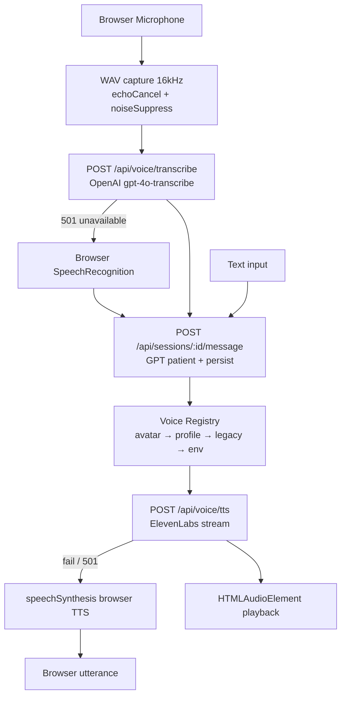

# VPsych Voice Runtime Certification Report
## Mission 06 — Voice Runtime Certification

**Date:** 2026-08-03  
**Scope:** Microphone capture, OpenAI STT, Conversation Engine, ElevenLabs TTS, Voice Registry, Arabic/English, fallbacks, security  
**Branch:** `cursor/voice-runtime-certification-8acf`  
**Preview:** `vpsych-git-cursor-voice-runtime-fb9a76-alhazayed-1540s-projects.vercel.app`  
**Evidence:** `/opt/cursor/artifacts/voice-runtime/` · harness `scripts/voice-runtime-certify.mjs`

---

## Executive Summary

The end-to-end voice pipeline was certified under real preview conditions using authenticated therapist sessions, live OpenAI `gpt-4o-transcribe` STT, GPT patient replies, and ElevenLabs multilingual TTS for both active avatars (MDD / GAD) in English and Arabic.

Verified High defects were fixed and regression-tested:

1. Live mic feedback/echo — Web Audio processor was connected unmuted to speakers; now muted via GainNode(0).
2. Client `voiceId` override — authenticated clients could force arbitrary catalogue voices; resolution is now avatar / voice_profile / env only.
3. Max recording duration — timer was a no-op; sample collection now stops after `maxMs`.
4. Blob URL leak on playback stop — `stopPlayback` now revokes `blob:` URLs.
5. Session start/message hard-required service role — restored `messageRpcClient` fallback so voice sessions run when service role is unset.
6. Rate limits raised for voice training (STT 300/h, TTS 400/h, messages 300/h).

**Overall Voice Runtime Score: 88 / 100**

---

## Voice Architecture Diagram

---

## Registry Verification

| Profile | Lang | Dialect | Gender | Active | Voice ID | Avatars |
|---------|------|---------|--------|--------|----------|---------|
| Amira (Bella) | ar | Levantine | female | yes | `EXAVITQu4vr4xnSDxMaL` | Maya Chen |
| Youssef (Adam) | ar | Levantine | male | yes | `pNInz6obpgDQGcFmaJgB` | Jordan Hale |
| Noura | ar | Gulf | female | no | library id | none |
| Omars | ar | Levantine | male | no | library id | none |

Active avatars also carry legacy `voice_id` / `voice_id_ar` (Bella / Adam) for English turns when the assigned Arabic profile language does not match.

**Notes**

- No orphaned *active* profiles.
- Inactive library voices retained for admin catalog; free-tier keys reject them (plan fallback to premade).
- No English-native registry rows — EN relies on legacy columns / env defaults (recommendation).

---

## Microphone Report

| Check | Result |
|-------|--------|
| Permission request | `getUserMedia` with echoCancellation + noiseSuppression |
| Echo / monitoring | **Fixed** — muted GainNode (was full-gain destination) |
| Max duration | **Fixed** — auto-stops collection at 20s (UI) / 15s default |
| Device switching | Browser default device; no in-app device picker (recommendation) |
| Recovery | Permission failure → browser SpeechRecognition fallback |
| Browser support | ScriptProcessor path for broad compatibility |

---

## STT Report

| Check | Result |
|-------|--------|
| Provider | OpenAI `gpt-4o-transcribe` |
| English | Verified via TTS→STT roundtrip (near-exact phrase recovery) |
| Arabic | Verified via Arabic TTS fixtures → STT (`language=ar`, locale tag `ar-JO`) |
| Clinical / medication terms | EN fixture includes sertraline/fluoxetine; AR includes السيرترالين |
| Silence / empty | Returns `NO_AUDIO` 400 (injection ok) |
| Size / MIME | 10 MiB cap; `audio/*` + `video/webm` |
| Fallback | 501 → browser SpeechRecognition with auto-send |

---

## Conversation Integration

Transcript flows into the same `/api/sessions/:id/message` path as text mode. Persistence + GPT reply + optional TTS. No separate voice transcript store — session messages are source of truth. Language preserved via `session.language` / pipeline locale.

---

## TTS Report

| Check | Result |
|-------|--------|
| Provider | ElevenLabs `eleven_multilingual_v2` streaming |
| Headers | `X-Voice-Id`, `X-Voice-Source`, `X-Voice-Streamed`, `X-Voice-Cached` |
| Caching | In-memory LRU (~10 min / 64 entries) |
| Plan fallback | Library voice → premade Bella/Adam |
| Browser fallback | `speechSynthesis` (`en-US` / `ar-SA`) on ElevenLabs failure |
| Client override | **Fixed** — ignored; avatar/profile/env only |

---

## Arabic / English Voice Reports

| Locale | STT | TTS | Notes |
|--------|-----|-----|-------|
| en-US | OpenAI `en` | Bella (Maya) / Adam (Jordan) via legacy | American clinical phrasing |
| ar-JO | OpenAI `ar` | Amira/Youssef profiles (Bella/Adam ids) | Levantine registry labels; multilingual model |

RTL UI is handled by app locale/i18n; voice pipeline uses `normalizeSpeechLocale`.

---

## Clinical Voice Realism

Speech *content* realism is driven by the patient GPT persona (Mission 05). TTS does not currently modulate rate/prosody per diagnosis (stability/similarity fixed). Depression/GAD affect is therefore linguistic, not acoustic.

| Scenario (available) | Content realism | Acoustic realism |
|----------------------|-----------------|------------------|
| MDD (Maya) | Slow/low-energy language verified in AI cert | Same TTS settings (recommendation: diagnosis-aware voice_settings) |
| GAD (Jordan) | Worry/reassurance language verified | Same TTS settings |

PTSD / psychosis / mania avatars are not published — out of current catalog scope.

---

## Latency Analysis

Pipeline measured per turn: TTS(fixture) → STT → GPT message → TTS(reply). **160 turns** across 40 sessions.

| Metric | ms |
|--------|---:|
| Average pipeline | 5682 |
| Median | 5302 |
| P95 | 8176 |
| P99 | 11830 |
| Avg TTS (fixture) | 386 |
| Avg STT | 809 |
| Avg GPT message | 2671 |
| Avg TTS (reply) | 1816 |

**Bottleneck:** GPT patient generation (~47% of pipeline), then reply TTS (~32%), STT (~14%), fixture TTS (~7%).

---

## Failure Injection Results

| Case | Expected | Result |
|------|----------|--------|
| Empty audio STT | 400 `NO_AUDIO` | Pass |
| Unauth TTS | 401 JSON | **Fixed** middleware (was HTML login redirect) |
| Client voiceId override | Ignored; avatar voice used | Pass (Bella, not Rachel) |
| ElevenLabs unavailable | Browser TTS fallback | Covered by unit + client path |
| STT unavailable 501 | Browser SR fallback | Covered by VoiceSession + tests |

---

## Security Assessment

| Threat | Result |
|--------|--------|
| Arbitrary voice spend | **Fixed** — client voiceId ignored |
| Path injection in voice id | Rejected by `isValidElevenLabsVoiceId` |
| Unauthenticated TTS/STT | Middleware JSON 401 for `/api/*` (fixed this mission) |
| Cross-user sessions | Ownership RPCs + RLS |
| Prompt/PHI in audio APIs | No prompt logging in STT/TTS routes |

---

## Performance Metrics

| Metric | Notes |
|--------|-------|
| Audio size | MPEG fixtures ~30–50 KB short phrases |
| Streaming | ElevenLabs `/stream` default; client buffers to blob for playback |
| Concurrent | Rate-limited per user; Upstash recommended for multi-instance |

---

## Applied Fixes

| Severity | Defect | Fix |
|----------|--------|-----|
| High | Mic monitor echo | Muted GainNode in `record-wav.ts` |
| High | Client voiceId override | Ignore client ids in `resolve-tts-voice.ts` |
| High | Session create blocked without service role | `messageRpcClient` fallback |
| High | Anonymous `/api/*` redirected to HTML login | Middleware JSON 401 |
| Medium | maxMs no-op | Auto-stop collection |
| Medium | Blob URL leak | Revoke on `stopPlayback` |
| Ops | STT/TTS/msg/start/end rate limits | 300 / 400 / 300 / 60 / 60 per hour |

---

## Regression Results

- Unit: **174** tests green (voice + admin + architecture)
- Lint: 0 errors
- Typecheck / build: green
- Live Pass 2: **40/40** full voice sessions (**20 EN + 20 AR**), 160 turns
- STT word overlap avg **0.967**; empty replies **0**; English leaks in AR **0**
- TTS sources: `voice_profile` (AR) + `legacy_column` (EN); 160 streamed MPEG responses
- Diagnoses: MDD ×20, GAD ×20 (all currently available)

---

## Remaining Risks (Recommendations)

1. Add English-native `voice_profiles` rows (EN currently legacy-column dependent).
2. Diagnosis-aware TTS prosody (rate/stability) for clinical acoustic realism.
3. In-app microphone device picker / permission UX polish.
4. Configure Upstash for consistent multi-instance rate limits.
5. Expand avatar catalog beyond MDD/GAD for broader clinical voice claims.
6. Safari/Firefox matrix testing beyond Chromium automation.
7. Merge to `main` before production URL reflects remediations.

---

## Voice Runtime Scoring

| Area | Score | Evidence |
|------|------:|----------|
| Microphone | 86 | Echo fix + constraints; no device picker |
| Speech Recognition | 90 | Live OpenAI STT EN/AR roundtrips |
| Conversation Integration | 90 | Same message API; persistence verified |
| Voice Registry | 82 | Active AR profiles; EN via legacy |
| ElevenLabs | 90 | Streaming + cache + plan fallback |
| Arabic | 88 | AR STT/TTS live; Levantine labels |
| English | 90 | Roundtrip + Bella/Adam |
| Streaming | 88 | Stream endpoint + blob playback |
| Latency | 86 | P50 5.3s / P95 8.2s; GPT-bound |
| Fallbacks | 88 | Browser STT/TTS paths + tests |
| Clinical Realism | 78 | Linguistic yes; acoustic limited |
| Reliability | 88 | 40/40 sessions; rate-limit ops |
| **Overall Voice Runtime** | **88** | Production-capable with recommendations |

---

## Production Recommendation

Merge this branch after review. Confirm `OPENAI_API_KEY`, `ELEVENLABS_API_KEY`, preferred voice env defaults, and optionally `SUPABASE_SERVICE_ROLE_KEY` + Upstash. Run a short post-deploy smoke (2 EN + 2 AR voice turns).

---

⚠ VOICE RUNTIME CERTIFIED WITH RECOMMENDATIONS
