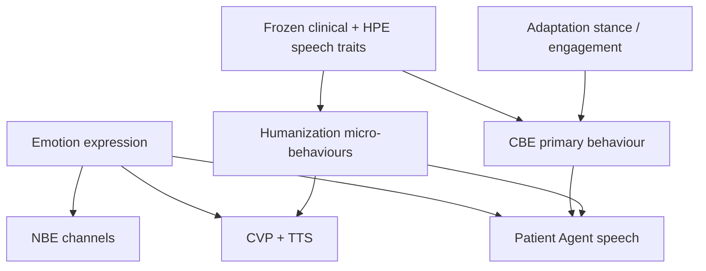
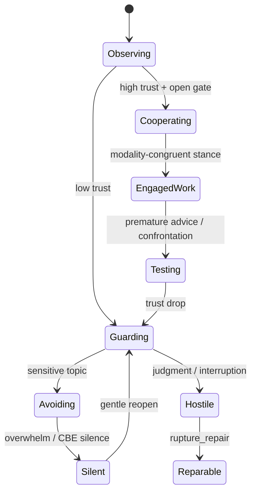
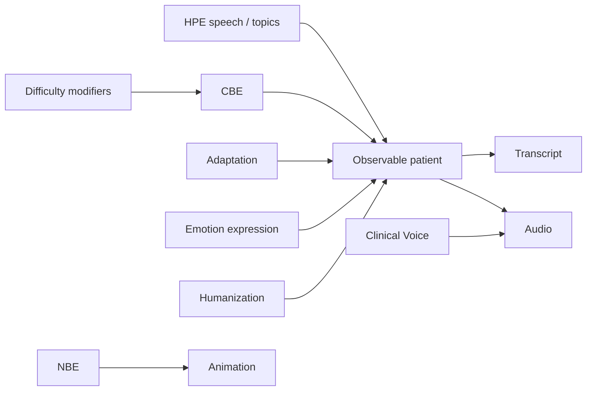

# Behavior Model

**Stage:** 5 · Document 03  
**Status:** Phase Complete · Needs Human Review  
**Rule:** Implementation evidence first; recommendations second. No code in this stage.

**Related engines:** [`../CONVERSATION_BEHAVIOUR_ENGINE.md`](../CONVERSATION_BEHAVIOUR_ENGINE.md) · [`../HUMANIZATION_ENGINE.md`](../HUMANIZATION_ENGINE.md) · [`../CLINICAL_VOICE_PROFILES.md`](../CLINICAL_VOICE_PROFILES.md) · NBE `src/lib/nbe/`

---

## 1. Purpose

Document how synthetic patients *act*: speech, body language, eye contact, silence, avoidance, hostility, cooperation, motivation, compliance, therapy engagement, and non-verbal behaviour.

---

## 2. Existing implementation (evidence)

### 2.1 Layer stack



**Precedence (Stage 4 OWN-03):** CBE disclosure gate / `cbe_direct` silence **outranks** Humanization micro-cues.

### 2.2 Evidence matrix

| Behaviour channel | Live owner | Persist | Notes |
|-------------------|------------|---------|-------|
| Speech style / vocabulary | HPE + Avatar speech | Snapshot / personalities | Module 2 / 2b |
| Speech phenotype (disorder) | Case speech-behavior cues | Snapshot fidelity | Module 1 |
| Clinical voice params | CVP | `voice_profiles` | rate, pitch, energy, prosody, hesitation |
| Silence / avoidance / lying / crying / anger / topic switch | CBE | Ephemeral | 12 kinds |
| Disclosure gate | CBE | Ephemeral | withhold\|deflect\|partial\|open |
| Micro-realism (hesitation, false start…) | Humanization | Ephemeral | 23 behaviour ids; clinical-gated |
| Eye contact, blink, head, breathing, sigh, smile, tear, restlessness, psychomotor, hand | NBE | Client timeline | Emotion-driven; TRM |
| Body language cue ids | Emotion expression | Runtime packet | `look_away`, `cross_arms`, `fidget`, … |
| Stance (opening…angry…) | Adaptation | case_memory | Alliance behaviour |
| Motivation (engage/change) | Emotion.motivation | case_memory | Affect |
| Therapy engagement / withdrawal | Adaptation.effects | case_memory | |
| Compliance / homework completion | **Missing structured** | Chart placeholder thin | Gap |
| Cooperation as typed construct | Proxy: engagement + disclosure | — | |

### 2.3 CBE behaviour kinds (live)

From `ConversationBehaviourKind`:

| Kind | Intent |
|------|--------|
| `avoidance` | Circle the hard part |
| `denial` | Soft-reject clinical framing |
| `minimization` | Underplay intensity |
| `guardedness` | Short answers; watch therapist |
| `lying` | Protective soft-lie — never invent hospitals/records/real people |
| `embarrassment` | Shame in speech |
| `crying` | Voice breaks / brief tearfulness |
| `anger` | Irritability when judged/rushed |
| `topic_switching` | Safer adjacent content |
| `silence` | Pause / ellipsis / optional `cbe_direct` |
| `therapist_interruption` | React to barge-in |
| `rapport_disclosure` | Disclosure follows earned rapport |

**Determinism:** `createRng(sessionId:cbe:turnIndex:…)`.  
**Flag:** `CBE_ENABLED` default on.

### 2.4 Humanization (live)

Micro-behaviours include thinking pauses, hesitation, false starts, fatigue markers, emotional colouring, etc. **Clinical gates** block humor/laughter under active risk (`RiskProfile`). Flag: `HUMANIZATION_ENABLED` default on.

### 2.5 NBE channels (live)

`eye_contact` · `blink` · `head_movement` · `breathing` · `sighing` · `smiling` · `tearfulness` · `restlessness` · `psychomotor_slowing` · `hand_gesture`

Phases: `idle` · `listening` · `thinking` · `speaking` · `interrupted` · `silent`  
Primarily Therapy Room Mode (flag-gated **off** by default in production architecture).

### 2.6 Hostility / cooperation / engagement (live proxies)

| Construct | Proxy today |
|-----------|-------------|
| Hostility | CBE `anger` + Emotion anger/mode + Adaptation anger effect |
| Cooperation | High Adaptation.engagement + disclosure `open` + Emotion engaged/warming |
| Avoidance | CBE avoidance / topic_switching / withhold |
| Motivation | Emotion.motivation + HPE treatment_expectations |
| Compliance | **Not modeled** as patient state |

---

## 3. Canonical behaviour model (future)

### 3.1 Channels

```
Verbal behaviour
  ├── content strategy (disclose / withhold / distort)
  ├── form (speech rate, hedges, length)
  └── interpersonal act (cooperate, test, withdraw)

Nonverbal behaviour
  ├── face / affect display
  ├── gaze / eye contact
  ├── posture / gesture
  └── psychomotor tone

Relational behaviour
  ├── engagement
  ├── hostility
  ├── compliance / homework
  └── therapy process moves
```

### 3.2 State machine (canonical overlay on live)



Live systems already approximate this via Adaptation stance + CBE + Emotion modes; the diagram is the **unified clinical reading**.

---

## 4. Interaction graph (engines → observable behaviour)



---

## 5. Gaps

| ID | Gap | Priority |
|----|-----|----------|
| CI-B01 | Compliance / homework adherence not typed | Medium (G-10) |
| CI-B02 | NBE not durable clinical profile; TRM off by default | Medium |
| CI-B03 | `therapistInterrupted` accepted by API but UI often never sends | Medium (OWN-05) |
| CI-B04 | Body language cue ids not unified catalog across Emotion / NBE / TRM | Low |
| CI-B05 | Cooperation / hostility not first-class metrics for realism | Medium |

---

## 6. Recommendations

1. Treat CBE as the **decision surface** for interpersonal acts; Humanization for micro-texture only.  
2. Add `therapy_engagement` and `homework_adherence` to Adaptation or Case therapy-process when implementing G-10.  
3. Publish a single nonverbal cue ID registry shared by Emotion expression, NBE, and TRM.  
4. Wire barge-in flag from Therapy Room client or remove dead input.  
5. Never announce behaviour labels in patient voice (existing CBE invariant).

---

## 7. Cross-references

- Decisions that select these behaviours: [`PATIENT_DECISION_ENGINE.md`](./PATIENT_DECISION_ENGINE.md)  
- Emotion → expression: [`EMOTION_MODEL.md`](./EMOTION_MODEL.md)  
- Therapy modality colouring: [`THERAPY_RESPONSE_MODEL.md`](./THERAPY_RESPONSE_MODEL.md)
