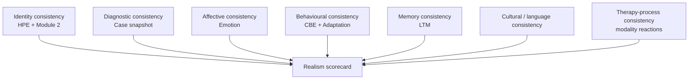
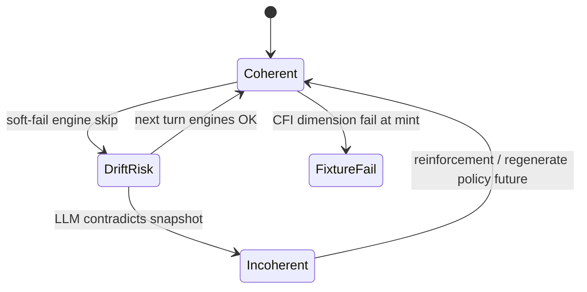

# Clinical Realism

**Stage:** 5 · Document 09  
**Status:** Phase Complete · Needs Human Review  
**Rule:** Measurable realism for **fictional** educational patients. Implementation evidence first.

**Evidence:** `src/lib/cfi/`, `avi/`, `eri/`, `vqi/`, `ale/`, `rrs/`, `scientific/`, Humanization clinical gates, Emotion determinism, CBE determinism, `FICTIONAL_PATIENT_CERTIFICATION.md`.

---

## 1. Purpose

Define measurable realism metrics so every synthetic patient remains **internally consistent** — identity, diagnosis, affect, behaviour, memory, and culture align.

Realism ≠ validated clinical outcome measurement. CFI/AVI/ERI are platform fidelity / research-readiness indices.

---

## 2. Existing implementation (evidence)

### 2.1 Index stack

| Index | Module | Role | Version class |
|-------|--------|------|---------------|
| **CFI** | `src/lib/cfi/` | Clinical Fidelity Index — case package fidelity | 1.0.0 |
| **AVI** | `src/lib/avi/` | Assessment Validity Index | 1.0.0 |
| **ERI** | `src/lib/eri/` | Educational Reliability Index | 1.0.0 |
| **ALE** | `src/lib/ale/` | Adaptive learning effectiveness | — |
| **RRS** | `src/lib/rrs/` | Research readiness | — |
| **VQI** | `src/lib/vqi/` | Aggregate quality | CFI 30% / ERI 25% / AVI 20% / ALE 15% / RRS 10% |

### 2.2 CFI dimensions (live) — patient-case realism spine

From `CfiDimensionId`:

| Dimension | Realism concern |
|-----------|-----------------|
| `dsm5_diagnostic_accuracy` | Coding fidelity |
| `icd11_consistency` | ICD-11 required consistency |
| `symptom_fidelity` | Symptoms match disorder domains |
| `severity_fidelity` | Severity matches intent |
| `timeline_consistency` | Onset/course plausible |
| `comorbidity_consistency` | Compatibility rules |
| `differential_consistency` | Differentials present |
| `mse_realism` | MSE cues (limited by authored-only MSE) |
| `medication_history` | Med history fidelity (thin runtime) |
| `risk_assessment` | RiskProfile completeness |
| `protective_factors` | **Known weak** — protectives often missing at runtime |
| `speech_realism` | Speech phenotype |
| `behavior_realism` | Behavioural cues |
| `emotional_realism` | Affect coherence |
| `cultural_realism` | Culture / help-seeking |
| `language_realism` | Locale language |
| `voice_realism` | Voice casting |
| `memory_consistency` | Memory scope / LTM |
| `disclosure_consistency` | Disclosure rules |
| `prompt_consistency` | Modules align with snapshot |

### 2.3 Runtime consistency mechanisms (not scored as CFI alone)

| Mechanism | Guarantee |
|-----------|-----------|
| Frozen `clinical_snapshot` | Diagnosis/symptoms immutable mid-session |
| HPE freeze | Traits don’t drift mid-session |
| Emotion expression deterministic | Same state → same packet |
| CBE seeded RNG | Same transcript context → same plan |
| `aiSource` propagation | Fallbacks never fake GPT |
| Humanization clinical gates | No joking under active risk |
| Fiction boundary | No real patient data |

### 2.4 AVI note (live)

AVI records `has_external_criterion: false` and uses synthetic repeat variance — **not** gold-standard clinician criterion validity.

---

## 3. Canonical realism metric framework

### 3.1 Consistency domains

### 3.2 Proposed measurable metrics (map to live + future)

| Metric ID | Definition | Live measure | Target |
|-----------|------------|--------------|--------|
| `RM-identity` | Same person across turns | HPE + name continuity | No trait contradiction in prompt |
| `RM-dx` | Speech matches disorder phenotype | CFI symptom/speech dims | No criterion recitation |
| `RM-affect` | Words match Emotion expression | expressionPromptBlock present | No invented opposite affect |
| `RM-disclose` | Hidden symptoms stay gated | disclosure_rules + CBE | SI not volunteered if hidden |
| `RM-memory` | Prior facts recalled when salient | LTM retrieval hits | No regenerated contradictory bio |
| `RM-culture` | Locale-native idioms | Module 2 / 3 | No machine translation |
| `RM-alliance` | Trust trajectory coherent | Adaptation traces | No unexplained full disclosure at trust 10 |
| `RM-modality` | Reacts to modality stance | reaction_rules | Thin today |
| `RM-safety` | Risk gates hold | Module 4 + Humanization | Humor blocked under risk |
| `RM-fiction` | Remains fictional SP | certification | No real PHI |

### 3.3 Internal consistency state machine

Today, soft-fail ★ engines can omit emotion/adaptation blocks without failing the session — a documented realism risk (Stage 3 hidden assumptions).

---

## 4. Evidence matrix — realism coverage

| Domain | Covered by | Gap |
|--------|------------|-----|
| Nosology | CFI DSM/ICD/symptom | Reserved disorders |
| MSE | CFI mse_realism | Authored-only MSE (G-02) |
| Protectives | CFI dimension | Often empty (G-01) |
| Emotion | Engine + emotional_realism | Dual trust OWN-02 |
| Behaviour | CBE + behavior_realism | TRM off; NBE ephemeral |
| Memory | LTM + memory_consistency | Adaptation carry unwired |
| Assessment validity | AVI | No external criterion |
| Educational reliability | ERI | Unvalidated scores |
| Aggregate | VQI | Scientific tables often empty |

---

## 5. Gaps

| ID | Gap | Priority |
|----|-----|----------|
| CI-R01 | Protective factors dimension under-specified at runtime | Critical |
| CI-R02 | Soft-fail engines → possible affect silence | Medium |
| CI-R03 | No turn-level realism auditor in production path | Medium |
| CI-R04 | AVI without external criterion | High (honesty) |
| CI-R05 | Measurement validity not certified | High |
| CI-R06 | Dual clinical models (persona vs snapshot) | Critical (G-18) |

---

## 6. Recommendations

1. Treat CFI at case mint as gate for curriculum packages.  
2. Add optional turn-level consistency checks: emotion word_choice vs reply (future).  
3. Close G-01/G-02 before claiming MSE/protective realism.  
4. Keep fictional patient certification separate from score validation.  
5. Never market VQI as clinical accuracy for real patients.

---

## 7. Cross-references

- Ontology: [`../clinical/PATIENT_ONTOLOGY.md`](../clinical/PATIENT_ONTOLOGY.md)  
- Fiction cert: [`../FICTIONAL_PATIENT_CERTIFICATION.md`](../FICTIONAL_PATIENT_CERTIFICATION.md)  
- Evolution consistency: [`PATIENT_EVOLUTION_MODEL.md`](./PATIENT_EVOLUTION_MODEL.md)
