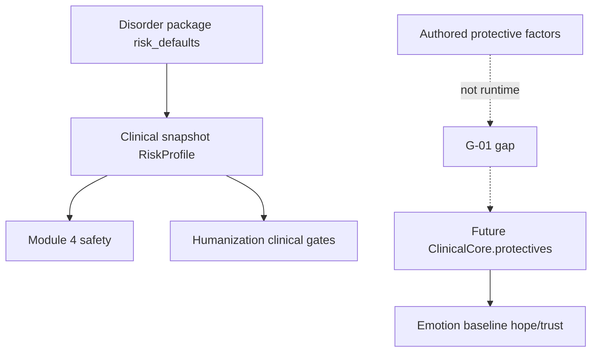

# DSM Mapping (Clinical Intelligence)

**Stage:** 5 · Document 06  
**Status:** Phase Complete · Needs Human Review  
**Rule:** Extends Stage 3 coding map with behavioural / cognitive / therapy intelligence. Does **not** replace [`../clinical/DSM_MAPPING.md`](../clinical/DSM_MAPPING.md).

**Evidence:** `src/lib/case-engine/catalog.ts`, `types.ts`, `validation.ts`, DB `disorders`, `src/lib/scientific/evidence.ts`, Emotion `baselines.ts`, persona case files.

---

## 1. Purpose

Map every **active** diagnosis package to: core symptoms, optional/elicited symptoms, severity, protective factors, risk factors, behaviour patterns, cognitive patterns, therapy challenges, typical progression — for educational synthetic patients only.

---

## 2. Catalog reality

| Set | Count | Notes |
|-----|------:|-------|
| DB / evidence-locked disorders | 17 | Includes reserved slots |
| Builtin packages with full `symptom_profile` | 11 | Offline TS catalog |
| Reserved IDs without packages | 6 | `pdd`, `social-anxiety`, `ocd`, `asd`, `schizoaffective`, `eating-disorders` |

Stage 3 [`../clinical/DSM_MAPPING.md`](../clinical/DSM_MAPPING.md) owns code tables. This file owns **clinical intelligence mapping**.

**Invariant:** Patient must not recite DSM criteria (Module 1). Codes are for trainee assessment (`dsm_reasoning`) and CFI.

---

## 3. Mapping schema (canonical)

For each disorder slug:

| Field | Source today | Status |
|-------|--------------|--------|
| Core symptoms | `salience: presenting` (+ key elicited) | Runtime |
| Optional / hidden symptoms | `elicited` / `hidden` | Runtime |
| Severity default | `severity_default` | Runtime |
| Risk factors (defaults) | `risk_defaults` | Runtime |
| Protective factors | Persona history / MSE | **Authored only** (G-01) |
| Behaviour patterns | speech cues + CBE biases + Emotion baselines | Partial |
| Cognitive patterns | cognition-domain symptoms + authored MSE | Partial |
| Therapy challenges | `common_therapist_mistakes`, `ideal_approach`, reaction rules | Partial |
| Typical progression | authored `session_arc` / teaching | Authored only |

---

## 4. Builtin package maps (evidence-based)

### 4.1 `mdd-recurrent-moderate` — MDD recurrent moderate

| Axis | Content |
|------|---------|
| DSM-5 / ICD-11 | `296.32` / `6A71.1` |
| Severity | moderate |
| Core symptoms | low_mood, anhedonia |
| Optional / elicited | sleep_disturbance, concentration |
| Hidden | passive_si |
| Risk defaults | SI passive; self_harm false |
| Protective (runtime) | **Missing** — authored persona only |
| Cognitive patterns | Impaired concentration / indecisiveness (symptom); rumination often authored |
| Behaviour patterns | Psychomotor / fatigue via Emotion + Humanization; reduced openness when depressed baseline |
| Therapy challenges | Premature behavioural activation before grief heard; safety exploration without interrogation |
| Ideal approach | Warm CBT/IPT-informed |
| Typical progression | Authored session_arc in personas — not enforced |
| Emotion prior | MDD/default baseline family |

### 4.2 `gad-with-panic`

| Axis | Content |
|------|---------|
| Codes | `300.02` / `6B00` |
| Core | excessive_worry |
| Optional | restlessness, sleep_onset |
| Hidden | panic_spikes |
| Risk | SI none |
| Cognitive | Multi-domain worry; hard to control (teaching) |
| Behaviour | Safety behaviours; reassurance-seeking (therapist mistake if looping) |
| Therapy | Avoid premature exposure; CBT for GAD |
| Emotion | Anxiety family baseline |

### 4.3 `ptsd`

| Axis | Content |
|------|---------|
| Codes | `309.81` / `6B40` |
| Core/key | intrusions, avoidance, hyperarousal, negative_mood_cognition, numbing |
| Risk | SI passive |
| Cognitive | Trauma-linked negative cognitions (symptom domain trauma/mood) |
| Behaviour | Avoidance of trauma talk until safety; CBE sensitive topic `trauma` |
| Therapy | No flooding; titration; trauma-informed supportive/CBT hybrid |

### 4.4 `adult-adhd` (inattentive)

| Axis | Content |
|------|---------|
| Codes | `314.00` / `6A05.0` |
| Core | inattention, forgetfulness, working_memory, restlessness_inner |
| Cognitive | Attention / WM as **symptoms**, not neuropsych model |
| Behaviour | Tangential detail; structure helps |
| Therapy | Avoid moralising; concrete examples |

### 4.5 `alcohol-use-disorder`

| Axis | Content |
|------|---------|
| Codes | `305.00` / `6C40.1` |
| Severity default | mild |
| Core | alcohol_use, role_interference, tolerance_withdrawal_hints |
| Risk flag | substance_use may be set by package/risk |
| Cognitive | Ambivalence; minimization / denial (CBE bias for substance topics) |
| Therapy | MI; curiosity over confrontation |
| Gap | No amount/frequency/route model (G-04) |

### 4.6 `panic-disorder`

| Axis | Content |
|------|---------|
| Codes | `300.01` / `6B01` |
| Core | panic_attacks, fear_of_recurrence, avoidance |
| Therapy | CBT + interoceptive exposure readiness |
| Behaviour | Avoidance; catastrophic misinterpretation often authored |

### 4.7 `bpd`

| Axis | Content |
|------|---------|
| Codes | `301.83` / ICD-11 personality codes |
| Core | affective_instability, abandonment_sensitivity, identity_disturbance, unstable_relationships, impulsivity_self_harm_risk |
| Risk | SI passive; self-harm risk in symptoms |
| Cognitive | Black-white / identity instability (authored + symptoms) |
| Behaviour | Testing, anger, rupture sensitivity (Adaptation + Emotion BPD priors) |
| Therapy | Validation **before** change; DBT-informed |

### 4.8 `complex-ptsd`

| Axis | Content |
|------|---------|
| DSM-5 | **null** (`dsm5_optional`) |
| ICD-11 | `6B41` |
| Core | reexperiencing, avoidance, sense_of_threat, affect_dysregulation, negative_self |
| Therapy | Titrate; validate chronic interpersonal threat |
| Note | ICD-11-only construct — dual-coding assessment must not force DSM code |

### 4.9 `schizophrenia`

| Axis | Content |
|------|---------|
| Codes | `295.90` / `6A20` |
| Core | hallucinations, negative_symptoms, functional_decline (+ package delusions content as authored/symptoms) |
| Cognitive / perception | Authored MSE rich; runtime mostly symptom text (G-11) |
| Therapy | Supportive; curious reality-testing; short clear questions |
| Emotion | Schizophrenia baseline family |

### 4.10 `bipolar-mania`

| Axis | Content |
|------|---------|
| Codes | `296.44` / `6A60.2` |
| Severity | severe |
| Core | elevated_mood, increased_energy, pressured_speech, flight_of_ideas, grandiosity, impulsivity |
| Behaviour | Pressured speech phenotype; do not mirror pace |
| Therapy | Containment; sleep/safety first |
| Emotion | Mania / bipolar baseline |

### 4.11 `delirium`

| Axis | Content |
|------|---------|
| Codes | `293.0` / `6D70` |
| Severity | severe |
| Core | fluctuating_attention, perceptual_disturbance, sleep_wake_disruption |
| Therapy | Medical simulation only when template allows |
| Note | Distinct from primary psychiatric packages |

---

## 5. Reserved disorders (no package map yet)

| Slug / id key | DSM/ICD in DB | Intelligence map |
|---------------|---------------|------------------|
| pdd | Yes | **Missing package** |
| social-anxiety | Yes | Missing |
| ocd | Yes | Missing (Emotion has OCD baseline regex without full package) |
| asd | Yes | Missing |
| schizoaffective | Yes | Missing |
| eating-disorders | Yes | Missing (Emotion eating baseline regex) |

Do **not** invent symptom maps here beyond “reserved — no builtin package.”

---

## 6. Protective & risk factors (cross-cutting)

| Factor class | Runtime? |
|--------------|----------|
| Suicidal ideation levels | Yes |
| Self-harm / harm-to-others / substance booleans | Yes |
| Escalation rules text | Yes |
| Self-neglect / dependents | Authored only |
| Protective factors list | Authored only |
| Static vs dynamic risk formulation | Authored MSE only |

---

## 7. Typical progression (canonical, not enforced)

Educational default (when curriculum pins one disorder):

| Phase | Sessions (illustrative) | Clinical intelligence focus |
|-------|-------------------------|----------------------------|
| Engagement | 1–3 | Trust, disclosure gates, risk mapping |
| Assessment deepening | 4–8 | Hidden symptoms emerge with rapport |
| Active work | 9–20 | Modality-congruent responses; homework |
| Consolidation | 21–40 | Insight↑ adherence variable |
| Maintenance / relapse drill | 40+ | Evolution model scenarios |

See [`PATIENT_EVOLUTION_MODEL.md`](./PATIENT_EVOLUTION_MODEL.md). Live runtime does **not** advance severity automatically.

---

## 8. Gaps

| ID | Gap | Priority |
|----|-----|----------|
| CI-D01 | 6 reserved disorders lack packages | High (G-16) |
| CI-D02 | Protective factors not on ClinicalCore | Critical (G-01) |
| CI-D03 | Cognitive/behaviour maps are partial proxies | High |
| CI-D04 | Progression not a state machine | Medium |
| CI-D05 | Specifiers / Z-codes authored only | Medium |
| CI-D06 | Dual model: persona DSM trees ≠ Module 1 | Critical (G-18) |

---

## 9. Recommendations

1. Every new disorder ships: codes + symptom_profile + risk_defaults + differentials + disclosure_rules + emotion baseline + therapy challenges.  
2. Promote protectives onto packages (R-C1).  
3. Add `behaviour_pattern_tags[]` and `cognitive_pattern_tags[]` as additive package fields for Decision Engine bias — still patient-language in prompts.  
4. Keep Stage 3 DSM_MAPPING as code authority; update both when codes change.

---

## 10. Cross-references

- Stage 3 codes: [`../clinical/DSM_MAPPING.md`](../clinical/DSM_MAPPING.md) · [`../clinical/ICD_MAPPING.md`](../clinical/ICD_MAPPING.md)  
- Cognition: [`PATIENT_COGNITIVE_MODEL.md`](./PATIENT_COGNITIVE_MODEL.md)  
- Therapy: [`THERAPY_RESPONSE_MODEL.md`](./THERAPY_RESPONSE_MODEL.md)
