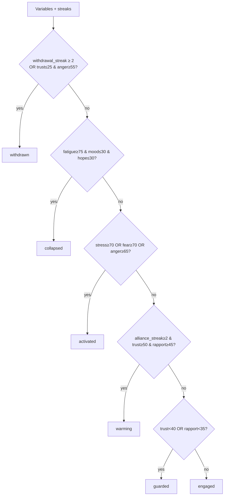
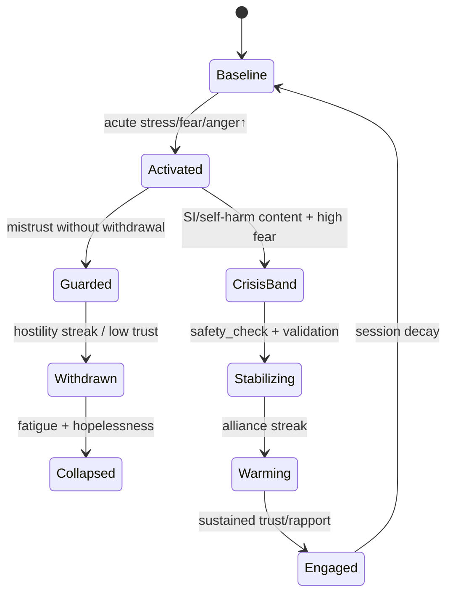

# Emotion Model

**Stage:** 5 · Document 02  
**Status:** Phase Complete · Needs Human Review  
**Rule:** Implementation evidence first; recommendations second. No code in this stage.  
**Engine doc:** [`../EMOTION_ENGINE.md`](../EMOTION_ENGINE.md)  
**Therapy state:** [`../clinical/THERAPY_STATE_MODEL.md`](../clinical/THERAPY_STATE_MODEL.md)

---

## 1. Purpose

Canonical model of synthetic-patient affect: baseline mood, state variables, persistence, decay, triggers, protective/vulnerability factors, stress accumulation, crisis escalation, and recovery trajectory.

---

## 2. Existing implementation (evidence)

### 2.1 Module layout

`src/lib/emotion/` — `types.ts`, `baselines.ts`, `interventions.ts`, `classify.ts`, `state-machine.ts`, `expression.ts`, `store.ts`, `engine.ts`, `index.ts`.

**Version:** `EMOTION_ENGINE_VERSION = "1.0.0"`.

**Persistence:** `case_memory.memory.emotion` (sidecar; soft-fail).  
**Wiring:** `POST /api/sessions/[id]/message` (best-effort before reply) + `GET/POST …/emotion`.

### 2.2 Variables (0–100) — live

| Variable | Role (from `EmotionalVariables`) |
|----------|----------------------------------|
| `baseline_mood` | Slow temperament prior from disorder; **immutable per tick** |
| `current_mood` | Moment-to-moment; decays toward baseline |
| `stress` | Acute load |
| `fear` | Threat / anxiety activation |
| `anger` | Irritability / hostility |
| `hope` | Forward-looking affect |
| `trust` | Sticky; gates positive intervention gains |
| `rapport` | Sticky alliance warmth |
| `fatigue` | Session drain + disorder prior |
| `motivation` | Readiness to engage / change |

### 2.3 Modes — live

`engaged` · `guarded` · `withdrawn` · `activated` · `collapsed` · `warming`

Selection (`selectMode`):



### 2.4 Interventions → deltas — live

`TherapistIntervention`: `validation` · `empathy` · `reflection` · `open_question` · `closed_question` · `support` · `psychoeducation` · `confrontation` · `advice` · `hostility` · `invalidation` · `rupture_repair` · `safety_check` · `silence` · `other`

Examples (from `interventions.ts`):

| Intervention | Primary effects |
|--------------|-----------------|
| Validation | trust↑ anger↓ stress↓ hope↑ rapport↑ mood↑ |
| Empathy | hope↑ trust↑ fear↓ rapport↑ |
| Hostility | trust↓ rapport↓ anger↑ stress↑ hope↓ motivation↓ (hostile streak) |
| Advice (premature) | motivation↓ trust↓ |
| Confrontation | anger↑ stress↑ trust↓ (activation; trust cost) |
| Psychoeducation | hope↑ motivation↑ fear↓ (trust-gated) |
| Silence | mild stress / curiosity effects (classifier path) |
| Safety check | fear↓ trust↑ (when appropriate) |

**Trust gating:** when trust is low, positive gains to trust/rapport/hope/mood/motivation are attenuated; hostile deltas apply at full strength.

### 2.5 Decay & persistence — live

From `decayTowardBaseline`:

| Class | Behaviour |
|-------|-----------|
| Mood | Pull toward `baseline_mood` (slower when withdrawn) |
| Acute (stress/fear/anger) | Ease toward disorder-shaped targets |
| Sticky (trust/rapport/motivation) | `stickyPull = 0.02` toward mild priors |
| Hope | Slow pull toward baseline mood |
| Fatigue | Creep with elapsed session seconds |

**Persistence across turns:** yes within `case_instance`.  
**Across sessions:** new CaseInstance → new emotion init from disorder baseline (unless future carry is wired).

### 2.6 Expression layer — live

`deriveExpression` → facial_affect, voice params, hesitation_ms, word_choice[], body_language[], animation_hooks[], openness, summary. Deterministic: identical state → identical packet. LLM must express, not invent contradicting affect.

### 2.7 Disorder baselines — live

`baselines.ts` matches disorder slug regex families: mania, bipolar, schizophrenia, PTSD/trauma, panic/GAD/anxiety, OCD, BPD, delirium, eating, MDD/default — each with inertia priors.

### 2.8 Protective / vulnerability factors — live status

| Factor type | In Emotion Engine? | Elsewhere |
|-------------|--------------------|-----------|
| Vulnerability (disorder inertia / baseline) | Yes (baselines + inertia) | Case risk defaults |
| Protective factors (structured list) | **No** | Authored persona history only (Stage 3 G-01) |
| Crisis resources | No (Emotion) | SafetyModule Module 4 |

---

## 3. Trigger system (live + canonical)

### 3.1 Live triggers

```
Therapist message
  → classifyTherapistIntervention (heuristic) OR explicit intervention label
  → secondary interventions optional
  → trustGatedDeltas + disorder inertia
  → decay + fatigue + streaks → mode → expression
```

### 3.2 Canonical trigger taxonomy (future — extend, don’t replace)

| Trigger class | Examples | Maps today to |
|---------------|----------|---------------|
| Alliance-building | validation, empathy, reflection | Live interventions |
| Alliance-rupturing | hostility, invalidation | Live |
| Activating | confrontation, premature advice | Live |
| Safety | safety_check | Live |
| Content | trauma probe, shame topics | Partially via CBE sensitive topics |
| Environmental | sleep loss, conflict | RandomizedContext (not Emotion) |
| Internal | rumination, fatigue | Fatigue creep only |

---

## 4. Stress accumulation & crisis escalation

### 4.1 Live

- Stress rises under hostility / confrontation / invalidation.  
- Mode `activated` when stress/fear/anger thresholds met.  
- Mode `withdrawn` / `collapsed` under sustained rupture or exhaustion.  
- **No** separate crisis state machine in Emotion Engine.  
- Risk disclosure & crisis *resources* owned by Case Safety Module (Module 4), not Emotion.

### 4.2 Canonical escalation ladder (design)



**CrisisBand** is educational SP behaviour — still fictional; Module 4 boundaries remain hard. Implementation of CrisisBand as a typed mode is **future** (today: RiskProfile + safety Module + Humanization clinical gates).

---

## 5. Recovery trajectory

| Horizon | Live behaviour | Gap |
|---------|----------------|-----|
| Within turn | Decay after intervention | — |
| Within session | Alliance streak → warming; hostility → withdrawal | — |
| Across sessions | Emotion re-inits per case | No recovery-stage enum; Adaptation carry not production-wired |

Canonical recovery should bind to [`LONGITUDINAL_CHANGE_MODEL.md`](./LONGITUDINAL_CHANGE_MODEL.md) and [`PATIENT_EVOLUTION_MODEL.md`](./PATIENT_EVOLUTION_MODEL.md).

---

## 6. Ownership conflict (documented, not fixed)

Emotion tracks `trust` / `rapport` **and** Adaptation tracks alliance trust/rapport (Stage 3 G-17, Stage 4 OWN-02).

| Namespace | Meaning |
|-----------|---------|
| Emotion.trust / rapport | Affective felt-safety dimensions |
| Adaptation.trust / rapport | Behavioural alliance / disclosure readiness |

**Rule for Stage 5:** keep split; Decision Engine reads both; do not silent-merge.

---

## 7. Gaps

| ID | Gap | Priority |
|----|-----|----------|
| CI-E01 | No discrete emotion categories beyond dimensional + facial_affect | Low |
| CI-E02 | No appraisal / cognition→emotion path | Medium |
| CI-E03 | Protective factors not emotion inputs | Critical (with G-01) |
| CI-E04 | No typed crisis mode | High |
| CI-E05 | Cross-session emotion carry absent | Medium |
| CI-E06 | Dual trust/rapport with Adaptation | Medium (contract tests) |

---

## 8. Recommendations

1. Keep Emotion Engine as the **affect spine**; do not replace with LLM-invented mood.  
2. Add contract tests: Emotion affect vs Adaptation alliance (R-M6).  
3. Feed structured protective factors into baseline hope/trust priors once ClinicalCore gains them.  
4. Optional `crisis_band` mode only after RiskProfile extensions; never bypass Module 4.  
5. Expression remains deterministic — no RNG.

---

## 9. Cross-references

- Behaviour expression: [`BEHAVIOR_MODEL.md`](./BEHAVIOR_MODEL.md)  
- Intervention response: [`THERAPY_RESPONSE_MODEL.md`](./THERAPY_RESPONSE_MODEL.md)  
- Decisions when emotional: [`PATIENT_DECISION_ENGINE.md`](./PATIENT_DECISION_ENGINE.md)
