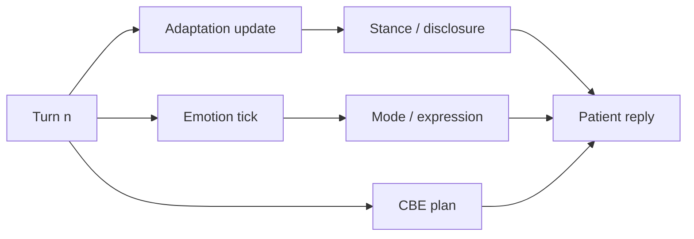
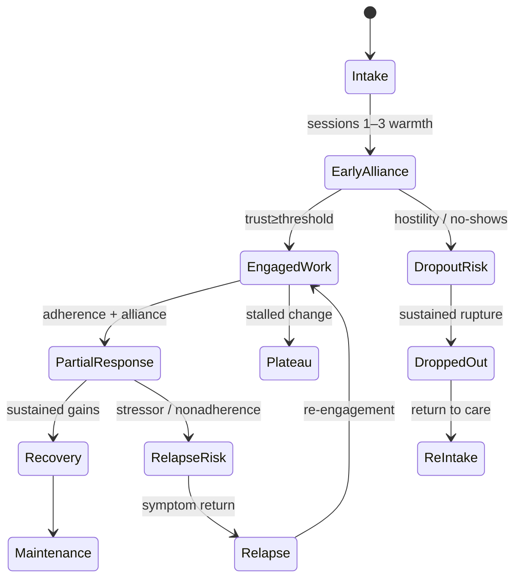

# Longitudinal Change Model

**Stage:** 5 · Document 05  
**Status:** Phase Complete · Needs Human Review  
**Rule:** Implementation evidence first; recommendations second. No code in this stage.

**Related:** [`../clinical/PATIENT_LIFECYCLE.md`](../clinical/PATIENT_LIFECYCLE.md) · [`../LONG_TERM_PATIENT_MEMORY.md`](../LONG_TERM_PATIENT_MEMORY.md) · [`../PATIENT_ADAPTATION_ENGINE.md`](../PATIENT_ADAPTATION_ENGINE.md) · [`PATIENT_EVOLUTION_MODEL.md`](./PATIENT_EVOLUTION_MODEL.md)

---

## 1. Purpose

Model session-to-session change for fictional patients: trust, rapport, adherence, symptom improvement/worsening, dropout, relapse, recovery, insight evolution.

---

## 2. Existing implementation (evidence)

### 2.1 What persists across sessions today

| Construct | Persist | Scope | Cross-session? |
|-----------|---------|-------|----------------|
| LTM facts + session summaries | `patient_long_term_memory` | therapist × avatar dyad | **Yes** — wired on message + end |
| Human personality traits | avatar + freeze each mint | avatar | Stable identity; re-frozen each case |
| Emotion state | `case_memory.memory.emotion` | case_instance | **No** — new case resets |
| Adaptation (rapport/trust/stance/arc) | `case_memory.memory.patient_adaptation` | case_instance | Designed carry via `beginNextSession` / `carryTrustToNextSession` — **not called from session create in production** |
| Diagnosis / symptoms / risk | `clinical_snapshot` | session / case | **New mint each session** (by design) |
| Authored `session_arc` | persona JSON | library | **Not enforced** at runtime |
| Trainee competencies | ACE / CGE tables | learner | Yes — **not patient** |
| Session reports | `session_reports` | session | Admin trainee scores |

**Evidence:** `src/lib/patient-memory/`, `src/lib/adaptation/` (`TreatmentArc`, `beginNextSession`), `docs/clinical/PATIENT_LIFECYCLE.md`, adaptation tests vs message route wiring gap.

### 2.2 Within-session change (live)

Trust/rapport can rise or fall within a session; disclosure readiness tracks Adaptation.

### 2.3 Longitudinal LTM categories (live)

`previous_session` · `therapist_mistake` · `promise` · `medication` · `relationship` · `life_event` · `trauma` · `children` · `occupation` · `future_plan` · `other`

LTM creates **continuity of autobiography**, not clinical recovery scores.

### 2.4 Explicit non-goals of current architecture

- A persona **never permanently owns** a disorder — each session may mint a different CaseInstance diagnosis.  
- Longitudinal “same patient, same illness trajectory” is therefore **partial**: identity + LTM continue; clinical package may intentionally change for training variety.

---

## 3. Canonical longitudinal constructs

| Construct | Definition | Live proxy | Canonical owner (future) |
|-----------|------------|------------|--------------------------|
| Trust (alliance) | Safety to rely / disclose | Adaptation.trust (+ Emotion.trust) | Adaptation (alliance); Emotion (affect) |
| Rapport | Felt connection | Adaptation.rapport | Adaptation |
| Treatment adherence | Meds / homework / attendance | **Missing** | Adaptation or therapy-process |
| Symptom improvement | Severity / salience drift | **Missing** (frozen snapshot) | Case Engine longitudinal overlay *or* curriculum-fixed packages |
| Symptom worsening | Escalation | RiskProfile static at mint | Same |
| Dropout risk | Likelihood of leaving care | **Missing** | Adaptation treatment_arc + Emotion hope/trust |
| Relapse | Return of syndrome after gain | **Missing** | Evolution model |
| Recovery | Sustained improvement stage | Authored session_arc only | Recovery stage enum (G-09) |
| Insight evolution | Awareness of illness/impact | DifficultyModifiers.insight frozen | Mutable insight band on Adaptation or Case overlay |

---

## 4. State machine (canonical treatment arc)

**Today:** Adaptation `TreatmentArc` accumulates warmth/empathy/judgment/interruptions and `sessions_completed` **in memory shape**, but cross-session carry is not production-wired; recovery stages are not enums.

---

## 5. Session-to-session change matrix

| Variable | Session N → N+1 today | Desired (canonical) |
|----------|----------------------|---------------------|
| Name / traits | Continuity via avatar + HPE | Same |
| LTM | Retrieve prior facts | Same + richer clinical facts |
| Trust/rapport | Reset with new case_memory | Carry Adaptation with decay |
| Emotion baseline | Re-seed from disorder | Optionally shift baseline with recovery stage |
| Symptoms | New package (may differ) | Curriculum chooses fixed vs progressive package |
| Insight | Frozen difficulty | Drift with alliance + psychoeducation |
| Adherence | n/a | Track homework/meds |
| Dropout | n/a | Risk score from arc |

---

## 6. Gaps

| ID | Gap | Priority |
|----|-----|----------|
| CI-L01 | `beginNextSession` not wired to `POST /api/sessions` | Critical for treatment arcs |
| CI-L02 | No recovery stage / session_arc enforcement | High (G-09) |
| CI-L03 | No adherence model | Medium (G-10) |
| CI-L04 | No symptom trajectory objects (PHQ/GAD educational) | Medium (G-12) |
| CI-L05 | Diagnosis may change every session — conflicts with “same illness” curricula unless presets pin disorder | Medium (document + preset) |
| CI-L06 | Dropout / relapse not modeled | Medium |

---

## 7. Recommendations

1. Wire Adaptation carry on session create when `longitudinal_group_id` / same therapist–avatar continuum is intended.  
2. Add instructor preset flag: `pin_disorder` + `progressive_severity` for multi-session courses.  
3. Promote authored `session_arc` to optional runtime expectations for ACE curricula (not patient LLM confession).  
4. Keep LTM as autobiography; do not store trainee scores in patient memory.  
5. Never claim validated outcome measurement for SP symptom scales.

---

## 8. Cross-references

- Multi-horizon arcs: [`PATIENT_EVOLUTION_MODEL.md`](./PATIENT_EVOLUTION_MODEL.md)  
- Emotion within session: [`EMOTION_MODEL.md`](./EMOTION_MODEL.md)  
- Lifecycle: [`../clinical/PATIENT_LIFECYCLE.md`](../clinical/PATIENT_LIFECYCLE.md)
