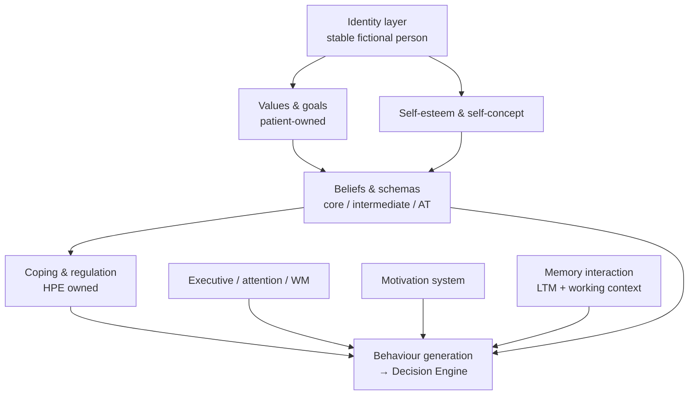

# Patient Cognitive Model

**Stage:** 5 · Document 01  
**Status:** Phase Complete · Needs Human Review  
**Rule:** Implementation evidence first; canonical design second. No code in this stage.  
**Ontology:** [`../clinical/PATIENT_ONTOLOGY.md`](../clinical/PATIENT_ONTOLOGY.md)  
**Runtime:** [`../runtime/COGNITIVE_ARCHITECTURE.md`](../runtime/COGNITIVE_ARCHITECTURE.md)

---

## 1. Purpose

Define how a synthetic patient *thinks* as a consistent fictional person: beliefs, goals, values, identity, self-esteem, coping, schemas, automatic thoughts, executive function, attention, motivation, memory interaction, and behaviour generation.

**Not this document:** Emotion dynamics (→ [`EMOTION_MODEL.md`](./EMOTION_MODEL.md)), turn decisions (→ [`PATIENT_DECISION_ENGINE.md`](./PATIENT_DECISION_ENGINE.md)), trainee scoring (→ [`THERAPIST_SCORING_FRAMEWORK.md`](./THERAPIST_SCORING_FRAMEWORK.md)).

---

## 2. Existing implementation (evidence)

### 2.1 Evidence matrix

| Concept | Runtime typed? | Prompted? | Persist? | Owner / path |
|---------|----------------|-----------|----------|--------------|
| Identity (name, city, occupation…) | Yes | Module 2 | `avatars.personalities` | Avatar Personality |
| Demographics (age, gender) | Yes | Module 1 | `clinical_snapshot` | ClinicalCore |
| Culture / idioms | Yes | Module 2 | personalities | CulturalContext |
| Temperament | Yes | Module 2b | HPE freeze | Personality Engine |
| Attachment style | Yes (enum) | Module 2b | HPE | Personality Engine |
| Big Five + resilience | Yes (1–5) | Module 2b | HPE | Personality Engine |
| Coping style | Yes (enum) | Module 2b | HPE | Personality Engine |
| Emotional regulation style | Yes (enum) | Module 2b | HPE | Personality Engine |
| Trust level (trait) | Yes (1–5) | Module 2b | HPE | Personality Engine |
| Preferred / avoidant topics | Yes | Module 2b | HPE | Personality Engine |
| Treatment expectations | Yes (string) | Module 2b | HPE | Personality Engine |
| Therapist-memory *policy* | Yes | Module 2b | HPE | Personality Engine |
| Cognitive *symptoms* (e.g. concentration, inattention) | Yes (symptom items) | Module 1 | snapshot | Case Engine packages |
| Motivation (affect) | Yes (0–100) | Expression block | `case_memory.emotion` | Emotion Engine |
| Fatigue | Yes (0–100) | Expression | emotion | Emotion Engine |
| Session goals | Yes (`string[]`) | Teaching / assessment | ClinicalCore | **Trainee** targets, not patient goals ontology |
| Authored beliefs / values prose | Authored only | Rarely / localization | persona JSON | Persona library |
| Core beliefs / schemas / AT objects | **No** | No | No | — |
| Self-esteem construct | **No** | No | No | — |
| Patient goals / values engine | **No** | Optional `values?` on persona identity module only | Thin | Case-engine types (not HPE) |
| Executive-function model | **No** (symptoms only) | Via symptom text | Snapshot symptoms | — |
| Attention model | **No** (ADHD symptom ids) | Via symptoms | Snapshot | — |
| Structured memory of *thoughts* | No | LTM facts only | `patient_long_term_memory` | Patient Memory |

**Evidence files:**  
`src/lib/personality-engine/types.ts`, `format-for-prompt.ts`, `src/lib/types.ts` (`ClinicalCore`, `SymptomProfileItem`), `src/lib/case-engine/catalog.ts`, `src/lib/emotion/types.ts`, `src/lib/patient-memory/types.ts`, `schemas/human-personality.v1.json`, `personas/*.case.json`, `docs/HUMAN_PERSONALITY_ENGINE.md`.

### 2.2 What the live “mind” actually uses

```
Frozen CaseInstanceSnapshot
  ├── ClinicalCore.symptom_profile[]     ← presenting cognition as symptoms
  ├── human_personality (HPE)            ← who thinks / how they cope
  └── difficulty_modifiers.insight       ← proxy for insight, not a belief object
        │
        ▼
Per turn: Emotion.motivation + Adaptation.disclosure + CBE plan + LTM hits
        │
        ▼
LLM speaks under prompt Modules 1–4 + 2b + reinforcement blocks
```

There is **no** separate cognitive case-formulation engine. Cognition is: (a) trait colouring, (b) symptom text, (c) authored persona MSE/prose (not snapshotted into Module 1), (d) LLM enactment under constraints.

### 2.3 Coping styles (live enum)

From `CopingStyle` in `personality-engine/types.ts`:

`problem_focused` · `emotion_focused` · `avoidant` · `support_seeking` · `intellectualizing` · `withdrawal` · `reassurance_seeking` · `somatic` · `mixed`

### 2.4 Attachment (live enum)

`secure` · `anxious_preoccupied` · `dismissive_avoidant` · `fearful_avoidant` · `disorganized`

---

## 3. Canonical cognitive model (future design)

This section is **normative for future implementation**. It must extend Stage 3 ontology IDs; it must not fork a second Patient type.

### 3.1 Layer diagram



### 3.2 Concept definitions (canonical)

| Concept ID | Definition | Proposed owner | Seed from today |
|------------|------------|----------------|-----------------|
| `ci.cognition.identity` | Who the person is (already Stage 3) | Avatar + HPE | Present |
| `ci.cognition.values[]` | Enduring valued directions | Case teaching + HPE culture | Persona `values?` / treatment_expectations |
| `ci.cognition.goals.patient[]` | What *they* want (≠ session_goals) | Case Engine package | Authored case_file hopes |
| `ci.cognition.self_esteem` | Global / domain self-worth 0–100 + narrative | New field on formulation object | Authored MSE / history |
| `ci.cognition.core_beliefs[]` | Stable absolute beliefs | Formulation artifact | Persona criterion prose |
| `ci.cognition.schemas[]` | Conditional if–then patterns | Formulation artifact | Authored therapy_behaviour |
| `ci.cognition.automatic_thoughts[]` | Situation-triggered thoughts | Turn-derived + seeded | Missing |
| `ci.cognition.coping` | Dominant coping | HPE (keep) | Present |
| `ci.cognition.executive` | Planning / inhibition / flexibility bands | MSE subset / ADHD package | Symptom ids only |
| `ci.cognition.attention` | Sustained / selective / divided | Same | Symptom ids only |
| `ci.cognition.motivation` | Trait readiness + state Motivation | HPE expectations + Emotion.motivation | Partial |
| `ci.cognition.memory_policy` | What may be recalled / distorted | HPE + LTM | Present policy; imperfect recall cues |

### 3.3 Behaviour generation (cognitive path)

```
Stimulus (therapist utterance + context)
  → activate schemas / ATs (future) OR symptom salience (today)
  → filter by disclosure rules + CBE gate (today)
  → colour by HPE coping / regulation (today)
  → modulate by Emotion + Adaptation (today)
  → generate speech/act via Patient Agent / cbe_direct (today)
```

Today steps 3–6 are real; step 2 is **authored symptom salience + LLM**, not a typed AT engine.

### 3.4 Memory interaction (cognitive)

| Memory kind | Live? | Cognitive role |
|-------------|-------|----------------|
| Case memory (emotion, adaptation) | Yes | Affective / alliance working state |
| LTM dyad facts | Yes | Autobiographical continuity |
| Imperfect recall cues | Yes (prompt) | Realistic forgetting / vagueness |
| Thought records / AT store | No | CBT-cognitive continuity across sessions |

---

## 4. Gaps (do not hide)

| ID | Gap | Priority | Links |
|----|-----|----------|-------|
| CI-C01 | No core belief / schema / AT types | Critical for CBT fidelity | Stage 3 G-06 |
| CI-C02 | `session_goals` are trainee goals, not patient goals | High | Ontology 2.10 |
| CI-C03 | Self-esteem absent | Medium | — |
| CI-C04 | Executive / attention only as symptoms | High for ADHD / delirium | G-11 / cognition |
| CI-C05 | Values not on HPE; optional persona field unused in Module 2b | Medium | — |
| CI-C06 | Authored beliefs in personas not snapshotted | Critical integrity | G-18 |
| CI-C07 | No cognition→emotion appraisal path | Medium | Emotion Model |

---

## 5. Recommendations (future implementation only)

1. Promote a **Patient Formulation Object** (5P / biopsychosocial + beliefs) onto the Case Engine teaching package; freeze onto snapshot for grading gold standards (Stage 3 R-H4).  
2. Keep **HPE** as sole owner of traits/coping/attachment — do not put Big Five on Case Engine.  
3. Add optional `automatic_thoughts_seed[]` on disorder packages for CBT scenarios — enacted via Decision Engine, never recited as DSM criteria.  
4. Distinguish `patient.goals` from `ClinicalCore.session_goals` in ontology before coding.  
5. Architecture tests must assert: personality independent of diagnosis (already) + formulation optional without breaking Module 1.

---

## 6. Cross-references

- Emotion state motivation: [`EMOTION_MODEL.md`](./EMOTION_MODEL.md)  
- Decisions under cognitive pressure: [`PATIENT_DECISION_ENGINE.md`](./PATIENT_DECISION_ENGINE.md)  
- DSM cognitive patterns: [`DSM_MAPPING.md`](./DSM_MAPPING.md)  
- Realism: [`CLINICAL_REALISM.md`](./CLINICAL_REALISM.md)
