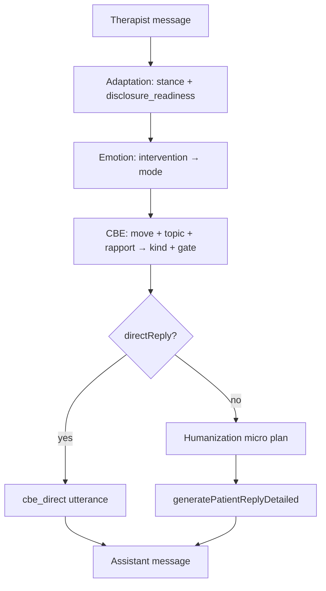
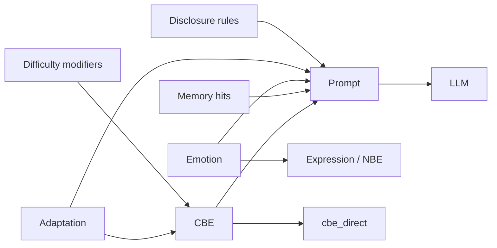

# Patient Decision Engine

**Stage:** 5 · Document 07  
**Status:** Phase Complete · Needs Human Review  
**Rule:** Implementation evidence first; recommendations second. No code in this stage.

**Runtime composition:** [`../runtime/ORCHESTRATION.md`](../runtime/ORCHESTRATION.md) · [`../runtime/RUNTIME_PIPELINE.md`](../runtime/RUNTIME_PIPELINE.md)

---

## 1. Purpose

Document how fictional patients decide: when they answer, refuse, avoid, become emotional, dissociate, change topic, lie, become defensive, or improve.

There is **no** standalone `lib/decision-engine` package today. Decisioning is a **composed** stack.

---

## 2. Existing implementation (evidence)

### 2.1 Composition order (message route)

From Stage 4 / lifecycle (live):

```
1. Adaptation process + persist ★
2. resolveAvatar (Modules 1–4 + 2b)
3. LTM retrieve + inject ★
4. Persist user message (hard)
5. Emotion process + persist ★
6. CBE plan ★
7. Humanization plan ★
8. Patient reply LLM  OR  cbe_direct stall
9. Persist assistant (RPC)
```

★ best-effort — never blocks reply hard path.

### 2.2 Decision surfaces (live)

| Decision | Primary owner | Inputs | Output |
|----------|---------------|--------|--------|
| How much to disclose | CBE DisclosureGate + Adaptation.disclosure_readiness + ClinicalCore.disclosure_rules | history, difficulty, topic | withhold\|deflect\|partial\|open |
| Whether to speak via LLM | CBE | silence / interruption | `directReply` optional |
| Interpersonal act | CBE primary kind | move, topic, rapport, RNG seed | avoidance, lying, anger… |
| Affective colouring | Emotion | intervention class | mode + expression |
| Alliance stance | Adaptation | warmth/judgment/… | PatientStance |
| Micro-texture | Humanization | risk gates | hesitation, false start… |
| Content constraints | Case snapshot + HPE topics + Module 4 | frozen clinical truth | prompt |
| “Improve” within session | Emotion warming + Adaptation engaging/disclosing | alliance streaks | stance/mode shift |

### 2.3 Disclosure rules (frozen clinical)

`condition`: `volunteered` · `on_direct_question` · `on_empathic_rapport` · `on_safety_assessment` · `never`

CBE gate is per-turn interpersonal; disclosure_rules are case truth about *what exists to reveal*.

### 2.4 When they… (evidence table)

| Behaviour | Live mechanism | Notes |
|-----------|----------------|-------|
| Answer openly | gate `open` + high rapport + Emotion openness | Still may be brief if HPE/guarded |
| Refuse / withhold | gate `withhold` / `deflect` | Not a hard API refusal — behavioural |
| Avoid | CBE `avoidance`, `topic_switching` | |
| Become emotional | Emotion mode activated/collapsed + CBE crying/anger + Humanization be_emotional | |
| Dissociate | **No typed dissociation decision** | May appear as authored symptom / silence / numbing text |
| Change topic | CBE `topic_switching` | |
| Lie | CBE `lying` — protective; forbids inventing clinical infrastructure | |
| Become defensive | CBE denial/minimization/anger + Adaptation angry/guarded | |
| Improve (session) | warming / engaging / disclosing stances | Not symptom cure |
| Improve (longitudinal) | LTM continuity only; Adaptation carry unwired | See Longitudinal model |

### 2.5 Decision tree (as implemented)



---

## 3. Canonical Decision Engine (future design)

### 3.1 Single logical engine, multiple physical owners

Stage 5 defines a **logical** Decision Engine. Physical ownership remains Stage 4 (no peer engine calls). A future `lib/session-turn` may expose `decidePatientTurn()` that returns one `PatientDecisionPlan` aggregating today’s plans.

### 3.2 Decision plan schema (proposed)

```
PatientDecisionPlan
  disclosure: withhold|deflect|partial|open
  act: ConversationBehaviourKind | cooperate | refuse_explicit
  affect_mode: EmotionMode
  stance: PatientStance
  cognitive_move?: activate_schema | ruminate | problem_solve | blank  // future
  dissociation?: none | mild_detachment | marked  // future
  improvement_signal?: none | alliance | insight | adherence  // future
  speak: llm | direct | silence_hold
```

### 3.3 Policy rules (canonical)

1. **Engines decide; model speaks** (except intentional direct stalls).  
2. **Never announce** decision labels in patient voice.  
3. **Lying is protective distortion**, not fabrication of real-world records.  
4. **Safety Module 4** overrides entertainment — risk content follows disclosure_rules + Humanization gates.  
5. **Determinism** for CBE selection given same seed inputs.  
6. Soft-fail: if any ★ engine fails, degrade to prompt Modules only — still a fictional patient.

### 3.4 Dissociation & improvement (explicit gaps → design)

| Concept | Design |
|---------|--------|
| Dissociation | Optional package tag + Decision bias toward silence / numbing word_choice / NBE gaze avert — **not** a clinical claim of real dissociation physiology |
| Defensive | Prefer denial/minimization before anger when trust mid-range |
| Improve | Requires longitudinal Adaptation carry + optional recovery stage; never auto-heal DSM criteria mid-session unless curriculum says so |

---

## 4. Interaction graph



---

## 5. Gaps

| ID | Gap | Priority |
|----|-----|----------|
| CI-P01 | No unified DecisionPlan type | Medium (orchestration debt RT-04) |
| CI-P02 | Dissociation not modeled | Medium |
| CI-P03 | Explicit “refuse to answer” speech acts rare — mostly soft withhold | Low |
| CI-P04 | Cognitive schema activation not in decision path | High (ties CI-C01) |
| CI-P05 | Improvement signals not logged as patient state | Medium |
| CI-P06 | Dual trust inputs may disagree | Medium (OWN-02) |

---

## 6. Recommendations

1. Document DecisionPlan as the façade over CBE+Adaptation+Emotion without merging stores.  
2. Add dissociation bias tags on trauma/CPTSD packages.  
3. Emit observability headers for gate + stance + mode (partially present for CBE).  
4. Architecture test: CBE errors never block reply (exists); extend to assert precedence CBE > Humanization.

---

## 7. Cross-references

- Behaviour kinds: [`BEHAVIOR_MODEL.md`](./BEHAVIOR_MODEL.md)  
- Emotion modes: [`EMOTION_MODEL.md`](./EMOTION_MODEL.md)  
- Longitudinal improve: [`LONGITUDINAL_CHANGE_MODEL.md`](./LONGITUDINAL_CHANGE_MODEL.md)
