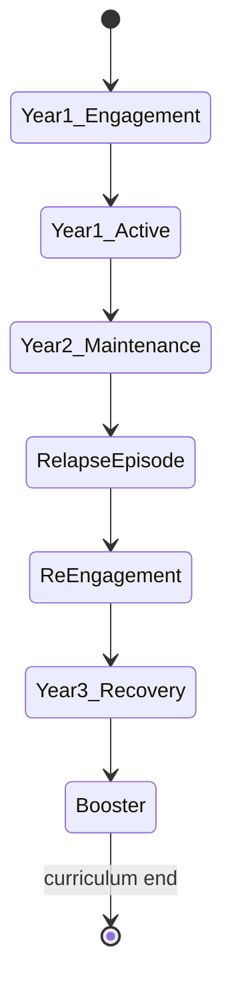

# Patient Evolution Model

**Stage:** 5 · Document 10  
**Status:** Phase Complete · Needs Human Review  
**Rule:** How fictional patients evolve across 10 / 25 / 50 / 100 sessions. Evidence first; arcs are **design** unless marked live.

**Related:** [`LONGITUDINAL_CHANGE_MODEL.md`](./LONGITUDINAL_CHANGE_MODEL.md) · [`../clinical/PATIENT_LIFECYCLE.md`](../clinical/PATIENT_LIFECYCLE.md)

---

## 1. Purpose

Provide canonical multi-horizon evolution for synthetic patients used in longitudinal curricula — without claiming real-world prognosis.

---

## 2. Existing implementation (evidence)

| Capability | Live? | Notes |
|------------|-------|-------|
| New CaseInstance per session | Yes | Diagnosis may change unless preset pins |
| LTM dyad memory growth | Yes | Facts + summaries compress over time |
| HPE identity stability | Yes | Re-frozen each mint from avatar |
| Authored `session_arc` (e.g. sessions 1…12) | Authored only | Not enforced |
| Adaptation `sessions_completed` / treatment_arc | In types + unit tests | **Not** production-wired across sessions |
| Emotion baseline shift with recovery | No | Re-seed from disorder each case |
| Automatic severity progression | No | Frozen per snapshot |
| 25 / 50 / 100 session curricula | No runtime | Design only |

---

## 3. Evolution dimensions

| Dimension | 10 sessions | 25 | 50 | 100 |
|-----------|-------------|----|----|-----|
| Alliance (trust/rapport) | Form / rupture drills | Stable working alliance possible | Repair history rich | Long attachment narrative via LTM |
| Disclosure | Hidden symptoms emerge | Deeper trauma/shame layers | Habitual openness with residual avoidances | Selective disclosure skill |
| Insight | Difficulty frozen today | Design: gradual insight↑ | Partial insight plateaus | Consolidated / defended insight variants |
| Symptoms | Static package today | Design: mild improvement or wax/wane | Relapse scenarios | Chronicity vs recovery forks |
| Adherence | Missing today | Introduce homework variability | Med adherence storylines | Long-term self-management |
| Life context | RandomizedContext per mint | LTM life_events accumulate | Role transitions (work/family) | Multi-year fictional biography |
| Dropout risk | Early rupture sensitive | Mid-therapy ambivalence | Late booster fatigue | Re-engagement arcs |
| Therapist memory | Name + few facts | Mistake/promise memory | Dense dyad model | Compressed lifelong summary |

---

## 4. Horizon playbooks (canonical curricula)

### 4.1 Ten-session arc (intake → early work)

**Live support:** LTM + single-session Emotion/Adaptation; pin disorder via instructor preset.  
**Missing:** enforced session_arc, adherence, symptom drift.

### 4.2 Twenty-five-session arc

| Block | Sessions | Intelligence focus |
|-------|----------|--------------------|
| A | 1–5 | Alliance + full assessment |
| B | 6–12 | Active modality work; CBE resistance normalizes |
| C | 13–18 | Plateau / breakthrough alternatives |
| D | 19–25 | Consolidation; optional mild relapse week |

Design: Adaptation carry mandatory; optional educational PHQ/GAD trajectory object (not device).

### 4.3 Fifty-session arc

| Phase | Focus |
|-------|-------|
| 1–10 | As 10-session playbook |
| 11–30 | Skill generalization; life_event injections via LTM seeds |
| 31–40 | Planned stressor / relapse risk |
| 41–50 | Maintenance; spaced sessions; dropout-return variant |

Requires: pinned persona continuum, progressive severity flag, recovery stage enum (G-09).

### 4.4 Hundred-session arc

Educational “simulated career of care”:

| Years (fictional) | Sessions (approx) | Content |
|-------------------|-------------------|---------|
| Year 1 | 1–40 | Engage → treat → early maintain |
| Year 2 | 41–70 | Life stressors; comorbidity teaching optional |
| Year 3 | 71–100 | Recovery identity; booster; graduation |

LTM compression becomes load-bearing; Decision Engine must respect compressed salience.

---

## 5. Fork library (scenario variants)

| Fork | Trigger | Patient intelligence effect |
|------|---------|------------------------------|
| Early dropout | Hostility streak sessions 1–3 | Low trust; LTM therapist_mistake |
| Alliance golden | Sustained warmth | Earlier disclosure; warming mode |
| Iatrogenic | Premature exposure / advice | Adaptation judgment↑; CBE anger |
| Relapse | Curriculum stressor event | Re-mint higher severity package **or** overlay |
| Recovery | Adherence + alliance | Baseline mood↑ (future); hope↑ |
| Chronic course | Low adherence + trauma load | Limited symptom change; rich LTM |

---

## 6. Consistency rules across horizons

1. **Identity continuity** — same avatar slug + HPE; names don’t reset.  
2. **Fiction** — multi-year biography remains synthetic.  
3. **Diagnosis ownership** — still CaseInstance; curricula **pin** disorder rather than binding avatar permanently.  
4. **Memory** — LTM is source of autobiographical truth across sessions.  
5. **No silent cure** — symptom change only via explicit curriculum package or future trajectory object.  
6. **Trainee scores ≠ patient recovery.**

---

## 7. Gaps

| ID | Gap | Priority |
|----|-----|----------|
| CI-V01 | No runtime evolution scheduler | High |
| CI-V02 | Adaptation cross-session unwired | Critical |
| CI-V03 | session_arc authored only | High |
| CI-V04 | No relapse/recovery package overlays | Medium |
| CI-V05 | LTM compression vs clinical fidelity untested at 100-session scale | Medium |
| CI-V06 | 100-session content not authored | Low (content) |

---

## 8. Recommendations

1. Implement curriculum presets: `horizon: 10|25|50|100` + `pin_disorder` + `evolution_fork`.  
2. Wire Adaptation `beginNextSession` when horizon > 1.  
3. Author Maya/Jordan (and future) arcs to 25 before 100.  
4. Add architecture test: longitudinal sessions share avatar + LTM key.  
5. Keep Emotion per-case unless recovery stage explicitly shifts baseline.

---

## 9. Cross-references

- Longitudinal mechanics: [`LONGITUDINAL_CHANGE_MODEL.md`](./LONGITUDINAL_CHANGE_MODEL.md)  
- DSM progression notes: [`DSM_MAPPING.md`](./DSM_MAPPING.md)  
- Realism over time: [`CLINICAL_REALISM.md`](./CLINICAL_REALISM.md)  
- Roadmap: [`../clinical/CLINICAL_ROADMAP.md`](../clinical/CLINICAL_ROADMAP.md)
