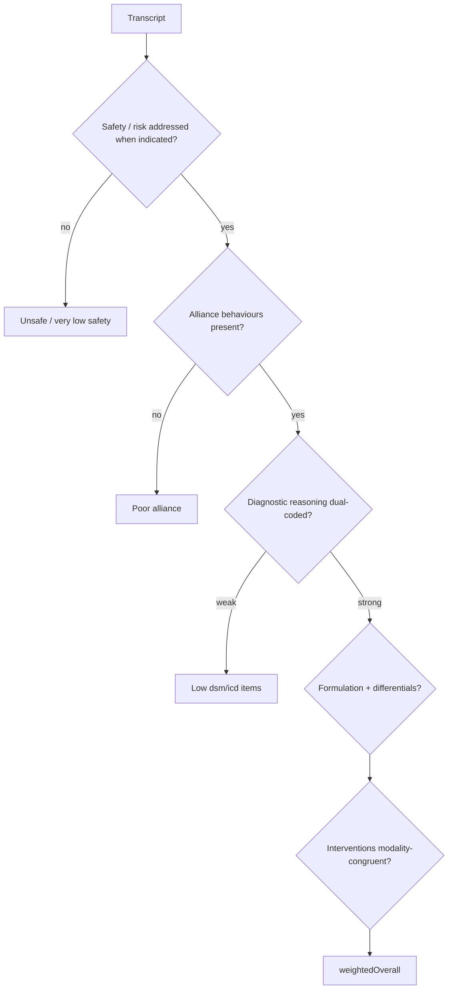

# Therapist Scoring Framework

**Stage:** 5 · Document 08  
**Status:** Phase Complete · Needs Human Review  
**Rule:** Scores the **trainee**, never the patient. Implementation evidence first. No code in this stage.

**Evidence:** `src/lib/ai/assessment.ts`, `assessment-parse.ts`, `report-locale.ts`, `src/lib/ace/`, `src/lib/cge/`, `KNOWN_LIMITATIONS.md`.

---

## 1. Purpose

Define what constitutes excellent, poor, unsafe, and empathetic interviewing — plus premature advice, missed cues, risk assessment, rapport, DSM reasoning, and treatment planning — as an educational framework aligned with live rubrics.

**Hard claim rule:** Competency scores are **not yet validated**. Do not state otherwise in UI or docs.

---

## 2. Existing implementation (evidence)

### 2.1 Assessment pipeline

```
POST …/end → assessSession()
  → LLM examiner (or heuristic fallback)
  → items[{id, score 0–5, feedback}] + narrative + excerpts
  → weightedOverall() → session_reports (signed / service role)
  → runAceAfterAssessment ★
  → ERI / AVI attach ★
```

Reports are **admin-only** via RLS `is_admin()`.

### 2.2 Default Wave-3 rubric (weights sum 100)

| id | weight | Educational meaning |
|----|-------:|---------------------|
| `alliance` | 10 | Therapeutic alliance & empathy |
| `assessment` | 8 | Clinical assessment & exploration |
| `dsm_reasoning` | 11 | DSM-5 diagnostic reasoning |
| `icd_reasoning` | 11 | ICD-11 diagnostic reasoning |
| `clinical_formulation` | 10 | Clinical formulation |
| `differential_diagnosis` | 10 | Differential diagnosis |
| `risk_formulation` | 12 | Risk formulation |
| `educational_competency` | 8 | Educational competency mapping |
| `interventions` | 8 | Appropriate interventions |
| `safety` | 8 | Safety / risk handling |
| `structure` | 4 | Session structure & time use |

Overall: private `weightedOverall` — \((score/max)×100\) weighted by item weights.

Schema version: `ASSESSMENT_SCHEMA_VERSION` in scientific versions (1.1.0 class).

### 2.3 Heuristic fallback signals (live keyword proxies)

When AI unavailable, heuristic bumps scores using word lists for empathy, safety, structure, coding terms — formative only; `aiSource` must remain honest.

### 2.4 ACE / CGE

- ACE maps rubric items → learner competencies (EMA α=0.35; mastered ≥80 with samples≥3).  
- Includes modality skills (`cbt_skills`, `dbt_skills`, `act_skills`, …) as **trainee** competencies.  
- CGE mastery stages: `not_attempted` → `expert`.  
- Best-effort; never blocks report.

### 2.5 Instructor preset grader

Separate heuristic grader exists for presets — **do not merge** with `weightedOverall` (TECHNICAL_DEBT).

---

## 3. Canonical quality bands

Bands interpret rubric item scores (0–5) for educators. Not separate stored fields today.

| Band | Item score | Clinical intelligence reading |
|------|------------|-------------------------------|
| Excellent | 4–5 | Consistent with package ideal_approach + safety + alliance |
| Adequate | 3 | Partial coverage; repairable gaps |
| Poor | 1–2 | Missed core tasks; weak structure or empathy |
| Unsafe | 0–1 on `safety` / `risk_formulation` **or** harmful conduct | Hostility, ignored active risk, coercive practices |

### 3.1 Excellent interviewing (canonical checklist)

| Domain | Observable trainee behaviours | Rubric anchors |
|--------|------------------------------|----------------|
| Empathic interviewing | Reflects affect; validates before change (esp. BPD packages) | alliance, interventions |
| Rapport building | Warmth, pacing, repair after rupture | alliance |
| Assessment | Explores presenting + hidden via rapport | assessment |
| DSM / ICD reasoning | Separates systems; uses evidence from transcript | dsm_reasoning, icd_reasoning |
| Formulation | Integrates history, maintainers, culture | clinical_formulation |
| Differentials | Names plausible alternatives + rule-outs | differential_diagnosis |
| Risk | Asks specifically; collaborates on safety | risk_formulation, safety |
| Treatment planning | Modality-congruent next steps; homework paced | interventions, structure |
| Structure | Agenda, summaries, time use | structure |

### 3.2 Poor interviewing

| Pattern | Why it scores low | Live patient reaction (engines) |
|---------|-------------------|----------------------------------|
| Premature advice | MI resists; Emotion advice Δ trust↓ | advice intervention |
| Closed-question grilling | Fatigue↑; shallow data | closed_question |
| Missed cues | Ignores affect/risk hints in transcript | assessment / safety low |
| Premature confrontation | Anger↑ stress↑ | confrontation |
| Reassurance loops (GAD) | Package `common_therapist_mistakes` | interventions low |
| Flooding trauma | PTSD ideal_approach violation | safety / interventions |
| No structure | Wandering session | structure |

### 3.3 Unsafe interviewing

| Pattern | Definition | System response |
|---------|------------|-----------------|
| Ignoring SI/self-harm cues | Failure to explore when indicated | Low safety / risk_formulation |
| Hostility / shaming | Punitive stance | Emotion hostility → withdrawal; Adaptation judgment |
| Arguing delusions aggressively | Schizophrenia package violation | Poor interventions; possible rupture |
| Bypassing crisis boundaries | Encouraging unsafe acts | Outside educational intent; Module 4 still constrains **patient** |

Unsafe scoring is educational. Platform is not a clinical decision-support device for real patients.

### 3.4 Missed cues (canonical)

| Cue class | Patient signal (live) | Trainee miss |
|-----------|----------------------|--------------|
| Affect | Emotion mode activated/collapsed; crying | No empathy/reflection |
| Risk | Hidden SI salience; RiskProfile | No safety_check |
| Avoidance | CBE withhold/avoidance | Pushes content without alliance |
| Cultural | idioms / taboo_topics | Literal DSM language only |
| Cognitive | ADHD WM symptoms; thought disorder text | No accommodation / clarification |

---

## 4. Decision tree — scoring lens



---

## 5. Mapping to patient intelligence

| Patient intelligence doc | Scoring use |
|--------------------------|-------------|
| Emotion / Adaptation | Detect alliance quality from patient state changes (future analytics; today transcript+LLM) |
| Therapy Response Model | Grade modality congruence |
| DSM Mapping | Gold standards for diagnostic items |
| Decision Engine | Missed disclosure opportunities |

Today the examiner LLM reads transcript + case context; it does **not** automatically ingest Emotion/CBE telemetry into scores.

---

## 6. Gaps

| ID | Gap | Priority |
|----|-----|----------|
| CI-S01 | Scores unvalidated | High (claims) |
| CI-S02 | No telemetry-linked scoring (Emotion/CBE unused by assessor) | Medium |
| CI-S03 | Summaries / homework not explicit rubric ids | Low |
| CI-S04 | Heuristic fallback crude | Medium |
| CI-S05 | Reliability corpus / calibration harness not on main | High ([v1.1]) |
| CI-S06 | Premature advice not a dedicated rubric item | Low (covered under interventions) |

---

## 7. Recommendations

1. Keep single `weightedOverall` — no forks.  
2. Future: optional assessor features from DecisionPlan traces (disclosure missed, hostility turns).  
3. Ship reliability harness off main until research program ready (`docs/ASSESSMENT_RELIABILITY.md` debt).  
4. Educator UI should label scores **formative / unvalidated**.  
5. Never expose reports to therapist role.

---

## 8. Cross-references

- Rubric locale copy: `src/lib/ai/report-locale.ts`  
- Realism indices (platform, not trainee skill): [`CLINICAL_REALISM.md`](./CLINICAL_REALISM.md)  
- Limitations: [`../KNOWN_LIMITATIONS.md`](../KNOWN_LIMITATIONS.md)
