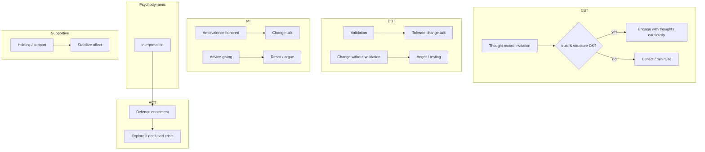

# Therapy Response Model

**Stage:** 5 · Document 04  
**Status:** Phase Complete · Needs Human Review  
**Rule:** Implementation evidence first; recommendations second. No code in this stage.

**Evidence:** `src/lib/case-engine/types.ts` (`TherapyModality`), `catalog.ts` (`BUILTIN_THERAPY_PROFILES`), `therapy-process.ts`, Emotion `interventions.ts`, CBE `therapist-move.ts`, ACE competency ids (trainee).

---

## 1. Purpose

Document how fictional patients respond to therapeutic modalities and common therapist moves — CBT, DBT, ACT, psychodynamic, supportive, MI, psychoeducation, validation, confrontation, homework, silence, empathy, reflection, summaries.

---

## 2. Existing implementation (evidence)

### 2.1 Modalities on Case Engine (live)

```ts
TherapyModality =
  "cbt" | "dbt" | "act" | "psychodynamic" | "supportive"
  | "motivational_interviewing" | "family_therapy"
  | "crisis_intervention" | "exposure_therapy"
```

Frozen onto `CaseInstanceSnapshot.therapy_modality` + `therapy_reaction_rules`.

### 2.2 Reaction rules — live (thin)

From `BUILTIN_THERAPY_PROFILES` generation:

| Modality | `engages_with` | `resists` |
|----------|----------------|-----------|
| CBT | structured questions, thought records | premature confrontation |
| Crisis intervention | safety focus, grounding | premature confrontation |
| MI | empathy, collaboration | **advice-giving** |
| All others (default) | empathy, collaboration | premature confrontation |

`alliance_cue`: `"{Label}: patient reacts to modality-congruent stance."`

These strings are formatted into Module 1 via `formatTherapyReactionForPrompt` — **not** a modality state machine.

### 2.3 Ideal approach strings (package-level)

Disorder packages include free-text `ideal_approach` (trainee guidance), e.g.:

- MDD: warm CBT/IPT-informed interview  
- GAD: collaborative CBT; avoid premature exposure  
- BPD: DBT-informed; validation before change  
- AUD: motivational interviewing  
- Panic: CBT with interoceptive exposure readiness  

These guide assessment teaching; they do **not** run a patient therapy-process FSM.

### 2.4 Therapist moves that *do* change patient state (live)

| Move / intervention | Emotion Engine | Adaptation | CBE |
|---------------------|----------------|------------|-----|
| Validation | trust↑ anger↓ … | validation cue | move class |
| Empathy | hope↑ trust↑ … | excellent_empathy / warmth | rapport |
| Reflection | mild alliance↑ | — | reflection move |
| Open / closed question | slight motivation Δ | — | open/closed |
| Psychoeducation | hope↑ motivation↑ | — | — |
| Confrontation | anger↑ stress↑ trust↓ | confrontation cue | confrontation |
| Advice | motivation↓ trust↓ | — | advice |
| Hostility / invalidation | rupture | judgment | anger/avoidance bias |
| Rupture repair | trust↑ | repair cue | — |
| Safety check | fear↓ trust↑ | — | safety_check |
| Silence | mild effects | — | may select silence |
| Summaries | **No dedicated class** | — | often classified as reflection/neutral |
| Homework assignment | **No patient state** | — | may hit advice if lecturing |

### 2.5 What does *not* exist

| Expected therapy response object | Status |
|----------------------------------|--------|
| CBT thought-record patient object | Missing |
| DBT skill enactment (TIPP, opposite action…) | Missing |
| ACT hexaflex state | Missing |
| Psychodynamic defence engine | Authored lists only (G-15) |
| Homework completion tracking | Missing (G-10) |
| Modality-specific resistance schedules | Thin `resists` arrays only |

ACE `cbt_skills` / `dbt_skills` / … score the **trainee**, not patient modality state.

---

## 3. Canonical response matrix (design)

Rows = patient response tendencies. Columns = therapist acts.  
**Status column:** Live = wired to engines; Design = normative for future.

### 3.1 Core interviewing acts

| Therapist act | Typical SP response (canonical) | Live wiring |
|---------------|---------------------------------|-------------|
| Empathy | Soften fear; raise hope/trust; open disclosure | Emotion + Adaptation |
| Validation | Lower anger; raise trust; DBT-congruent for BPD packages | Emotion + Adaptation |
| Reflection | Mild alliance; feel heard | Emotion reflection |
| Summary | Organize; slight trust if accurate; irritation if wrong/premature | **Design** (map to reflection ± accuracy) |
| Silence | Space to feel; or anxiety → fill/withdraw | Emotion silence + CBE silence |
| Open question | Invite engagement | Emotion + CBE |
| Closed question | Slight fatigue / short answers | Emotion |
| Psychoeducation | Motivation↑ if trust adequate; resistance if lecturing | Emotion; trust-gated |
| Confrontation | Activation; trust cost if premature | Emotion + Adaptation + CBE |
| Premature advice | Motivation↓ trust↓; MI packages resist | Emotion; MI resists |
| Homework | Compliance depends on alliance + conscientiousness | **Design** |
| Hostility | Withdrawal / anger | Emotion hostile path |

### 3.2 Modality-congruent responses (canonical)



**Implementation note:** Today only the MI “resists advice” and CBT “engages structured questions / thought records” strings approximate this. Full modality FSMs are Stage 5 design debt for a later implementation stage.

---

## 4. Decision tree (patient response)

```
Therapist utterance
  → classify Emotion intervention + CBE therapist move
  → if modality == MI and move == advice → bias resist (live string + Emotion advice Δ)
  → if BPD package and validation → alliance path (Emotion); change-first → activation
  → if disclosure topic sensitive → CBE gate may withhold regardless of modality
  → emit Adaptation stance + Emotion mode + CBE kind
  → Patient Agent enacts (or cbe_direct)
```

---

## 5. Gaps

| ID | Gap | Priority |
|----|-----|----------|
| CI-T01 | Therapy reaction rules are 3-field string bags | High |
| CI-T02 | No per-modality patient state machines | High |
| CI-T03 | Summaries / homework not first-class interventions | Medium |
| CI-T04 | Defence mechanisms not engine-backed | Medium (G-15) |
| CI-T05 | Exposure / ERP titration not modeled beyond ideal_approach text | Medium |
| CI-T06 | Family therapy modality has no distinct reaction profile | Low |

---

## 6. Recommendations

1. Expand `patient_reaction_rules` into typed `TherapyResponseProfile` per modality without breaking snapshot JSON (additive schema).  
2. Map assessment rubric `interventions` scoring to expected modality-congruent moves using package `ideal_approach`.  
3. Implement homework adherence as Adaptation or therapy-process state (G-10).  
4. Defence catalog → CBE enactable kinds (R-M5).  
5. Keep patient from reciting modality jargon unless culturally plausible — existing naturalness rules.

---

## 7. Cross-references

- Emotion deltas: [`EMOTION_MODEL.md`](./EMOTION_MODEL.md)  
- Observable behaviour: [`BEHAVIOR_MODEL.md`](./BEHAVIOR_MODEL.md)  
- Therapist quality: [`THERAPIST_SCORING_FRAMEWORK.md`](./THERAPIST_SCORING_FRAMEWORK.md)  
- DSM therapy challenges: [`DSM_MAPPING.md`](./DSM_MAPPING.md)
