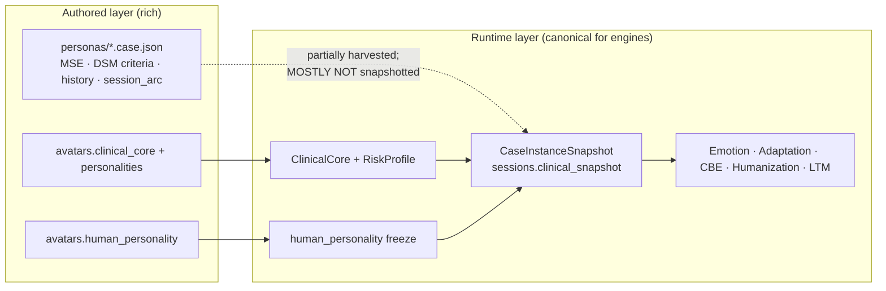

# VPsych Clinical Data Model

**Stage:** 3 — Clinical Data Architecture & Knowledge Model  
**Status:** Ready for Staging  
**Baseline:** live `src/lib/types.ts`, `case-engine`, `personality-engine`, engine state types, `personas/*.case.json`, `supabase/migrations/`  
**Rule:** This package documents the **actual** clinical information model. Gaps are catalogued, not invented.  
**Certification:** Stage 3 marked **Ready** (human review accepted for merge).

---

## Purpose

After Stage 3, every present and future AI engine must read clinical meaning from **one** patient ontology. Engines may own *runtime state* derived from that ontology, but they must not redefine the patient.

Canonical entry points:

| Document | Role |
|----------|------|
| [`PATIENT_ONTOLOGY.md`](./PATIENT_ONTOLOGY.md) | Single patient ontology — every clinical concept once |
| [`PATIENT_LIFECYCLE.md`](./PATIENT_LIFECYCLE.md) | Avatar → case → session → longitudinal |
| [`CASE_MODEL.md`](./CASE_MODEL.md) | Immutable CaseInstance / clinical_snapshot |
| [`DSM_MAPPING.md`](./DSM_MAPPING.md) | DSM-5 coding as implemented |
| [`ICD_MAPPING.md`](./ICD_MAPPING.md) | ICD-10 / ICD-11 as implemented |
| [`SYMPTOM_MODEL.md`](./SYMPTOM_MODEL.md) | Symptom profile domains & salience |
| [`MENTAL_STATUS_MODEL.md`](./MENTAL_STATUS_MODEL.md) | MSE — authored vs runtime gap |
| [`THERAPY_STATE_MODEL.md`](./THERAPY_STATE_MODEL.md) | Emotion, adaptation, CBE, humanization, alliance |
| [`RISK_MODEL.md`](./RISK_MODEL.md) | RiskProfile + Module 4 safety |
| [`MEMORY_MODEL.md`](./MEMORY_MODEL.md) | Case memory + longitudinal LTM |
| [`LIVING_ENVIRONMENT_MODEL.md`](./LIVING_ENVIRONMENT_MODEL.md) | Living situation / socio context (thin) |
| [`CULTURAL_CONTEXT_MODEL.md`](./CULTURAL_CONTEXT_MODEL.md) | Locale-native cultural framing |
| [`CLINICAL_GAP_ANALYSIS.md`](./CLINICAL_GAP_ANALYSIS.md) | Missing concepts (no implementation) |
| [`CLINICAL_ROADMAP.md`](./CLINICAL_ROADMAP.md) | Prioritised remediation roadmap |

Architecture boundaries: [`../SOFTWARE_ARCHITECTURE.md`](../SOFTWARE_ARCHITECTURE.md).

---

## Two layers (critical invariant)

| Layer | What it is | What engines must use |
|-------|------------|------------------------|
| **Runtime clinical model** | `ClinicalCore` + `CaseInstanceSnapshot` + Human Personality freeze + turn-state engines | **Yes — canonical** |
| **Authored case library** | `personas/*.case.json` rich `case_file` (MSE, criterion trees, protective factors, session_arc) | Authoring / examination asset; **not** a second patient model for engines |

**Hidden assumption (documented):** authored MSE and protective-factor prose exist in personas but are **not** first-class on `ClinicalCore` and are **not** injected into Module 1 except where otherwise noted. Future engines must not assume they are available at runtime until promoted via Case Engine packages.

---

## Knowledge ownership (summary)

| Clinical knowledge | Single owner | Must not own |
|--------------------|--------------|--------------|
| Diagnosis codes & disorder package | **Case Engine** (`disorders`) | Avatar permanently; Personality; Emotion |
| Session presentation (symptoms, disclosure, risk) | **Case Engine** via frozen `clinical_snapshot.clinical_core` | Turn engines |
| Locale identity & culture | **Avatar Personality** (Module 2) | Case Engine diagnosis |
| Temperament / attachment / Big Five | **Personality Engine** (Module 2b) | GPT authorship |
| Emotion variables | **Emotion Engine** | Adaptation (rapport/trust only) |
| Rapport / trust / stance | **Adaptation Engine** | Emotion |
| Longitudinal facts | **Patient Memory** | case_memory emotion keys |
| Per-turn conversation behaviour | **CBE** | Humanization (micro-cues only) |
| Safety boundaries / crisis resources | **SafetyModule** on personality + **RiskProfile** on clinical_core | Humanization when gated |
| Assessment of the *therapist* | **Assessment** → `session_reports` | Patient ontology |

Full matrix: [`PATIENT_ONTOLOGY.md`](./PATIENT_ONTOLOGY.md) § Ownership.

---

## Persistence map (clinical)

| Store | Clinical payload |
|-------|------------------|
| `avatars.clinical_core` | Slim Module 1 template |
| `avatars.personalities` | Locale identity, culture, speech, safety, thin case_file localization |
| `avatars.human_personality` | Trait profiles by locale |
| `personas` | Identity baseline; **does not permanently own diagnosis** |
| `disorders` | DSM/ICD codes + `package` jsonb |
| `case_instances.clinical_snapshot` | Immutable minted case |
| `sessions.clinical_snapshot` | Session copy (update-guarded) |
| `case_memory.memory` | Emotion + adaptation + ephemeral notes namespaces |
| `patient_long_term_memory` | Dyad longitudinal store |
| `voice_profiles` | Clinical delivery params |
| `session_reports` | Therapist performance scores (not patient chart) |
| `session_private_notes` | Therapist notes — **never** patient LLM |

---

## Prompt representation (patient-facing)

| Module | Clinical content |
|--------|------------------|
| 1 | Disorder name, severity, onset, demographics, symptoms, disclosure, fidelity cues |
| 2 | Identity, culture, idioms, speech; **only** `substance_and_medication_context` from case_file |
| 2b | Full human personality profile |
| 3 | Language / dialect rules |
| 4 | RiskProfile + safety_module |

Details: [`../SOFTWARE_ARCHITECTURE.md`](../SOFTWARE_ARCHITECTURE.md) § Prompt architecture.

---

## Certification checklist (Stage 3)

| Criterion | Status |
|-----------|--------|
| Entire clinical model documented | Yes — this package |
| Single patient ontology | Yes — `PATIENT_ONTOLOGY.md` |
| Ownership explicit | Yes |
| Relationships documented | Yes |
| Lifecycle documented | Yes |
| Gap analysis complete | Yes — `CLINICAL_GAP_ANALYSIS.md` |
| Clinical roadmap generated | Yes — `CLINICAL_ROADMAP.md` |
| No fabricated features | Yes — gaps marked Missing |
| Reflects live implementation | Yes — code-traced |

**Release status:** Ready for Staging

**Certification note:** Stage 3 clinical documentation is marked Ready for merge to `main`. Runtime behaviour is unchanged; remaining clinical gaps stay tracked in `CLINICAL_GAP_ANALYSIS.md` / `CLINICAL_ROADMAP.md`.

**Rollback:** documentation-only; revert the docs commit.
