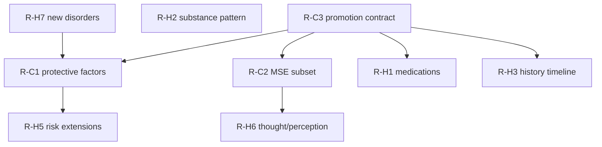
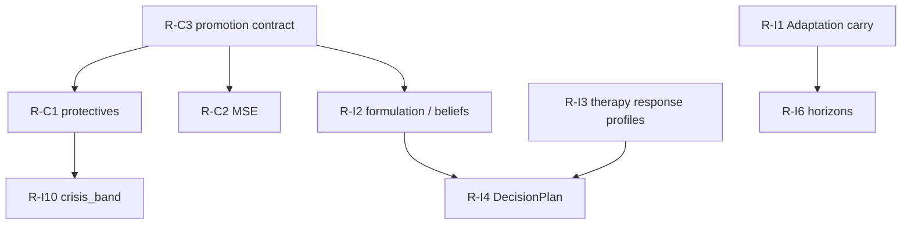

# Clinical Roadmap

**Stage 3 output — recommendations only. No implementation in documentation stages.**  
**Updated:** 2026-08-07 — Stage 5 Clinical Intelligence Framework registered (docs under [`../clinical-intelligence/`](../clinical-intelligence/)).

Links: [`CLINICAL_GAP_ANALYSIS.md`](./CLINICAL_GAP_ANALYSIS.md) · [`PATIENT_ONTOLOGY.md`](./PATIENT_ONTOLOGY.md) · [`../SOFTWARE_ARCHITECTURE.md`](../SOFTWARE_ARCHITECTURE.md) · [`../clinical-intelligence/README.md`](../clinical-intelligence/README.md)

---

## Principles

1. One ontology — extend `PATIENT_ONTOLOGY.md` before coding.  
2. Case Engine owns diagnosis, symptoms, risk, MSE promotion.  
3. Personality Engine owns traits only.  
4. Prefer promoting authored persona fields over inventing parallel schemas.  
5. No medical-device claims; instruments remain educational.  
6. Small schema migrations; never edit applied migrations.  
7. **Stage 5 intelligence** designs how the SP mind behaves; it must not fork Stage 3 types or Stage 4 ownership. Implement only after ontology + ownership updates.

Architectural impact scale: **S** = types/docs · **M** = Case Engine + migration + prompt · **L** = new engine or multi-system rewrite risk.

---

## Critical

| ID | Concept | Owner | Impact | Status |
|----|---------|-------|--------|--------|
| R-C1 | Promote protective factors onto ClinicalCore / package | Case Engine | M | **Done (Stage 6)** |
| R-C2 | Define runtime MSE subset; snapshot + optional Module 1 fidelity | Case Engine | M–L | **Done (Stage 6)** |
| R-C3 | Documented promotion pipeline: persona case_file → snapshot | Case Engine | M | **Partial** — package seeds + promote API; authored persona JSON MSE still thin |

**Suggested sequence:** R-C3 contract → R-C1 fields → R-C2 MSE subset (speech/mood/affect/insight/judgement/risk first; thought/perception next).

---

## High

| ID | Concept | Owner | Impact | Rationale |
|----|---------|-------|--------|-----------|
| R-H1 | Structured medication list | Case Engine (+ LTM sync) | M | G-03 |
| R-H2 | Substance use pattern fields | Case Engine | M | G-04 |
| R-H3 | History / past-symptom timeline | Case Engine | M | G-05 |
| R-H4 | Gold-standard formulation artifact for grading | Case Engine teaching | M | G-06 |
| R-H5 | RiskProfile: self_neglect, risk_to_dependents | Case Engine | S–M | G-08 |
| R-H6 | Thought form/content & perception on MSE subset | Case Engine | M | G-11 |
| R-H7 | Ship reserved disorder packages (OCD, ASD, eating, …) | Case Engine catalog | M | G-16 |
| R-H8 | ClinicalCore `icd10_code?` parity | Case Engine types | S | ICD asymmetry |

---

## Medium

| ID | Concept | Owner | Impact | Rationale |
|----|---------|-------|--------|-----------|
| R-M1 | Living environment structured package | New package / Module 2 | M | G-07 |
| R-M2 | Recovery stage / enforce session_arc | Case Engine + ACE | M | G-09 |
| R-M3 | Treatment adherence state | Adaptation or Case | S–M | G-10 |
| R-M4 | Educational instrument registry (PHQ-9, …) | Case Engine | M | G-12 |
| R-M5 | Defence mechanisms catalog → CBE enactable | Future Defence + CBE | M | G-15 |
| R-M6 | Emotion↔Adaptation trust/rapport contract tests | Architecture | S | G-17 |
| R-M7 | Atomic case_memory merge helper | Platform / both stores | S | ARCH-S2-02 |

---

## Low

| ID | Concept | Owner | Impact | Rationale |
|----|---------|-------|--------|-----------|
| R-L1 | Impulse control field | ClinicalCore / MSE | S | G-13 |
| R-L2 | Children as structured entities | Family extension | M | G-14 |
| R-L3 | Durable animation clinical profile | NBE | S | Today ephemeral |
| R-L4 | Religion practice schedule | Cultural / HPE | S | Thin string today |

---

## Future

| ID | Concept | Notes |
|----|---------|-------|
| R-F1 | Genogram / family systems graph | Family Dynamics Engine |
| R-F2 | SNOMED / LOINC coding | Only if research export requires; not needed for SP chat |
| R-F3 | Formal DSM cultural formulation interview structure | Cultural Context expansion |
| R-F4 | Validated instrument psychometrics as clinical claims | **Forbidden** until research program completes — keep educational |
| R-F5 | Attachment Engine (processual) beyond HPE enum | May extend Personality or new engine; must not fork attachment |
| R-F6 | Labs / psych testing data objects | TRM chart today null |
| R-F7 | Trauma phase-of-care ontology | Beyond PTSD packages |

---

## Dependency sketch (Stage 3 clinical data)

---

## Stage 5 — Clinical Intelligence (implementation backlog)

Canonical designs live in [`../clinical-intelligence/`](../clinical-intelligence/).  
**Stage 6 implementation:** [`../clinical-intelligence/IMPLEMENTATION.md`](../clinical-intelligence/IMPLEMENTATION.md) · code `src/lib/clinical-intelligence/`.  
Blueprint: [`../clinical-intelligence/STAGE_6_IMPLEMENTATION_BLUEPRINT.md`](../clinical-intelligence/STAGE_6_IMPLEMENTATION_BLUEPRINT.md).

### Critical (intelligence)

| ID | Concept | Owner | Impact | Status |
|----|---------|-------|--------|--------|
| R-I1 | Wire Adaptation `beginNextSession` for longitudinal curricula | Adaptation + session create | M | **Done** — dyad carry on create/message |
| R-I2 | Patient formulation object (beliefs / schemas / goals) on Case teaching package | Case Engine | M–L | **Done** — ClinicalCore.formulation |
| R-I3 | Typed `TherapyResponseProfile` replacing thin reaction strings | Case Engine therapy-process | M | **Done** — v1 additive; legacy bags normalize |

### High (intelligence)

| ID | Concept | Owner | Impact | Status |
|----|---------|-------|--------|--------|
| R-I4 | DecisionPlan façade over CBE + Adaptation + Emotion | Runtime orchestration | M | **Done** — `decidePatientTurn` |
| R-I5 | Behaviour / cognitive pattern tags on disorder packages | Case Engine catalog | S–M | **Partial** — package seeds `pattern_tags` |
| R-I6 | Curriculum horizons `10\|25\|50\|100` + `pin_disorder` | Instructor presets + ACE | M | **Partial** — helpers/tests; preset wire remain |
| R-I7 | Dissociation / numbing decision bias for trauma packages | Decision + CBE | S–M | **Done** — DecisionPlan.dissociation |
| R-I8 | Assessor optional telemetry features (missed disclosure, hostility turns) | Assessment | M | Open |

### Medium (intelligence)

| ID | Concept | Owner | Impact | Status |
|----|---------|-------|--------|--------|
| R-I9 | Homework / adherence state | Adaptation / therapy-process | S–M | **Done** — mind-state adherence |
| R-I10 | Emotion crisis_band mode (after RiskProfile extensions) | Emotion | M | Open (CrisisRisk type present) |
| R-I11 | Turn-level realism auditor (expression vs reply) | Platform / CFI bridge | M | Open |
| R-I12 | Unified nonverbal cue ID registry | Emotion + NBE + TRM | S | Open |
| R-I13 | Recovery stage enum enforcing authored session_arc | Case + ACE | M | **Partial** — RecoveryTrajectory runtime |

### Dependency sketch (intelligence on clinical)

---

## Out of scope for clinical model work

- Implementing engines in documentation stages.  
- Declaring competency scores validated.  
- Rewriting prompt Modules 2–4 for convenience.  
- Storing permanent diagnosis on avatars.  
- Redesigning Stages 1–4 architecture or ontology roots.

---

## Success criteria (future hardening stage)

- [ ] Every Critical gap closed or explicitly deferred with owner.  
- [ ] `PATIENT_ONTOLOGY.md` lists no Critical Missing items.  
- [ ] Architecture tests assert ClinicalCore field presence for protectives + MSE subset once shipped.  
- [ ] Persona library fields either promoted or clearly marked authoring-only in schema comments.  
- [ ] Stage 5 Critical intelligence items (R-I1–R-I3) closed or deferred with owner.  
- [ ] Longitudinal curricula can pin disorder and carry Adaptation alliance across sessions.  
- [ ] Clinical intelligence package remains the SP-mind SoT; no parallel “patient brain” docs outside `clinical-intelligence/`.
