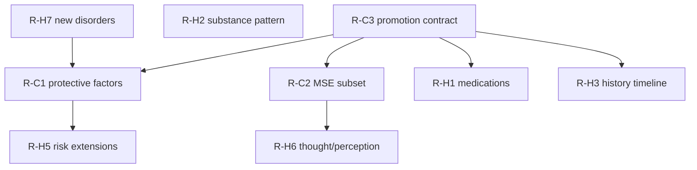

# Clinical Roadmap

**Stage 3 output — recommendations only. No implementation in this stage.**

Links: [`CLINICAL_GAP_ANALYSIS.md`](./CLINICAL_GAP_ANALYSIS.md) · [`PATIENT_ONTOLOGY.md`](./PATIENT_ONTOLOGY.md) · [`../SOFTWARE_ARCHITECTURE.md`](../SOFTWARE_ARCHITECTURE.md)

---

## Principles

1. One ontology — extend `PATIENT_ONTOLOGY.md` before coding.  
2. Case Engine owns diagnosis, symptoms, risk, MSE promotion.  
3. Personality Engine owns traits only.  
4. Prefer promoting authored persona fields over inventing parallel schemas.  
5. No medical-device claims; instruments remain educational.  
6. Small schema migrations; never edit applied migrations.

Architectural impact scale: **S** = types/docs · **M** = Case Engine + migration + prompt · **L** = new engine or multi-system rewrite risk.

---

## Critical

| ID | Concept | Owner | Impact | Rationale |
|----|---------|-------|--------|-----------|
| R-C1 | Promote protective factors onto ClinicalCore / package | Case Engine | M | Closes CFI + risk teaching gap (G-01) |
| R-C2 | Define runtime MSE subset; snapshot + optional Module 1 fidelity | Case Engine | M–L | Ends dual-model drift (G-02, G-18) |
| R-C3 | Documented promotion pipeline: persona case_file → snapshot | Case Engine | M | Prevents hidden assumptions (G-18) |

**Suggested sequence:** R-C3 contract → R-C1 fields → R-C2 MSE subset (speech/mood/affect/insight/judgement/risk first; thought/perception next).

---

## High

| ID | Concept | Owner | Impact | Rationale |
|----|---------|-------|--------|-----------|
| R-H1 | Structured medication list | Case Engine (+ LTM sync) | M | G-03 |
| R-H2 | Substance use pattern fields | Case Engine | M | G-04 |
| R-H3 | History / past-symptom timeline | Case Engine | M | G-05 |
| R-H4 | Gold-standard formulation artifact for grading | Case Engine teaching | M | G-06 |
| R-H5 | RiskProfile: self_neglect, risk_to_dependents | Case Engine | S–M | G-08 |
| R-H6 | Thought form/content & perception on MSE subset | Case Engine | M | G-11 |
| R-H7 | Ship reserved disorder packages (OCD, ASD, eating, …) | Case Engine catalog | M | G-16 |
| R-H8 | ClinicalCore `icd10_code?` parity | Case Engine types | S | ICD asymmetry |

---

## Medium

| ID | Concept | Owner | Impact | Rationale |
|----|---------|-------|--------|-----------|
| R-M1 | Living environment structured package | New package / Module 2 | M | G-07 |
| R-M2 | Recovery stage / enforce session_arc | Case Engine + ACE | M | G-09 |
| R-M3 | Treatment adherence state | Adaptation or Case | S–M | G-10 |
| R-M4 | Educational instrument registry (PHQ-9, …) | Case Engine | M | G-12 |
| R-M5 | Defence mechanisms catalog → CBE enactable | Future Defence + CBE | M | G-15 |
| R-M6 | Emotion↔Adaptation trust/rapport contract tests | Architecture | S | G-17 |
| R-M7 | Atomic case_memory merge helper | Platform / both stores | S | ARCH-S2-02 |

---

## Low

| ID | Concept | Owner | Impact | Rationale |
|----|---------|-------|--------|-----------|
| R-L1 | Impulse control field | ClinicalCore / MSE | S | G-13 |
| R-L2 | Children as structured entities | Family extension | M | G-14 |
| R-L3 | Durable animation clinical profile | NBE | S | Today ephemeral |
| R-L4 | Religion practice schedule | Cultural / HPE | S | Thin string today |

---

## Future

| ID | Concept | Notes |
|----|---------|-------|
| R-F1 | Genogram / family systems graph | Family Dynamics Engine |
| R-F2 | SNOMED / LOINC coding | Only if research export requires; not needed for SP chat |
| R-F3 | Formal DSM cultural formulation interview structure | Cultural Context expansion |
| R-F4 | Validated instrument psychometrics as clinical claims | **Forbidden** until research program completes — keep educational |
| R-F5 | Attachment Engine (processual) beyond HPE enum | May extend Personality or new engine; must not fork attachment |
| R-F6 | Labs / psych testing data objects | TRM chart today null |
| R-F7 | Trauma phase-of-care ontology | Beyond PTSD packages |

---

## Dependency sketch

---

## Out of scope for clinical model work

- Implementing engines in documentation stages.  
- Declaring competency scores validated.  
- Rewriting prompt Modules 2–4 for convenience.  
- Storing permanent diagnosis on avatars.

---

## Success criteria (future hardening stage)

- [ ] Every Critical gap closed or explicitly deferred with owner.  
- [ ] `PATIENT_ONTOLOGY.md` lists no Critical Missing items.  
- [ ] Architecture tests assert ClinicalCore field presence for protectives + MSE subset once shipped.  
- [ ] Persona library fields either promoted or clearly marked authoring-only in schema comments.
