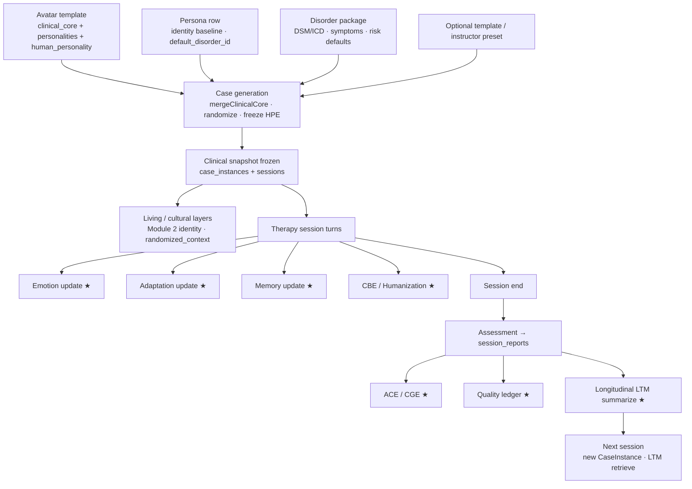

# Patient Lifecycle

**Evidence:** `createCaseForSession` (`case-engine/persist.ts`), `generateCaseInstance` (`generator.ts`), session create/message/end routes, LTM hooks.

---

## Canonical lifecycle (implementation)

★ = best-effort; must not block report persistence.

---

## Phase detail

### 1. Avatar template
- **Owner:** Avatar catalog + Personality Engine + authored personas library.
- **Contains:** slim `clinical_core`, locale personalities, human_personality map, voice casting.
- **Does not:** permanently bind a disorder to the human identity for all future sessions.

### 2. Case generation
- **Entry:** `POST /api/sessions` → `createCaseForSession`.
- **Paths:** preset → template → default `generateCaseInstance`.
- **Actions:** select disorder; merge package + legacy core; apply difficulty disclosure; randomize non-diagnostic context; compute speech/teaching cues; freeze human personality; optionally score CFI meta.
- **Output:** `CaseInstanceSnapshot` written to `case_instances` and `sessions.clinical_snapshot`.

### 3. Living environment / culture at mint
- **Culture & living situation** come from Module 2 personality (locale-native), not from a separate Living Environment Engine.
- **RandomizedContext** adds stressor / finances / relationship colour without mutating DSM criteria.

### 4. Clinical snapshot (immutable)
- Update guard freezes clinical snapshot fields on `sessions`.
- Diagnosis, symptoms, risk defaults, difficulty, modality, frozen traits are fixed for the session.

### 5. Therapy session (mutable runtime)
Per turn (`POST …/message`):

1. Adaptation process + persist  
2. resolveAvatar (Modules 1–4 from snapshot)  
3. LTM retrieve + inject  
4. Persist user message  
5. Emotion process + persist  
6. CBE plan  
7. Humanization plan  
8. Patient reply (or cbe_direct)  
9. Persist assistant message  

### 6. Scoring & persistence
- `assessSession` → signed/service-role `session_reports`.
- ACE ingest ★, LTM session summarize ★, quality ledger seal ★.

### 7. Longitudinal follow-up
- **New session** always mints a **new** CaseInstance (fresh diagnosis package possible).
- LTM retrieves prior dyad facts (therapist ↔ avatar) into the new session prompt.
- Adaptation/Emotion state is case-scoped (`case_memory`), not automatically carried as the same object across cases unless keys are redesigned (current: per case_instance).

---

## Lifecycle vs authored session_arc

Personas define `session_arc[]` (expected states at sessions 1…12). That arc is **authored documentation**, not an enforced runtime state machine. Recovery stage is therefore **not** a first-class lifecycle field today.

---

## Security & clinical integrity across lifecycle

| Gate | Behaviour |
|------|-----------|
| Mint | Culture cannot rewrite ICD/DSM codes |
| Turn | Soft-fail engines never block reply |
| End | Report insert-once; therapist never receives report body on end API |
| Notes | Private notes stay outside patient LLM |
| Fiction | Synthetic SP; no claim of real patient data |
