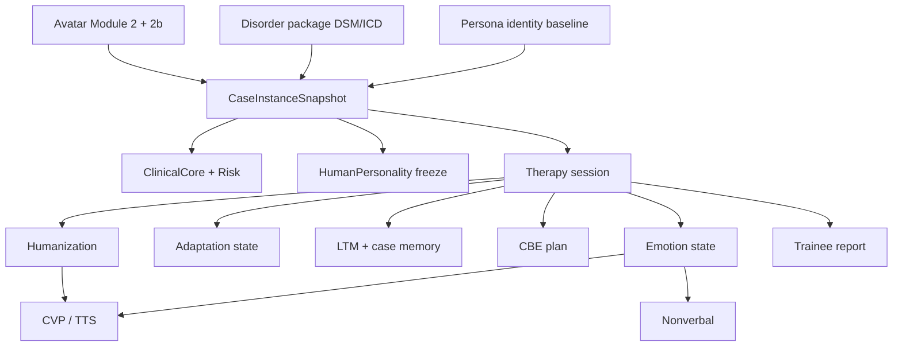

# VPsych Patient Ontology

**Canonical clinical ontology for all engines.**  
Every clinical concept appears **exactly once**. Other documents and engines reference this file; they do not redefine the patient.

**Evidence:** `src/lib/types.ts`, `src/lib/case-engine/types.ts`, `src/lib/personality-engine/types.ts`, emotion/adaptation/patient-memory/conversation-behaviour/humanization/clinical-voice/nbe/therapy-room types, `schemas/human-personality.v1.json`, `personas/*.case.json`.

---

## 1. Ontological root

```
SyntheticPatient (fictional educational SP)
├── IdentityLayer          # who the person is (stable / locale)
├── ClinicalPresentation   # what is wrong THIS session (immutable snapshot)
├── TraitPersonality       # how they are as a person (independent of diagnosis)
├── CulturalLanguageLayer  # how they speak and seek help
├── SafetyLayer            # risk + boundaries for THIS presentation
├── DeliveryLayer          # voice / nonverbal / humanization expression
└── SessionRuntimeState    # emotion, adaptation, memory, conversation (mutable)
```

**Not part of the patient ontology:** therapist competency scores, ACE/CGE learner graphs, quality indices (CFI/ERI/…), admin reports. Those assess the *trainee*, not the patient.

---

## 2. Concept catalogue

Status legend: **Runtime** = first-class typed + available to engines · **Authored** = in personas/library, not runtime ClinicalCore · **Derived** = computed each turn · **Missing** = not in implementation (see gap analysis).

### 2.1 Identity & demographics

| Concept ID | Definition | Status | Owner | Runtime type / path | DB | Prompt |
|------------|------------|--------|-------|---------------------|-----|--------|
| `patient.identity.display_name` | Spoken name | Runtime | Avatar Personality | `AvatarPersonality.identity.display_name` | `avatars.personalities` | M2 |
| `patient.identity.given_name` / `family_name` | Name parts | Runtime | Avatar Personality | identity.* | personalities | M2 |
| `patient.demographics.age` | Age (years) | Runtime | ClinicalCore (session) / persona baseline | `ClinicalCore.age` | snapshot / clinical_core | M1 |
| `patient.demographics.gender` | female\|male\|non-binary\|unspecified | Runtime | ClinicalCore | `ClinicalCore.gender` | same | M1 |
| `patient.identity.city` / `region` / `country` | Geographic identity | Runtime | Avatar Personality | identity.* | personalities | M2 |
| `patient.identity.occupation` | Occupation string | Runtime | Avatar Personality (+ randomized variant) | identity.occupation; `RandomizedContext.occupation_variant` | personalities / snapshot | M2 |
| `patient.identity.education` | Education string | Runtime | Avatar Personality / HPE | identity.education; HPE.education | personalities / human_personality | M2 / 2b |
| `patient.identity.living_situation` | Housing / household prose | Runtime (thin) | Avatar Personality | identity.living_situation | personalities | M2 |
| `patient.identity.family_context` | Family prose | Runtime (thin) | Avatar Personality | identity.family_context | personalities | M2 |
| `patient.identity.socioeconomic_context` | Finances / class prose | Runtime (thin) | Avatar Personality | identity.socioeconomic_context | personalities | M2 |
| `patient.persona.slug` | Stable persona key | Runtime | Case Engine personas | `PersonaRow.slug` | `personas` | snapshot.persona |
| `patient.biography.full` | Full authored biography | Authored | Persona library | `case_file.identity` in JSON | file only | **Not** in M1 |
| `patient.children` | Children as structured entities | Missing as structured; LTM category `children` exists | — | — | LTM entries | if remembered |
| `patient.housing.structured` | Rooms, homelessness enum, etc. | Missing | — | — | — | — |
| `patient.finances.structured` | Income bands, debt | Thin: `RandomizedContext.financial_situation` | Case Generator | randomized_context | case_instances | not Module 1 codes |

### 2.2 Culture, language, religion

| Concept ID | Definition | Status | Owner | Path | Prompt |
|------------|------------|--------|-------|------|--------|
| `patient.locale` | BCP-47 personality locale | Runtime | Avatar / session | `en-US` \| `ar-JO` | M2–M3 |
| `patient.language` / `dialect` / `direction` | Speech language | Runtime | Avatar Personality | personality.language* | M3 |
| `patient.culture.stigma_framing` | How distress is framed | Runtime | CulturalContext | cultural_context.* | M2 |
| `patient.culture.help_seeking` | Attitude to care | Runtime | CulturalContext | help_seeking_attitude | M2 |
| `patient.culture.family_involvement` | Family role in care | Runtime | CulturalContext | family_involvement | M2 |
| `patient.culture.authority_orientation` | Clinician power distance | Runtime | CulturalContext | authority_orientation | M2 |
| `patient.culture.disclosure_norms` | What may be said | Runtime | CulturalContext | disclosure_norms | M2 |
| `patient.culture.faith_or_meaning` | Faith / meaning framing | Runtime | CulturalContext | faith_or_meaning_framing | M2 |
| `patient.culture.taboo_topics` | Taboo list | Runtime | CulturalContext | taboo_topics[] | M2 |
| `patient.religion` (trait) | Religion string | Runtime | Personality Engine | HPE.religion | M2b |
| `patient.idioms_of_distress` | Local idioms | Runtime | Avatar Personality | idioms_of_distress[] | M2 |
| `patient.clinical_localization` | Symptom expression by locale | Runtime | Avatar Personality | clinical_localization[] | M2 |

### 2.3 Diagnosis & coding

| Concept ID | Definition | Status | Owner | Path | Notes |
|------------|------------|--------|-------|------|-------|
| `patient.diagnosis.primary` | Primary disorder THIS session | Runtime | Case Engine | `CaseInstanceSnapshot.primary_diagnosis` | Immutable on snapshot |
| `patient.diagnosis.primary.dsm5` | DSM-5 code | Runtime | Case Engine | disorders.dsm5_code / snapshot | Optional for ICD-11-only (CPTSD) |
| `patient.diagnosis.primary.icd10` | ICD-10 code | Runtime | Case Engine | disorders.icd10_code | On DisorderRow / snapshot; **not** on typed ClinicalCore |
| `patient.diagnosis.primary.icd11` | ICD-11 code | Runtime | Case Engine | disorders.icd11_code | **Required** in validation |
| `patient.diagnosis.comorbidities[]` | Comorbid diagnoses | Runtime | Case Engine | snapshot.comorbidities | Tiered rules |
| `patient.diagnosis.category` | mood/anxiety/trauma/… | Runtime | Case Engine | DisorderRow.category | |
| `patient.diagnosis.name` / `slug` | Display + stable key | Runtime | Case Engine | | ClinicalCore.disorder is name string |
| `patient.diagnosis.specifiers` | Specifiers coded | Authored | Persona case_file | case_file.diagnosis | Not on ClinicalCore |
| `patient.diagnosis.z_codes` | Psychosocial Z-codes | Authored | Persona case_file | psychosocial_and_contextual | Not runtime |
| `patient.diagnosis.who_das` | WHODAS estimate | Authored free text | Persona | who_das_2_estimate | Not typed |
| `patient.diagnosis.snomed` | SNOMED CT | Missing | — | — | — |

**Invariant:** A persona never permanently owns a disorder. Diagnosis is minted per case.

### 2.4 Symptoms

| Concept ID | Definition | Status | Owner | Path |
|------------|------------|--------|-------|------|
| `patient.symptoms[]` | Symptom list | Runtime | Case Engine → ClinicalCore | `symptom_profile[]` |
| `patient.symptoms.id` | Stable symptom id | Runtime | same | |
| `patient.symptoms.description` | Presentation text | Runtime | same | M1 |
| `patient.symptoms.domain` | mood\|anxiety\|sleep\|appetite\|cognition\|somatic\|social\|behavioral\|psychotic\|trauma | Runtime | same | |
| `patient.symptoms.salience` | presenting\|elicited\|hidden | Runtime | same | M1 tag |
| `patient.symptoms.past` | Past-only symptom timeline | Missing as structured | — | Authored history prose only |
| `patient.symptoms.instruments` | PHQ-9/GAD-7 objects | Authored narrative | Persona | Not typed scores |

### 2.5 Risk & safety

| Concept ID | Definition | Status | Owner | Path |
|------------|------------|--------|-------|------|
| `patient.risk.suicidal_ideation` | none\|passive\|active_no_plan\|active_with_plan | Runtime | ClinicalCore.RiskProfile | M4 |
| `patient.risk.self_harm` | boolean | Runtime | RiskProfile | M4 |
| `patient.risk.harm_to_others` | boolean | Runtime | RiskProfile | M4 |
| `patient.risk.substance_use` | boolean flag | Runtime | RiskProfile | M4 — not pattern detail |
| `patient.risk.escalation_rules` | free text | Runtime | RiskProfile | gates / chart |
| `patient.safety.crisis_resources` | Locale crisis contacts | Runtime | SafetyModule | M4 |
| `patient.safety.boundary_rules` | Hard boundaries | Runtime | SafetyModule | M4 |
| `patient.safety.risk_disclosure_style` | How risk is spoken | Runtime | SafetyModule | M4 |
| `patient.risk.self_neglect` | Self-neglect | Authored MSE only | Persona MSE | Not RiskProfile |
| `patient.risk.risk_to_dependents` | Dependents | Authored MSE only | Persona | Not RiskProfile |
| `patient.risk.protective_factors[]` | Protective factors list | Authored | Persona history | **Not** on ClinicalCore; CFI notes gap |
| `patient.risk.static_dynamic` | Static/dynamic risk formulation | Authored prose | Persona MSE.risk | Not typed |

### 2.6 History & formulation

| Concept ID | Status | Owner | Notes |
|------------|--------|-------|-------|
| `patient.history.present_illness` | Authored | Persona case_file | Not ClinicalCore |
| `patient.history.onset` / course / precipitating / perpetuating | Authored | Persona | onset_duration string only at runtime |
| `patient.history.protective_factors` | Authored | Persona | Gap for runtime |
| `patient.history.previous_episodes` / meds / therapy / hospitalizations | Authored | Persona | LTM may store meds as facts |
| `patient.history.family_psychiatric` | Authored | Persona | |
| `patient.history.trauma` | Thin | Symptom domain + LTM category `trauma` | No trauma staging ontology |
| `patient.history.substance_detail` | Thin | personality `substance_and_medication_context` + Risk boolean | |
| `patient.formulation.structured` | Missing | — | Rubric scores trainee formulation only |
| `patient.medication.list` | Missing structured | Chart placeholder null; memory category `medication` | |
| `patient.labs` / `psych_testing` | Missing | TRM chart always null | |

### 2.7 Mental status (MSE)

| Concept ID | Status | Owner | Notes |
|------------|--------|-------|-------|
| `patient.mse.*` (appearance, behaviour, speech, mood, affect, thought_process, thought_content, perception, cognition, insight, judgement, risk) | **Authored** in personas | Persona library | **Absent** from ClinicalCore & Module 1 |
| `patient.mse.insight` (runtime proxy) | Derived cue | DifficultyModifiers.insight → therapy-process lines | Not MSE object |
| `patient.mse.judgment` (teaching) | Teaching string | clinical_teaching.judgment_expectation | CFI, not prompt M1 field |

See [`MENTAL_STATUS_MODEL.md`](./MENTAL_STATUS_MODEL.md).

### 2.8 Personality, temperament, attachment

| Concept ID | Status | Owner | Path |
|------------|--------|-------|------|
| `patient.traits.temperament` | Runtime | Personality Engine | HPE.temperament |
| `patient.traits.attachment_style` | Runtime | Personality Engine | secure \| anxious_preoccupied \| dismissive_avoidant \| fearful_avoidant \| disorganized |
| `patient.traits.big_five` | Runtime | HPE | openness, agreeableness, conscientiousness, neuroticism + resilience 1–5 |
| `patient.traits.coping_style` | Runtime | HPE | enum |
| `patient.traits.emotional_regulation` | Runtime | HPE | enum |
| `patient.traits.trust_level` | Runtime | HPE | 1–5 |
| `patient.traits.humor` | Runtime | HPE | enum |
| `patient.traits.intelligence` | Runtime | HPE | band/strengths/style |
| `patient.traits.speech_style` / vocabulary | Runtime | HPE | |
| `patient.traits.topics` | Runtime | HPE preferred/avoidant | |
| `patient.traits.memory_of_therapist` | Runtime | HPE | alliance sensitivity / rupture style |
| `patient.traits.treatment_expectations` | Runtime | HPE | |
| Persona therapy_behaviour.attachment prose | Authored | Persona | Must not conflict with HPE enum; HPE is runtime owner |

### 2.9 Speech, thought, cognition (behavioural overlays)

| Concept ID | Status | Owner | Path |
|------------|--------|-------|------|
| `patient.speech.behaviour_profile` | Derived | Case Engine speech-behavior | fidelity.speech_behavior_cue |
| `patient.speech.personality` | Runtime | Avatar Personality.speech | M2 |
| `patient.thought_form` / `thought_content` / `perception` | Authored MSE | Persona | Not runtime typed |
| `patient.cognition` / attention / executive | Authored MSE / symptom domain cognition | Persona / symptoms | No structured neuropsych model |
| `patient.sleep` / `appetite` / `energy` / `motivation` | Symptom domains + Emotion variables (fatigue, motivation) | ClinicalCore / Emotion | Partial |

### 2.10 Therapy & conversation state (session-mutable)

| Concept ID | Status | Owner | Persist |
|------------|--------|-------|---------|
| `patient.state.emotion.*` | Runtime | Emotion Engine | case_memory.memory.emotion |
| `patient.state.adaptation.*` | Runtime | Adaptation Engine | case_memory.memory.patient_adaptation |
| `patient.state.cbe.*` | Derived per turn | CBE | ephemeral |
| `patient.state.humanization.*` | Derived per turn | Humanization | ephemeral |
| `patient.state.disclosure_gate` | Derived | CBE | ephemeral |
| `patient.state.stance` | Runtime | Adaptation PatientStance | case_memory |
| `patient.therapy.difficulty_modifiers` | Runtime frozen | Case Engine | snapshot |
| `patient.therapy.modality` | Runtime frozen | Case Engine | snapshot |
| `patient.therapy.disclosure_rules` | Runtime frozen | ClinicalCore | snapshot |
| `patient.therapy.session_goals` | Runtime frozen | ClinicalCore | assessment use |
| `patient.therapy.adherence` | Missing structured | — | — |
| `patient.therapy.recovery_stage` | Missing | — | Authored session_arc only |
| `patient.functioning.social` / `occupational` | Thin | randomized_context + authored WHO-DAS text | |

### 2.11 Memory

| Concept ID | Status | Owner | Persist |
|------------|--------|-------|---------|
| `patient.memory.case` | Runtime | Case memory blob | case_memory |
| `patient.memory.longitudinal` | Runtime | Patient Memory | patient_long_term_memory |
| `patient.memory.entry.category` | Runtime | LTM | previous_session, therapist_mistake, promise, medication, relationship, life_event, trauma, children, occupation, future_plan, other |

### 2.12 Delivery (expression, not diagnosis)

| Concept ID | Status | Owner | Persist |
|------------|--------|-------|---------|
| `patient.voice.profile` | Runtime | Voice / CVP | voice_profiles |
| `patient.voice.clinical_params` | Runtime | Clinical Voice | speech_rate, pitch, energy, … |
| `patient.nonverbal.*` | Runtime (TRM) | NBE | client timeline |
| `patient.humanization.behaviours` | Derived | Humanization | ephemeral; clinical-gated |

### 2.13 Assessment history (of the *patient* vs *trainee*)

| Concept ID | Status | Notes |
|------------|--------|-------|
| Trainee session reports | Runtime | `session_reports` — **not** patient chart |
| Patient instrument scores over time | Missing | Narrative only in personas |
| Quality ledgers | Runtime | Platform scientific audit — not patient ontology |

---

## 3. Relationship graph (implementation)



**Causal reading (educational SP):**  
Diagnosis package → symptoms & risk defaults → frozen ClinicalCore → Module 1.  
Traits & culture colour *how* symptoms are expressed (Modules 2/2b), never overwrite codes.  
Therapist behaviour → Adaptation + Emotion + CBE → speech/affect.  
Facts → Memory.  
Trainee performance → Assessment report (separate ontology).

---

## 4. Ownership rules

1. **One owner per concept ID** (tables above).  
2. Engines may *read* ClinicalCore; only Case Engine *writes* it (at mint).  
3. Emotion and Adaptation share `case_memory` row but **different keys** — never overwrite each other’s namespace.  
4. Authored persona `case_file` is not an alternate ontology; promotion to runtime requires Case Engine / ClinicalCore extension (roadmap).  
5. No engine may invent a parallel `Patient` type; extend `ClinicalCore`, `CaseInstanceSnapshot`, or HPE schemas.

---

## 5. Validation & security

| Rule | Evidence |
|------|----------|
| ICD-11 required on disorders (DSM optional for ICD-11-only) | case-engine validation |
| Culture/locale must not rewrite diagnosis codes | Case Engine invariant |
| Snapshot clinical fields frozen after mint | session update guard trigger |
| Risk disclosure never teaches means | Module 4 template |
| Private notes never enter patient prompt | architecture test |
| Synthetic / fictional — no real patient data claim | platform governance |

---

## 6. Extension points

Add new clinical concepts by:

1. Assigning a new `patient.*` concept ID here.  
2. Choosing owner engine.  
3. Extending the owner’s TypeScript type + migration if persisted.  
4. Declaring prompt module / fidelity slot.  
5. Updating gap analysis (remove from Missing).

Do **not** add shadow fields only inside an engine’s private types without registering them in this ontology.
