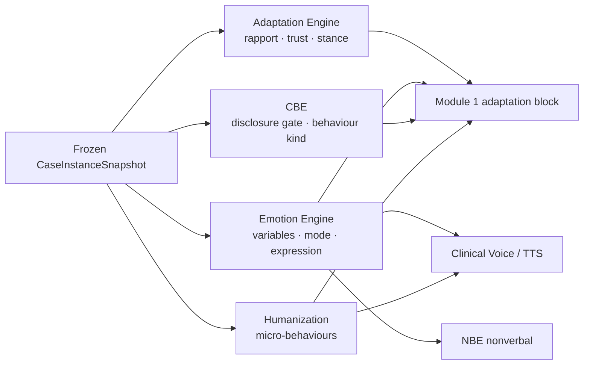

# Therapy State Model

**Purpose:** Session-mutable clinical-interaction state — how the patient *is* this turn, given a frozen case.

**Not included:** Immutable diagnosis (Case Model), trainee scores (Assessment).

---

## State machines & owners

---

## 1. Adaptation state

| Field group | Shape | Persist | Owner |
|-------------|-------|---------|-------|
| Rapport / trust levels | 0–100 + streaks | `case_memory.memory.patient_adaptation` | Adaptation |
| Effects | withdrawal, anger, disclosure_readiness, engagement | same | Adaptation |
| Stance | opening\|engaging\|guarded\|withdrawn\|angry\|disclosing\|reparable | same | Adaptation |
| Treatment arc | cumulative therapist warmth/empathy/… | same | Adaptation |

**Prompt:** `adaptation_block` via `resolveAvatar`.  
**Failure:** soft ★.

---

## 2. Emotion state

| Field group | Shape | Persist | Owner |
|-------------|-------|---------|-------|
| Variables | baseline_mood, current_mood, stress, fear, anger, hope, trust, rapport, fatigue, motivation (0–100) | `case_memory.memory.emotion` | Emotion |
| Mode | engaged\|guarded\|withdrawn\|activated\|collapsed\|warming | same | Emotion |
| Expression | facial, voice params, hesitation, word_choice, body_language, animation_hooks, openness | runtime | Emotion |

**Note:** Emotion and Adaptation both track trust/rapport-like quantities — **different namespaces**. Do not merge without an explicit architecture decision (gap/debt).

---

## 3. Conversation behaviour (CBE)

| Field | Persist | Owner |
|-------|---------|-------|
| Behaviour kinds (avoidance, silence, crying, …) | ephemeral | CBE |
| DisclosureGate withhold\|deflect\|partial\|open | ephemeral | CBE |
| `directReply` short-circuit | ephemeral | CBE (`aiSource: cbe_direct`) |

**Flag:** `CBE_ENABLED` default on.  
**Precedence:** CBE gate/silence may skip LLM; owns gating vs Humanization micro-cues.

---

## 4. Humanization

| Field | Persist | Owner |
|-------|---------|-------|
| Behaviour ids (hesitation, false_start, fatigue, …) | ephemeral | Humanization |
| Clinical gates from RiskProfile | ephemeral | Humanization |
| voiceHints | client | Humanization → TTS |

**Flag:** `HUMANIZATION_ENABLED` default on.

---

## 5. Frozen therapy parameters (not turn-mutable)

| Field | Owner | Persist |
|-------|-------|---------|
| difficulty_modifiers | Case Engine | snapshot |
| therapy_modality + reaction_rules | Case Engine | snapshot |
| disclosure_rules | ClinicalCore | snapshot |
| session_goals / ideal_approach | ClinicalCore | snapshot |

---

## 6. Therapy Room extras

| Field | Owner | Notes |
|-------|-------|-------|
| Private notes / chart sections | TRM | Never patient LLM |
| Immersion metrics | TRM | UX telemetry |
| Clinic urgency | Derived from RiskProfile | Schedule |

---

## Missing therapy-state concepts

| Concept | Status |
|---------|--------|
| Treatment adherence structured | Missing |
| Recovery stage enum | Missing (authored session_arc only) |
| Formal alliance inventory (WAI) | Missing |
| Homework completion as patient state | Chart field only / thin |

See gap analysis.

---

## Security

- Humanization blocked during active risk (clinical gates).  
- Emotion/Adaptation soft-fail must not drop safety Module 4.  
- Namespaced case_memory writes only.
