# Clinical Validation Roadmap

**Goal:** Transform VPsych from a **certified simulator** (RC1 / Wave 3) into a **scientifically validated educational platform**.

**Non-goals:** New simulation features, production behaviour changes, marketing superlatives.

---

## Stage map

```mermaid
flowchart LR
  RC1[RC1 Certified Simulator] --> PPP[Professional Preview]
  PPP --> CVP0[CVP Infrastructure]
  CVP0 --> S1[Pilot Study]
  S1 --> S2[Reliability Study]
  S2 --> S3[Educational Outcomes]
  S3 --> S4[Comparative Blind Trial]
  S4 --> S5[Multi-site Replication]
  S5 --> Pub[Peer-reviewed Validation]
```

| Stage | Evidence gate | Allowed public language |
|---|---|---|
| **RC1** | Functional/security certs | Certified training simulator (formative) |
| **PPP** | Invited expert ratings | Under expert evaluation |
| **CVP-0** | This infrastructure live | Clinical Validation Program open |
| **S1 Pilot** | ≥10 reviewers, ≥30 rated sessions, CQI triage | Pilot cohort results (N disclosed) |
| **S2 Reliability** | Pre-registered IRA; ICC/κ with CIs | Preliminary reliability coefficients |
| **S3 Outcomes** | Ethics-approved pre/post or OSCE-linked | Associated educational change (scoped) |
| **S4 Blind** | Pre-registered vs human SP / comparator | Comparative realism claims (endpoint-only) |
| **S5 Multi-site** | ≥3 institutions, independent analysis | Generalizable validation language |
| **Publication** | DOI / peer review | Cite paper; lock marketing to abstract |

---

## Workstreams (no simulation changes)

### A. Operations
1. Create study (`POST /api/admin/cvp/studies`) with IRB reference.  
2. Register institutions and attach sites.  
3. Mint invitations; track acceptance.  
4. Allocate randomized assignments per enrollment.  
5. Monitor `/admin/validation` weekly.

### B. Measurement
1. Dual-rate ≥20 overlapping sessions for IRA.  
2. Populate calibration items with expert gold scores.  
3. Collect baseline/post outcome instruments.  
4. Run blind challenge for psychiatrist scorers.  
5. Export de-identified packages for statisticians.

### C. Governance
1. File IRB / ethics using `IRB_PACKET.md`.  
2. Register analysis plan before looking at primary endpoints.  
3. Maintain CONSORT-style flow counts.  
4. Claims audit continues (`docs/ppp/CLAIMS_AUDIT.md`).

### D. Publication
1. Methods paper (simulator + protocol).  
2. Reliability paper (IRA / calibration).  
3. Outcomes paper (educational endpoints).  
4. Comparative realism paper (blind challenge).

---

## Success criteria (platform-level)

VPsych may be described as **scientifically validated for educational use** only when:

- Pre-registered analyses are completed for reliability **and** at least one educational outcome.  
- Multi-site or independently replicated results support the claim scope.  
- Limitations remain disclosed (synthetic patients; not a medical device).  
- Marketing language is locked to published endpoints.

Until then: **Clinical Validation Program — evidence in progress.**
