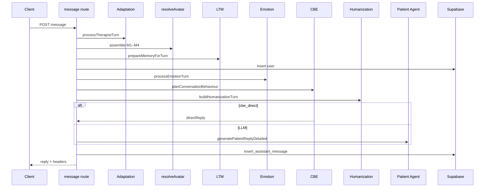

# Runtime Pipeline

Canonical execution pipelines from **live code**. Prose order is authoritative; Stage 2 mermaid had Humanization nested incorrectly under the LLM branch — **corrected here**.

---

## 1. Session create

```
Request
  → Authentication (getUser)
  → Rate limit start:30/h
  → Validate avatarId / load active avatar
  → Resolve locale
  → Case Resolution (createCaseForSession)
  → Clinical Snapshot persist (case_instances + sessions)
  → Therapy Room mode flag → interaction_mode
  → insert_system_message RPC
  → Response { sessionId, diagnosis meta, maxDurationSec, … }
```

No Memory / Emotion / LLM / Scoring on create.

---

## 2. Message turn (one mind)

```
Request { message, therapistInterrupted? }
  → Authentication
  → Rate limit msg:120/h
  → Validate body (≤4000)
  → Load session + ownership + active + timer
       └─ expired → expireStaleSession → 409
  → ★ Adaptation (load → process → void save)
  → Case Resolution via resolveAvatar(snapshot, adaptationBlock)
       └─ Prompt Assembly Modules 1→2→2b→3→4
  → ★ Memory (LTM prepareMemoryForTurn → append)
  → Persistence: INSERT user message (Hard)
  → Load history / turnIndex
  → ★ Emotion (process → append expression block)
  → ★ Behaviour CBE (plan; may set directReply)
  → ★ Clinical Intelligence DecisionPlan (façade; soft-fail)
  → ★ Humanization (prompt cues + voiceHints)   ← always before reply
  → Reply:
       ├─ cbe_direct → text + aiSource=cbe_direct
       └─ LLM Patient Agent → text + aiSource
  → Persistence: insert_assistant_message RPC (Hard)
  → Telemetry: console.info + X-AI-* / X-CBE-* / X-CI-* / X-Humanization headers
  → Response JSON (reply, emotion?, cbe?, decision*, humanization?, voiceHints?)
```



---

## 3. Voice client pipeline

```
Therapist audio
  → STT /api/voice/transcribe
  → Message pipeline (§2)
  → TTS /api/voice/tts (CVP + ElevenLabs stream)
  → Browser playback (AbortSignal barge-in on TRM)
```

Text-only skips STT/TTS.

**Gap:** `conversation-pipeline` does not send `therapistInterrupted` even when playback aborted.

---

## 4. Session end

```
Request
  → Authentication
  → Rate limit end:20/h
  → Ownership
  → Mark completed|expired
  → session_has_report? → alreadyExists (skip rest)
  → Load messages → resolveAvatar
  → Scoring assessSession()
  → ★ ACE runAceAfterAssessment
  → ★ Memory runPatientMemoryAfterSession
  → Reporting (service role INSERT or HMAC RPC)
  → ★ Quality Ledger seal (+ VQI in-process ping)
  → Telemetry headers X-AI-* / X-Quality-Ledger-Id
  → Completion { ok, reportId, ledgerId, … }  // no report body
```

---

## 5. What is not in the pipeline

| Absent | Status |
|--------|--------|
| Streaming LLM tokens to client | Not implemented |
| Product Realtime / SSE | Not implemented |
| Living Environment engine step | No engine |
| Durable job queue | Not implemented |
| Server-side animation | Client NBE only |
| Scoring on every turn | End only |

---

## Pipeline invariants

1. Soft engines never block Hard persist / report key failures.  
2. Snapshot is read-only on turn/end.  
3. Assistant messages only via RPC.  
4. `aiSource` always set for patient text.  
5. Private notes never enter §2.
