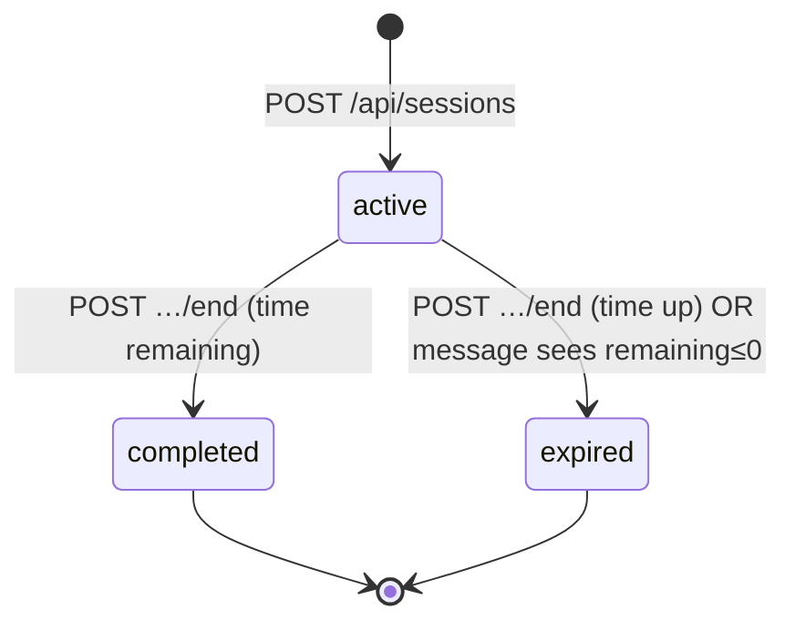
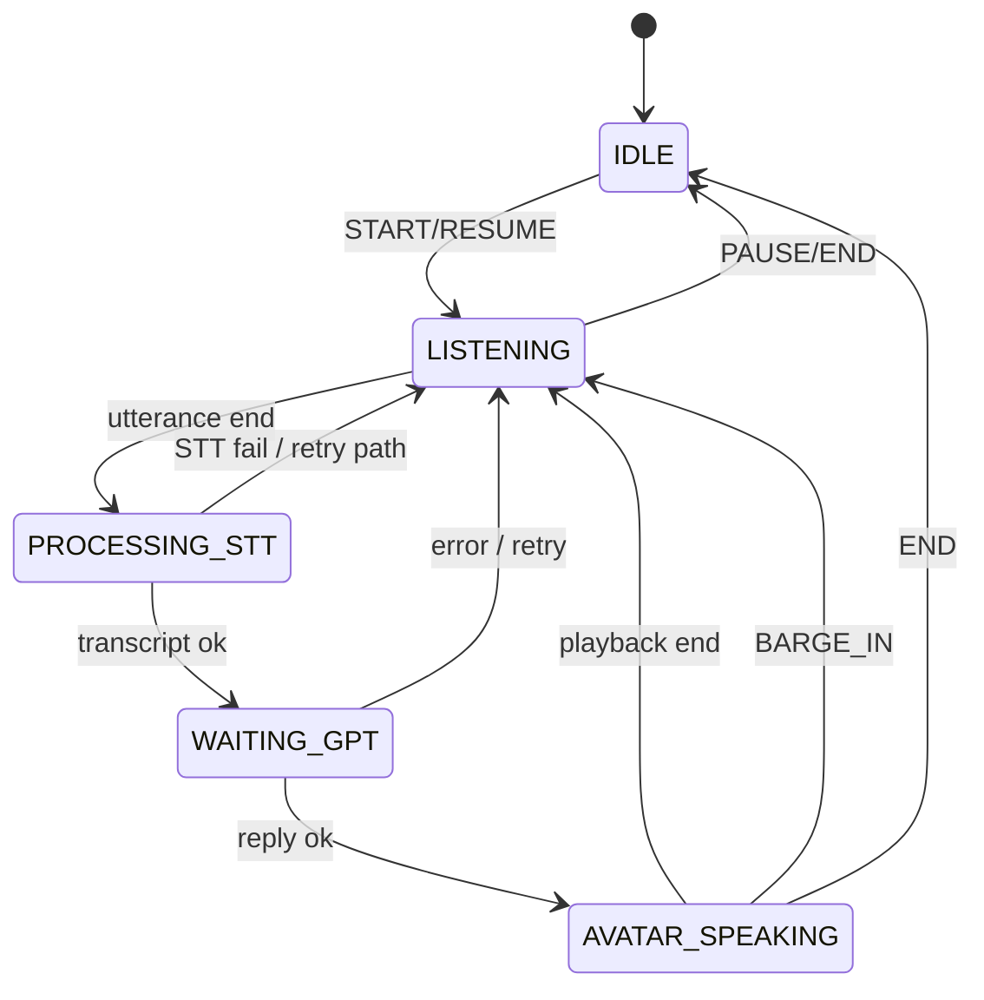

# Runtime State Machine

Three cooperating machines: **Session**, **Turn (server)**, **Therapy Room FSM (client)**.

---

## 1. Session state machine

**Owner:** `sessions.status` + timer (`session-timer` / `session-expiry`)



| State | Meaning | Allowed |
|-------|---------|---------|
| `active` | In progress | message, emotion, notes (flags), end |
| `completed` | Ended by therapist | end idempotent / report read admin |
| `expired` | Hard time limit | same as completed for messaging (409) |

**Failure states:**

| Condition | Transition |
|-----------|------------|
| Create case mint fails | No session row / 500 — never enters `active` |
| Message on non-active | 409 |
| Timer elapsed on message | expire → 409 `{expired:true}` |
| End without report keys | Status may be completed but 500 on report write |

**Clinical snapshot:** frozen for entire session lifecycle (update guard).

---

## 2. Server turn phases (logical)

Not a persisted enum — phases of a single request:

```
AUTH → RATE_LIMIT → VALIDATE → LOAD_SESSION
  → ADAPTATION → RESOLVE_PROMPT → MEMORY
  → PERSIST_USER → EMOTION → CBE → HUMANIZATION
  → GENERATE → PERSIST_ASSISTANT → RESPOND
```

| Phase failure | Result |
|---------------|--------|
| AUTH | 401 |
| RATE_LIMIT | 429 |
| VALIDATE | 400 |
| LOAD_SESSION / ownership | 404/403/409 |
| PERSIST_USER | 500 — stop (no assistant) |
| Soft engines | continue with degraded mind |
| GENERATE unexpected | 502 — user message already saved |
| PERSIST_ASSISTANT | 500 — reply computed but not stored |

**Partial mind states after soft-fail:** missing emotion/adaptation/memory/CBE/humanization blocks — still one reply path.

---

## 3. Therapy Room conversation FSM (client)

**File:** `lib/therapy-room/conversation-fsm.ts`  
**Flag:** `NEXT_PUBLIC_THERAPY_ROOM_MODE`



Generation counter bumps on `START|RESUME|RETRY|BARGE_IN|END|PAUSE` to drop stale async results.

**Classic VoiceSession:** no full FSM — ad hoc mic / `speechSynthesis.cancel`.

---

## 4. Adaptation / Emotion internal modes

| Machine | Modes (examples) | Persist |
|---------|------------------|---------|
| Adaptation stance | opening, engaging, guarded, withdrawn, angry, disclosing, reparable | case_memory |
| Emotion mode | engaged, guarded, withdrawn, activated, collapsed, warming | case_memory |

These are **patient mind substates**, not session.status.

---

## 5. Report idempotency state

```
no report → assess+write
has report → alreadyExists (no re-assess)
```

---

## Transition rules (summary)

1. Only one session status writer: end route / expire helper.  
2. Turn phases are synchronous in one isolate.  
3. BARGE_IN is client-only unless `therapistInterrupted` is sent (currently not from UI).  
4. Soft engine failure ≠ session status change.
